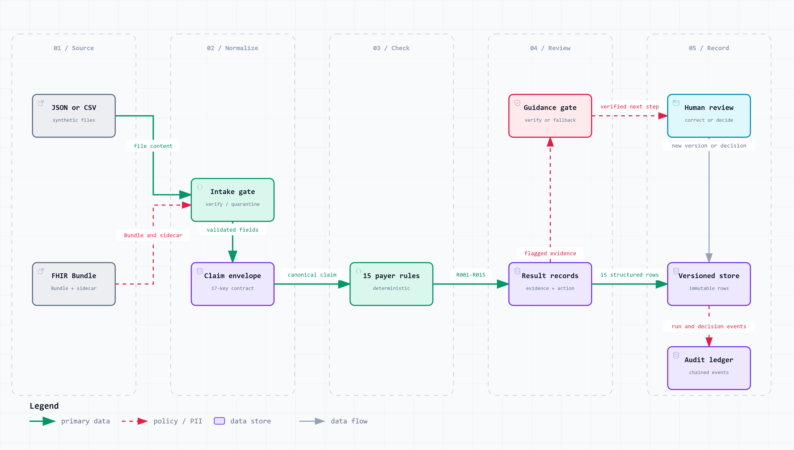

# ClaimGuard

<p align="center">
  
</p>

<p align="center"><strong>Evidence-first healthcare claim pre-validation, before payer submission.</strong></p>

<p align="center">
  <code>Next.js 16</code> · <code>FastAPI</code> · <code>PostgreSQL 16</code> · <code>Python 3.11–3.13</code> · <code>15 deterministic rules</code>
</p>

ClaimGuard helps a clinic's revenue-cycle team find administrative problems before a claim is submitted. It accepts synthetic claim packages, normalizes them, executes a versioned fictional payer-rule catalogue, connects every finding to source evidence, recommends a correction, and keeps the reviewer in control.

> **Boundary:** ClaimGuard is a pre-submission review system, not a payer and not an adjudication or clinical-decision system. A `PASS` means that the configured checks passed. It never means payer approval. This repository uses synthetic data only.

Built by **Team Claimix** for the CSTAM 3.0 Velodoc challenge: Oussema Harrabi, Wassim Hajji, Eya Ayedi, Ghassen Benkaji, and Maram Kouki.

## Start here

- [Run the complete product](#run-the-complete-product)
- [Rehearse all Phase 1 requirements](docs/verification/PHASE1-HANDS-ON-REHEARSAL.md)
- [Read the technical report](output/pdf/ClaimGuard_Technical_Report.pdf)
- [Explore the architecture and data flow](docs/11-Architecture-and-Dataflow.md)
- [Understand the clinic platform](docs/21-Clinic-Platform-Foundation.md)
- [Browse all project documentation](docs/README.md)
- [Find a subsystem](#repository-guide)

## What the product does

```text
JSON envelope / CSV package / FHIR R4 + sidecar
                         │
                         ▼
             detect → validate → normalize
                         │
                         ▼
          15 deterministic, versioned checks
                         │
              ┌──────────┴──────────┐
              ▼                     ▼
      structured findings     tamper-evident audit
              │
              ▼
 evidence + correction guidance + bounded AI explanation
              │
              ▼
       human decision → correction → immutable recheck
```

The application is a modular monolith. A Next.js workspace calls one FastAPI contract. The API owns identity, tenant and role checks, ingestion, deterministic validation, review workflow, bounded assistance, and persistence in PostgreSQL.

<p align="center">
  
</p>

The diagram's green path is authoritative: normalized input, deterministic checks, structured results, and human review. The purple AI lane may improve wording only. It cannot modify rule results, evidence, severity, routing, or reviewer decisions. See the [architecture README](reports/phase1-architecture/README.md) for the diagram sources and report artifacts.

## Phase 1 requirement coverage

| Scored requirement | Implementation | How to verify |
|---|---|---|
| **Data ingestion and normalization** | ClaimGuard envelope JSON, split relational CSV, and FHIR R4 Bundle with a verified ClaimGuard sidecar are detected, transport-validated, and projected into one canonical 17-key scoring envelope. Invalid intake is quarantined instead of silently evaluated. | Upload the committed samples through **Document Intake**, or follow the [hands-on rehearsal](docs/verification/PHASE1-HANDS-ON-REHEARSAL.md). |
| **Deterministic and AI rule engine** | Rules `R001`–`R015` always produce one of `PASS`, `FAIL`, `UNABLE_TO_ASSESS`, `NOT_APPLICABLE`, or `NOT_IMPLEMENTED`. The deterministic engine is authoritative. AI is a post-processing explanation layer only. | Run `uv run claimguard evaluate --split all` and `uv run pytest -m "not llm and not e2e"`. |
| **Explainability and structured output** | Every check returns Claim ID, Rule ID and version, exact RFC 6901 evidence paths and original values, severity, explicit confidence semantics, and corrective action. Deterministic confidence is `null` with `confidence_kind: not_probabilistic`, never a fabricated probability. | Inspect `GET /v1/runs/{run_id}/results`, the reviewer evidence desk, or the generated [evaluation report](docs/verification/EDU-EVALUATION-REPORT.md). |
| **Audit log engine** | Run, result, explanation, decision, correction, and assistant events are persisted. Audit records use SHA-256 hash chaining and protected append-only database tables. Corrections create a new run linked through `supersedes_run_id`. | Open **Audit** as a lead/admin, **Audit Integrity** as a technical manager, and run `uv run python scripts/audit_replay.py --run-id RUN_ID`. |

On the committed synthetic benchmark and public instructional labels, the engine records status accuracy `1.0000`, issue F1 `1.0000`, zero false alarms, and zero missed issues across 400 development claims and 9,000 public labels over development, validation, and stress splits. These numbers describe conformance to a fictional teaching oracle, not real-world payer performance. Reproduce them with the commands in [EDU-PACK-CONFORMANCE.md](docs/verification/EDU-PACK-CONFORMANCE.md).

## Run the complete product

### Prerequisites

Install:

- Git
- Docker Desktop with Docker Compose
- [uv](https://docs.astral.sh/uv/) and Python 3.11, 3.12, or 3.13
- Node.js 22 and npm when running the frontend outside Docker
- Make only if you want the convenience targets. On Windows, run Make from Git Bash or WSL.

No model key is required. ClaimGuard fails closed to deterministic explanations when the optional model layer is disabled or unavailable.

### Option A: full Docker stack

This is the simplest way to run the product as another contributor.

```powershell
Copy-Item .env.example .env
```

Generate a session signing key of at least 32 characters and put it in `.env` as `CLAIMGUARD_SESSION_KEY`. One PowerShell option is:

```powershell
uv run python -c "import secrets; print(secrets.token_urlsafe(48))"
```

Then build the stack and provision the first clinic administrator:

```powershell
docker compose up -d --build
docker compose exec api python -m claimguard.clinic.provision `
  --tenant-id clinic-demo `
  --clinic-name "Demo Clinic" `
  --email admin@example.test
```

The provisioner prompts for a password of at least 12 characters. No default account or password is committed.

Open:

| Service | Address | Purpose |
|---|---|---|
| Product and role workspaces | <http://127.0.0.1:3001> | Landing page, sign-in, intake, review, administration |
| FastAPI OpenAPI | <http://127.0.0.1:8000/docs> | Live request/response contract |
| API readiness | <http://127.0.0.1:8000/v1/health> | Schema and rule-catalogue health |
| Grafana LGTM container | <http://127.0.0.1:3000> | Observability infrastructure only; application exporters are not wired yet |

Check or stop the stack with:

```powershell
docker compose ps
docker compose logs api web
docker compose down
```

`docker compose down` keeps the named PostgreSQL volume. Use volume deletion only when you deliberately want to erase local data.

### Option B: fast local development loop

Start PostgreSQL in Docker and run the API and frontend on the host:

```powershell
Copy-Item .env.example .env
uv sync --all-extras
docker compose up -d db
uv run alembic upgrade head
uv run claimguard status
uv run python -m claimguard.clinic.provision `
  --tenant-id clinic-demo `
  --clinic-name "Demo Clinic" `
  --email admin@example.test
```

Set `CLAIMGUARD_SESSION_KEY` in `.env`, then use two terminals:

```powershell
# Terminal 1
uv run claimguard serve --reload
```

```powershell
# Terminal 2
Set-Location frontend
npm ci
npm run dev
```

Open <http://127.0.0.1:3000>. The Next.js server proxies `/v1/*` to `CLAIMGUARD_API_ORIGIN`, which defaults to `http://127.0.0.1:8000`.

For Bash, the equivalent first step is `cp .env.example .env`; export the session key in the shell or add it to `.env`.

### First useful workflow

1. Sign in as the provisioned clinic admin.
2. Create RCM lead and reviewer accounts under **Team & Access** and place them in departments if needed.
3. Open **Document Intake** and submit one of the samples in [`examples/phase1/`](examples/phase1/README.md).
4. Submit the accepted draft for deterministic validation.
5. Assign the claim to a reviewer.
6. Sign in as that reviewer and open **My Queue**.
7. Read each finding beside its evidence and suggested correction. Record a decision or request missing information.
8. Edit the permitted claim fields and select **Recheck claim**. The corrected envelope becomes a new immutable run; the original remains available.
9. Inspect clinic events under **Activity** or **Audit**, and verify the chain under **Audit Integrity**.

The complete click-by-click path for JSON, CSV, FHIR, correction, recheck, and audit replay is in the [Phase 1 hands-on rehearsal](docs/verification/PHASE1-HANDS-ON-REHEARSAL.md).

## Inputs and normalization

ClaimGuard accepts three Phase 1 source shapes:

| Format | Files | Notes |
|---|---|---|
| ClaimGuard envelope | One `.json` file | Preferred structured format; directly validates the 17-key contract. |
| Relational CSV | Exactly five CSV files | `claims.csv`, `coverage.csv`, `lines.csv`, `authorizations.csv`, and `attachments.csv`. |
| FHIR R4 | Bundle JSON plus ClaimGuard sidecar | FHIR supplies clinical and encounter structure; the verified sidecar supplies scoring fields that FHIR does not represent reliably. |

The current pilot API caps intake source content at 64 KiB. Source files are untrusted data, never instructions to the assistant. Accepted input is normalized before rules run; rejected or quarantined input never reaches the rule engine.

<p align="center">
  
</p>

## Role workspaces and multitenancy

One clinic is one tenant. Users receive a clinic membership and one role. Every protected request derives `user_id`, `tenant_id`, and role from the signed session rather than trusting client-supplied identity fields.

| Role | Responsibilities | Main workspace pages |
|---|---|---|
| **RCM reviewer** | Work assigned findings, request information, record decisions, correct and recheck claims | My Queue, Document Intake, Requests, Activity |
| **RCM lead** | Reviewer work plus workload assignment, escalation handling, quality visibility | Team Queue, Assignments, Escalations, Review Quality, My Queue, Document Intake, Requests, Activity |
| **Clinic admin** | Manage the clinic, departments, users, routing, and clinic-wide reporting | Overview, All Claims, Assignments, Departments, Team & Access, Analytics, Audit |
| **Technical manager** | Monitor operational metadata without reading claim content | Operations, Intake Jobs, Model & Rule Versions, Redacted Logs, Audit Integrity, Configuration |

Authorization is enforced in the API, not only by hidden navigation. Current tenant isolation uses service-layer query scoping, tenant-qualified foreign keys, and role gates. PostgreSQL row-level security and a non-owner runtime database role are planned hardening, not implemented claims.

Authentication uses a signed, `HttpOnly`, `SameSite=Strict` session cookie with an eight-hour lifetime. `/v1/health` and `/v1/auth/login` are public; all other `/v1` endpoints require a valid session. Read [`claimguard/clinic/README.md`](claimguard/clinic/README.md) for the permission matrix and provisioning model.

## Backend and API contract

FastAPI is the single application contract. The frontend's `/v1/[...path]` route is a same-origin proxy, not a second API. Use the live OpenAPI page at `/docs` as the exact request/response reference.

| Area | Endpoints |
|---|---|
| Health and identity | `GET /v1/health`, `POST /v1/auth/login`, `GET /v1/auth/me`, `POST /v1/auth/logout` |
| Claims and runs | `POST /v1/claims`, `GET /v1/runs/{run_id}`, `GET /v1/runs/{run_id}/claim`, `GET /v1/runs/{run_id}/results`, `POST /v1/claims/{claim_id}/recheck` |
| Review workflow | `GET /v1/queue`, `GET /v1/my-queue`, `GET|POST /v1/runs/{run_id}/decisions`, `GET|POST /v1/assignments` |
| Clinic directory | `GET|POST /v1/team`, `POST /v1/team/{user_id}/status`, `GET|POST /v1/departments`, `POST /v1/departments/{department_id}/update` |
| Requests and escalations | `GET|POST /v1/requests`, `POST /v1/requests/{request_id}/resolve`, `GET|POST /v1/escalations`, `POST /v1/escalations/{escalation_id}/resolve` |
| Intake | `GET|POST /v1/intake-jobs`, `GET /v1/intake-jobs/{job_id}`, `POST /v1/intake-jobs/{job_id}/submit`, `GET /v1/intake-jobs/operations` |
| Read models | `GET /v1/activity`, `/overview`, `/analytics`, `/review-quality`, `/audit`, `/versions`, `/redacted-logs`, `/audit-integrity`, `/operations` |
| Configuration | `GET|POST /v1/configuration` |
| Assistance | `GET /v1/ai/status`, `POST /v1/runs/{run_id}/findings/{rule_id}/explain`, `POST /v1/threads/{thread_id}/messages`, `GET /v1/threads/{thread_id}` |

Contract rules:

- A successful validation run contains exactly 15 rule-result records.
- Evidence is `{path, value}` and the path must resolve against the immutable submitted claim.
- Deterministic status, severity, evidence, and confidence semantics cannot be changed by an AI provider.
- Malformed requests return explicit 4xx responses; missing infrastructure is exposed through readiness instead of hidden by mocks.
- Rechecks create a new version and link to the prior run. They do not update the original.
- Tenant and role scope come from the authenticated principal.

See [`claimguard/review/README.md`](claimguard/review/README.md) for workflow semantics and [`claimguard/edu/README.md`](claimguard/edu/README.md) for the rule-result contract.

## Explanation, SLM, and JEV layers

The explanation path is deliberately bounded:

1. A scope guard verifies the caller may read the finding.
2. The system gathers a read-only context projection from deterministic records.
3. The optional model drafts plain-language wording.
4. A verifier checks factual grounding and prohibited authority claims.
5. Unsafe or unverifiable text is repaired once or replaced by the deterministic fallback.
6. The answer and provenance are recorded.

`CLAIMGUARD_AI_MODE=off` is the safe default. `groq` and `openai_compatible` providers can be configured through `.env.example`; credentials are never required for core validation. The benchmark notebook compares candidate small language models, but the repository does not claim that a checkpoint is production-ready or fine-tuned. Model output remains advisory even after a future fine-tuning cycle.

JEV is a separate typed advisory sidecar for grounding, agreement, and attention signals. It cannot enter or modify the graded 15-key result record. Without service credentials it remains offline-safe. Details: [assistant architecture](docs/22-AI-Assistant-Design.md), [security envelope](docs/19-Assistance-Security-Envelope.md), [SLM methodology](docs/18-SLM-Benchmark-Methodology.md), and [JEV boundary](docs/17-JEV-Judge-Layer.md).

## Persistence and audit

PostgreSQL migrations under `claimguard/db/migrations/versions/` define:

- claim packages, canonical claims, findings, and evidence;
- versioned rule runs, results, decisions, and explanation provenance;
- clinics, users, memberships, departments, assignments, requests, and escalations;
- intake jobs and tenant configuration;
- append-only assistant threads and turns;
- audit events chained with `prev_hash` and `chain_hash`.

Database triggers refuse updates or deletes on protected history tables. The ledger is **tamper-evident and append-only inside the application database**, not magically immutable against a database superuser or infrastructure compromise. See [`claimguard/db/README.md`](claimguard/db/README.md) and [`claimguard/audit/README.md`](claimguard/audit/README.md).

## Developer commands

```powershell
# Python quality gates
uv run ruff check .
uv run ruff format --check .
uv run pyright
uv run pytest -m "not llm and not e2e"

# Phase 1 engine and evidence
uv run claimguard evaluate --split all
uv run claimguard report --split development --output docs/verification/EDU-EVALUATION-REPORT.md
uv run python scripts/adversarial_cases.py
uv run python scripts/sample_run.py

# Frontend gates
Set-Location frontend
npm ci
npm run lint
npm run typecheck
npm test
npm run build
```

`make lint`, `make typecheck`, `make test`, `make conformance`, `make report`, `make up`, and `make down` provide equivalent convenience targets. `make test-all` includes opt-in `llm` and `e2e` tests and therefore needs their external dependencies.

CI repeats Python lint, formatting, strict type checking, tests on Python 3.11 and 3.13 with PostgreSQL, frontend lint/typecheck/test/build on Node 22, locked dependency auditing, and secret scanning.

## Repository guide

| Path | Responsibility | Local guide |
|---|---|---|
| `frontend/` | Next.js landing page and role workspaces | [Frontend README](frontend/README.md) |
| `claimguard/edu/` | Canonical Phase 1 engine, rule catalogue execution, evidence, explanation | [Engine README](claimguard/edu/README.md) |
| `claimguard/review/` | FastAPI routes, workflow orchestration, persistence adapters | [Review API README](claimguard/review/README.md) |
| `claimguard/clinic/` | Tenant directory, sessions, RBAC, assignments, intake workspaces | [Clinic README](claimguard/clinic/README.md) |
| `claimguard/ai/` | Bounded interactive-assistant graph and receipts | [AI README](claimguard/ai/README.md) |
| `claimguard/audit/` | Hash-chain primitives | [Audit README](claimguard/audit/README.md) |
| `claimguard/db/` | Alembic environment and SQL migrations | [Database README](claimguard/db/README.md) |
| `examples/phase1/` | Reproducible JSON, CSV, and FHIR inputs | [Examples README](examples/phase1/README.md) |
| `scripts/` | Evidence-generation and verification entry points | [Scripts README](scripts/README.md) |
| `tests/` | Unit, integration, contract, security, and UI tests | [Tests README](tests/README.md) |
| `reports/phase1-architecture/` | LaTeX report, visual sources, exports, logo | [Report README](reports/phase1-architecture/README.md) |
| `notebooks/` | Colab SLM comparison experiment | [Notebook README](notebooks/README.md) |
| `artifacts/` | Reproducible generated evidence and diagram exports | [Artifacts README](artifacts/README.md) |
| `docs/` | Domain, architecture, decisions, verification, handoff | [Documentation index](docs/README.md) |

## What is next

There is substantial work after the Phase 1 proof. The current priorities are:

1. **Submission proof and usability:** rehearse all three intake formats, the correction/recheck path, audit replay, architecture report, and a concise video with no hidden manual fixes.
2. **Tenant hardening:** PostgreSQL row-level security, a non-owner runtime role, session rotation/revocation, password recovery, stronger credential policy, and explicit cross-tenant security tests.
3. **Document understanding:** safe PDF/image upload, malware and type checks, OCR/layout extraction, field-level provenance, confidence/abstention, and mandatory human confirmation before claim creation.
4. **SLM evidence:** enlarge and freeze a task-specific evaluation set, compare multiple quantized candidates in Colab, measure factuality and abstention, then consider parameter-efficient fine-tuning only if retrieval and prompting do not meet the acceptance gate.
5. **JEV evaluation:** benchmark value, latency, privacy, and failure behavior before enabling any advisory integration.
6. **Operations:** wire OpenTelemetry exporters, define redaction policy, provision dashboards and alerts, test backup/restore, and document incident response. The bundled Grafana LGTM service is infrastructure, not completed observability.
7. **Workflow durability and scale:** load tests, idempotency, background intake execution, retention policy, and only then an evidence-based decision on Temporal. The Compose Temporal profile is currently an unwired spike.
8. **Production assurance:** threat modeling, dependency and container scanning, accessibility and browser coverage, deployment manifests, secrets management, and real domain validation with authorized specialists and non-production data.

The living implementation inventory and known limitations are in [docs/20-Implementation-Completion-Report.md](docs/20-Implementation-Completion-Report.md).

## Contributing safely

1. Create a branch; do not push directly to `main`.
2. Read the nearest subsystem README and the relevant architecture decision before editing.
3. Keep synthetic data only. Never commit credentials, `.env`, raw model keys, or real patient data.
4. Add tests for behavior changes and regenerate evidence when a reported number changes.
5. Do not widen AI authority. The deterministic core and human reviewer remain authoritative.
6. Run the local quality gates and open a pull request. Merge only after green CI and review.

Historical planning documents remain useful context, but executable code, current migrations, live OpenAPI, and generated verification artifacts take precedence when they disagree.

## License and use

This repository is a competition prototype built around fictional payer rules and synthetic claims. Confirm licensing and production-governance requirements before any use beyond the challenge environment.
