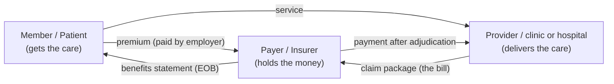
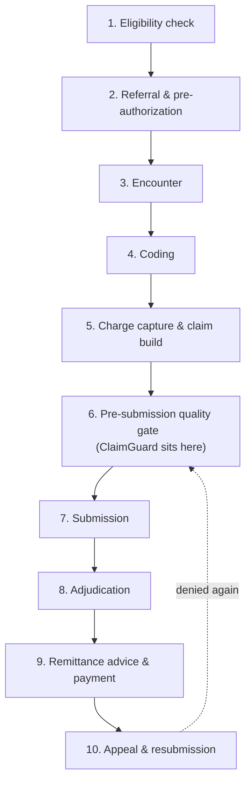

# ClaimGuard AI — Domain Primer 01
# Healthcare Claims in the Gulf: Dubai / UAE 101

> **Who this is for:** every teammate, especially the three who have never seen a hospital billing department.
> **What it is:** a top-to-bottom primer on how money, data, and rules move when a patient gets care and a clinic gets paid in Dubai and the wider Gulf.
> **Status:** v1.0 (draft for team review) · **Date:** 2026-09-04
> **Companion doc:** `02-PROBLEM-Why-Claims-Get-Rejected.md` (the problem statement).

**How to read this document.** Section 1 gives you the 30-second version. Sections 2–9 build the domain in order: people → regulators → the claim lifecycle → coding → worked examples → standards → where validation lives today → Gulf corrections. Section 10 is a glossary of every acronym. You can jump to any section, but if you read it top to bottom once, you will know more about claims than most junior billing staff.

**A note on the numbers.** This document deliberately separates what is **well-sourced** (peer-reviewed study, official regulator release, large survey — every one carries a source URL and a year) from what is **industry folklore** (widely repeated, but untraceable to a primary source). We will present these documents to a jury. One unsourced statistic is a credibility disaster; we never fabricate. Where a figure comes from a vendor's own marketing rather than an independent source, we say so and flag it.

**A note on our vocabulary.** This team is building **ClaimGuard AI** for the CSTAM–VELODOC challenge. Velodoc's own vocabulary appears throughout this document and must be used consistently in every doc, deck, and demo we produce:

| Term | Meaning in our project |
|---|---|
| **Payer** | The insurance company (or TPA acting for it) that adjudicates and pays claims. The "customer" we keep happy by sending them clean claims. |
| **Reviewer** | The human who reviews our output — our user is the provider's billing staff, not the payer. |
| **Signal** | A detected problem on a claim (e.g., "coverage inactive"), with a family, severity, and confidence score (0–1). |
| **Finding** | The structured, explainable output attached to a signal: what rule fired, what evidence, what the reviewer should check. |
| **Claim package** | The full bundle we validate: claim data + attachments + authorization references + encounter references. A claim (837/FHIR) is just the envelope; the package is everything. |
| **Quality gate** | The review layer we place *before* submission. Nothing we build ever decides a claim; it *gates* it. |
| **Synthetic fixtures** | Velodoc's 13 fictional test claims (fictional patients, payers, providers) on which we measure detection quality. We never touch real patient data. |
| **Review, don't adjudicate** | Our non-negotiable principle: ClaimGuard **reviews** claims and hands findings to a human. It never adjudicates, never decides payment, never makes clinical decisions, never diagnoses, never recommends treatment. |
| **Copilot** | The product posture: a human-oversight copilot for the billing team, not an autopilot. |
| **Handoff** | The final pipeline phase where findings are delivered to the human reviewer (and the audit log is written). |

---

## 1. Why this matters

### The 30-second version

When a patient in Dubai sees a doctor, the clinic does not get paid by the patient — it gets paid by the patient's **insurance company** (the payer). To get paid, the clinic assembles a **claim**: a structured electronic bill saying *who* was treated, *what* was done, *why* it was done, and *how much* it costs. In Dubai, **insurance is mandatory** — the employer must pay for it (a Dubai Health Authority, or **DHA**, mandate in force since 2014) — so almost every visit triggers a claim. Roughly **95%+ of Dubai claims travel electronically** through DHA's **eClaimLink** exchange (lifetrenz.ae, 2026 — *vendor-reported, flag for primary confirmation*).

The result is a system with extraordinary volume and very little slack for error:

- **44.1 million** insurance claims were processed in Dubai in 2023 (143.32 million transactions, **AED 21.68 billion** in value) — Government of Dubai Media Office, Feb 2024 (`mediaoffice.ae`).
- In 2024: **43.6 million** claims, **4.6 million** beneficiaries, **AED 24.55 billion** spent, **44 insurers**, **16 claims-management companies** (TPAs), and **3,660 providers** — Dubai Health Authority *Health Accounts System* data (HASD, 2024).

Every one of those 43–44 million claims must be *right the first time*: right member, right coverage, right authorization, right diagnosis, right procedure, right price. If it is wrong, the payer can reject it, and the provider enters a slow, expensive rework loop. **That rework loop is the problem our project exists to shrink.**

### The money flow — and why it is "backwards" from retail

In a shop, money flows **one way, at the point of sale**: you hand the cashier money, you walk out with goods. In healthcare insurance, the flow is split across three parties and weeks of time:

Read the arrows. The **patient receives the service** but is **not the one who pays for it** — a third party (the insurer) pays, weeks later, only if the claim survives adjudication. This is *third-party payment*, and it explains the entire point of the claims industry:

- The person who consumed the service is **not the person who pays for it**, so there is no natural "the customer is always right" moment. The bill has to be *proved* to a skeptical payer.
- The provider's revenue depends on **the payer's rules**, not on the patient's satisfaction — so the provider has a huge financial stake in getting the paperwork right.
- The payer is incentivized to pay only what is valid, because every AED it pays comes out of its own pool.

This is why claims need a **pre-submission quality gate** at all: the provider and the payer both want clean claims, but the *cost of dirtiness* lands almost entirely on the provider. (We quantify that cost in `02-PROBLEM-Why-Claims-Get-Rejected.md`.)

---

## 2. The cast of characters

Six roles. Every claim that ever exists touches all of them (the broker sometimes; the TPA almost always in the Gulf).

### 2.1 Member / Patient

- **Who they are:** the person covered by a health insurance policy. In Dubai, the member is identified by their **Emirates ID** — the national identity card — which becomes the anchor of every eligibility check and claim.
- **What they want:** care when they need it, without surprise bills and without paperwork.
- **How they touch a claim:** they present at the clinic (front desk checks eligibility under their Emirates ID), they receive the service, and they may pay a small **copay**/coinsurance share. They almost never see the claim itself — but they *feel* it, because a disputed claim turns into bills and phone calls (and, per Premier's 2024 survey of 516 US hospitals, denied claims measurably damage patient satisfaction — see `02`).
- **Named market example:** any Daman, Bupa, or AXA Gulf policyholder in Dubai. Our flagship demo fixture is the fictional member **"Sara Mansour"** (MRI — *magnetic resonance imaging* — Lumbar Spine; see Section 6, Example D).

### 2.2 Provider (clinic / hospital / doctor)

- **Who they are:** any licensed healthcare facility — hospital, clinic, dental center, diagnostic imaging center. Providers are licensed by the regulator in their emirate (DHA in Dubai, **DOH** — Department of Health — in Abu Dhabi, **MOHAP** — Ministry of Health and Prevention — in the northern emirates).
- **What they want:** to be paid correctly, in full, and *fast*. A claim that is rejected today becomes cash that arrives weeks or months late — or never.
- **How they touch a claim:** they generate everything — the clinical record, the codes, the charges, the claim file, the attachments. In our vocabulary, **the provider (their billing staff) is the *reviewer's* user**; we are a **copilot** for them.
- **Named market example (real):** NorthStar Medical Center in Dubai (used in Velodoc's fixtures; also a real Dubai clinic). Our flagship fixture's provider is the fictional **NorthStar Medical Center**.

### 2.3 Payer (insurer)

- **Who they are:** the insurance company that collects premiums and pays claims. In the UAE market: **Daman** (government-owned, the giant), **Bupa**, **AXA Gulf**, **Sukoon**, **MetLife**, **GIG Gulf** (Gulf Insurance Group), and others; newer digital entrants include **NextCare**. In our fixture set the payer is the fictional **HealthPlus Gold**.
- **What they want:** pay only valid claims, reject invalid ones, manage the risk pool, satisfy the regulator. A payer that pays everything goes bankrupt; a payer that wrongly rejects everything gets fined (loss ratios and complaints are regulated).
- **How they touch a claim:** they **adjudicate** — apply their own rule set (coverage, benefit limits, medical necessity, pricing) to every claim and produce a payment, a reduction, or a denial.

### 2.4 TPA — Third-Party Administrator

- **Who they are:** an outsourced claims processor that runs the claims machinery *for* an insurer (or for a self-insured employer). They receive claims, check them against the policy, adjudicate routine claims, and answer provider inquiries. Many UAE carriers outsource to TPAs; the HASD 2024 count was **16 "claims-management companies"** operating in Dubai.
- **What they want:** process claims at scale, accurately and cheaply, and enforce the policy faithfully.
- **How they touch a claim:** your claim often lands *at the TPA's system first*, not the insurer's. When we say "the payer checks X", in the Gulf that check is frequently performed by a TPA on the payer's behalf.
- **Named market examples:** **MedNet**, **Neuron**, and **Whealth** (commonly cited UAE TPAs — industry knowledge; the HASD "16 claims-management companies" figure is from DHA, 2024).

### 2.5 Broker

- **Who they are:** the intermediary who sells insurance policies to employers and individuals. In Dubai's employer-mandated market, brokers design the group benefits package.
- **What they want:** sell the policy, earn commission, keep the client renewing. They are the ones who get the angry call when a claim goes wrong.
- **How they touch a claim:** they usually don't touch individual claims — but they set the *benefit design* (limits, exclusions) that claims are judged against, and they are often dragged into disputes. Worth knowing: when benefit wording is ambiguous, the broker's sales pitch is what members remember.

### 2.6 Regulator

- **Who they are:** the government bodies that license everyone and write the rules of the game. In Dubai: **DHA** (licenses providers, runs the health system, operates eClaimLink) and **DHIC** (Dubai Health Insurance Corporation — regulates the insurance market, defines the mandatory minimum benefit package called the **EBP**, the Essential Benefits Plan).
- **What they want:** affordable, mandatory, fair coverage; solvency of insurers; smooth provider-payer settlements; and (increasingly) data standards and cybersecurity (e.g., **ADHICS** in Abu Dhabi — see Section 7).
- **How they touch a claim:** every claim is judged against a policy that exists only because the regulator mandated it and sets its minimum contents; the regulator can also audit claims data en masse.

**Definitions you need now (we will repeat them in the glossary):**

> **Emirates ID** — the mandatory national identity card of the UAE, issued by the Federal Authority for Identity, Citizenship, Customs & Ports Security. In health claims it is the master key: eligibility checks, member matching, and claim identity all anchor on it.
>
> **EBP — Essential Benefits Plan** — Dubai's mandated minimum health insurance package (via DHIC). Every resident must be offered at least the EBP; it has fixed sub-limits that bite in practice — e.g., the EBP **dental sub-limit is typically around AED 500 per year** (from Gulf-market research; verify against current DHIC schedule before quoting to a jury). Many of our "benefit balance" failure modes are EBP sub-limits like this one.

**The one-sentence summary:** the member consumes, the provider delivers, the payer (or its TPA) pays, the broker sold the deal, and the regulator wrote the rulebook — *and the provider carries nearly all the execution risk*.

---

## 3. The regulators

Every Gulf jurisdiction has its own regulator, its own mandatory-insurance rules, and its own electronic platform. For a claims-pre-validation product, the important message is: **rules are local, and "clean in one emirate" means nothing in the next.** Here is the map:

| Regulator | Jurisdiction | What it controls | Platform / schemes |
|---|---|---|---|
| **DHA** — Dubai Health Authority | Dubai | Licenses providers; runs the public health system; owns the claims exchange; sets submission rules (e.g., PD-05-2025 timing rules) | **eClaimLink** (electronic claims exchange), **DHPO** (remittance channel), **NABIDH** (clinical records exchange) |
| **DHIC** — Dubai Health Insurance Corporation | Dubai | Regulates the insurance market, insurers, brokers, TPAs; defines and enforces the **EBP** mandatory package | EBP benefits schedule; market supervision |
| **DOH** — Department of Health | Abu Dhabi | Licenses providers and insurers in Abu Dhabi; operates Abu Dhabi's schemes and its cybersecurity/health-information standard | **Thiqa** (government-employee scheme), **Shafafiya** (visitors/other residents), **ADHICS v2** (data & cyber standard, mandatory since Aug 2024 — applies to payers *and* providers), **Malaffi** (clinical records exchange) |
| **MOHAP** — Ministry of Health & Prevention | Federal (northern emirates: Sharjah, Ajman, Umm Al Quwain, Ras Al Khaimah, Fujairah) | Sets federal health policy; licenses facilities in the northern emirates | Federal licensing |
| **CCHI** — Council of Cooperative Health Insurance | Saudi Arabia | Regulates Saudi's cooperative health insurance market, insurers, and the mandatory employer coverage | **NPHIES** (the national claims platform — **FHIR R4**-based, launched **Oct 2022**) |
| **MOPH** | Qatar | Regulates Qatar's health system and insurance | Qatar's national programs |
| **MOH / Afya** | Kuwait | Health ministry + the Afya health-insurance program for expatriates | Afya |
| **NHRA / SEHATI** | Bahrain | National Health Regulatory Authority + SEHATI health insurance scheme for expatriates | SEHATI |
| **MOH / Dhamani** | Oman | Health ministry + Dhamani mandatory scheme | Dhamani |

**Grouped takeaway (memorize this):**

- **Gulf-wide, every jurisdiction mandates some form of insurance and runs (or is building) a national electronic claims platform.** The data formats differ; the *game* is the same everywhere.
- **Saudi's NPHIES is the region's FHIR R4 flagship** — a claims platform that natively speaks **FHIR R4** (the same standard our pipeline Ingests). That is not a coincidence; it is an explicit design argument for us (Section 7).
- **ADHICS v2 is the compliance hook we quote in our pitch**: Abu Dhabi's mandatory cybersecurity standard applies to payers AND providers (DOH, 2024). A tool that ingests claims handles sensitive data — being "ADHICS-aware" is our local trust story.

---

## 4. THE LIFECYCLE, step by step

Ten steps from "patient walks in" to "clinic gets paid". This is the spine of the entire domain — a claims person can narrate this in their sleep.

For each step we state: **who does it**, **what data is produced**, **what can go wrong**. Watch how the failure modes map one-to-one onto Velodoc's rule IDs (COV-001, AUTH-004, …) — that mapping is deliberate: our rule catalogue is the lifecycle's error catalogue.

### Step 1 — Eligibility check

- **Who:** the clinic's front desk / registration staff, before (or at) the visit.
- **Data produced:** a verification record — member identity (Emirates ID), policy number, payer, coverage status ("active/inactive"), and benefit snapshot. Electronically this is an **X12 270/271** eligibility request/response ("*are you covered?*" / "*here's your coverage*" — Section 7).
- **What can go wrong:** the check is skipped, done on the wrong ID, done after coverage lapsed, or done for *presence of coverage* only — without checking *benefit sub-limits* (e.g., the EBP dental AED 500 cap). A coverage that ended yesterday (like our flagship fixture, where coverage ended **15 Aug 2026** and service was **20 Aug 2026**) sails through the front desk's "is the card valid?" glance.
- **ClaimGuard hooks:** **COV-001** (coverage active on date of service), **COV-008** (benefit balance available).

### Step 2 — Referral & pre-authorization

- **Who:** for specialist visits, imaging, procedures, or admissions — the treating physician and the provider's authorization team. Dubai's rule **PD-05-2025** (in force 16 Nov 2025) requires the provider to submit a pre-authorization request **within 1 hour of the physician's order**, and the insurer/TPA to respond within **6 hours (elective outpatient), 24 hours (inpatient)**, and *immediately* for emergencies; a delay fee of **0.03% of the net claim per day** applies to late responders (lifetrenz.ae, 2026 — *vendor-reported; verify against the DHA gazette before quoting*).
- **Data produced:** a referral letter; a prior-authorization request (**X12 278** — "*may I do this?*"); an **approval (authorization number)** with a validity window *and* a scope ("MRI lumbar spine, approved for 30 days").
- **What can go wrong:** no authorization was obtained at all; the authorization **expired before the service date**; the authorization is for a **different service** than the one billed (referral mismatch); the request was submitted but the clinic didn't record the approval number.
- **ClaimGuard hooks:** **AUTH-004** (required approval present), **AUTH-006** (approval valid on service date), **AUTH-009** (referral matches service).

### Step 3 — Encounter

- **Who:** the clinician; the patient is seen.
- **Data produced:** the **encounter record** — clinical notes, orders, lab results, imaging, prescriptions. This is clinical, free-text, and messy.
- **What can go wrong:** the claim references an encounter that doesn't exist or is not resolvable (bad ID); the clinical record contradicts the codes (documentation insufficiency — the classic "medical documentation requested" denial); attachments (PDFs: reports, referral letters) are missing or unreadable.
- **ClaimGuard hooks:** **ENC-001** (encounter reference resolves), **DOC-004** (referenced attachment present), **ID-002** (claim and encounter identity match).

### Step 4 — Coding

- **Who:** medical coders (or the clinician, in small clinics) translate the encounter into **ICD-10-CM** (diagnosis — what's wrong) + **CPT** (procedure — what was done) codes. Dental claims use **CDT**; inpatient admissions are grouped into **IR-DRG** (Section 5).
- **Data produced:** coded service lines — each with a procedure code, a supporting diagnosis, a date, a quantity, and a price.
- **What can go wrong:** wrong code; **missing or unsupported diagnosis** for the procedure (every procedure needs a *covered* reason); unbundling (billing components separately to inflate the price); miscoding a "rule-out" suspicion as a diagnosis. Coding errors are a direct, measurable slice of denials (Optum 2024: 5% of denials are medical-coding; 16% missing/invalid claim data — Section 8 of `02`).
- **ClaimGuard hooks:** the **Clean** signal family (gross claim-quality anomalies); rule IDs **INT-003** (service periods do not overlap) and **DUP-002** (duplicate service line) catch structural coding mistakes here.

### Step 5 — Charge capture & claim build

- **Who:** the billing team assembles the **claim package**: header (member, provider, payer, dates) + service lines + priced charges + attachments + authorization references.
- **Data produced:** the claim file itself — in the US/Gulf EDI world an **X12 837** ("*here's the bill*"); in our pipeline, **FHIR R4 JSON and/or CSV** (Velodoc's input contract). Plus the envelope: submitter IDs, billing provider IDs, member identifiers.
- **What can go wrong:** missing provider identifier (**ID-005**); incomplete envelope (**ENV-001**); a duplicated service line (two identical MRI lines at 1,800 each — **DUP-002** — exactly our flagship fixture); overlapping service periods (**INT-003**); a referenced attachment that was never uploaded (**DOC-004**).
- **ClaimGuard hooks:** **ID-005**, **ENV-001**, **DUP-002**, **INT-003**, **ID-002**.

### Step 6 — Pre-submission scrubbing / quality gate (**ClaimGuard's home**)

- **Who:** software — either the practice-management system's own edits, a third-party claims **scrubber**, the clearinghouse's generic edits, or (in 2026, rarely) an AI copilot like the one we are building. In Velodoc's lab this is our pipeline: **Ingest → Normalize → Validate → Handoff**.
- **Data produced:** **signals and findings** — structured, explainable problem reports with severity and confidence (e.g., finding: "coverage inactive — COV-001 — High — confidence 0.99 — evidence: coverage end date 2026-08-15 precedes service date 2026-08-20"). Plus an **audit log** entry (our audit-log engine is a scored Phase-1 component).
- **What can go wrong:** this step is skipped, done too late (post-submission), or done by rules so shallow they miss family-level problems (Section 8). **This is the step we are fixing.** Nothing here adjudicates: findings are **handed off** to a human reviewer, who decides. **Review, don't adjudicate.**
- **ClaimGuard hooks:** this *is* the hook layer — all rule IDs fire here.

### Step 7 — Submission

- **Who:** the provider's system submits the claim through the channel — eClaimLink in Dubai, NPHIES in Saudi, or a clearinghouse in other markets.
- **Data produced:** transmission records — the electronic envelope, a submission acknowledgment, a claim number.
- **What can go wrong:** the claim is syntactically valid but went to the wrong channel; the envelope (submitter/recipient IDs) is wrong; the claim is submitted missing a required field (the payer's "front-door" edit rejects it **even though a scrubber passed it** — Section 8, the *blind spot*); the member's ID doesn't match the payer's file.
- **ClaimGuard hooks:** **ENV-001** (minimum claim envelope), **ID-002** (claim and encounter identity match).

### Step 8 — Adjudication

- **Who:** the payer (or its TPA) runs the claim through *its own* rules: coverage, benefit balance, authorization, medical necessity, pricing, submission deadlines.
- **Data produced:** an adjudication decision: **paid / reduced / denied** (denials carry a reason code).
- **What can go wrong:** the payer applies its **companion-guide / front-door edits** that no scrubber saw; benefit balance exhausted (EBP sub-limits again — **COV-008**); the authorization is invalid on the service date (**AUTH-006**); "service not covered" (**COV-001** family). Note politely but firmly: payers *also* make mistakes — **54.3% of private-payer denials are ultimately paid after appeal** (Premier 2024, US survey of 516 hospitals) — but the provider still has to *prove* it, at its own cost.
- **ClaimGuard hooks:** all families — this is where a missed signal becomes a denial.

### Step 9 — Remittance advice & payment

- **Who:** the payer sends money + the **remittance advice** — in EDI, the **X12 835** ("*here's what you're owed and why*"), which in Dubai flows through **DHPO** (Dubai Health Post Office). The provider posts the payment to its accounts receivable.
- **Data produced:** payment records; the 835's reason codes for any reduction; the aging of the provider's **A/R** (accounts receivable).
- **What can go wrong:** underpayments, silent/partial denials ("paid 0 of 1,800 with reason 'billed amount exceeds allowed'"), and — the quiet killer — the provider *doesn't notice* a 0-payment line and the money silently evaporates (US folklore says ~65% of denials are never resubmitted — *unsourceable, do not quote as fact*; the only verifiable anchor is the KFF appeal statistic in `02`, 11.5% appealed).
- **ClaimGuard hooks:** post-hoc, our audit log is the evidence trail for this step's disputes.

### Step 10 — Appeal & resubmission

- **Who:** the provider's billing/appeals staff, against the payer's decision.
- **Data produced:** appeal letters, corrected claims, re-submissions.
- **What can go wrong:** appeals are **not filed** (only **11.5%** of denied Medicare Advantage prior-authorization requests are ever appealed, though **80.7%** of appeals are overturned — KFF 2026, CMS data — that's *not* a US-insurance-only statistic; it is a behavioral truth about providers everywhere); deadlines missed (**4% of denials are untimely filing** — Optum 2024); each appeal round costs **45–60 days**, so a wrongly denied claim can take **up to ~6 months** to recoup (3 rounds × 45–60 days — derived from appeals workflow practice, flag as industry practice rather than a single sourced number).
- **ClaimGuard hooks:** the corrected claim re-enters at Step 6 — a **handoff** loop. Our demo narrative ("fix, re-check, resubmit") is exactly this loop, only faster.

**Lifecycle x ClaimGuard cheat sheet:**

| Step | Typical failure | Rule ID |
|---|---|---|
| 1 Eligibility | coverage lapsed / benefit limit | COV-001, COV-008 |
| 2 Authorization | no approval / expired / wrong service | AUTH-004, AUTH-006, AUTH-009 |
| 3 Encounter | unresolvable encounter / missing attachment | ENC-001, DOC-004, ID-002 |
| 4 Coding | bad codes | DUP-002, INT-003, Clean family |
| 5 Claim build | envelope/identity errors | ENV-001, ID-005, ID-002 |
| 6 Quality gate | **skipped or too late** | **all — this is us** |
| 7 Submission | front-door rejection | ENV-001, ID-002 |
| 8 Adjudication | denial | all families |
| 9 Payment | silent partial denial | (audit trail) |
| 10 Appeal | never appealed | (handoff loop) |

---

## 5. Coding explained for beginners

Coding is the language of the claim. The doctor writes the story of the visit in clinical prose (Step 3); the coder translates it into **codes** — short standardized identifiers — so that the payer's computers can adjudicate it automatically. There are (roughly) four code systems you must know:

### ICD-10-CM — the diagnosis codes ("what's wrong")

**ICD-10-CM** = *International Classification of Diseases, 10th Revision, Clinical Modification*. It is the payer-facing catalogue of diagnoses. An ICD-10-CM code says *why* the patient came in. Format: letter + digits, e.g., **M54.5**.

### CPT — the procedure codes ("what was done")

**CPT** = *Current Procedural Terminology* (American Medical Association). A CPT code says *what service was performed*. Format: 5 digits, e.g., **72148**. (Historically, Gulf markets and US markets bill CPT; the UAE uses it per provider-payer agreements; Saudi under NPHIES uses local + standard coding per its catalogue.)

### CDT — dental procedure codes

**CDT** = *Current Dental Terminology* (American Dental Association) — the dental analogue of CPT (e.g., D0140 = limited oral evaluation).

### IR-DRG — the inpatient payment groups

**IR-DRG** = *International Refined Diagnosis-Related Groups* (3M's international version). This is *not* a per-procedure code — it is a **bundling system for hospital admissions**. When a patient is admitted, the whole admission is grouped into one IR-DRG based on the principal diagnosis + procedures + complications. The hospital gets **one bundled payment per admission**, not per service line. **IR-DRG has been mandatory in the UAE since 1 September 2020** — every inpatient claim is grouped, and the price is set by the group, not by the itemized bill.

> **Why IR-DRG changes the game:** under fee-for-service (outpatient), billing extra lines makes more money; under DRG (inpatient), billing extra lines makes *nothing* — but **coding completely** (capturing every comorbidity) does. The error profile inverts: outpatient claims die from *too many/duplicate lines* (DUP-002), inpatient claims die from *under-coded* records. Keep this asymmetry in your head; it makes you sound senior.

### The rule: every service line needs a supporting diagnosis

A payer will not pay for a procedure it cannot *understand*. Every procedure line must carry a **diagnosis that justifies it** — the "medical necessity" pair. Examples:

- **72148** (MRI lumbar spine) with **M54.5** (low back pain) → sensible.
- **72148** with **S93.4** (sprained ankle) → nonsense → denied as not medically necessary.
- **99213** (office visit, established patient, level 3) with **E11.9** (type 2 diabetes) → plausible.

Why? Because the payer's computers adjudicate *pairs*, and because the payer's obligation (to members *and* regulators) is to pay for necessary care. A procedure with no defensible diagnosis is either a coding error or fraud; both must be rejected. This single rule — diagnosis–procedure linkage — sits behind a large share of "medical necessity" and "missing/invalid claim data" denials (Optum 2024: 12% + 7% + 5% of denials across the documentation-data-coding family — detailed list in `02`, Section 3).

### Six concrete examples (and more)

| Code | System | Plain English | Used when |
|---|---|---|---|
| **M54.5** | ICD-10-CM | Low back pain | The classic MRI-lumbar reason (our flagship fixture) |
| **I10** | ICD-10-CM | Essential (primary) hypertension | Almost every adult chronic-visit claim |
| **E11.9** | ICD-10-CM | Type 2 diabetes, no complications | Diabetes follow-up |
| **J06.9** | ICD-10-CM | Acute upper respiratory infection, unspecified | The common cold visit |
| **K21.9** | ICD-10-CM | GERD (*gastroesophageal reflux disease*) without esophagitis | GI (*gastrointestinal*) complaints |
| **S06.9X9A** | ICD-10-CM | Unspecified head injury, initial encounter | A fall at the mall |
| **72148** | CPT | MRI, lumbar spine, without contrast | Back-pain imaging |
| **99213** | CPT | Office visit, established patient, level 3 | The standard follow-up |
| **99203** | CPT | Office visit, new patient, level 3 | First visit with a new doctor |
| **93000** | CPT | Electrocardiogram (ECG) + interpretation | Heart check in a clinic |
| **99284** | CPT | Emergency-department visit, level 4 | ER (*emergency room*) visit with moderate severity |
| **36415** | CPT | Routine blood draw (venipuncture) | Labs |
| **D0140** | CDT | Limited oral evaluation | Dental problem-focused exam |

**Same visit, different codes — one worked line:** patient with back pain is seen (99213), gets an MRI ordered (72148), and a routine ECG (93000) because of a murmur. The claim carries three service lines, each with one CPT and one supporting ICD-10-CM diagnosis:

| Line | CPT | ICD-10-CM | Charge |
|---|---|---|---|
| 1 | 99213 | M54.5 | AED 300 |
| 2 | 72148 | M54.5 | AED 1,800 |
| 3 | 93000 | R00.2 (palpitations) | AED 250 |

The payer's engine checks: is each CPT valid? is each diagnosis valid? does each diagnosis *support* its procedure? are dates and quantities sane? are lines duplicated or overlapping?

---

## 6. The five worked examples

Five scenarios from the research, each expanded into the full lifecycle costume. Each one shows: **setup → what the provider does → what data goes on the claim → what the payer checks → what typically goes wrong → which ClaimGuard rule fires.** Numbers are illustrative (AED) unless a source is cited.

### Example A — The MRI that needed prior authorization

- **Setup:** Layla, a member of an employer plan, has had low back pain for six weeks (M54.5). Her GP (*general practitioner*) refers her to a neurologist; the neurologist orders an MRI lumbar spine (**72148**, ~AED 1,800). The policy requires prior authorization for MRI.
- **Provider does:** under Dubai PD-05-2025 it should submit the prior-auth request (X12 278) **within 1 hour** of the order and record the approval number (lifetrenz.ae, 2026 — *vendor-reported*).
- **Claim data:** member ID, provider ID, service date, 72148 @ 1,800, M54.5, auth reference field.
- **Payer checks:** authorization present? (**AUTH-004**) authorization valid *on the service date*? (**AUTH-006**) authorization for *this* procedure? (**AUTH-009**).
- **What typically goes wrong:** the clinic's junior staff bill the MRI **without ever requesting authorization** (they "forgot", or the order came at 16:55 and the authorization team went home). The payer denies: "prior authorization required."
- **ClaimGuard:** **AUTH-004** → signal *authorization missing*, High severity — exactly our flagship fixture's second signal (confidence **0.96**). If the approval *exists* but expired, **AUTH-006** fires instead. If the approval is for "CT (*computed tomography*) lumbar" not "MRI lumbar", **AUTH-009**.
- **Verdict for the reviewer:** don't submit — get the auth first. Time saved: one denial cycle (45–60 days per round) and the PD-05-2025 clock.

### Example B — The dental claim that hit the annual limit

- **Setup:** Ahmed has the **EBP** plan (Dubai's mandated minimum package). The EBP **dental sub-limit is ~AED 500 per year** (research; verify against the current DHIC schedule). In January he has a cleaning + two fillings (~AED 620) — already over the sub-limit at out-of-pocket rates; by March he needs a crown (~AED 1,100).
- **Provider does:** the dental clinic bills the crown (CDT **D2740** crown) as a new claim, expecting payment.
- **Claim data:** member ID, service date, D2740 @ 1,100, diagnosis (K02.9 dental caries), no awareness of January's spend.
- **Payer checks:** **benefit balance available?** The policy's dental annual maximum.
- **What typically goes wrong:** the payer **adjusts** (pays 0 of the remaining limit) or worse, the clinic *didn't check the balance at Step 1* — the member now owes the clinic the difference, and the clinic has an unhappy patient + an unpaid AED 500+.
- **ClaimGuard:** **COV-008** → signal *benefit balance may be exhausted*, confidence typically **Medium–High**. COV-008 is precisely the "benefit balance available" rule in the fixture catalogue.
- **Verdict for the reviewer:** tell the patient the limit situation *before* the crown, not after; correct contract management beats claim repair.

### Example C — The duplicate consultation

- **Setup:** Omar visits the same clinic for the same condition twice in one day — morning GP visit (99213, AED 300) and, after tests back, an "urgent" afternoon visit billed as a **second 99213**.
- **Provider does:** the billing system generates two identical service lines — same CPT, same date, same diagnosis, same provider.
- **Claim data:** two lines: 99213 @ 300, 99213 @ 300, both dated same day, both M54.5.
- **Payer checks:** duplicate-line detection; also the practice's own policy ("one E/M — *evaluation and management* visit — per provider per day").
- **What typically goes wrong:** many payers **silently pay one and adjust the second** (a "0-payment line" in the 835 — the quiet killer from Step 9), or deny the second outright. The clinic can win an appeal with documentation, but most clinics don't fight small lines.
- **ClaimGuard:** **DUP-002** → signal *possible duplicate service line*, Medium severity (confidence **0.88** in the flagship fixture). Our rule is honest by design: it flags *possible* duplicates for the **reviewer** — the two visits might be legitimate, and the human decides. **Review, don't adjudicate** in its purest form.
- **Verdict for the reviewer:** if legitimate, attach the second note; if a re-bill, delete the line. Caught at the gate, this costs seconds; caught later, it's a clean-up item and a reduced 835.

### Example D — The coverage that lapsed (our flagship fixture)

- **Setup (verbatim from Velodoc's fixture set):** **CLM-0042 — "Sara Mansour"**, MRI Lumbar Spine, **NorthStar Medical Center**, payer **HealthPlus Gold**. Her coverage **ended 15 Aug 2026**; the service date is **20 Aug 2026**; **no authorization**; and the claim contains **two identical MRI lines at AED 1,800 each**.
- **Provider does:** the front desk checked her card at registration — the card wasn't physically expired, so she was seen. The billing team builds the claim package: two lines of 72148 @ 1,800, M54.5, no auth reference.
- **Claim data:** member ID, provider, service date 20-08-2026, {72148: 1,800} ×2, M54.5, auth ref: *(empty)*.
- **Payer checks:** coverage active on date of service? benefit applies? authorization? duplicates?
- **What typically goes wrong:** *everything, at once* — a three-way hit. The payer rejects the claim entirely (coverage), and even the one valid MRI would have been adjusted for the missing auth, and the duplicated line would have been netted.
- **ClaimGuard:** fires **three signals** exactly as Velodoc's catalogue expects:
  1. **COV-001** — *coverage inactive on date of service*, **High, 0.99** (evidence: coverage end 2026-08-15 < service 2026-08-20);
  2. **AUTH-004** — *authorization missing*, **High, 0.96**;
  3. **DUP-002** — *possible duplicate line*, **Medium, 0.88**.
- **Verdict for the reviewer:** this claim must *not* be submitted as-is. Each finding carries its evidence and confidence so the reviewer can act in seconds — that structured output is exactly our Phase-1 "explainability & structured output" scored component. This fixture is our demo centerpiece because it shows **three families (Coverage, Authorization, Integrity) at once**.

### Example E — The emergency, out-of-network visit

- **Setup:** a Dubai resident’s child falls at a beach in another emirate (or a visitor on a short-term plan) and is taken to a local emergency department **outside the network**. Emergency care *is* covered by most Gulf policies (regulation mandates emergency coverage), but at **out-of-network (OON) rates** with conditions: the visit must be a genuine emergency and the claim must say so.
- **Provider does:** the ED (*emergency department*) treats, then bills the member's payer (the claim follows the *member*, not the facility's usual payer).
- **Claim data:** service date, ED visit (99284 @ ~AED 1,200), diagnosis (S06.9X9A head injury), **network status: OON**, emergency indicator, member's payer ID.
- **Payer checks:** coverage active? benefit applicable OON? **emergency indicator present and defensible?** (a non-emergency OON visit can be denied outright); benefit balance at OON rates.
- **What typically goes wrong:** the **emergency indication is missing or the claim envelope is incomplete** — the clinic bills as if in-network, the payer's front-door edits reject or reduce, and the member receives a surprise bill. Alternatively the member's coverage *wasn't valid at all* (visitor plan lapsed), which is a straight COV-001.
- **ClaimGuard:** primary signal **ENV-001** — *minimum claim envelope* — because the claim lacks the emergency/network evidence the payer will demand (in the published 13-fixture set this scenario is caught by the envelope and coverage rules; in the full R01–R15 catalogue it maps to a Coverage-family network-applicability rule — flag in docs that fixture↔catalogue mapping is by rule family). Secondary: **COV-001** if coverage is the actual problem.
- **Verdict for the reviewer:** attach the ED note and emergency indicator, or check the member's coverage — again, before submission, while fixing is still cheap.

### Rule-ID mapping summary

| Scenario | Signal family | Rule ID(s) | Severity (typical) |
|---|---|---|---|
| A. MRI prior auth | Authorization | AUTH-004 (+ AUTH-006, AUTH-009) | High |
| B. Dental annual limit | Coverage | COV-008 | Medium–High |
| C. Duplicate consultation | Integrity | DUP-002 | Medium |
| D. Coverage lapsed (CLM-0042) | Coverage + Authorization + Integrity | COV-001 (0.99), AUTH-004 (0.96), DUP-002 (0.88) | High / High / Medium |
| E. Emergency OON | Coverage / Clean | ENV-001 (+ COV-001) | Medium–High |

**The six signal families** (Velodoc's catalogue): **Coverage, Authorization, Integrity, Identity, Documentation, Clean.** Every rule ID we cite belongs to one of these:

| Family | What it watches | Example rules |
|---|---|---|
| Coverage | Is the member covered? Is the benefit available? | COV-001, COV-008 |
| Authorization | Was it approved, and is the approval valid? | AUTH-004, AUTH-006, AUTH-009 |
| Integrity | Are lines consistent, non-duplicated, non-overlapping? | DUP-002, INT-003 |
| Identity | Does the claim know who everyone is? | ID-002, ID-005 |
| Documentation | Are the attachments and encounters there? | DOC-004, ENC-001 |
| Clean | Gross quality of the claim envelope | ENV-001 |

(The full catalog is R01–R15, published by Velodoc at **veloclaim.app/reference**; the 13 **synthetic fixtures** realize a subset of these rules. Before any jury demo, confirm exactly which fixture exercises which rule so a live demo never contradicts this doc.)

---

## 7. The standards and alphabet soup

### The Gulf platforms

- **eClaimLink** — DHA's electronic claims exchange for Dubai: eligibility checks, claim submission, authorization, and remittance all flow through it. ~**95%+ of Dubai claims** are submitted electronically via eClaimLink (lifetrenz.ae, 2026 — *vendor-reported; flag for primary confirmation*). This is why "Dubai" is our beachhead market: the channel already exists, so a quality gate upstream of it plugs straight in.
- **DHPO** — *Dubai Health Post Office*: the remittance channel through which payers deliver 835 remittance advices to providers. If eClaimLink is the outgoing mailbox, DHPO is the incoming one.
- **ADHICS** — *Abu Dhabi Healthcare Information and Cyber Security Standard*, **v2.0 mandatory since Aug 2024**, applying to healthcare facilities, payers, and service providers (DOH, 2024). It is the *privacy/security* standard; our compliance story ("we process synthetic data only; our audit log is tamper-evident") is graded against exactly this kind of requirement.
- **NPHIES** — Saudi Arabia's national health insurance claims platform, **FHIR R4-based, launched Oct 2022**. The region's proof that **FHIR is the future of Gulf claims** — our pipeline's native input format matches the most advanced national platform in the region.
- **NABIDH / Malaffi** — the *clinical* record exchanges (not claims): **NABIDH** (Dubai, DHA) and **Malaffi** (Abu Dhabi, DOH) aggregate patient clinical records across providers. They matter to us because claims *reference clinical data*: a claim's attachments and encounter references (rules **DOC-004**, **ENC-001**) are the claims-side shadow of those clinical records. A well-built ClaimGuard never reads clinical records for decisions — it only checks *references* — but it must understand the ecosystem they live in.

### The X12 transactions — plain language

The Gulf's EDI (electronic data interchange) transactions are the US-developed **X12** standards, which the region's platforms mirror. Forget the numbers; remember the *questions*:

| X12 | Plain English | Direction |
|---|---|---|
| **270/271** | "*Are you covered?*" / "*Yes — here's their coverage and benefits.*" | Provider → payer / payer ← |
| **278** | "*May I do this?*" (prior authorization request + response) | Provider ↔ payer |
| **837** | "*Here's the bill.*" (the claim — 837P professional, 837I institutional, 837D dental) | Provider → payer |
| **276/277** | "*Did you get it? / what's its status?*" / "*Yes, here's the status.*" | Provider ↔ payer |
| **835** | "*Here's what you're owed — and why.*" (remittance advice: payment + reason codes) | Payer → provider |
| **834** | "*Here's the roster.*" (enrollment: who is covered, from when) | Payer → provider (periodically) |

**X12 → FHIR R4 mapping** (FHIR = *Fast Healthcare Interoperability Resources*, the modern JSON-based standard; our pipeline Ingest phase speaks FHIR R4 JSON and/or CSV):

| X12 transaction | FHIR R4 resource(s) | Note |
|---|---|---|
| 270/271 (eligibility) | `CoverageEligibilityRequest` / `CoverageEligibilityResponse` | The native pair |
| 278 (prior auth) | `Claim` with `use=preauthorization` (+ `ClaimResponse`) | Da Vinci PDex Prior Authorization profiles build on this |
| 837 (claim) | `Claim` with `use=claim` | Our core input shape |
| 835 (remittance) | `ExplanationOfBenefit` | The EOB resource mirrors the 835's payment+reasons |
| 276/277 (status) | `ClaimResponse` (closest) | FHIR has no dedicated status-inquiry resource; `ClaimResponse` carries status |
| 834 (enrollment) | `Coverage` + `Patient` (+ `Group`) | Enrollment data lives in Coverage |
| — (attachments) | `DocumentReference` / `Binary` | The "claim package" attachments (DOC-004) |
| — (audit) | `AuditEvent` | Our tamper-evident audit-log story maps to this |

**Why this table is our elevator pitch:** the world is moving from X12 (fixed, batch, 1980s) to FHIR R4 (modern, RESTful, the basis of NPHIES). We normalize any claim package (FHIR or CSV) into one canonical shape on Ingest — so ClaimGuard speaks the *future* language natively and can map the legacy 837 world onto it.

---

## 8. Where pre-submission validation sits today

The market already has validation layers — but they sit in four very different places, with very different economics. This is the section that explains *why our product has a slot*.

1. **Inside the practice management system (PMS).** The clinic's own billing software runs built-in edits as the claim is built (member ID format, date sanity, required fields). Cheap, instant — but the rule sets are shallow, generic, and maintained by whoever sold the PMS. It cannot know each payer's companion guide.
2. **At a claims scrubber** (two placements):  — a **scrubber** is a specialized rule engine (the US market is a ~**95% duopoly**: **Optum ~25% + ClaimsXten ~70%**; ClaimsXten was divested to TPG for **$2.2B in Oct 2022** and rebooted as **"Lyric"** — onhealthcare.tech, 2025). Scrubbing can run:
   - **at the clearinghouse** — i.e., *after* the claim left the building. Feedback arrives as a **rework ticket** days later: the claim already failed, the patient already got a statement, morale already suffered. **Too late.**
   - **at the coder's desk** — the scrubber is embedded in the coding workflow, so feedback arrives *while the claim is being built*. **The ideal placement** — and the one the incumbents under-serve.
3. **At the clearinghouse.** Clearinghouses add generic, syntax-level edits (is this a valid 837? valid member format?). They are payer-agnostic, so they **cannot know each payer's companion guides** — which is why a claim can **pass the scrubber and still be rejected by the payer's own front-door edits** (quickintell.com guide on 837/clearinghouses).
4. **On manual billing staff.** Real humans eyeballing claims. Expensive, inconsistent, and it burns out staff — and the AMA's 2024 physician survey (published Feb 2025) shows the wider administrative burden: **39 prior-auth requests per physician per week, ~13 hours/week of physician+staff time, 93% saying it delays care, and 89% saying it contributes to burnout** (ajmc.com, reporting the AMA survey). The people doing pre-submission review are exactly the people drowning in that workload.

**The timing insight (memorize this — it is the core of our pitch):**

> A problem caught **at the coder's desk costs seconds** — one screen, one fix, still in the workflow.
> The same problem caught **at the clearinghouse costs days** — rework ticket, re-submission, patient statements.
> The same problem caught **at the payer costs weeks or months** — denial, appeal round (45–60 days), up to ~6 months to recoup, and only ~54.3% of private-payer denials are ever paid after appeal anyway (Premier 2024).

Put numbers on it: **12%** of claims are initially denied (Optum 2024 Denials Index, 124M claims, 1,400+ hospitals — up from 9% in 2016); each denied claim costs the provider **$43.84** to process on average, and the industry spends **$19.7B/year** fighting denials, roughly half of it wasted (Premier 2024). A clinic submitting 10,000 claims/year at the 12% rate eats ~1,200 denial events — *most of which our quality gate would have caught at Step 6, in the workflow*.

Existing scrubbers also have four structural weaknesses we exploit (details and sources in `02`, Sections 6–7):

1. **Brittle, high-maintenance rules** — e.g., the US **NCCI** edit files update quarterly *with retroactive replacement files* (CMS.gov); keeping a rule engine current is a full-time job.
2. **Can't read unstructured attachments** — PDF reports and referral letters are opaque to them (our bonus-pillar **OCR/RAG attachment parsing** is aimed exactly here).
3. **Black-box distrust** — for payers and providers alike, "the system said no" without a rationale is a named buying criterion; explainability *sells* (Nym Health's rules-based, fully-auditable approach became a **KLAS Top Performer, Aug 2025, score 89.6**, on a >95%-accuracy / 50%-denial-reduction vendor claim — yardstickresearch.app).
4. **Binary pass/fail, no confidence, no routing** — they say "clean/unclean" but not "*this line is 88% likely a duplicate; reviewer, check it*".

**Where ClaimGuard slots in:** at the *package* level — the whole claim package (claim + attachments + auth + encounter references), in the *pre-submission* slot (Step 6), with *explainable* findings and confidence, routed to the human reviewer before anything is submitted. Nobody owns that exact layer today — that is the white space.

---

## 9. Gulf-specific notes and corrections

This section exists because the Gulf market is poorly documented online, and _a lot of what circulates is wrong_. Corrections we have verified — and one gap we want the jury to respect:

1. **"MISBAR" is a myth — do not use it.** A Saudi claims system called "MISBAR" could **not be verified from any primary source** in our research. Treat every mention as folklore. If a judge or mentor asks, say precisely that: *"We could not verify MISBAR; the verified Saudi system history is SBS → NPHIES."*
2. **Mumaris+ is NOT a claims system.** Mumaris+ is the Saudi Commission for Health Specialties' (**SCFHS**) **practitioner licensing/credentialing** platform — it's about *who may practice*, not *how claims are paid*. Conflating them is a classic demo-day credibility slip.
3. **The actual Saudi claims history:** the older system was **SBS (Saudi Billing System)**; the current national platform is **NPHIES** (FHIR R4, launched Oct 2022). Use NPHIES everywhere SBS/MISBAR would have appeared.
4. **DHA publishes NO claim rejection/denial rate — and neither does any Gulf regulator.** Dubai publishes claims *volume* (44.1M claims, AED 21.68B — Dubai Media Office 2024; HASD 2024) but **not** rejection or denial statistics. This data gap is itself an argument worth making to the jury: the region's claims system is huge and digitized, yet nobody can tell you its error rate — *which is exactly why a pre-submission quality gate with its own measurement (**Macro F1** — the F1 score, the harmonic mean of precision and recall, averaged across signal classes — on the 50-claim test set) is valuable*.
5. **Vendor-reported figures need a primary check before the finals.** The eClaimLink "95%+" share and the PD-05-2025 timing/delay-fee numbers come from a vendor write-up (lifetrenz.ae, 2026), not from a DHA gazette. They are directionally consistent with what the market believes — but "vendor-reported, to be confirmed against DHA sources" is how we present them, or we drop them.
6. **Timing rules are getting stricter, not looser.** If PD-05-2025 holds, providers have *1 hour* after a physician's order to file a pre-auth request. That makes the authorization workflow time-critical — which makes catching missing-auth problems at the gate (AUTH-004) worth even more than the static case.

---

## 10. Glossary — every acronym in this document

| Acronym | Expansion | One-line meaning |
|---|---|---|
| **ADHICS** | Abu Dhabi Healthcare Information and Cyber Security Standard | Abu Dhabi's mandatory health-data security standard (v2.0, from Aug 2024) |
| **AED** | United Arab Emirates dirham | UAE currency |
| **AI** | Artificial Intelligence | Software that learns/Infers rather than only follows fixed rules |
| **A/R (AR)** | Accounts Receivable | Money owed to the provider for work already done; "aging" tracks how old those debts are |
| **AMA** | American Medical Association | US medical association; publishes CPT and runs the annual prior-auth physician survey |
| **AUTH-004 / 006 / 009** | (Velodoc rule IDs) | Authorization present / valid on service date / matches service |
| **CCHI** | Council of Cooperative Health Insurance | Saudi Arabia's health-insurance regulator |
| **CDS** | Clinical Decision Support | Software that informs clinical decisions (our product deliberately sits outside this lane) |
| **CDT** | Current Dental Terminology | Dental procedure code set (the dental CPT) |
| **ClaimGuard AI** | (project name) | Our trustworthy agentic copilot for healthcare claim pre-validation |
| **CMS** | Centers for Medicare & Medicaid Services | The US federal payer; publishes NCCI edits and Medicare data |
| **COV-001 / 008** | (Velodoc rule IDs) | Coverage active on date of service / benefit balance available |
| **CPT** | Current Procedural Terminology | Procedure code set ("what was done") |
| **DRG** | Diagnosis-Related Groups | The family of inpatient bundled-payment groups; **IR-DRG** is the international variant used in the UAE |
| **CSV** | Comma-Separated Values | Simple tabular file format; our second accepted input |
| **DHA** | Dubai Health Authority | Dubai's health regulator; runs eClaimLink |
| **DHIC** | Dubai Health Insurance Corporation | Dubai's insurance-market regulator; defines the EBP |
| **DHPO** | Dubai Health Post Office | Dubai's remittance (835) delivery channel |
| **DOH** | Department of Health | Abu Dhabi's health regulator (DoH Abu Dhabi) |
| **DOC-004** | (Velodoc rule ID) | Referenced attachment present |
| **DUP-002** | (Velodoc rule ID) | Duplicate service line |
| **EBP** | Essential Benefits Plan | Dubai's mandated minimum health insurance package (DHIC) |
| **EDI** | Electronic Data Interchange | Machine-to-machine exchange of standardized business documents |
| **EHR/EMR** | Electronic Health/Medical Record | The clinical records system (vs. the claims system) |
| **ENC-001** | (Velodoc rule ID) | Encounter reference resolves |
| **ENV-001** | (Velodoc rule ID) | Minimum claim envelope (claim is complete enough to be processed) |
| **EOB** | Explanation of Benefits | The member-facing summary of what was paid and why |
| **FHIR** | Fast Healthcare Interoperability Resources | Modern healthcare data standard (R4 = version 4); our native input format |
| **HASD** | Health Accounts System Dubai | DHA's health-financing statistics system (2024 figures cited) |
| **HCP** | Healthcare Professional | Clinician |
| **ICD-10-CM** | International Classification of Diseases, 10th revision, Clinical Modification | Diagnosis code set ("what's wrong") |
| **ID-002 / 005** | (Velodoc rule IDs) | Claim+encounter identity match / provider identifier present |
| **INT-003** | (Velodoc rule ID) | Service periods do not overlap |
| **IR-DRG** | International Refined Diagnosis-Related Groups | Inpatient bundled-payment groups (mandatory in UAE since 1 Sep 2020) |
| **JSON** | JavaScript Object Notation | Standard text data format; FHIR R4 resources are exchanged as JSON |
| **KFF** | Kaiser Family Foundation | US health-policy research organization |
| **KLAS** | KLAS Research | Healthcare-IT market research firm; publishes "Top Performer" ratings |
| **MOH** | Ministry of Health | Health ministry (Kuwait, Oman) |
| **MOHAP** | Ministry of Health and Prevention | UAE federal health ministry (northern emirates) |
| **MOPH** | Ministry of Public Health | Qatar's health ministry |
| **NABIDH** | (DHA's unified health record network) | Dubai's clinical-records exchange |
| **NCCI** | National Correct Coding Initiative | US code-pair edit files (update quarterly, retroactively) |
| **NHRA** | National Health Regulatory Authority | Bahrain's health regulator |
| **NPHIES** | (Saudi national platform) | Saudi's FHIR-R4 national claims platform (launched Oct 2022) |
| **OON** | Out-of-Network | Provider outside the member's plan network |
| **OCR** | Optical Character Recognition | Reading text out of images/PDFs (our bonus pillar) |
| **PD-05-2025** | (DHA rule reference) | Dubai prior-auth timing rule (in force 16 Nov 2025 — vendor-reported) |
| **PMS** | Practice Management System | The clinic's billing/scheduling software |
| **R01–R15** | (Velodoc rule catalogue) | The 15 published rules at veloclaim.app/reference |
| **RAG** | Retrieval-Augmented Generation | AI technique to answer using retrieved documents (attachment parsing pillar) |
| **SCFHS** | Saudi Commission for Health Specialties | Saudi practitioner licensing body (runs Mumaris+ — licensing, NOT claims) |
| **SBS** | Saudi Billing System | The older Saudi claims system (pre-NPHIES) |
| **TPA** | Third-Party Administrator | Outsourced claims processor acting for an insurer |
| **X12** | (EDI standard family) | The EDI transaction standards (270/271, 278, 837, 835, 834, 276/277) |
| **837 / 835 / 278 / 270–271 / 276–277 / 834** | (X12 transactions) | The bill / the payment+reasons / prior auth / eligibility / status / enrollment — see Section 7 |
| **CSTAM** | (challenge organizer) | The organizer of the CSTAM–VELODOC "ClaimGuard AI" challenge (Hammamet, Tunisia); no official expansion published in our materials |
| **CT** | Computed Tomography | Cross-sectional X-ray imaging ("CT scan") |
| **E/M** | Evaluation and Management | The family of CPT codes for office/outpatient visits (99213, 99203, …) |
| **ECG** | Electrocardiogram | Records the heart's electrical activity |
| **ED** | Emergency Department | The hospital emergency unit |
| **ER** | Emergency Room | Same as ED — the ER code row in Section 5 uses this spelling |
| **F1** | F1 score | Harmonic mean of precision and recall; **Macro F1** averages it across signal classes (our Phase-2 detection metric) |
| **GERD** | Gastroesophageal reflux disease | Chronic heartburn/reflux condition (ICD-10-CM K21.9) |
| **GI** | Gastrointestinal | Relating to the digestive tract |
| **GIG** | Gulf Insurance Group | Kuwait-based insurer; "GIG Gulf" is its UAE arm |
| **GP** | General Practitioner | The first-contact family doctor |
| **MRI** | Magnetic Resonance Imaging | Imaging modality ("MRI of the lumbar spine" = our flagship fixture's procedure) |
| **TPG** | (private-equity firm) | TPG Inc., the investor that bought ClaimsXten (now "Lyric") for $2.2B (Oct 2022) |
| **UAE** | United Arab Emirates | The federation (Dubai, Abu Dhabi, and five northern emirates) |
| **US** | United States | Where most denial statistics are measured (Optum, Premier, KFF) |

**Velodoc project vocabulary** (kept in this glossary too): **signal, finding, synthetic fixture, claim package, quality gate, copilot, payer, reviewer, handoff, "review, don't adjudicate"** — each defined in the opening table of this document and used consistently everywhere.

---

## Appendix — sources

Every statistic above carries its URL and year in the body; this is the consolidated list we will defend in front of the jury.

1. Optum — *2024 Revenue Cycle Denials Index* (2023 data; 124M claims, 1,400+ hospitals; 12% initial denial rate up from 9% in 2016; 84% avoidable; front-end causes 44%; root-cause ranking). https://marketplace.optum.com/content/dam/change-healthcare/marketplace-assets/outcomes-and-insights/2024-denials-index.pdf
2. Premier — *Trend Alert: Private Payers Retain Profits by Refusing or Delaying Legitimate Medical Claims* (2024 member survey, 516 hospitals; ~15% private-payer initial denial rate; $43.84 cost per denial; $19.7B/yr; 54.3% paid after appeal; 13.9% past due; −44 days cash on hand; CAHPS −8.2 points). https://www.premierinc.com/newsroom/blog/trend-alert-private-payers-retain-profits-by-refusing-or-delaying-legitimate-medical-claims
3. KFF (2026, CMS data) — only 11.5% of denied Medicare Advantage prior-auth requests appealed; 80.7% overturned. https://www.kff.org/medicare/medicare-advantage-insurers-made-nearly-53-million-prior-authorization-determinations-in-2024/
4. AMA survey 2024 (reported Feb 2025, AJMC) — 39 prior-auth requests/week/physician; ~13 hrs/week; 93% delays care; 29% serious adverse event; 89% burnout. https://www.ajmc.com/view/ama-survey-highlights-growing-burden-of-prior-authorization-on-physicians-patients
5. Shrank et al., *JAMA* (2019) — $265.6B/yr administrative-complexity waste; $760–935B total US healthcare waste (~25%). https://jamanetwork.com/journals/jama/fullarticle/2752664
6. CAQH Index (2024, via PR Newswire) — $90B/yr routine admin tasks; $20B automation opportunity; 70 min saved per visit. https://www.prnewswire.com/news-releases/new-caqh-index-reveals-20b-savings-opportunity-to-cut-waste-reduce-costs-and-improve-patient-access-302374339.html
7. Government of Dubai Media Office (Feb 2024) — Dubai 2023: 44.1M claims, 143.32M transactions, AED 21.68B. https://mediaoffice.ae/en/news/2024/February/12-02/DHA
8. DHA HASD (2024) — 43.6M claims, 4.6M beneficiaries, AED 24.55B, 44 insurers, 16 claims-management companies, 3,660 providers. (Shared research, DHA Health Accounts System.)
9. lifetrenz.ae (2026) — eClaimLink ~95%+ electronic travel; PD-05-2025 timing/delay-fee rules. **Vendor-reported — verify against DHA before finals.**
10. onhealthcare.tech (2025) — first-pass claims-editing duopoly (Optum ~25% + ClaimsXten ~70%); $2.2B TPG divestiture Oct 2022; "Lyric"; moat quote. https://www.onhealthcare.tech/p/how-optums-claims-editing-system-569
11. quickintell.com — claims can pass the scrubber yet be rejected by payer front-door edits. https://quickintell.com/guides/837-claims-clearinghouse
12. Yardstick Research / Nym Health tear-sheet — KLAS Top Performer Aug 2025 (89.6); >95% accuracy, 50% denial reduction (**vendor-claimed**). https://yardstickresearch.app/tear-sheet/nym-health/
13. CMS.gov — NCCI edit files update quarterly with retroactive replacement files. https://www.cms.gov/medicare/coding-billing/national-correct-coding-initiative-ncci-edits
14. recovry.ai (2026) — FDA CDS final guidance (Jan 2026): "independently review the basis" criterion; the "third lane" positioning. https://recovry.ai/news/the-emerging-third-lane-of-healthcare-ai
15. actuary.info (Aug 2026) — EU AI Act Annex III 5(c) covers life/health insurance *risk assessment & pricing* only; claims processing not high-risk; deadline deferred to 2 Dec 2027. https://actuary.info/insights/eu-ai-act-high-risk-insurance-underwriting-august-2026
16. DOH Abu Dhabi — ADHICS v2 standard (mandatory since Aug 2024; applies to facilities, payers, service providers). https://www.doh.gov.ae/-/media/Feature/Resources/Standards/ADHICS-v2-standard.ashx
17. MGMA (2024) — median 47 days in accounts receivable for physician practices (secondary/supporting).
18. Velodoc — rule catalogue R01–R15 and the 13 synthetic fixtures with rule IDs. https://veloclaim.app/reference