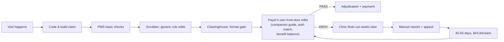
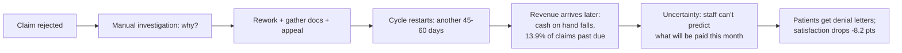
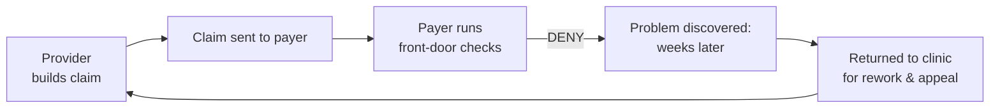
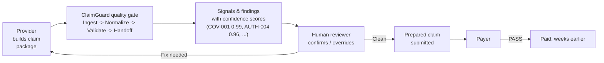

# 02 — The Problem & Its Impact

> **Document:** Why ClaimGuard AI exists — the problem, its cost, how it is solved today, and why that is not enough.
> **Project:** ClaimGuard AI — CSTAM-VELODOC Challenge ("Trustworthy Agentic Copilot for Healthcare Claim Pre-Validation")
> **Audience:** Team members (incl. 3 beginners), mentors, jury. Every acronym is defined on first use; every statistic carries a source URL and a year.
> **Status:** v1.0 draft · 2026-09-04 · For pitch preparation
> **Reading time:** ~15 minutes. **Pitch-reusable:** yes — key numbers and the before/after diagram in §9 transfer directly to slides.

---

## 1. The problem in one paragraph

When a patient in Dubai visits a clinic, the clinic does not get paid by the patient — a health insurer (the **payer**) pays the clinic afterwards, based on a formal **claim** the clinic submits. That claim is a stack of administrative paperwork: who the patient is, what was done, which codes describe it, whether an approval (authorization) was obtained beforehand, and whether coverage was still active on the day of the visit. This paperwork is built by humans, under time pressure, and it is frequently wrong in small, fixable ways — a coverage date that lapsed last week, a missing approval, a code entered twice. The payer's computer rejects those claims, and the clinic only discovers the problem **after** submission, weeks later, forcing a manual rework-and-appeal cycle that costs money, delays revenue, and frustrates patients. Roughly 1 in 8 claims is rejected on first submission, most of those rejections are avoidable, and the industry spends tens of billions of dollars a year fighting them. **ClaimGuard AI is a pre-submission "quality gate"** — a copilot that checks the complete claim *package* for these administrative problems **before** it is sent, tells the clinic exactly what is wrong and how confident it is, and hands the prepared claim to a human reviewer. It reviews, it never adjudicates: no clinical decisions, no diagnoses, no treatment recommendations. The problem we are solving is that the only place claims are reliably checked today is the wrong place — **after** they have already failed.

---

## 2. What exactly goes wrong — with concrete examples

A **claim** is the bill a provider (clinic/hospital) sends to a payer. A **claim package** is the claim plus everything that must travel with it: the encounter record, attachments (e.g., a radiology report PDF), and the authorization reference. ClaimGuard checks the package, not just the bill. Problems come in families — Velodoc's **six signal families**: **Coverage**, **Authorization**, **Integrity**, **Identity**, **Documentation**, and **Clean** (the absence of problems — the state a claim should reach before submission).

Here are five realistic broken claims, drawn from the same world as Velodoc's 13 synthetic fixtures (whose rule IDs, e.g. `COV-001`, appear below).

| # | The claim | What's wrong | What the payer does | What the clinic loses | Signal family |
|---|---|---|---|---|---|
| 1 | **Sara Mansour (fixture CLM-0042):** MRI Lumbar Spine at NorthStar Medical Center, payer "HealthPlus Gold". Service date 20 Aug 2026. Two identical MRI line items, 1,800 AED each. | Her coverage **ended 15 Aug 2026** — five days *before* the service. The required **authorization was never obtained**. And the MRI appears **twice**, identically. | Rejects the claim (coverage inactive), returns it. Even if coverage were active, the missing authorization alone kills it; the duplicate would be cut or could trigger a fraud-review delay. | Full rework: check coverage, request retroactive auth (usually impossible), correct the duplicate, re-file, wait through an appeal. Revenue stuck for 45–60+ days. | Coverage (`COV-001`, High 0.99) · Authorization (`AUTH-004`, High 0.96) · Integrity (`DUP-002`, Medium 0.88) |
| 2 | **Dental procedure at a clinic** for a basic plan with a dental sub-limit of ~500 AED/year (typical "Essential Benefits Plan" style product). Visit already used most of the limit. | The claim's total exceeds the **remaining benefit balance** — the plan has money left for almost nothing. | Denies the excess line: "benefit exhausted at date of service." | The clinic performed the work and cannot collect from the insurer; billing the patient mid-cycle creates a dispute. The service is, effectively, 100% lost revenue. | Coverage (`COV-008` — benefit balance available) |
| 3 | **Specialist consultation** billed after a referral for a *different* specialty; the approved authorization reference does not match the service rendered. | The **referral/authorization does not match** the service actually performed — wrong specialty, or the approval expired before the visit | Rejects: "authorization not valid for service." | The visit must be re-adjudicated, the specialist re-bills, and the patient may be asked to pay out of pocket in the meantime — a trust-destroying outcome. | Authorization (`AUTH-006` — approval valid on service date, `AUTH-009` — referral matches service) |
| 4 | **Outpatient consultation** (e.g., CPT 99213) appears twice on one claim — the same visit, entered twice by a tired front-desk clerk. | **Duplicate service line** on the claim. | Flags or cuts the duplicate line; in the worst case holds the *entire* claim for review, delaying every other line on it. | The whole claim, including the legitimate parts, is delayed — one typo holding 10 valid procedures hostage. | Integrity (`DUP-002` — duplicate line, `INT-003` — service periods overlap) |
| 5 | **Physiotherapy claim** where the supporting PDF attachment (treatment notes the plan requires) is missing, and the provider identifier is recorded in the wrong field. | The **referenced attachment isn't there** (`DOC-004`), and the **provider identifier doesn't resolve** (`ID-005`/`ID-002`). | Returns the claim without adjudication: "missing documentation" — the entire cycle restarts from scratch. | Full resubmission: the clinic re-runs the whole submission pipeline, days or weeks later, and the payer's 45–60 day clock starts again. | Documentation (`DOC-004`) · Identity (`ID-005`, `ID-002`) |

**The pattern:** none of these five problems requires a doctor to diagnose. They are administrative defects — coverage dates, approvals, duplicates, identifiers, attachments — discoverable *in the claim package itself* before it ever leaves the clinic. That is precisely the layer ClaimGuard automates.

---

## 3. The numbers

> **How to read this section:** every figure below carries a source and a year. Where an industry figure is *claimed* but cannot be verified, it is separated out in §3.7 as **folklore** — do not present those numbers to a jury.

### 3.1 Denial rates

| Figure | Value | What it means | Source (year) |
|---|---|---|---|
| Initial claim denial rate (US hospitals) | **12%** | ~1 in 8 claims rejected on first submission; 124M claims, 1,400+ hospitals studied | Optum Revenue Cycle Denials Index (2024, data year 2023) — [PDF](https://marketplace.optum.com/content/dam/change-healthcare/marketplace-assets/outcomes-and-insights/2024-denials-index.pdf) |
| Initial denial rate to *private* payers | **~15%** | Higher than the all-payer average when the payer is commercial | Premier member survey, 516 hospitals (2024) — [link](https://www.premierinc.com/newsroom/blog/trend-alert-private-payers-retain-profits-by-refusing-or-delaying-legitimate-medical-claims) |
| Denials that are **potentially avoidable** | **84%** | The vast majority of denials are preventable | Optum (2024, same PDF above) |
| Share of denials caused by **front-end** (registration/eligibility) | **44%** | Nearly half stem from the same window ClaimGuard targets: *before* submission | Optum (2024, same PDF above) |
| Private-payer denials ultimately paid after appeal | **54.3%** | More than half of "no" answers become "yes" — evidence the original denial was often wrong | Premier (2024) |
| Medicare Advantage prior-auth requests appealed | **11.5%** | Almost nobody appeals — because it is too expensive/slow to try | KFF analysis of CMS data (2026) — [link](https://www.kff.org/medicare/medicare-advantage-insurers-made-nearly-53-million-prior-authorization-determinations-in-2024/) |
| Appeals that are **overturned** | **80.7%** | When someone *does* appeal, the denial is usually reversed — the system is wrong far more often than it admits | KFF (2026, same link) |

### 3.2 Cost

| Figure | Value | Source (year) |
|---|---|---|
| Average provider cost **per denied claim** (staff time to investigate, rework, appeal) | **$43.84** | Premier (2024) |
| Industry-wide cost of *fighting* denials | **$19.7B / year**, roughly half wasted | Premier (2024) |
| Total US administrative-complexity waste | **$265.6B / year** (part of $760–935B total waste, ~25% of US health spend) | JAMA, Shrank et al. (2019) — [link](https://jamanetwork.com/journals/jama/fullarticle/2752664) |
| Cost of routine administrative tasks across US healthcare | **$90B / year**; **$20B** of it automatable; **70 minutes saved per patient visit** by automation | CAQH Index (2024) — [link](https://www.prnewswire.com/news-releases/new-caqh-index-reveals-20b-savings-opportunity-to-cut-waste-reduce-costs-and-improve-patient-access-302374339.html) |

> **Worked arithmetic (not a sourced statistic — simple math on sourced rates):** a clinic submitting 1,000 claims/month at Optum's 12% initial denial rate generates ~120 rejected claims/month. At Premier's $43.84 per-claim rework cost, that is **~$5,260/month (~$63k/year) of pure rework expense** — *before* counting the denied revenue itself, which is locked up for weeks. Capturing half of those defects before submission halves the rework bill. This is arithmetic, not research; use it only as an illustration.

### 3.3 Root causes — ranked

Share of claim denials by root cause (Optum Revenue Cycle Denials Index, 2024, data year 2023 — [same PDF](https://marketplace.optum.com/content/dam/change-healthcare/marketplace-assets/outcomes-and-insights/2024-denials-index.pdf)):

| Rank | Root cause | Share of denials | ClaimGuard signal family |
|---|---|---|---|
| 1 | Registration & eligibility errors | **24%** (front-end family total: **44%**) | Coverage, Identity |
| 2 | Missing / invalid claim data | **16%** | Integrity, Identity, Documentation |
| 3 | Authorization / pre-certification missing | **13%** | Authorization |
| 4 | Medical documentation requested (attachments) | **12%** | Documentation |
| 5 | Service not covered | **10%** | Coverage |
| 6 | Medical necessity | 7% | *(out of ClaimGuard's scope — clinical judgement territory)* |
| 7 | Medical coding errors | 5% | Integrity (line-level) |
| 8 | Untimely filing | 4% | Integrity (dates) |

**Read this table carefully: ranks 1–5 plus 8 — the overwhelming majority of denials — are administrative defects in the claim package itself.** Only ranks 6–7 (medical necessity, coding) touch clinical or quasi-clinical judgement, and even coding defects are largely mechanical. This is why "administrative pre-validation" is a legitimate, large, and *safe* target.

### 3.4 Eligibility & authorization burden

| Figure | Value | Source (year) |
|---|---|---|
| Prior-authorization requests per physician per week | **39**; consuming ~**13 hours/week** of physician + staff time | AMA survey (2024, published Feb 2025) — [link](https://www.ajmc.com/view/ama-survey-highlights-growing-burden-of-prior-authorization-on-physicians-patients) |
| Physicians saying prior auth delays care | **93%** | AMA (2024) |
| Physicians reporting a serious adverse event caused by prior-auth delay | **29%** | AMA (2024) |
| Physicians saying prior auth contributes to burnout | **89%** | AMA (2024) |

### 3.5 Timeliness & cash flow

| Figure | Value | Source (year) |
|---|---|---|
| Health-system claims **past due** (>90 days) | **13.9%** of all claims | Premier (2024) |
| Hospital **days of cash on hand** | Down **44 days year-over-year** — the denial/rework drag is squeezing liquidity directly | Premier (2024) |
| Time to recoup a wrongly denied claim | **Up to ~6 months** — 3 appeal rounds × 45–60 days each | Premier data (2024), synthesized by our research scout ([flagged as derived] — see §3.7) |
| Median days in accounts receivable (A/R) for physician practices | **47 days** | MGMA (2024) — secondary source |
| Dubai prior-auth turnaround rules | Insurer/TPA must respond within **6 hours** (elective outpatient), **24 hours** (inpatient), immediately (emergency); providers must submit pre-auth within **1 hour** of the physician's order; delay fee 0.03% of net claim per day | DHA rule **PD-05-2025**, in force 16 Nov 2025, via lifetrenz.ae (2026) — **vendor-reported; needs primary confirmation before pitch use** |

### 3.6 Human cost

| Figure | Value | Source (year) |
|---|---|---|
| Patient satisfaction drop after a denied claim | **−8.2 CAHPS points** (Consumer Assessment of Healthcare Providers and Systems) — *even when the claim is later paid* | Premier (2024) |

The −8.2 points is the number to remember: the damage to patient trust happens at the moment of the denial letter, not at the moment of eventual payment. Every avoidable denial is also a patient-relations event.

### 3.7 Well-sourced vs. industry folklore — **read this before quoting numbers**

Three numbers circulate constantly in healthtech pitches. **None of them is reliable. Do not use them with a jury.**

| Claim | Why it is unreliable | Status |
|---|---|---|
| **"$262 billion in denied claims annually"** | Traces back only to an *unnamed 2019 survey*; no primary dataset, no methodology, no verifiable publisher. A real figure of that magnitude would be in CMS or GAO reporting. | ❌ FOLKLORE |
| **"65% of denied claims are never resubmitted"** | Unsourceable — we could not find any primary study producing this number; it appears in secondary blog posts without citation chains. (Its sibling statistic, that **only 11.5% appeal** and **80.7% of appeals win**, IS sourced — KFF 2026 — use that instead.) | ❌ FOLKLORE |
| **"30% of US healthcare spending is waste"** | The current peer-reviewed figure is **~25%** (JAMA 2019, Shrank et al., above). The "30%" is a stale, widely-mangled version. | ⚠️ OUTDATED — use 25% (JAMA 2019) |
| *(Bonus — Gulf folklore)* **"MISBAR is Saudi Arabia's claims system"** | Could **not be verified** anywhere. Saudi's practitioner-licensing system (Mumaris+) is *not* claims; Saudi claims run on the SBS successor **NPHIES** (FHIR R4, launched Oct 2022). Treat "MISBAR" as a myth. | ❌ FOLKLORE — and a caution: even system *names* circulate as rumor. Verify everything. |

**The team rule:** every number in a pitch carries "(source, year)" on the slide — or it doesn't go on the slide.

---

## 4. The Gulf gap

Dubai's health-insurance market is mandatory, electronic, and large:

| Figure | Value | Source (year) |
|---|---|---|
| Insurance claims processed in Dubai, 2023 | **44.1M** (143.32M total transactions, AED 21.68B) | Government of Dubai Media Office (2024) — [link](https://mediaoffice.ae/en/news/2024/February/12-02/DHA) |
| Claims processed, 2024 (Dubai HASD — Health Authority Strategic Data) | **43.6M claims**, 4.6M beneficiaries, **AED 24.55B** spend, **44 insurers**, 16 claims-management companies, **3,660 providers** | Dubai HASD (2024) |
| Share of Dubai claims traveling electronically | **~95%+**, via DHA's **eClaimLink** (the mandatory electronic claims exchange: eligibility, submission, authorization, remittance) | lifetrenz.ae (2026) — vendor-reported |

**Now the critical fact: no Gulf regulator — DHA, DHIC, DOH, MOHAP, CCHI, or any other — publishes a claim rejection or denial rate.** We checked. There is no Dubai, UAE, or GCC equivalent of Optum's 12%. The region processes tens of millions of claims a year and has *no public measure of how many fail on first submission*.

**Why this gap is itself the business argument for a quality gate:**

1. **You can't manage what you don't measure.** A market with mandatory insurance, mandated response times (PD-05-2025) and no published rejection metric is a market where providers are flying blind — they learn their claims failed weeks after the fact, one denial letter at a time.
2. **The regulatory machinery implies the problem is real.** If Dubai's regulator found it necessary to mandate 1-hour pre-auth submission and response-time SLAs on insurers (PD-05-2025), the administrative friction the mandates address is *proven to exist* — the failure data is simply not published.
3. **The economics of the region point the same way as the US data.** 44M+ claims/year × even a modest first-pass rejection rate produces a rework burden measured in millions of AED — but no one can quote it, which is exactly why a tool that *measures and prevents* it has no incumbent.
4. **Local compliance is a hook, not a hurdle.** Abu Dhabi's ADHICS v2 (cybersecurity standard, mandatory since Aug 2024, applies to "Healthcare Facility, Payer, Service Provider") means payers and providers alike are being pushed toward disciplined, auditable data handling — a claims quality-gate fits the compliance spirit (see §8).

> **Pitch line:** "Dubai processed 44.1 million claims in 2023 and no public authority publishes how many of them were rejected on arrival. We exist to make that waste visible — and preventable — for the clinic that submits the claim, before the payer ever sees it."

---

## 5. How it is solved TODAY (the normal way)

Today's pre-submission quality control is a patchwork of human effort and legacy tools. Each layer does something, and each leaks. This is the honest picture — including where the current system *works*.

### 5.1 The layers

| Layer | What it does | What it does well | Where it fails |
|---|---|---|---|
| **Manual billing staff** (the human layer) | Coders and billers review claims, fix obvious errors, chase missing info before submission | Catches gross errors a machine would also catch; knows the clinic's own quirks; the only layer that can read a PDF attachment | Expensive, slow, inconsistent (varies by person, shift, and fatigue); misses subtle cross-field defects (e.g., auth valid but for the wrong specialty); zero audit trail of *why* something was fixed |
| **Practice management system (PMS)** | The clinic's own software: scheduling, demographics, basic claim build | Correct data *at the source* (patient demographics entered once); template claim templates | Only knows what's inside the clinic's own system — cannot see the payer's rulebook, benefit balances, or authorization status; checks are shallow |
| **Claims scrubber / editing engine** | Rule-based software that checks code pairs and basic claim logic before submission | Fast, deterministic, cheap per claim; catches coding-pair errors (e.g., NCCI edits) reliably | **Brittle rule maintenance** — NCCI files update quarterly *with retroactive replacement files* that rewrite past rules ([CMS](https://www.cms.gov/medicare/coding-billing/national-correct-coding-initiative-ncci-edits)); cannot read unstructured PDF attachments; binary pass/fail with no confidence; no knowledge of *this* payer's companion guides |
| **Clearinghouse** | The courier between provider and payer (or its TPA) that does a final format/scrub pass | Enforces message-level validity (is the 837 file parseable? are required fields present?); one connection to many payers | **Too late and too shallow** — it only sees transmission errors and generic edits, not payer-specific rules; and critically, its gate is *the last* gate, so it cannot help the clinic fix things upstream |
| **Appeal / rework cycle** | When a claim is denied: staff investigate, gather documentation, appeal, resubmit, wait | Recovers 54.3% of private-payer denials eventually (Premier 2024) — the appeals system is *forgiving* | Costs $43.84/claim just to fight (Premier 2024); takes up to ~6 months; writes off the 45.7% that never get paid; and inflicts the −8.2 CAHPS patient-satisfaction penalty on every patient who got a denial letter |

### 5.2 The crux: **"it passes the scrubber, and dies at the payer"**

Here is the failure mode this project exists to kill:

> A claim clears the clinic's PMS, sails through the scrubber, and passes the clearinghouse — every gate says **PASS**. It reaches the payer, and the payer's *own* front-door edits (their "companion guide" rules, their authorization matching, their benefit-balance checks — which no scrubber saw) reject it. The scrubber validated the claim against *generic* rules; the payer adjudicates it against *their* rules.

This is not exotic: because the claim-editing market is a ~95% duopoly (see §7), the "edit package" the scrubber applies is generic and payer-agnostic — while payers apply their own front-door checks at adjudication. The two rule sets disagree, and the provider pays for the disagreement in rework cycles ([quickintell.com, 837 clearinghouse guide](https://quickintell.com/guides/837-claims-clearinghouse)). The end-to-end consequence: **every gate validated the claim and no gate validated the claim.** Only the payer knows the ground truth, and the payer tells you — by denying you, weeks later.

### 5.3 The workflow today, in one picture

Notice where the **first reliable check** happens: inside the payer's system (node F) — *after* submission. Everything before it is guesswork against generic rules. The first honest QA happens at the worst possible moment.

---

## 6. The effect on their work — the operational chain reaction

A single rejected claim triggers a chain that ripples through the whole clinic:

Each step is *sourced* (all figures from §3):

1. **Rejection:** ~12% of claims rejected initially (Optum 2024); ~15% vs private payers (Premier 2024).
2. **Manual work:** every denied claim costs **$43.84** in staff time to investigate and resubmit (Premier 2024).
3. **Delay:** a denied claim's clock restarts — each appeal round costs **45–60 days**, so a fought denial can tie up revenue for **up to ~6 months** (Premier 2024 data, derived).
4. **Slower revenue:** **13.9%** of system claims sit past-due; hospital **days of cash on hand fell 44 days YoY** as the rework drag compounds (Premier 2024); median physician-practice A/R sits at **47 days** (MGMA 2024).
5. **Uncertainty:** the clinic cannot forecast cash because the payer's decision is a black box that arrives weeks late. Uncertainty is itself a cost — it forces conservative budgeting, buffer borrowing, and AR follow-up headcount.
6. **Human cost:** the *staff* side — prior auth alone consumes **39 requests and ~13 hours per physician per week**, with **93%** saying it delays care, **29%** reporting a serious patient adverse event from the delay, **89%** calling it a burnout driver (AMA 2024). The *patient* side — **−8.2 CAHPS points** in satisfaction after a denial, even when later paid (Premier 2024).

**The synthesis:** every avoidable denial is a small, predictable, self-inflicted wound on cash flow, staff time, and patient trust. The clinic doesn't need the payer to change; it needs to stop *submitting* claims that are guaranteed to fail.

---

## 7. Why existing solutions are not enough

### 7.1 The market context: a 95% duopoly with the wrong incentives

First-pass claim *editing* is one of the most concentrated markets in healthcare software: **Optum (~25% market share) + ClaimsXten (~70%) ≈ 95%** of first-pass claim editing. ClaimsXten was divested to TPG for **$2.2B in Oct 2022** and rebooted as "Lyric" ([onhealthcare.tech](https://www.onhealthcare.tech/p/how-optums-claims-editing-system-569)). These are incumbent, payer-side, generic-rule engines — and they are exactly the "passes the scrubber, dies at the payer" problem of §5.2.

The most important strategic insight from our competitive research:

> **"AI lowers the cost of building a model, not the cost of earning trust or acquiring the data."** — onhealthcare.tech (2025)

In other words: nobody will win this market with a cleverer model. The moat is **trust and data** — an auditable rule base, a transparent rationale trail, and ground-truth signal data from real claims. That is the design ClaimGuard is built around (Velodoc's published fictional rule catalogue R01–R15; synthetic fixtures with rule IDs; "review, don't adjudicate").

### 7.2 The seven concrete gaps

| # | Gap | What it means in practice | Evidence |
|---|---|---|---|
| 1 | **Brittle, high-maintenance rules** | Scrubber rule files (e.g., NCCI edits) change quarterly *with retroactive replacement files*, so a claim validated last quarter may be invalid this quarter — the rule base is a maintenance treadmill | [CMS NCCI](https://www.cms.gov/medicare/coding-billing/national-correct-coding-initiative-ncci-edits) |
| 2 | **Scrubber ≠ payer** | The scrubber applies generic edits; the payer applies its own companion-guide/front-door edits — a claim can pass one and die at the other | [quickintell.com](https://quickintell.com/guides/837-claims-clearinghouse); duopoly analysis above |
| 3 | **Can't read unstructured PDFs** | Attachments (reports, referrals) are part of the claim package payers demand — existing tools ignore them; missing-documentation denials (12% of all, Optum 2024) go unchecked | Optum 2024 ranking (§3.3); bonus scoring in the challenge explicitly rewards OCR/RAG attachment parsing |
| 4 | **Black-box distrust** | Providers won't trust a system they can't audit; "explainability" is a *named buying criterion* in this market; the counter-pattern proof is Nym Health — deliberately rules-based, auditable rationale, **KLAS Top Performer Aug 2025 (89.6)**, >95% accuracy, 50% denial reduction (vendor-claimed) | [yardstickresearch tear-sheet](https://yardstickresearch.app/tear-sheet/nym-health/) |
| 5 | **No confidence calibration** | Binary "pass/fail" with no probability — the clerk can't prioritize, can't decide "this one is almost certainly fine, ship it," can't explain to a manager *how sure* the tool is | Innate to scrubber architecture |
| 6 | **No routing / no triage** | A denied claim needs a human with the right access (biller vs. coder vs. physician for auth); tools emit a rejection, not a *handoff to the right reviewer* | — |
| 7 | **Binary pass/fail** | There is no "medium-confidence, ask a human" state — real claims live in uncertainty, and forcing them into pass/fail generates exactly the false-confidence that produces the §5.2 failure | Innate to scrubber architecture |

### 7.3 The white space

Reading the market from the provider's side: nobody owns the **pre-submission claim-package quality gate** — the layer that checks the *whole package* (claim + attachments + authorization status + payer-specific rules) at the only moment it helps (before submission), with calibrated confidence and a human handoff. Scrubbers sit before it without payer fidelity. Clearinghouses sit after it without upstream visibility. Payers sit after that, where it's too late. **The white space is the middle — and the middle is where the money leaks.**

---

## 8. The regulatory boundary as a design constraint

"Administrative only, no clinical decisions" is not just ethics or a branding choice — **it is a regulatory boundary that determines what kind of product ClaimGuard is allowed to be.** Staying on the administrative side is what keeps ClaimGuard out of the medical-device lane and the high-risk-AI lane, in every jurisdiction that matters. Crossing it would change the product's entire compliance posture.

### 8.1 FDA (US): the CDS four-criteria test

The FDA's Clinical Decision Support (CDS) guidance sets out four criteria under which software that *supports* care decisions is **not** regulated as a medical device. In its final form (January 2026 final guidance), the decisive criterion is that the software must **"enable the healthcare professional to independently review the basis for the recommendation"** ([recovry.ai summary of the "third lane"](https://recovry.ai/news/the-emerging-third-lane-of-healthcare-ai)). The four criteria, in brief: (1) not intended to acquire/process/analyze medical images or signals; (2) intended for healthcare professionals only (not patients); (3) provides support without replacing independent judgement; (4) the HCP can independently review the basis.

**Where ClaimGuard sits:** we never touch diagnosis, treatment, or clinical judgement — we check coverage dates, authorization references, duplicates, identifiers, and attachments. We do not need to squeeze under the CDS exception, because we never enter CDS territory at all. "Review, don't adjudicate" is the load-bearing wall: the product *cannot* recommend a treatment, so it cannot be a CDS device, so the CDS question never arises.

### 8.2 EU AI Act: Annex III 5(c)

Under the EU AI Act, the high-risk classification for insurance covers **Annex III point 5(c): "risk assessment and pricing in relation to natural persons in the case of life and health insurance."** Claims *processing* and pre-validation are **not** listed — they are not high-risk under the Act, and the Annex III compliance deadline has been deferred to **2 December 2027** ([actuary.info analysis](https://actuary.info/insights/eu-ai-act-high-risk-insurance-underwriting-august-2026)). The practical lesson: if ClaimGuard drifted into *pricing* or *risk assessment* (e.g., scoring a patient's future claims), it would flip into a high-risk system with obligations (risk management, data governance, human oversight, EU database registration). We stay out of that lane by construction.

### 8.3 ADHICS v2 (Abu Dhabi) — the local hook

Abu Dhabi's **ADHICS (Abu Dhabi Healthcare Information and Cyber Security Standard) v2** applies — explicitly — to "Healthcare Facility, Payer, Service Provider" and has been mandatory since **August 2024** ([DOH standard PDF](https://www.doh.gov.ae/-/media/Feature/Resources/Standards/ADHICS-v2-standard.ashx)). For the Gulf pitch, this is the local compliance argument: the regulator is pushing every claims-touching organization toward disciplined, auditable, secure data handling. A quality gate that logs every finding, preserves an audit trail, and protects patient data aligns with the *spirit* of ADHICS — and our Phase-2 "privacy/security/safety guards" and cryptographic-audit-log bonus track to it directly.

### 8.4 What would happen if we crossed the line?

If ClaimGuard ever output a clinical conclusion ("this patient needs X"), it would:
- become a **medical device** under FDA rules (510(k)/De Novo pathway if marketed in the US) and a **high-risk AI system** under the EU AI Act — with design-dossier, conformity-assessment, and liability obligations we have neither the budget nor the timeline for;
- expose the team and Velodoc to **liability** for any downstream clinical outcome plausibly traced to our output;
- destroy the pitch's cleanest sentence — "we review, we never adjudicate" — replacing a trust story with a regulatory story against a 1 Nov 2026 selection gate.

**The boundary is a feature.** "Administrative only" is what lets a 5-person student team build something real, defensible, and fundable in this timeline.

---

## 9. Where exactly we intervene

ClaimGuard's intervention point is **the last moment before submission** — after the claim package is assembled, before it crosses to the payer/TPA. It is a **quality gate** on the way out, not a spectator on the way back.

### Before — the problem is discovered *after* the fact

Timeline of damage: claim leaves Monday → payer rejects Friday → clinic learns *next week* → rework runs 45–60+ days → revenue arrives months late or never (13.9% past-due; up to ~6 months to recoup; Premier 2024).

### After — the same problem, discovered *before*

### The timing argument

The payer's rejection is not the *discovery* of the problem — it is the *report* of a problem that existed in the claim package all along. The coverage date was wrong on 15 August; the payer just told you about it on 25 September. **ClaimGuard moves the discovery point from after-submission to before-submission — and every dollar of rework, every day of delay, and every denial letter in §6 happens only in the window between the two.** Everything after the intervention point on the "after" diagram is exactly the same machinery (payer front-door checks, adjudication) — we just remove the guaranteed failures from the traffic, so the payer's "DENY" branch fires far less often.

This is also why the product ships in Velodoc's pipeline shape — **Ingest → Normalize → Validate → Handoff** — with the human in the loop at **Handoff** (*review, don't adjudicate*): the gate doesn't file the claim, the reviewer does.

---

## 10. What success looks like

Velodoc defines the product's success criteria as six properties. Here is each one, *concretely*:

| Success criterion | What it means in operation | How we'll prove it |
|---|---|---|
| **1. Finds real problems** | Fixture CLM-0042 (Sara Mansour) must yield three true signals: coverage inactive (`COV-001`, High 0.99), authorization missing (`AUTH-004`, High 0.96), possible duplicate (`DUP-002`, Medium 0.88) — problems that *actually* would be denied | Macro F1 on the 50-claim dataset (Phase 2 scoring); regression against the 13 synthetic fixtures |
| **2. Avoids false alarms** | A clean claim (the **Clean** signal family) must sail through with no findings — a quality gate that cries wolf gets switched off | False-positive rate tracked per rule; Medium/Low confidence tiers exist so the gate stays honest |
| **3. Explains itself** | Every finding carries a rule ID, a plain-language reason, and a confidence score — "why did you flag this?" is answered by the artifact, not by vibes | Audit-log engine (Phase 1 scoring); Velodoc's R01–R15 published catalogue as the vocabulary |
| **4. Knows when to ask for help** | Confidence calibration: high-confidence findings auto-flag, medium-confidence ones escalate to the human **reviewer** at **Handoff** — the gate knows it is a copilot, not a judge | Human-in-the-loop & escalation track (Phase 2 scoring) |
| **5. Is traceable** | Every check, every override, every submission decision is logged — you can replay *why* this claim left the clinic the way it did | Audit log (Phase 1) + optional cryptographic audit log (bonus) |
| **6. Is usable** | A biller at NorthStar Medical Center can read a finding and act on it in seconds — the output is a handoff, not a stack of raw JSON | Phase 3 UI/UX scoring; the before/after diagram in §9 is the demo |

**The one-sentence definition of success:** a clinic submits a claim, the gate says "Clean," the payer processes it the first time — and the clinic's A/R, its staff's evenings, and its patients' satisfaction all stop paying for the defects the claim package never should have contained.

---

## Appendix — glossary of first-use terms

| Term | Meaning |
|---|---|
| Claim | The formal bill a provider sends to a payer for services rendered |
| Claim package | The claim plus everything that must travel with it: encounter record, attachments (PDFs), authorization references |
| Payer | The insurer that pays the claim (Daman, Bupa, AXA Gulf, Sukoon, MetLife, GIG Gulf, ...) |
| TPA | Third-Party Administrator — outsourced claims processor between insurer and provider |
| Provider | The clinic/hospital (licensed by DHA in Dubai) |
| Member / beneficiary | The insured patient (identified by Emirates ID) |
| DHA / DHIC | Dubai Health Authority / Dubai Health Insurance Corporation |
| DOH, MOHAP | Abu Dhabi Department of Health; Ministry of Health and Prevention (federal) |
| eClaimLink | DHA's mandatory electronic claims exchange (eligibility, submission, authorization, remittance) |
| NPHIES | Saudi national healthcare platform (FHIR R4, launched Oct 2022) |
| ADHICS | Abu Dhabi Healthcare Information and Cyber Security Standard (v2, mandatory Aug 2024) |
| ICD-10-CM | Diagnosis codes ("what's wrong"), e.g. M54.5 low back pain |
| CPT | Procedure codes ("what was done"), e.g. 72148 MRI lumbar spine, 99213 office visit |
| CDT | Dental procedure codes |
| IR-DRG | Inpatient prospective-payment classification (mandatory in UAE since 1 Sep 2020) |
| X12 EDI | The electronic data format family: 270/271 "are you covered?", 278 "may I do this?", 837 "here's the bill", 276/277 "did you get it?", 835 "here's what you're owed & why", 834 enrollment (837P professional / 837I institutional / 837D dental) |
| Scrubber | Rule-based claim-editing software run before submission |
| Clearinghouse | The courier layer between provider and payer that performs final format/scrub checks |
| NCCI | National Correct Coding Initiative (US) — code-pair edit files, updated quarterly with retroactive replacements |
| Signal / finding | Velodoc vocabulary: a *signal* is a detected problem family; a *finding* is the concrete, rule-attributed result (rule ID + confidence) |
| Review, don't adjudicate | Core principle: ClaimGuard prepares and explains; a human decides |
| Quality gate | The pre-submission check layer ClaimGuard occupies |
| FHIR R4 | Fast Healthcare Interoperability Resources, release 4 — the JSON standard used for claim input (synthetic only) |