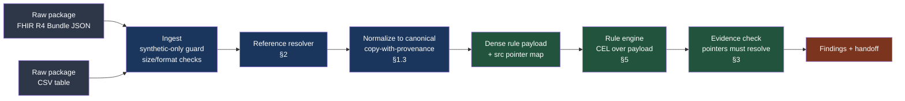
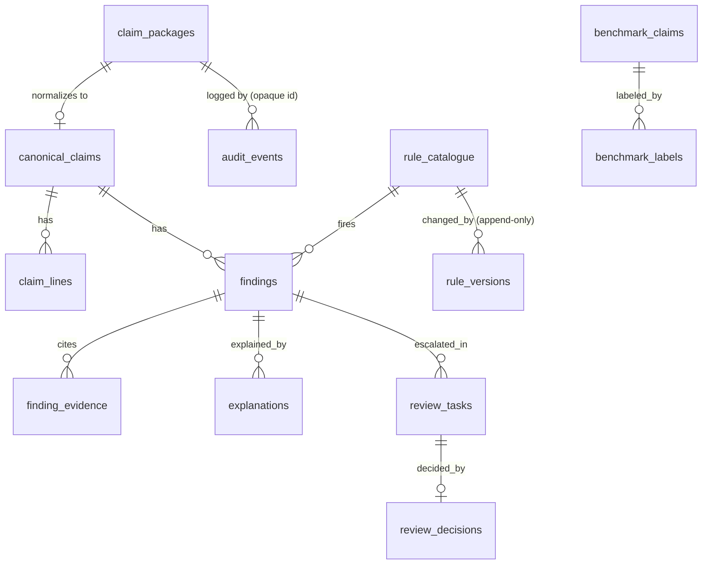
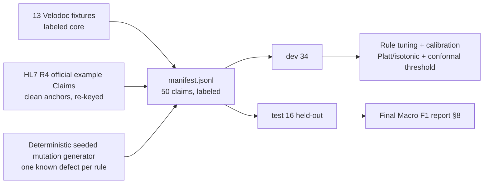

# 05 — System Design & Data Model

> **Document:** The concrete, implemented-as-is blueprint of ClaimGuard AI — the canonical claim model, reference resolution, evidence model, PostgreSQL schema, rule catalogue manifest, REST/WebSocket API, the 50-claim benchmark generator, and the evaluation harness.
> **Project:** ClaimGuard AI — CSTAM-VELODOC Challenge ("Trustworthy Agentic Copilot for Healthcare Claim Pre-Validation")
> **Audience:** The two engineers who build the core; the three beginners who build the AI-flavoured features on top. Every acronym is defined on first use. This document is the **contract** — code that contradicts §1–§6 is a defect.
> **Status:** v2.0 · 2026-09-05 · For implementation (v2 adversarial-review patch: P0-1–P0-3 + P1/P2 spec fixes; changelog in Appendix C)
> **Reading time:** ~40 minutes. **Implementation order:** §1 → §2 → §3 (core model + resolver), §4 (schema), §5 (rules), §7+§8 (benchmark + eval), §6 (API last — it is a thin layer over §2–§5).

---

## 0. Vocabulary and invariants (read this first)

The system **pre-validates claims before submission**. It is a **quality gate** sitting between the clinic and the **payer**. It never makes clinical decisions, never diagnoses, never recommends treatment, and never approves or denies payment — it **reviews, never adjudicates**: built for *review, don't adjudicate* (the footer of Velodoc's own reference site is "Built for review, not replacement", and that is the product posture too). A **claim package** is the claim plus everything that must travel with it: the patient record, the encounter, the authorization reference, and attachments. The pipeline is **Ingest → Normalize → Validate → Handoff** (Velodoc's lab UI phases); a **handoff** is the moment a package plus its **findings** is routed to a human **reviewer**.

Invariants that no code may violate:

1. **Every finding cites a resolving source pointer** (§3). A finding that cannot point at the original bytes that caused it is *not emitted* — and never silently (v2): it is suppressed with a written `finding.suppressed` audit record or deferred to a human reviewer, so the bad pointer is always visible (§3).
2. **Rules are data, not code** (§5). A rule is a versioned YAML manifest with a CEL condition. Rule authors never write Python.
3. **The LLM explains; the rules decide.** The LLM may rephrase finding language, draft reviewer-facing prose, and normalize free text — it may never change a rule outcome, severity, confidence, or routing (constraint enforced in §6 API layer and §3 engine).
4. **Input is synthetic only** (FHIR R4 JSON and/or CSV). A hard guard rejects packages carrying real-person identifiers; §4 stores the raw package encrypted at rest anyway.
5. **Audit is append-only** (§4): `audit_events` has no UPDATE/DELETE privilege for the application role, a hash chain `h_n = SHA256(h_{n-1} ‖ serialize(event_n))`, and a nightly chain-verification job.

A **signal** is a family label (Coverage, Authorization, Integrity, Identity, Documentation, Clean). A **finding** is one concrete detected problem with a title, detail, tone (red/amber), evidence, rule (ID + version + name), confidence (High 0.9x / Medium 0.8x), and a next action. **Fixtures** are Velodoc's 13 published synthetic claim packages; we reproduce them as our labeled seed corpus (§9).

---

## 1. Canonical Claim Model

### 1.1 Why normalize

Velodoc's input contract is "FHIR R4 JSON and/or CSV, synthetic only", and FHIR is deliberately verbose: `Claim.item` may carry `servicedDate` *or* `servicedPeriod`; `quantity`/`unitPrice`/`net` are a triple that different payers populate differently; `insurance` is a list; references come as `urn:uuid:…`, `Claim/42`, `#contained`, or a bare id. CSV has no standard schema at all — every clinic exports different columns.

The rules engine must not deal with any of that. We therefore normalize every accepted package into **one stable shape** — the *canonical claim model* below — and the rules operate only on it. Normalization has three consequences that the rest of this document leans on:

1. **One shape, one rule language.** Every rule condition is a CEL expression over the same dense JSON payload (§5), regardless of whether the package arrived as FHIR or CSV.
2. **Provenance survives mapping.** Normalization is a *copy with provenance*: every canonical field records the exact JSON Pointer (RFC 6901) it came from in the original package (§2.3, §3). Evidence therefore always cites the original, never the copy.
3. **Mapping bugs become visible.** A field the canonicalizer failed to map is `null` in the dense payload, and the envelope rules (ENV-001, §5.2) fire on it — a missing mapping is a *finding*, not a silent gap.



### 1.2 Package layout

```
claimguard/
  core/
    canonical.py          # §1.3 — the models below
    resolve.py            # §2.1 — reference resolver + pointer index
    evidence.py           # §3 — SourcePointer, Evidence, emit()
    engine.py             # rule engine: loads YAML catalogue, binds payload, runs CEL
    envelope.py           # ENV-001 pre-pass: minimum required fields
    guard.py              # synthetic-only guard, PII refuse-list, size caps
  rules/                  # YAML catalogue, one file per rule (§5)
  api/                    # FastAPI app: §6 endpoints, thin layer over core
  db/                     # migrations/0001_schema.sql (§4)
  benchmark/              # §7, §8 — generator, manifest, harness
```

### 1.3 The models (complete, implementable)

> **v2 note (2026-09-05) — P0-1 (camelCase payload) and P0-2 (no partial dicts):**
> every canonical model now declares Pydantic `Field(alias="camelCase")` aliases
> and `to_rule_payload()` serializes with `model_dump(by_alias=True)` — the dense
> payload is camelCase, so every §5.2 CEL condition (`payload.coverage.periodEnd`,
> `i.productOrService`, `payload.authorization.validFrom`, `payload.patient.memberId`,
> `payload.coverage.payerName`, …) finally resolves against the payload the engine
> actually binds. `CanonicalBase` sets `populate_by_name=True` so the canonicalizer
> can keep constructing models with Python field names (`member_id=…`). The old
> `env` dict is **deleted**: it merged flat partial objects over the full dump and
> destroyed nested models (`env["coverage"]` kept only payer/plan and wiped
> `periodEnd`; `env["patient"]` kept only `memberId`; same for `provider`). The
> payload is now a pure alias dump of the whole model plus the derived `anchorDate`.
> A startup smoke test (below) proves payload keys and CEL references agree.

```python
# file: claimguard/core/canonical.py  — Python 3.11+, pydantic v2. Input: synthetic only.
from __future__ import annotations

from datetime import date, datetime
from decimal import Decimal
from typing import Optional

from pydantic import BaseModel, ConfigDict, Field, model_validator


class SourcePointer(BaseModel):
    """A resolvable reference back into the ORIGINAL claim package.

    - resource_type == "csv": `resource_id` is the CSV file name and
      `pointer` is an RFC 6901 pointer into the parsed table, e.g.
      "/row/3/coverage_end".
    - otherwise: `resource_id` is the logical resource id (or fullUrl) and
      `pointer` is an RFC 6901 pointer into that resource, e.g. "/item/0/net".
    - `bundle_entry` records the Bundle.entry index when the package was FHIR
      (survives re-ordering; used as a stable lookup key, §2.1).
    """

    resource_type: str  # "Claim" | "Coverage" | "Patient" | "Encounter" | "Organization" | "DocumentReference" | "csv"
    resource_id: str  # logical id, fullUrl, or CSV file name
    pointer: str  # RFC 6901 JSON Pointer, e.g. "/item/0/net", "/row/3/coverage_end"
    bundle_entry: Optional[int] = None  # index into Bundle.entry (FHIR only)


class CanonicalBase(BaseModel):
    """Every canonical object carries `src`: one SourcePointer per canonical field.

    After normalization, `src` MUST contain an entry for every mappable field
    defined in §1.4/§1.5. Fields that are *computed* rather than copied
    (e.g. BenefitBalance.remaining) instead populate `derived_from` with the
    pointers of the fields they were computed from.
    """

    # populate_by_name: the canonicalizer builds models with Python field
    # names (member_id=…), while to_rule_payload() serializes with the
    # camelCase aliases below (by_alias=True, §1.3). Both spellings must work.
    model_config = ConfigDict(extra="forbid", populate_by_name=True)
    src: dict[str, SourcePointer] = Field(default_factory=dict)
    derived_from: dict[str, list[SourcePointer]] = Field(default_factory=dict)


class Money(CanonicalBase):
    value: Decimal = Field(ge=0)
    currency: str = Field(default="AED", min_length=3, max_length=3)


class Member(CanonicalBase):
    member_id: str | None = Field(
        default=None, alias="memberId"
    )  # plan membership number (ENV-001)
    subscriber_id: str | None = Field(default=None, alias="subscriberId")  # contract holder id
    name: str | None = None
    dob: date | None = None
    gender: str | None = None  # FHIR administrative gender code


class Provider(CanonicalBase):
    provider_id: str | None = Field(
        default=None, alias="providerId"
    )  # registered/national identifier (ID-005, ENV-001)
    name: str | None = None
    type: str | None = None  # Organization.type coding
    specialty: str | None = None  # Practitioner.specialty (if practitioner)


class Coverage(CanonicalBase):
    status: str | None = None  # Coverage.status
    payer_name: str | None = Field(
        default=None, alias="payerName"
    )  # resolved Organization name (PYR-001/R14, ENV-001)
    plan_name: str | None = Field(default=None, alias="planName")  # Coverage.class (plan) (PYR-001)
    period_start: date | None = Field(default=None, alias="periodStart")
    period_end: date | None = Field(default=None, alias="periodEnd")  # coverage endDate (COV-001)
    subscriber_id: str | None = Field(default=None, alias="subscriberId")


class BenefitBalance(CanonicalBase):
    """Category-level benefit limits, from CoverageEligibilityResponse if present."""

    category: str | None = None  # e.g. "dental", "outpatient"
    limit_amount: Decimal | None = Field(default=None, ge=0, alias="limitAmount")
    used_amount: Decimal | None = Field(default=None, ge=0, alias="usedAmount")
    remaining: Decimal | None = None  # DERIVED = limit - used (recorded in derived_from)
    period_start: date | None = Field(default=None, alias="periodStart")
    period_end: date | None = Field(default=None, alias="periodEnd")


class Authorization(CanonicalBase):
    """Extracted from supportingInfo[category="authorization"] / Claim.referral
    / the referenced preauthorization Claim (use=preauthorization)."""

    reference: str | None = None  # raw reference string (AUTH-004)
    ref_resolved: bool = Field(default=False, alias="refResolved")  # set by the resolver (§2.2)
    status: str | None = None  # active/cancelled/expired
    procedure_code: str | None = Field(
        default=None, alias="procedureCode"
    )  # authorized productOrService (AUTH-009)
    valid_from: date | None = Field(
        default=None, alias="validFrom"
    )  # approval validity window (AUTH-006)
    valid_to: date | None = Field(default=None, alias="validTo")
    authorized_provider: str | None = Field(default=None, alias="authorizedProvider")


class Attachment(CanonicalBase):
    id: str | None = None
    reference: str | None = None  # raw reference to a DocumentReference
    ref_resolved: bool = Field(default=False, alias="refResolved")
    expected: bool = False  # required by plan convention (DOC-004)
    content_present: bool = Field(
        default=False, alias="contentPresent"
    )  # DocumentReference has content
    content_type: str | None = Field(default=None, alias="contentType")
    content_hash: str | None = Field(default=None, alias="contentHash")
    size: int | None = None


class Encounter(CanonicalBase):
    id: str | None = None
    status: str | None = None
    period_start: date | None = Field(default=None, alias="periodStart")
    period_end: date | None = Field(default=None, alias="periodEnd")
    type: str | None = None  # Encounter.type coding
    location: str | None = None  # resolved location name (R13)
    subject_resolved: bool = Field(
        default=False, alias="subjectResolved"
    )  # Encounter.subject resolves (ID-002/ENC-001)
    subject_matches_member: bool = Field(
        default=False, alias="subjectMatchesMember"
    )  # subject == claim.patient (ID-002)


class ClaimLine(CanonicalBase):
    sequence: int
    product_or_service: str | None = Field(
        default=None, alias="productOrService"
    )  # CPT / procedure code (DUP-002, AUTH-009)
    category: str | None = None
    revenue_code: str | None = Field(default=None, alias="revenueCode")
    serviced_date: date | None = Field(default=None, alias="servicedDate")  # item.servicedDate
    serviced_period_start: date | None = Field(
        default=None, alias="servicedPeriodStart"
    )  # item.servicedPeriod.start
    serviced_period_end: date | None = Field(
        default=None, alias="servicedPeriodEnd"
    )  # item.servicedPeriod.end  (INT-003)
    quantity: Decimal | None = Field(default=None, ge=0)
    unit_price: Money | None = Field(default=None, alias="unitPrice")
    net: Money | None = Field(default=None)  # must be > 0 in practice (AMT-001)
    modifier: list[str] = Field(default_factory=list)
    encounter_refs: list[str] = Field(
        default_factory=list, alias="encounterRefs"
    )  # item[].encounter (ENC-001)
    encounter_refs_resolved: list[bool] = Field(default_factory=list, alias="encounterRefsResolved")
    diagnosis_sequence: list[int] = Field(default_factory=list, alias="diagnosisSequence")
    information_sequence: list[int] = Field(default_factory=list, alias="informationSequence")

    @model_validator(mode="after")
    def _anchor(self):
        # One eligibility anchor per line: serviced_date, else period start.
        if self.serviced_date is None and self.serviced_period_start is not None:
            self.serviced_date = self.serviced_period_start
        return self


class CanonicalClaim(CanonicalBase):
    """The normalized claim package — what every rule evaluates against."""

    model_version: str = Field(default="1.0", alias="modelVersion")
    claim_id: str = Field(default="", alias="claimId")  # visible id, e.g. "CLM-0042" (ENV-001)
    claim_type: str | None = Field(
        default=None, alias="claimType"
    )  # professional | institutional | oral | pharmacy
    claim_use: str = Field(default="claim", alias="claimUse")
    status: str = "active"  # Claim.status (ST-001: must be reviewable)
    created: datetime | None = None
    currency: str = "AED"
    total: Money | None = None
    anchor_date: date | None = (
        None  # DERIVED: min eligibility anchor across lines (serialized as anchorDate below)
    )
    patient: Member = Field(default_factory=Member)
    provider: Provider = Field(default_factory=Provider)
    coverage: Coverage = Field(default_factory=Coverage)
    lines: list[ClaimLine] = Field(default_factory=list)
    encounter: Encounter | None = None
    authorization: Authorization | None = None
    attachments: list[Attachment] = Field(default_factory=list)
    benefit_balance: BenefitBalance | None = Field(default=None, alias="benefitBalance")
    envelope_errors: list[str] = Field(
        default_factory=list, alias="envelopeErrors"
    )  # populated by ENV-001 pre-pass

    def to_rule_payload(self) -> dict:
        """DENSE payload for CEL: a pure `model_dump(by_alias=True, mode="json")`
        of the whole canonical model plus the derived anchorDate. Every canonical
        field present, null when absent (blank CSV cells surface as "" — ENV-001
        tests both forms, §5.2); dates as ISO-8601 strings (lexicographic order
        == chronological order); decimals as floats. P0-1: the aliases declared
        above make every key camelCase, matching the §5.2 CEL conditions; the
        startup smoke test below proves it. P0-2: NO hand-built partial dicts are
        merged in — the old `env` dict replaced whole nested models
        (coverage/patient/provider) and destroyed their fields."""
        payload = self.model_dump(
            by_alias=True,
            mode="json",
            exclude={
                "src",
                "derived_from",
                "anchor_date",
            },  # §2.3: the dense payload carries no provenance
        )
        payload["anchorDate"] = self.anchor_date.isoformat() if self.anchor_date else ""
        return payload
```

**Startup smoke test (P0-1, required)** — runs at every engine start and in CI
(default gate on the 12 Sep go/no-go, doc 09): serialize the flagship fixture
CLM-0042 (§9.3) to the dense payload, then assert that every dotted key
referenced by every CEL condition in the loaded catalogue resolves in it. A
future alias drift fails startup, never a reviewer's desk.

```python
# file: claimguard/core/smoke.py
def smoke_dense_payload_contract(catalogue: list[dict], fixture: CanonicalClaim) -> None:
    """Every CEL expression in the catalogue must reference only resolvable
    keys of the dense payload produced by to_rule_payload(). Raises on the
    first miss — a load-time catalogue error, per §5.1."""
    payload = fixture.to_rule_payload()
    for rule in catalogue:
        for path in cel_dotted_paths(rule["condition"], prefix="payload"):
            node, parts = payload, path.split(".")[1:]
            for part in parts:
                assert isinstance(node, dict) and part in node, (
                    f"{rule['id']} references {path}, which is NOT a key of the "
                    f"dense payload — camelCase alias mismatch (P0-1)"
                )
                node = node[part]
```
```

### 1.4 Mapping table — FHIR R4 path → canonical field

The canonicalizer walks a Bundle with a resolver (§2), resolves every Reference, and copies fields while recording `src`. Conventions that FHIR leaves open are fixed here (our bundle convention):

- **Authorization** is carried as `Claim.supportingInfo` with `category` coded `authorization`, whose `valueReference` points at a `Claim` with `use = preauthorization` (validity = its `item.servicedPeriod`, authorized procedure = its `item.productOrService`). `Claim.referral` is retained as the raw referral reference.
- **Attachment** is carried as `Claim.supportingInfo` with `category` coded `attachment` / `valueReference` → `DocumentReference` (content presence = `DocumentReference.content[].attachment`).
- **Benefit balance** is carried by an optional `CoverageEligibilityResponse` in the same bundle (`insurance[0].benefitBalance[]`).

| FHIR R4 path (bundle resource) | Canonical field | Notes on normalization |
|---|---|---|
| `Claim.id` | `claim_id` | |
| `Claim.type.coding[0].code` | `claim_type` | professional/institutional/oral/pharmacy |
| `Claim.use` | `claim_use` | claim \| preauthorization \| predetermination |
| `Claim.status` | `status` | ST-001 checks it is reviewable (`active`/`draft` set per plan) |
| `Claim.created` | `created` | `dateTime` → ISO datetime |
| `Claim.priority` | *(not mapped — see §7 multi-violation variants)* | reserved |
| `Claim.total.value` / `.currency` | `total.value` / `total.currency` | default currency `AED` when absent |
| `Claim.patient` (Reference) | `patient` (whole Member) | must resolve; subject of ID-002 |
| `Claim.patient.identifier` *(subscriber id)* | `patient.subscriber_id` | |
| `Claim.patient` → `Patient.id` | `patient.member_id` | member id convention |
| `Patient.name[0].family` + `.given[0]` | `patient.name` | `"family, given"` |
| `Patient.birthDate` | `patient.dob` | |
| `Patient.gender` | `patient.gender` | |
| `Claim.provider` (Reference) | `provider` (whole Provider) | resolved Organization/Practitioner |
| `Organization.identifier.value` | `provider.provider_id` | ID-005 target |
| `Organization.name` | `provider.name` | |
| `Organization.type.coding[0].code` | `provider.type` | |
| `Practitioner.specialty.coding[0].code` | `provider.specialty` | when a practitioner is referenced |
| `Claim.insurance[0].coverage` (Reference) | `coverage` (whole Coverage) | first insurance entry wins; others logged |
| `Coverage.status` | `coverage.status` | |
| `Coverage.payor[0]` → `Organization.name` | `coverage.payer_name` | PYR-001 target (≙ R14) |
| `Coverage.class` (plan class) | `coverage.plan_name` | |
| `Coverage.period.start` | `coverage.period_start` | |
| `Coverage.period.end` | `coverage.period_end` | **COV-001 target** |
| `Coverage.subscriberId` | `coverage.subscriber_id` | |
| `CoverageEligibilityResponse.insurance[0].benefitBalance[].category.coding[0].code` | `benefit_balance.category` | when CER present |
| `…benefitBalance[].limit[].amount.value` | `benefit_balance.limit_amount` | |
| `…benefitBalance[].used.value` | `benefit_balance.used_amount` | |
| **derived** `limit − used` | `benefit_balance.remaining` | `derived_from` = the two pointers above; **COV-008 target** |
| `Claim.item[*]` | `lines[]` | each item → one `ClaimLine` |
| `Claim.item[].sequence` | `lines[].sequence` | |
| `Claim.item[].productOrService.coding[0].code` | `lines[].product_or_service` | DUP-002 / AUTH-009 target |
| `Claim.item[].category.coding[0].code` | `lines[].category` | |
| `Claim.item[].revenue.coding[0].code` | `lines[].revenue_code` | |
| `Claim.item[].servicedDate` | `lines[].serviced_date` | |
| `Claim.item[].servicedPeriod.start/end` | `lines[].serviced_period_start/end` | INT-003 target |
| `Claim.item[].quantity.value` | `lines[].quantity` | |
| `Claim.item[].unitPrice.value/currency` | `lines[].unit_price` | |
| `Claim.item[].net.value/currency` | `lines[].net` | AMT-001 target (≙ R09) |
| `Claim.item[].modifier[].coding[].code` | `lines[].modifier` | |
| `Claim.item[].encounter[]` (Reference) | `lines[].encounter_refs` + `encounter_refs_resolved` | ENC-001 target |
| `Claim.item[].diagnosisSequence[]` | `lines[].diagnosis_sequence` | |
| `Claim.item[].informationSequence[]` | `lines[].information_sequence` | |
| `Claim.referral` (Reference) | `authorization.reference` | kept raw; also referenced by AUTH-009 |
| `Claim.supportingInfo[category=authorization].valueReference` + referenced preauth Claim | `authorization.valid_from/valid_to/procedure_code/status/ref_resolved` | bundle convention above |
| `Claim.supportingInfo[category=authorization].valueReference.reference` | `authorization.reference` | AUTH-004 target |
| `Claim.supportingInfo[category=attachment].valueReference` → `DocumentReference` | `attachments[]` | reference + `ref_resolved` |
| `DocumentReference.content[].attachment.data\|url` presence | `attachments[].content_present` | DOC-004 target |
| `DocumentReference.content[].attachment.contentType/size/hash` | `attachments[].content_type/size/content_hash` | |
| `Claim.encounter`-family `item.encounter` → `Encounter.id/status/period/type` | `encounter.*` | first resolved encounter wins |
| `Encounter.location[0].location` → `Location.name` | `encounter.location` | R13 target |
| `Encounter.subject` resolves? matches `Claim.patient`? | `encounter.subject_resolved` / `subject_matches_member` | ID-002 target |
| **derived** min over lines of (`serviced_date` \| `serviced_period_start`) | `anchor_date` | `derived_from` = each contributing line pointer; the date every coverage/authorization rule compares against |

### 1.5 Mapping table — CSV column → canonical field

CSV is wrapped at ingest: one row = one claim package; repeated line-level columns (`line_*`) are grouped into `lines[]` by a stable `line_seq` column. The CSV source pointer shape is `csv://claims.csv#/row/<N>/<column>` (§2.1). Columns beyond those below are ignored and logged (never silently used).

| CSV column (our canonical layout) | Canonical field | Notes |
|---|---|---|
| `claim_id` | `claim_id` | required (ENV-001) |
| `claim_type` | `claim_type` | default `professional` |
| `claim_use` | `claim_use` | default `claim` |
| `claim_status` | `status` | default `active` (ST-001) |
| `created` | `created` | ISO datetime |
| `total`, `currency` | `total` | default currency `AED` |
| `patient_id` | `patient.member_id` | required |
| `patient_name` | `patient.name` | |
| `patient_dob` | `patient.dob` | `YYYY-MM-DD` |
| `patient_gender` | `patient.gender` | |
| `subscriber_id` | `patient.subscriber_id`, `coverage.subscriber_id` | |
| `provider_id` | `provider.provider_id` | required (ID-005) |
| `provider_name` | `provider.name` | |
| `payer_id` | `coverage.payer_name` (id form) | PYR-001 (≙ R14) |
| `plan_name` | `coverage.plan_name` | |
| `coverage_status` | `coverage.status` | default `active` |
| `coverage_start`, `coverage_end` | `coverage.period_start/end` | COV-001 target |
| `line_seq` | `lines[].sequence` | grouping key |
| `line_code` | `lines[].product_or_service` | DUP-002 / AUTH-009 target |
| `line_category` | `lines[].category` | |
| `line_revenue` | `lines[].revenue_code` | |
| `line_service_date` | `lines[].serviced_date` | |
| `line_service_start`, `line_service_end` | `lines[].serviced_period_start/end` | INT-003 target |
| `line_quantity`, `line_unit_price`, `line_net` | `lines[].quantity/unit_price/net` | AMT-001 target (≙ R09); parse failures → envelope error |
| `line_modifier` | `lines[].modifier` | semicolon-separated |
| `line_encounter_id` | `lines[].encounter_refs` | `csv://…/row/N/line_encounter_id` |
| `encounter_id`, `encounter_status`, `encounter_start`, `encounter_end`, `encounter_type`, `encounter_location` | `encounter.*` | |
| `auth_reference` | `authorization.reference` | AUTH-004 target; `ref_resolved=True` iff non-empty |
| `auth_valid_from`, `auth_valid_to` | `authorization.valid_from/valid_to` | AUTH-006 target |
| `auth_procedure` | `authorization.procedure_code` | AUTH-009 target |
| `auth_status` | `authorization.status` | |
| `attachment_ids` | `attachments[].reference` + `content_present` | semicolon-separated; `content_present = True` iff a matching uploaded file exists (DOC-004) |
| `benefit_category`, `benefit_limit`, `benefit_used` | `benefit_balance.*` | COV-008 target |

---

## 2. Reference Resolution

### 2.1 The resolver

A FHIR R4 Bundle is a list of `entry[]`, each with an optional `fullUrl` (usually `urn:uuid:…` or an absolute URL) and a `resource` carrying `resourceType` + `id`. References inside resources are *strings*: `"urn:uuid:abc"`, `"Claim/42"`, `"#contained"`, or a bare id. Resolution must be unambiguous and recorded, because:

- **Dangling references are a first-class defect** — they fire ENC-001 (encounter reference resolves), and other rules degrade gracefully when a reference they need is dangling.
- **Provenance needs a stable key.** We record `bundle_entry` (the entry index) at normalization time so evidence can re-locate the resource even if its id is opaque.

```mermaid
flowchart TD
    A[Bundle.entry[]] --> B["Build index<br/>keys: fullUrl, 'Type/id', id"]
    A --> C[Walk every Reference<br/>patient, provider, insurance.coverage,<br/>item.encounter, referral, supportingInfo]
    B --> D{"starts with '#'?"}
    D -- yes --> E[Look up contained resource<br/>inside owning resource]
    D -- no --> F{"in index?"}
    F -- yes --> G[Resolved: record target type/id + entry index]
    F -- no --> H["Dangling: ResourceRef.resolved = False<br/>reason = 'no entry matches reference'"]
    E -- miss --> H
    G --> I[Canonicalizer copies fields,<br/>records SourcePointer per field]
    H --> I
    I --> J[ref_resolved booleans on<br/>encounter / authorization / attachments]
    J --> K[Rules: ENC-001, AUTH-004, DOC-004, ID-002]
```

```python
# file: claimguard/core/resolve.py
from typing import Optional
from pydantic import BaseModel


class ResourceRef(BaseModel):
    """Outcome of resolving one FHIR reference string."""

    raw: str  # e.g. "urn:uuid:3f2c"
    kind: str = "bundle"  # bundle | contained | external | csv
    target_type: Optional[str] = None
    target_id: Optional[str] = None
    entry_index: Optional[int] = None  # Bundle.entry index
    resolved: bool = False
    reason: Optional[str] = None  # why it failed, surfaced in evidence


def index_bundle(bundle: dict) -> dict[str, ResourceRef]:
    """Key every entry by every plausible reference spelling. Keys are
    cheap supersets; lookups below apply expected-type checks to disambiguate."""
    idx: dict[str, ResourceRef] = {}
    for i, entry in enumerate(bundle.get("entry", [])):
        res = entry.get("resource") or {}
        rt, rid = res.get("resourceType"), res.get("id")
        full = entry.get("fullUrl") or ""
        ref = ResourceRef(raw=full, target_type=rt, target_id=rid, entry_index=i, resolved=True)
        keys = {full, f"{rt}/{rid}", rid, full.rsplit("/", 1)[-1], full.removeprefix("urn:uuid:")}
        for k in keys:
            if k:
                idx.setdefault(k, ref)  # first spelling wins; setdefault keeps IDs stable
    return idx


def resolve_ref(
    ref: str, index: dict[str, ResourceRef], expected_type: Optional[str] = None
) -> ResourceRef:
    """Resolve one reference string. Never raises."""
    if ref.startswith("#"):
        # contained resource: handled by the canonicalizer with the owning
        # resource; recorded here as 'contained'.
        return ResourceRef(
            raw=ref,
            kind="contained",
            resolved=False,
            reason="contained lookup deferred to canonicalizer",
        )
    candidates = [ref, ref.removeprefix("urn:uuid:"), ref.rsplit("/", 1)[-1]]
    for c in candidates:
        hit = index.get(c)
        if hit is None:
            continue
        if expected_type is not None and hit.target_type != expected_type:
            continue  # wrong type for this slot — keep looking
        return hit
    return ResourceRef(
        raw=ref, resolved=False, reason="no matching bundle entry (or type mismatch)"
    )
```

Ambiguity rules (documented, encoded above): a bare id is the *weakest* key and only binds when no stronger key (`fullUrl` or `Type/id`) matches; `setdefault` makes the first entry in the Bundle authoritative; expected-type filtering disambiguates a bare id that collides across resource types.

### 2.2 Dangling references → ENC-001

After canonicalization, every canonical object that was populated *through* a reference carries a `ref_resolved` boolean (see `Authorization.ref_resolved`, `Attachment.ref_resolved`, `Encounter.subject_resolved`, `ClaimLine.encounter_refs_resolved`). Those booleans are ordinary canonical fields with `src` pointers to the reference strings themselves, so the rule engine can fire on them:

- **ENC-001 (encounter reference resolves):** fires when any `lines[].encounter_refs_resolved[]` is `False` or `encounter` is null while at least one line carries an encounter ref. The evidence pointer is the raw reference string, e.g. `/item/0/encounter/0` in the Claim resource.
- **AUTH-004 (required approval present):** fires when `authorization` is null or `authorization.ref_resolved == False`.
- **DOC-004 (referenced attachment present):** fires when an `expected` attachment has `ref_resolved == False` or `content_present == False`.
- **ID-002 (member and beneficiary match):** uses `encounter.subject_resolved` and `subject_matches_member`.

A dangling reference never crashes the canonicalizer — it becomes a finding. This is the "graceful error handling for malformed FHIR" the Phase 2 rubric demands (CSTAM Book p.17–19).

### 2.3 Provenance pointers — the backbone of explainability

Every canonical field copied from the package records where it came from. Examples from the flagship fixture CLM-0042 (full package in §9.3):

| Canonical field | `src` (SourcePointer) |
|---|---|
| `coverage.period_end` | `resource_type="Coverage", resource_id="cov-7711", pointer="/period/end", bundle_entry=3` |
| `lines[0].net` | `resource_type="Claim", resource_id="CLM-0042", pointer="/item/0/net", bundle_entry=1` |
| `lines[1].net` | `… pointer="/item/1/net" …` |
| `anchor_date` | `derived_from=[lines[0].serviced_date pointer]` |
| `benefit_balance.remaining` | `derived_from=[limit pointer, used pointer]` |
| `encounter.subject_matches_member` | `derived_from=[Encounter.subject pointer, Claim.patient pointer]` |

Provenance is stored **in the canonical object** (`src` / `derived_from`), persisted in `canonical_claims.canonical_json` (it survives `to_rule_payload()` only as pointers — the dense payload carries no provenance, by design: rules are pure functions over data). Evidence resolution (§3) re-reads the original raw package from `claim_packages.raw_json` using these pointers. This is *"enough to reconstruct, never enough to leak"*: the canonical stores pointers, not copies of the raw PHI.

---

## 3. Evidence Model

A **finding** is emitted with a list of **evidence items**, each of which is (canonical path, source pointer, value snapshot). The emission rule is deliberately blunt:

> **If a finding cannot cite a resolving pointer, it is not emitted — and never silently** (v2, P1): it is suppressed with a written `finding.suppressed` audit record or deferred to a human reviewer, so a rule that fired on a bad pointer stays visible.

This single rule is what makes explainability *structural* rather than cosmetic: the engine cannot produce noise it cannot also justify. It also auto-suppresses stale findings if the raw package mutates between normalization and handoff (the pointer stops resolving) — but the suppression itself is now audited (§3 `emit()`), never a silent vanish.

```python
# file: claimguard/core/evidence.py
import jsonpointer  # pip install jsonpointer (RFC 6901)
from enum import Enum
from pydantic import BaseModel, Field


class RawPackage(BaseModel):
    """The ingest output: the original bytes, resolved, never re-written."""

    source_kind: str  # "fhir" | "csv"
    source_ref: str  # bundle id / file name
    bundle: dict | None = None  # original FHIR Bundle JSON (synthetic)
    csv_tables: dict[str, list[dict]] = None  # {file_name: rows}
    index: dict  # ResourceRef index built by §2.1


class Evidence(BaseModel):
    canonical_path: str  # e.g. "coverage.period_end"
    pointer: SourcePointer  # where the fact lives in the raw package
    value: object | None = None  # snapshot taken at detection time


def resolve_pointer(pkg: RawPackage, sp: SourcePointer) -> object | None:
    """Return the node at sp.pointer inside pkg, or None. Never raises."""
    if sp.resource_type == "csv":
        table = (pkg.csv_tables or {}).get(sp.resource_id)
        if table is None:
            return None
        try:
            return jsonpointer.resolve_pointer(table, sp.pointer)
        except jsonpointer.JsonPointerException:
            return None
    for i, entry in enumerate((pkg.bundle or {}).get("entry", [])):
        res = entry.get("resource") or {}
        if sp.bundle_entry is not None and i != sp.bundle_entry:
            continue
        if res.get("resourceType") == sp.resource_type and (
            res.get("id") == sp.resource_id or entry.get("fullUrl") == sp.resource_id
        ):
            try:
                return jsonpointer.resolve_pointer(res, sp.pointer)
            except jsonpointer.JsonPointerException:
                return None
    return None


class FindingDraft(BaseModel):
    rule_id: str
    rule_version: int
    claim_id: str = ""  # visible claim id, bound by the engine before emit() (v2)
    title: str
    detail: str
    tone: str  # red | amber
    severity: str  # info | minor | major | critical (from catalogue only)
    confidence: float  # 0..1 (set by engine, see §5.3)
    evidence: list[Evidence]
    next_action: str
    llm_assisted: bool = False


class Finding(FindingDraft):
    finding_id: str  # uuid
    claim_id: str
    created_at: str


class EmitOutcome(str, Enum):
    """Disposition of one FindingDraft after evidence resolution. There is NO
    silent drop (P1, v2): a finding whose pointer fails to resolve either is
    SUPPRESSED with a written audit record or DEFERRED_TO_HITL — never
    vanished without a trace."""

    EMITTED = "emitted"  # all evidence resolved → a Finding is returned
    SUPPRESSED = "suppressed"  # ≥1 pointer failed → no Finding; audit event written
    DEFERRED_TO_HITL = "deferred_to_hitl"  # suppressed AND routed to a human reviewer


class EmitResult(BaseModel):
    outcome: EmitOutcome
    finding: Finding | None = None  # set only when EMITTED
    reason: str = ""  # SUPPRESSED / DEFERRED_TO_HITL: which pointers failed
    unresolved_evidence: list[Evidence] = Field(default_factory=list)


def emit(draft: FindingDraft, pkg: RawPackage) -> EmitResult:
    """THE emission rule (invariant #1, v2): unverifiable findings are not
    emitted — and never dropped silently. Evidence values are snapshotted at
    detection time so the finding is self-contained even if the raw package is
    later re-keyed or archived. If any evidence pointer fails to resolve:

      1. a `finding.suppressed` audit event is ALWAYS written (§4) with the
         rule_id, rule_version, and every unresolvable pointer — the audit
         record is the finding's tombstone; silent drops are forbidden;
      2. if the 04 cross-check gate (mandatory-topic rules, severity >= major)
         says the pointer failure itself needs eyes, the draft is
         DEFERRED_TO_HITL: a review task of type 'escalation' with
         reason_codes=["evidence_pointer_failure"] is created — the gate is
         reachable now because emit() RETURNS its outcome instead of returning
         None before the gate ever runs (P1);
      3. otherwise the draft is SUPPRESSED(reason), audited, and dropped."""
    resolved: list[Evidence] = []
    failed: list[Evidence] = []
    for ev in draft.evidence:
        node = resolve_pointer(pkg, ev.pointer)
        if node is None:
            failed.append(ev)
            continue
        resolved.append(ev.model_copy(update={"value": node}))
    if failed:
        # The engine binds a per-claim audit writer; opaque_ref maps the
        # visible claim id to the opaque package UUID (§4).
        audit.write_finding_suppressed(
            claim_ref=opaque_ref[draft.claim_id],
            rule_id=draft.rule_id,
            rule_version=draft.rule_version,
            failed_evidence=[(ev.canonical_path, ev.pointer.pointer) for ev in failed],
        )
        reason = "evidence pointer(s) do not resolve: " + ", ".join(
            f"{ev.canonical_path} @ {ev.pointer.pointer}" for ev in failed
        )
        if cross_check_gate(draft, failed):  # 04's cross-check gate — now reachable
            review_tasks.create(
                claim_id=draft.claim_id,
                task_type="escalation",
                reason_codes=["evidence_pointer_failure"],
                finding_ids=[],
            )
            return EmitResult(
                outcome=EmitOutcome.DEFERRED_TO_HITL, reason=reason, unresolved_evidence=failed
            )
        return EmitResult(outcome=EmitOutcome.SUPPRESSED, reason=reason, unresolved_evidence=failed)
    return EmitResult(
        outcome=EmitOutcome.EMITTED,
        finding=Finding(
            **draft.model_dump(exclude={"evidence"}),
            finding_id=uuid4().hex,
            evidence=resolved,
            created_at=utcnow_iso(),
        ),
    )
```

> **v2 note (2026-09-05) — P1:** `emit()` previously returned `None` and dropped
> the finding BEFORE 04's cross-check gate could route it to HITL — a rule that
> fired on an unresolvable pointer vanished with no audit record. Now `emit()`
> returns `EMITTED | SUPPRESSED(reason) | DEFERRED_TO_HITL`; suppressed findings
> always write a `finding.suppressed` audit event (rule_id + rule_version + the
> unresolvable pointers), the gate chooses between suppression and HITL deferral,
> and the `audit_events.kind` CHECK constraint in §4 gains `finding.suppressed`.
```

The Finding JSON that leaves the API (§6.4) is exactly this object plus rule metadata. **Tone derivation** is deterministic: `red` ⇔ `severity ∈ {major, critical}`, `amber` ⇔ `severity ∈ {info, minor}` — the LLM never sets tone.

---

## 4. Database Schema (PostgreSQL)

One schema `claimguard`. Raw package JSON is PHI-shaped even though synthetic; it is stored encrypted at rest (column-level encryption note below) and referenced from audit by its opaque UUID only.



```sql
-- file: claimguard/db/migrations/0001_schema.sql
-- PostgreSQL 13+ (uses gen_random_uuid(), identity columns, partial indexes)
CREATE SCHEMA IF NOT EXISTS claimguard;
CREATE EXTENSION IF NOT EXISTS pgcrypto;

-- =====================================================================
-- 1. claim_packages — the raw synthetic package, byte-faithful
-- =====================================================================
CREATE TABLE claimguard.claim_packages (
    package_id        UUID PRIMARY KEY DEFAULT gen_random_uuid(),
    provider_claim_id TEXT NOT NULL,          -- visible id, e.g. 'CLM-0042'
    source_kind       TEXT NOT NULL CHECK (source_kind IN ('fhir','csv')),
    source_ref        TEXT NOT NULL,          -- bundle id / file name
    raw_json          JSONB NOT NULL,         -- original package (encrypted at rest; see note)
    input_hash        TEXT NOT NULL,          -- sha256(serialized raw_json), dedupe + audit
    envelope_ok       BOOLEAN NOT NULL DEFAULT FALSE,   -- ENV-001 pre-pass result
    envelope_errors   JSONB NOT NULL DEFAULT '[]',
    status            TEXT NOT NULL DEFAULT 'received'
                      CHECK (status IN ('received','normalized','validated','handoff','failed')),
    received_at       TIMESTAMPTZ NOT NULL DEFAULT now()
);
CREATE UNIQUE INDEX uq_claim_packages_input_hash ON claimguard.claim_packages (input_hash);
CREATE INDEX ix_claim_packages_status ON claimguard.claim_packages (status, received_at);

-- NOTE (encryption at rest): raw_json must be stored via application-level
-- envelope encryption (e.g., AES-256-GCM with a KMS-rotated data key). The
-- column itself stays JSONB so the resolver can read it; the app encrypts on
-- write and decrypts only inside the core process. ClaimGuard holds only
-- synthetic fixtures, but the guard exists by design, not by accident.

-- =====================================================================
-- 2. canonical_claims — the normalized shape (§1.3), with provenance
-- =====================================================================
CREATE TABLE claimguard.canonical_claims (
    id                UUID PRIMARY KEY DEFAULT gen_random_uuid(),
    package_id        UUID NOT NULL UNIQUE REFERENCES claimguard.claim_packages(package_id),
    model_version     TEXT NOT NULL DEFAULT '1.0',
    claim_id          TEXT NOT NULL,          -- visible id
    claim_type        TEXT,
    claim_use         TEXT NOT NULL DEFAULT 'claim',
    status            TEXT NOT NULL DEFAULT 'active',
    created           TIMESTAMPTZ,
    currency          CHAR(3) NOT NULL DEFAULT 'AED',
    total             NUMERIC(18,2) CHECK (total >= 0),
    anchor_date       DATE,                   -- §1.3 derived eligibility anchor
    patient_member_id TEXT,
    provider_id       TEXT,
    payer_name        TEXT,
    canonical_json    JSONB NOT NULL,         -- full canonical model incl. src/derived_from
    created_at        TIMESTAMPTZ NOT NULL DEFAULT now()
);
CREATE INDEX ix_canonical_claims_claim_id ON claimguard.canonical_claims (claim_id);

-- =====================================================================
-- 3. claim_lines — line items (mirrors CanonicalClaim.lines)
-- =====================================================================
CREATE TABLE claimguard.claim_lines (
    id                    UUID PRIMARY KEY DEFAULT gen_random_uuid(),
    claim_id              UUID NOT NULL REFERENCES claimguard.canonical_claims(id) ON DELETE CASCADE,
    sequence              INTEGER NOT NULL,
    product_or_service    TEXT,
    category              TEXT,
    revenue_code          TEXT,
    serviced_date         DATE,
    serviced_period_start DATE,
    serviced_period_end   DATE,
    quantity              NUMERIC(18,4),
    unit_price            NUMERIC(18,2) CHECK (unit_price >= 0),
    net                   NUMERIC(18,2),
    modifier              TEXT[] NOT NULL DEFAULT '{}',
    encounter_refs        JSONB NOT NULL DEFAULT '[]',        -- raw strings
    encounter_refs_resolved JSONB NOT NULL DEFAULT '[]',      -- booleans
    evidence              JSONB NOT NULL DEFAULT '{}',        -- per-field src pointers
    UNIQUE (claim_id, sequence)
);
CREATE INDEX ix_claim_lines_service_date ON claimguard.claim_lines (serviced_date);

-- =====================================================================
-- 4. rule_catalogue — versioned rule manifests (active + historical)
-- =====================================================================
CREATE TABLE claimguard.rule_catalogue (
    rule_id           TEXT NOT NULL,             -- e.g. 'COV-001'
    version           INTEGER NOT NULL CHECK (version >= 1),
    family            TEXT NOT NULL,             -- Coverage | Authorization | Integrity | Identity | Documentation | Clean
    name              TEXT NOT NULL,
    description       TEXT NOT NULL,
    severity          TEXT NOT NULL CHECK (severity IN ('info','minor','major','critical')),
    base_confidence   NUMERIC(4,3) CHECK (base_confidence > 0 AND base_confidence <= 1),
    condition         TEXT NOT NULL,             -- CEL expression over dense payload (§5)
    evidence_paths    JSONB NOT NULL,            -- canonical paths cited by this rule
    suggested_action  TEXT NOT NULL,
    references        JSONB NOT NULL DEFAULT '[]',
    payer             TEXT NOT NULL DEFAULT '*',    -- '*' = baseline catalogue; payer code for payer policy packs (§5.4)
    source            JSONB NOT NULL DEFAULT '{}',  -- {name, url, retrieved} — REQUIRED for payer packs, optional for baseline (§5.4)
    effective_from    DATE NOT NULL,
    effective_to      DATE,                      -- NULL = currently effective
    enabled           BOOLEAN NOT NULL DEFAULT TRUE,
    content_hash      TEXT NOT NULL,             -- sha256 of the normalized manifest
    created_at        TIMESTAMPTZ NOT NULL DEFAULT now(),
    PRIMARY KEY (rule_id, version)
);
-- Exactly one *active* version per rule id (no duplicate rule IDs per version):
CREATE UNIQUE INDEX uq_rule_one_active
    ON claimguard.rule_catalogue (rule_id)
    WHERE enabled AND effective_to IS NULL;
CREATE INDEX ix_rule_catalogue_family ON claimguard.rule_catalogue (family);

-- =====================================================================
-- 5. rule_versions — append-only log of catalogue changes
-- =====================================================================
CREATE TABLE claimguard.rule_versions (
    id            BIGINT GENERATED ALWAYS AS IDENTITY PRIMARY KEY,
    rule_id       TEXT NOT NULL,
    from_version  INTEGER,
    to_version    INTEGER NOT NULL,
    old_hash      TEXT,
    new_hash      TEXT NOT NULL,
    changed_by    TEXT NOT NULL,
    changed_at    TIMESTAMPTZ NOT NULL DEFAULT now(),
    manifest_diff JSONB NOT NULL DEFAULT '{}'
);
CREATE INDEX ix_rule_versions_rule ON claimguard.rule_versions (rule_id, to_version);

-- =====================================================================
-- 6. findings — one row per emitted finding (§3)
-- =====================================================================
CREATE TABLE claimguard.findings (
    id            UUID PRIMARY KEY DEFAULT gen_random_uuid(),
    claim_id      UUID NOT NULL REFERENCES claimguard.canonical_claims(id) ON DELETE CASCADE,
    rule_id       TEXT NOT NULL,
    rule_version  INTEGER NOT NULL,
    family        TEXT NOT NULL,
    severity      TEXT NOT NULL CHECK (severity IN ('info','minor','major','critical')),
    tone          TEXT NOT NULL CHECK (tone IN ('red','amber')),
    title         TEXT NOT NULL,
    detail        TEXT NOT NULL,
    next_action   TEXT NOT NULL,
    confidence    NUMERIC(4,3) CHECK (confidence > 0 AND confidence <= 1),
    status        TEXT NOT NULL DEFAULT 'open'
                  CHECK (status IN ('open','escalated','auto_resolved','accepted','dismissed')),
    llm_assisted  BOOLEAN NOT NULL DEFAULT FALSE,
    dedupe_hash   TEXT NOT NULL,                -- sha256(claim_id|rule_id|version|evidence pointers)
    created_at    TIMESTAMPTZ NOT NULL DEFAULT now(),
    FOREIGN KEY (rule_id, rule_version) REFERENCES claimguard.rule_catalogue(rule_id, version)
);
CREATE UNIQUE INDEX uq_findings_dedupe ON claimguard.findings (dedupe_hash);
CREATE INDEX ix_findings_claim ON claimguard.findings (claim_id);
CREATE INDEX ix_findings_queue ON claimguard.findings (status, severity) WHERE status = 'open';

-- =====================================================================
-- 7. finding_evidence — every evidence item of every finding
-- =====================================================================
CREATE TABLE claimguard.finding_evidence (
    id              UUID PRIMARY KEY DEFAULT gen_random_uuid(),
    finding_id      UUID NOT NULL REFERENCES claimguard.findings(id) ON DELETE CASCADE,
    ordinal         INTEGER NOT NULL,
    canonical_path  TEXT NOT NULL,              -- e.g. 'coverage.period_end'
    resource_type   TEXT NOT NULL,
    resource_id     TEXT NOT NULL,
    bundle_entry    INTEGER,
    pointer         TEXT NOT NULL,              -- RFC 6901 pointer
    value_snapshot  JSONB,                      -- detection-time value
    derived         BOOLEAN NOT NULL DEFAULT FALSE,   -- true when value is derived, not copied
    UNIQUE (finding_id, ordinal)
);

-- =====================================================================
-- 8. explanations — LLM-generated, reviewer-facing language (never decision)
-- =====================================================================
CREATE TABLE claimguard.explanations (
    id                  UUID PRIMARY KEY DEFAULT gen_random_uuid(),
    finding_id          UUID NOT NULL REFERENCES claimguard.findings(id) ON DELETE CASCADE,
    language            TEXT NOT NULL DEFAULT 'en',
    text                TEXT NOT NULL,          -- the prose the reviewer reads
    model_version       TEXT NOT NULL,
    prompt_hash         TEXT NOT NULL,
    faithfulness_method TEXT NOT NULL DEFAULT 'ragas_faithfulness',
    faithfulness_score  NUMERIC(4,3) CHECK (faithfulness_score >= 0 AND faithfulness_score <= 1),
    created_at          TIMESTAMPTZ NOT NULL DEFAULT now()
);
CREATE INDEX ix_explanations_finding ON claimguard.explanations (finding_id);

-- =====================================================================
-- 9. review_tasks — HITL routing (three tiers, §6)
-- =====================================================================
CREATE TABLE claimguard.review_tasks (
    id            UUID PRIMARY KEY DEFAULT gen_random_uuid(),
    claim_id      UUID NOT NULL REFERENCES claimguard.canonical_claims(id) ON DELETE CASCADE,
    task_type     TEXT NOT NULL
                  CHECK (task_type IN ('escalation','confidence_gated','sample_audit')),
    -- 'escalation'        = mandatory topic (AUTH-004/006/009, ENC-001, eligibility)
    -- 'confidence_gated'  = low-confidence / high-severity
    -- 'sample_audit'      = ~10% stratified double-review
    status        TEXT NOT NULL DEFAULT 'open'
                  CHECK (status IN ('open','in_review','decided','expired')),
    reason_codes  JSONB NOT NULL DEFAULT '[]',  -- e.g. ["mandatory_topic_auth"]
    finding_ids   JSONB NOT NULL DEFAULT '[]',  -- findings attached to this task
    severity_level TEXT NOT NULL DEFAULT 'minor',
    assigned_role TEXT NOT NULL DEFAULT 'reviewer',
    created_at    TIMESTAMPTZ NOT NULL DEFAULT now(),
    decided_at    TIMESTAMPTZ,
    decision_id   UUID UNIQUE                    -- set when decided
);
CREATE INDEX ix_review_tasks_queue ON claimguard.review_tasks (status, created_at) WHERE status IN ('open','in_review');
CREATE INDEX ix_review_tasks_claim ON claimguard.review_tasks (claim_id);

-- =====================================================================
-- 10. review_decisions — structured overrides, reason-code enums not prose
-- =====================================================================
CREATE TABLE claimguard.review_decisions (
    id                    UUID PRIMARY KEY DEFAULT gen_random_uuid(),
    task_id               UUID NOT NULL UNIQUE REFERENCES claimguard.review_tasks(id),
    decision              TEXT NOT NULL
                          CHECK (decision IN ('confirmed','override_clear','override_keep',
                                              'needs_more_info','dismissed')),
    reason_code           TEXT NOT NULL
                          CHECK (reason_code IN ('eligibility_verified_manually',
                                                 'auth_found_in_system',
                                                 'duplicate_verified_legit',
                                                 'data_entry_error',
                                                 'coverage_retroactive',
                                                 'cancel_duplicate_of_other_task',
                                                 'other_requires_comment')),
    comment               TEXT,                 -- optional; REQUIRED when reason_code='other_requires_comment'
    reviewer_id           TEXT NOT NULL,
    affected_finding_ids  JSONB NOT NULL DEFAULT '[]',
    override              JSONB NOT NULL DEFAULT '{}',  -- machine-readable override payload
    input_hash            TEXT NOT NULL,        -- sha256 of the task snapshot the reviewer saw
    reviewed_at           TIMESTAMPTZ NOT NULL DEFAULT now()
);

-- =====================================================================
-- 11. audit_events — APPEND-ONLY, hash-chained (§4.2)
-- =====================================================================
CREATE TABLE claimguard.audit_events (
    event_id      BIGINT GENERATED ALWAYS AS IDENTITY PRIMARY KEY,
    at            TIMESTAMPTZ NOT NULL DEFAULT now(),
    kind          TEXT NOT NULL
                  CHECK (kind IN ('claim_received','normalized','validated','finding_created',
                                  'finding.suppressed','escalated','review_decided','override_applied',
                                  'rule_published','benchmark_run','llm_called','handoff')),
    claim_ref     UUID,                         -- OPAGUE reference to claim_packages; never the visible claim id
    rule_version  TEXT,
    finding_ids   UUID[] NOT NULL DEFAULT '{}',
    decision      TEXT,
    reason_code   TEXT,
    reviewer_id   TEXT,
    trace_id      TEXT NOT NULL,                -- OpenTelemetry trace id (per-claim trace)
    input_hash    TEXT,
    output_hash   TEXT,
    prompt_hash   TEXT,
    model_version TEXT,
    prev_hash     TEXT,                         -- sha256 of the previous event's canonical row
    hash          TEXT,                         -- sha256(prev_hash || canonical row serialization)
    CHECK (at IS NOT NULL)
);
CREATE UNIQUE INDEX uq_audit_hash ON claimguard.audit_events (hash);
CREATE INDEX ix_audit_at ON claimguard.audit_events (at);
CREATE INDEX ix_audit_claim ON claimguard.audit_events (claim_ref);

-- =====================================================================
-- 12. benchmark_claims / benchmark_labels — the 50-claim labeled set (§7)
-- =====================================================================
CREATE TABLE claimguard.benchmark_claims (
    id                UUID PRIMARY KEY DEFAULT gen_random_uuid(),
    claim_id          TEXT NOT NULL UNIQUE,     -- e.g. 'BM-023'
    anchor            TEXT NOT NULL,            -- seed fixture / HL7 example id
    clean             BOOLEAN NOT NULL,
    split             TEXT NOT NULL CHECK (split IN ('dev','test')),
    family_tags       JSONB NOT NULL DEFAULT '[]',
    mutations         JSONB NOT NULL DEFAULT '[]',   -- [{rule_id, mutation_fn, args}]
    manifest_lineno   INTEGER NOT NULL,         -- pointer into manifest.jsonl
    generated_at      TIMESTAMPTZ NOT NULL DEFAULT now(),
    seed              INTEGER NOT NULL
);
CREATE INDEX ix_benchmark_split ON claimguard.benchmark_claims (split, clean);

CREATE TABLE claimguard.benchmark_labels (
    id                  UUID PRIMARY KEY DEFAULT gen_random_uuid(),
    benchmark_claim_id  UUID NOT NULL REFERENCES claimguard.benchmark_claims(id) ON DELETE CASCADE,
    rule_id             TEXT NOT NULL,
    severity            TEXT NOT NULL,
    tone                TEXT NOT NULL CHECK (tone IN ('red','amber')),
    confidence_lo       NUMERIC(4,3),        -- INFORMATIONAL for deterministic rules; NOT scored (§7.4)
    confidence_hi       NUMERIC(4,3),        -- calibration targets for LLM-derived fields only (§7.4)
    UNIQUE (benchmark_claim_id, rule_id)
);
CREATE INDEX ix_benchmark_labels_claim ON claimguard.benchmark_labels (benchmark_claim_id);

-- =====================================================================
-- 13. llm_calls — LLM telemetry (hashes, not prompts; content lives in explanations)
-- =====================================================================
CREATE TABLE claimguard.llm_calls (
    id            UUID PRIMARY KEY DEFAULT gen_random_uuid(),
    trace_id      TEXT NOT NULL,
    claim_ref     UUID,
    kind          TEXT NOT NULL CHECK (kind IN ('normalize','explain','draft_prose','review_summary')),
    model_version TEXT NOT NULL,
    prompt_hash   TEXT NOT NULL,
    output_hash   TEXT NOT NULL,
    input_tokens  INTEGER NOT NULL DEFAULT 0,
    output_tokens INTEGER NOT NULL DEFAULT 0,
    latency_ms    INTEGER NOT NULL DEFAULT 0,
    temperature   NUMERIC(3,2) NOT NULL DEFAULT 0.0,
    status        TEXT NOT NULL DEFAULT 'ok' CHECK (status IN ('ok','retry','unreliable','refused')),
    error_code    TEXT,
    created_at    TIMESTAMPTZ NOT NULL DEFAULT now()
);
CREATE INDEX ix_llm_calls_trace ON claimguard.llm_calls (trace_id, created_at);

-- =====================================================================
-- 14. calibration_runs — confidence calibration + abstention thresholds (§8.4)
-- =====================================================================
CREATE TABLE claimguard.calibration_runs (
    id                UUID PRIMARY KEY DEFAULT gen_random_uuid(),
    run_at            TIMESTAMPTZ NOT NULL DEFAULT now(),
    method            TEXT NOT NULL CHECK (method IN ('platt','isotonic','conformal_abstention')),
    dataset_split     TEXT NOT NULL CHECK (dataset_split IN ('dev','test')),
    model_version     TEXT NOT NULL,
    n_samples         INTEGER NOT NULL,
    ece               NUMERIC(6,4),             -- expected calibration error
    auROC             NUMERIC(6,4),             -- confidence discriminability
    abstain_threshold NUMERIC(4,3),             -- conformal abstention cutoff (§8.4)
    coverage          NUMERIC(6,4),             -- 1 - abstention rate on eval split
    report            JSONB NOT NULL DEFAULT '{}',
    seed              INTEGER NOT NULL
);

-- =====================================================================
-- 15. Roles and the append-only audit
-- =====================================================================
CREATE ROLE claimguard_app NOLOGIN;
GRANT USAGE ON SCHEMA claimguard TO claimguard_app;
GRANT SELECT, INSERT ON ALL TABLES IN SCHEMA claimguard TO claimguard_app;

-- audit_events is APPEND-ONLY for the application role:
REVOKE UPDATE, DELETE, TRUNCATE, REFERENCES ON claimguard.audit_events FROM claimguard_app;

-- Defense in depth: even a privileged/buggy connection cannot mutate rows.
CREATE OR REPLACE FUNCTION claimguard.audit_no_modify() RETURNS trigger AS $$
BEGIN
    RAISE EXCEPTION 'audit_events is append-only (event %)', OLD.event_id;
END; $$ LANGUAGE plpgsql;

CREATE TRIGGER trg_audit_no_modify
    BEFORE UPDATE OR DELETE ON claimguard.audit_events
    FOR EACH ROW EXECUTE FUNCTION claimguard.audit_no_modify();

-- Hash chain insert trigger: h_n = sha256(h_{n-1} || serialize(row_n))
CREATE OR REPLACE FUNCTION claimguard.audit_chain_insert() RETURNS trigger AS $$
DECLARE
    v_prev TEXT;
BEGIN
    SELECT hash INTO v_prev FROM claimguard.audit_events
    ORDER BY event_id DESC LIMIT 1;
    NEW.prev_hash := COALESCE(v_prev, 'genesis');
    NEW.hash := encode(
        digest(
            NEW.prev_hash || NEW.at::text || COALESCE(NEW.claim_ref::text,'') ||
            NEW.trace_id || COALESCE(NEW.decision,'') || COALESCE(NEW.reason_code,'') ||
            COALESCE(array_to_string(NEW.finding_ids, ','),'') || COALESCE(NEW.model_version,''),
            'sha256'
        ), 'hex');
    RETURN NEW;
END; $$ LANGUAGE plpgsql;

CREATE TRIGGER trg_audit_chain
    BEFORE INSERT ON claimguard.audit_events
    FOR EACH ROW EXECUTE FUNCTION claimguard.audit_chain_insert();

-- Nightly integrity verification (also exposed as GET /v1/audit/verify, §6.3):
CREATE OR REPLACE FUNCTION claimguard.verify_audit_chain()
RETURNS TABLE (broken_at TIMESTAMPTZ, event_id BIGINT, expected TEXT, stored TEXT) AS $$
DECLARE
    v_prev TEXT := 'genesis';
    r RECORD;
BEGIN
    FOR r IN SELECT * FROM claimguard.audit_events ORDER BY event_id LOOP
        IF r.prev_hash <> v_prev THEN
            broken_at := r.at; event_id := r.event_id;
            expected := 'prev=' || v_prev; stored := r.prev_hash; RETURN NEXT;
        END IF;
        v_prev := r.hash;   -- app-side recompute is identical to trigger logic
    END LOOP;
END; $$ LANGUAGE plpgsql;
```

**Hash serialization is owned by the trigger — the Python side replicates it (P0-3).**
The trigger above is the SINGLE canonical owner of the hash serialization.
`04` §9 previously computed `SHA256(prev_hash + "\x1f" + json.dumps(event, sort_keys=True, …))`
on the Python side — that can never agree with the trigger's raw field
concatenation, so the chain was broken by design. v2 resolves the
contradiction: the trigger stays, and the Python side replicates it
character-for-character — same fields, same order, same null coercion
(`COALESCE` → `''`), same list join (`array_to_string(finding_ids, ',')`), same
concatenation (`||` with NO separator). The serialized field list (explicit, in
order): `prev_hash`, `at`, `claim_ref`, `trace_id`, `decision`, `reason_code`,
`finding_ids` (comma-joined), `model_version`. Fields NOT in the hash by design
(the trigger is the owner, and the owner decides): `kind`, `reviewer_id`,
`input_hash`, `output_hash`, `prompt_hash` — they are chain-visible but not
chain-covered; changing the field list is a migration that must touch trigger
AND replica together.

```python
# file: claimguard/db/audit_chain.py — Python replica of the trigger (P0-3)
import hashlib


def chain_hash(
    prev_hash: str,
    at_text: str,
    claim_ref: str,
    trace_id: str,
    decision: str,
    reason_code: str,
    finding_ids: list[str],
    model_version: str,
) -> str:
    """Replicate claimguard.audit_chain_insert() CHARACTER-FOR-CHARACTER.

    - prev_hash: the previous event's stored hash ('genesis' for the first).
    - at_text / claim_ref: the EXACT ::text renderings Postgres produced —
      timestamptz::text is '2026-09-05 10:00:00.123456+00' (space, '+00'), NOT
      Python's isoformat ('T', '+00:00'); uuid::text is the dashed lowercase
      form. Pass NULL cells as '' exactly like COALESCE(..., ''). Never
      re-format a value the trigger already rendered — the integration test
      below is the tripwire against drift.
    - finding_ids: the UUID[] cell; ",".join(...) mirrors array_to_string(..., ',').
    - The `||` operator concatenates with NO separator — so does this join.
    """
    serialized = "".join(
        [
            prev_hash,
            at_text,
            claim_ref,
            trace_id,
            decision,
            reason_code,
            ",".join(finding_ids),
            model_version,
        ]
    )
    return hashlib.sha256(serialized.encode("utf-8")).hexdigest()
```

**Required integration test (P0-3):** insert one event through the application
path and assert the trigger-computed hash equals the Python-computed hash on
the same row — the test fails on any serialization drift between the two sides.

```python
# tests/integration/test_hashchain_trigger.py — REQUIRED (P0-3)
def test_trigger_hash_matches_python_replica(conn):
    prev = (
        conn.scalar("SELECT hash FROM claimguard.audit_events ORDER BY event_id DESC LIMIT 1")
        or "genesis"
    )
    row = conn.one("""
        INSERT INTO claimguard.audit_events
            (kind, claim_ref, trace_id, decision, reason_code, finding_ids, model_version)
        VALUES ('finding_created', gen_random_uuid(), 't-smoke', NULL, NULL,
                '{00000000-0000-0000-0000-000000000000}', 'gpt-4o')
        RETURNING prev_hash, hash,
                  at::text, claim_ref::text, trace_id, decision, reason_code,
                  finding_ids, model_version
    """)
    expected = chain_hash(
        prev_hash=row.prev_hash,
        at_text=row.at,
        claim_ref=row.claim_ref,
        trace_id=row.trace_id,
        decision=row.decision or "",
        reason_code=row.reason_code or "",
        finding_ids=row.finding_ids or [],
        model_version=row.model_version or "",
    )
    assert row.hash == expected, (
        "trigger and Python replica disagree — hash serialization drifted (P0-3)"
    )
```

> **v2 note (2026-09-05) — P0-3:** the DB trigger is now the single canonical
> owner of hash serialization; the Python `chain_hash()` above replicates it
> character-for-character (previously `04` §9's JSON-dump hashing could never
> match the trigger's `||`-concatenation, so the two could never agree). The
> integration test asserting trigger hash == Python hash is mandatory.

**Audit policy** (matches Phase 2 "audit log engine", CSTAM Book p.17): events carry *pointers and hashes*, never PHI — `claim_ref` is the opaque UUID, and no event stores a provider claim id or patient name. A `handoff` event closes the per-claim trace. Chain failures **fail open**: the nightly job logs the gap and pages the team; it never blocks claims (an availability failure must not freeze a clinic).

---

## 5. Rule Catalogue Specification

### 5.1 Manifest schema

A rule is a YAML file in `claimguard/rules/`. One file per rule id; versions bump the `version` field (a new file *or* an edit — the `content_hash` changes either way). The catalogue table (§4) is the source of truth; YAML files are the authoring format; the schema below is enforced by a Pydantic manifest validator at load time and gate.

```yaml
# claimguard/rules/COV-001.yaml — full schema with all keys
id: COV-001
version: 3                      # integer, >= 1
family: Coverage                # Coverage | Authorization | Integrity | Identity | Documentation | Clean
name: Coverage active at the date of service
description: |
  The plan must be active on the date the service was delivered. Fires when the
  coverage period ends before the eligibility anchor date of the claim.
severity: critical              # info | minor | major | critical  (NEVER changed by LLM or engine)
base_confidence: 0.99           # 0..1; engine may adjust within [base-0.15, 1.0] (§5.3)
condition: |                   # CEL expression over the DENSE payload (§1.3 to_rule_payload)
  payload.coverage != null
  && payload.coverage.periodEnd != null
  && payload.anchorDate > payload.coverage.periodEnd
evidence_paths:                 # canonical paths this rule may cite (whitelist)
  - coverage.period_end
  - anchor_date
suggested_action: Verify eligibility and route to an administrative reviewer
references:
  - https://veloclaim.app/reference
  - https://hl7.org/fhir/R4/coverage.html
effective_from: 2026-09-01
effective_to: null              # null = currently effective
payer: "*"                      # "*" = baseline catalogue; payer code = payer policy pack (§5.4)
enabled: true
```

Field-by-field contract (the manifest validator rejects anything else):

| Key | Type | Constraint |
|---|---|---|
| `id` | string | uppercase family prefix + 3 digits, e.g. `COV-001`; must match filename and the `rule_id` in §9 |
| `version` | int | ≥ 1; `(id, version)` unique in the catalogue; the partial unique index §4 keeps one active version |
| `family` | enum | one of the six signal families |
| `name` | string | ≤ 120 chars, sentence case |
| `description` | string | ≤ 1000 chars; explains *when* it fires and why, for reviewers |
| `severity` | enum | `info` \| `minor` \| `major` \| `critical` |
| `base_confidence` | number | (0, 1] — the catalogue's prior for this defect class |
| `condition` | string | valid CEL, compiles at load; operates on the dense payload (§1.3) |
| `evidence_paths` | list[string] | whitelist of canonical paths the rule may cite; the engine refuses evidence outside it |
| `suggested_action` | string | the `next_action` scaffold for every finding of this rule |
| `references` | list[string] | URLs (FHIR docs, plan manuals, Velodoc reference pages) |
| `effective_from` / `effective_to` | date / date\|null | activation window; `null` to = open-ended |
| `enabled` | bool | soft switch; disabled rules never fire but stay in history |
| `payer` | string | `"*"` = baseline catalogue (applies to every payer); else a payer code from §9.1 — the rule is a payer policy pack overlay (§5.4) evaluated only for that payer |
| `source` | object | `{name, url, retrieved}` — provenance of the rule text; REQUIRED for payer packs, optional for baseline (§5.4) |

CEL notes: the engine binds `payload` to `to_rule_payload()` output, which is **dense** (every key present, `null` when absent; blank CSV cells surface as `""` — ENV-001 tests both forms, §5.2). Payload keys are the **camelCase aliases** declared in §1.3 (P0-1): every CEL condition MUST reference an alias, and the startup smoke test (§1.3) proves the whole catalogue resolves against a serialized CLM-0042 at load time. Dates are ISO-8601 strings, so `<=`/`>` on them is chronological. The engine implements the CEL spec subset of [`cel-python`](https://github.com/cloud-custodian/cel-python) (maps, lists, the `exists` macro, string/number comparison) — rule authors stay in data, never in Python. Any condition that fails to compile is a load-time catalogue error: the whole catalogue version refuses to go live (a quality gate on the rules themselves).

### 5.2 Five worked rules (covering Coverage, Authorization, Integrity ×2, Documentation)

```yaml
# ---- COV-001 · family Coverage · flagship rule (fixture CLM-0042) ----
id: COV-001
version: 3
family: Coverage
name: Coverage active at the date of service
description: |
  The plan must be active on the date the service was delivered. Fires when the
  coverage period ends before the eligibility anchor date of the claim (e.g.,
  coverage ended 2026-08-15, service delivered 2026-08-20).
severity: critical
base_confidence: 0.99
condition: |
  payload.coverage != null
  && payload.coverage.periodEnd != null
  && payload.anchorDate > payload.coverage.periodEnd
evidence_paths: [coverage.period_end, anchor_date]
suggested_action: Verify eligibility and route to an administrative reviewer
references: ["https://veloclaim.app/reference", "https://hl7.org/fhir/R4/coverage.html"]
effective_from: 2026-09-01
effective_to: null
enabled: true
```

```yaml
# ---- AUTH-006 · family Authorization · approval valid on service date ----
id: AUTH-006
version: 1
family: Authorization
name: Approval valid on the date of service
description: |
  A present authorization must cover the service date: the eligibility anchor
  must fall inside the approval's validity window. Fires when the approval
  exists but expired before the service, or begins after it.
severity: major
base_confidence: 0.94
condition: |
  payload.authorization != null
  && payload.authorization.validFrom != null
  && payload.authorization.validTo != null
  && !(payload.authorization.validFrom <= payload.anchorDate
       && payload.anchorDate <= payload.authorization.validTo)
evidence_paths: [authorization.valid_from, authorization.valid_to, anchor_date]
suggested_action: Verify the approval window against the service date; request re-validation if the window is stale
references: ["https://veloclaim.app/reference", "https://hl7.org/fhir/R4/claim.html"]
effective_from: 2026-09-01
effective_to: null
enabled: true
```

```yaml
# ---- DUP-002 · family Integrity · duplicate service line (fixture CLM-0042) ----
id: DUP-002
version: 2
family: Integrity
name: Duplicate service line
description: |
  Two line items with the same procedure code, same service date and same net
  amount are a possible duplicate — a tired front-desk clerk entering the same
  visit twice is the canonical case. Always a 'compare the source documents'
  finding, never an auto-decision: the two lines may be billing artifacts.
severity: minor
base_confidence: 0.88
condition: |
  payload.lines.size() > 1
  && payload.lines.exists(i,
       payload.lines.exists(j,
         j.sequence > i.sequence
         && i.productOrService == j.productOrService
         && i.servicedDate == j.servicedDate
         && i.net == j.net
       )
     )
evidence_paths: ["lines", "lines[].product_or_service", "lines[].serviced_date", "lines[].net"]
suggested_action: Compare the source documents before changing either line
references: ["https://veloclaim.app/reference", "https://hl7.org/fhir/R4/claim.html"]
effective_from: 2026-09-01
effective_to: null
enabled: true
```

```yaml
# ---- INT-003 · family Integrity · service periods do not overlap ----
id: INT-003
version: 1
family: Integrity
name: Service periods do not overlap
description: |
  Two distinct lines whose serviced periods overlap (start_i <= end_j AND
  start_j <= end_i) describe the same clock time twice — a scheduling or entry
  defect, or a duplicate in period form.
severity: minor
base_confidence: 0.82
condition: |
  payload.lines.exists(i,
    i.servicedPeriodStart != null
    && payload.lines.exists(j,
        j.sequence > i.sequence
        && j.servicedPeriodStart != null
        && i.servicedPeriodStart <= j.servicedPeriodEnd
        && j.servicedPeriodStart <= i.servicedPeriodEnd
      )
  )
evidence_paths: ["lines[].serviced_period_start", "lines[].serviced_period_end"]
suggested_action: Confirm which period is correct and correct the other line before submission
references: ["https://veloclaim.app/reference", "https://hl7.org/fhir/R4/claim.html"]
effective_from: 2026-09-01
effective_to: null
enabled: true
```

```yaml
# ---- ENV-001 · family Documentation · minimum claim envelope ----
# The quality gate itself: a package that cannot even be read cannot be validated.
# family sourced from Velodoc's published fixture label CLM-0161 (external label),
# not our internal taxonomy — fixture label > YAML manifest for fixture-backed rules.
id: ENV-001
version: 1
family: Documentation
name: Minimum claim envelope present
description: |
  The claim must carry at minimum: a claim id, a patient member id, a provider
  id, a payer/plan, and a creation timestamp. Absent envelope fields surface as
  null (FHIR) or "" (blank CSV cell) in the dense payload; this rule fires on
  either form. The envelope pre-pass populates canonical.envelope_errors with
  the same list.
severity: critical
base_confidence: 0.999
condition: |
  payload.claimId == "" || payload.created == "" || payload.created == null
  || payload.patient == null || payload.patient.memberId == "" || payload.patient.memberId == null
  || payload.provider == null || payload.provider.providerId == "" || payload.provider.providerId == null
  || payload.coverage == null || payload.coverage.payerName == "" || payload.coverage.payerName == null
evidence_paths: [claim_id, created, patient.member_id, provider.provider_id, coverage.payer_name]
suggested_action: Return the package to the submitter with the missing envelope fields listed
references: ["https://veloclaim.app/reference", "https://hl7.org/fhir/R4/claim.html"]
effective_from: 2026-09-01
effective_to: null
enabled: true
```

> **v2 note (2026-09-05) — ENV-001 family and envelope semantics:** ENV-001's
> family is **Documentation**, sourced from Velodoc's published fixture label for
> CLM-0161 ("Malformed claim envelope") — the fixtures are the only
> externally-published, externally-graded labels we possess. Authority hierarchy:
> **fixture label > YAML manifest** for the 12 fixture-backed rules (this one
> corrected from our earlier internal choice of **Integrity**); the manifest
> remains the single source of truth only for rules with no fixture. Its
> condition now tests both `== ""` (blank CSV cells) and
> `== null` (absent FHIR fields): the dense payload is a pure alias dump (§1.3
> P0-2), so envelope leaves are `null` when absent, no longer pre-normalized to
> `""` inside `to_rule_payload()` (P0-1).

### 5.3 Severity and confidence policy

- **Severity is a property of the rule, set by the team in the manifest** — it encodes how administratively harmful that defect class is (a coverage lapse blocks the claim; a possible duplicate needs human comparison). The engine and the LLM per-claim NEVER change it. A reviewer can disagree with a finding, but that is a *review decision* (§4 table 10, §6 POST decision) recorded against the finding, not a mutation of the rule.
- **Confidence starts at `base_confidence` and the engine may adjust it within `[base − 0.15, 1.0]`** using deterministic evidence-strength modifiers only — e.g. *exact* pointer resolution vs. a best-effort CSV parse, or whether a comparison needed a type coercion. The LLM never touches confidence.
- **The LLM writes language, not verdicts.** After deterministic rules fire, the LLM may rephrase `title`/`detail`/`suggested_action` into reviewer-facing prose (and draft the free-text explanation stored in `explanations`), but the structured fields (rule id, severity, tone, confidence, evidence pointers, next-action class) are immutable from its perspective. Enforcement is mechanical: the LLM's structured output must reproduce the engine's `rule_id`, `severity`, `tone`, and `evidence` pointers verbatim, and any mismatch routes the explanation to HITL as an `LLM_UNRELIABLE` finding (§3 invariant #3, and the bounded validate-and-retry contract in the architecture doc).
- **Routing:** severity + confidence only *recommend* a route; **mandatory-topic escalation is never confidence-gated** — any AUTH-004/006/009, ENC-001, or eligibility/benefit finding escalates regardless of confidence (Velodoc's "ask a human when the situation is uncertain or important").

### 5.4 Payer policy packs

A **payer policy pack** is a set of *overlay* rules for one payer: versioned,
effective-dated rule manifests layered on top of the baseline catalogue
(`payer: "*"`). The engine evaluates **baseline + the claim's payer pack**
(the pack is selected during normalization from the resolved payer, §1.4
`coverage.payer_name` / payer code — both layers share the same dense CEL
payload, so the pack costs one extra rule pass). Every finding names the
**pack/version/source** that produced it — the §6.5 Finding JSON carries
`rule.payer`, `rule.pack_version`, and `rule.source` — so a reviewer always
sees which rule text fired and which source document it came from.

Pack-specific manifest keys on top of the §5.1 schema:

| Key | Type | Constraint |
|---|---|---|
| `payer` | string | `"*"` = baseline (applies to every payer); otherwise a payer code from §9.1 (e.g. `NOURISH-SEL`, `AFAQ-STD`) — the pack is evaluated only when the claim's payer matches |
| `effective_from` | date | pack activation date (reuses the baseline field) |
| `source` | object | `{name, url, retrieved}` — the provenance of the overlay text: payer manual/policy name, its URL, and the retrieval date; surfaced on every finding this rule produces |

Worked example — a payer-specific overlay rule:

```yaml
# claimguard/rules/PAK-NOURISH-001.yaml — payer-specific overlay (§5.4)
id: PAK-NOURISH-001
version: 1
family: Authorization
payer: NOURISH-SEL            # §9.1 payer code; "*" would mean baseline
name: Nourish Select — physiotherapy sessions require prior authorization
description: |
  Nourish Select's 2026 provider manual requires a prior authorization for
  physiotherapy (CPT 97140) sessions. Overlay rule: fires when a
  physiotherapy line exists but the claim carries no authorization.
severity: major
base_confidence: 0.9
condition: |
  payload.lines.exists(i,
    i.productOrService == "97140"
    && payload.authorization == null
  )
evidence_paths: [lines[].product_or_service, authorization]
suggested_action: Request the authorization or route to the payer's prior-authorization desk
references: ["https://veloclaim.app/reference"]
effective_from: 2026-09-01
source:
  name: Nourish Select Provider Manual 2026 (v4)
  url: https://payers.local/nourish-select/provider-manual-2026.pdf
  retrieved: 2026-08-20
```

> **v2 note (2026-09-05):** new — payer policy packs (per-payer, versioned,
> effective-dated overlays with source URLs; doc 09). Baseline rules carry
> `payer: "*"`; the engine evaluates baseline + the claim's payer pack; every
> finding names its pack/version/source. `rule_catalogue` gains `payer` and
> `source` columns (§4). The overlay's CEL keys above are camelCase aliases
> (§1.3 P0-1) and are covered by the startup smoke test.

---

## 6. API Surface

### 6.1 Conventions

- Base URL `/v1`; JSON everywhere; timestamps RFC 3339; ids opaque strings.
- Auth: API key or OAuth2 Bearer, scopes `read:claims`, `write:claims`, `review`, `admin:rules`, `audit:read`. Rate limits per key; `429` with `Retry-After`.
- Idempotency: `POST /v1/claims:validate-async` accepts an `Idempotency-Key` header (replay-safe job creation).
- **Error shape (every 4xx/5xx):**

```json
{
  "error": {
    "code": "RESOURCE_NOT_FOUND",
    "message": "review task rt-… does not exist",
    "details": [{"field": "task_id", "issue": "unknown id"}],
    "trace_id": "t-9f2c…"
  }
}
```

Codes: `VALIDATION_FAILED` (422 — input payload malformed), `UNPARSEABLE_CLAIM` (422 — FHIR/CSV cannot be normalized), `RULE_MANIFEST_INVALID` (400 — POST /v1/rules), `RESOURCE_NOT_FOUND` (404), `STATE_CONFLICT` (409 — task already decided), `RATE_LIMITED` (429), `INTERNAL` (500), `SERVICE_UNAVAILABLE` (503). The `UNPARSEABLE_CLAIM` response includes the envelope errors, never a crash.

### 6.2 Endpoint matrix

| # | Method & path | Purpose | Sync/Async | Bonus |
|---|---|---|---|---|
| 1 | `POST /v1/claims:validate` | Quality-gate a claim package, return findings | sync | — |
| 2 | `POST /v1/claims:validate-async` | Same, as a background job (large/attachments) | async (202) | — |
| 3 | `GET /v1/claims/{id}` | Claim package status + summary | sync | — |
| 4 | `GET /v1/claims/{id}/findings` | All findings for a claim | sync | — |
| 5 | `GET /v1/review-queue` | Reviewer inbox (open tasks, cursor-paged) | sync | — |
| 6 | `GET /v1/review-tasks/{id}` | One review task incl. findings + evidence | sync | — |
| 7 | `POST /v1/review-tasks/{id}/decision` | Structured reviewer decision / override | sync | — |
| 8 | `GET /v1/rules` | Active rule catalogue | sync | — |
| 9 | `POST /v1/rules` | Publish a new rule manifest version | sync | **+2 dynamic payer-rule management** |
| 10 | `GET /v1/audit/{claim_id}` | Audit events for one claim (opaque ref) | sync | — |
| 11 | `GET /v1/audit/verify` | Hash-chain integrity check | sync | **+2 cryptographic audit ledger** (chain itself is core Phase 2) |
| 12 | `GET /v1/health` | Liveness + dependency status | sync | — |
| 13 | `WS /v1/ws/claims` | Push validation progress per package | stream | **+2 real-time async streaming** |

Also supported (part of the async contract, not in the minimum list): `GET /v1/jobs/{job_id}` → `{job_id, status: queued|running|completed|failed, result_url}`.

### 6.3 Per-endpoint specification

**1. `POST /v1/claims:validate`** — the quality gate.
Request: `application/json` — either a FHIR R4 Bundle (`{"resourceType":"Bundle",…}`) or a CSV package (`{"source_kind":"csv","tables":[{…}],"attachments":[{"filename","content","content_type"}]}`).

```json
{
  "source_kind": "fhir",
  "package": { "resourceType": "Bundle", "type": "collection", "entry": [] }
}
```

`202` is never returned here — 200 or an error. Responses (200):

```json
{
  "claim_id": "CLM-0042",
  "quality_gate": "review",
  "status": "validated",
  "summary": { "findings": 3, "red": 2, "amber": 1,
               "families": {"Coverage": 1, "Authorization": 1, "Integrity": 1} },
  "findings": [],
  "handoff": { "review_required": true, "review_task_id": "rt-…" },
  "trace_id": "t-9f2c…"
}
```

`quality_gate` semantics: `passed` = zero findings (Clean signal, ready to submit); `review` = findings exist that need human eyes (ever — no auto-approval and no auto-rejection of payment exists anywhere in the system); `blocked` = ENV-001 fired / envelope failed (return to submitter). Status codes: `200` (validated), `422 VALIDATION_FAILED` (malformed JSON), `422 UNPARSEABLE_CLAIM` (normalization failed with envelope errors), `429`, `500`. Note: the system **pre-validates, never adjudicates** — `quality_gate: "review"` means "a human should look before this goes to the payer", not "denied".

**2. `POST /v1/claims:validate-async`** — same request body; returns `202`:

```json
{ "job_id": "jb-…", "status": "queued", "result_url": "/v1/jobs/jb-…", "trace_id": "t-…" }
```

Client polls `GET /v1/jobs/{job_id}` or subscribes over the WebSocket. Errors: `422` as above, `429`, `503` (queue full). **Cancellation** is not offered for validation jobs (they are short), but the WS close cancels a queued job's delivery.

**3. `GET /v1/claims/{id}`** — `id` may be the visible claim id or the opaque package UUID. `200` with claim status + summary (`{package_id, claim_id, status, quality_gate, created_at, finding_count}`); `404` unknown; `403` wrong scope.

**4. `GET /v1/claims/{id}/findings`** — `200` `{claim_id, findings: [Finding…]}`; `404`. Query: `?status=open&cursor=…&limit=50`.

**5. `GET /v1/review-queue`** — `200`:

```json
{
  "items": [
    { "task_id": "rt-…", "claim_id": "CLM-0042", "task_type": "escalation",
      "status": "open", "severity_level": "critical",
      "reason_codes": ["mandatory_topic_auth", "mandatory_topic_eligibility"],
      "finding_ids": ["f-…", "f-…"], "created_at": "…" }
  ],
  "next_cursor": "…"
}
```

Query: `?task_type=&status=open&limit=50&cursor=…`. `200`, `403` (review scope only).

**6. `GET /v1/review-tasks/{id}`** — `200` task + full findings with evidence and explanations:

```json
{ "task_id": "rt-…", "claim_id": "CLM-0042", "task_type": "escalation",
  "reason_codes": ["mandatory_topic_eligibility", "mandatory_topic_auth"],
  "findings": [],
  "created_at": "…", "decided_at": null }
```

`404` unknown; `409` not applicable. (`findings` is shown empty above for brevity; each element is the full §6.4 Finding shape plus `evidence` and `explanations` arrays.)

**7. `POST /v1/review-tasks/{id}/decision`** — the human-in-the-loop override endpoint (Phase 2, "manual overrides, feedback logging"). Request:

```json
{
  "decision": "override_clear",
  "reason_code": "eligibility_verified_manually",
  "comment": "Spoke to HealthPlus; retro coverage confirmed by phone ref #…",
  "reviewer_id": "r-9",
  "affected_finding_ids": ["f-…"]
}
```

`200`:

```json
{ "decision_id": "rd-…", "task_status": "decided", "affected_findings": ["f-…"],
  "applied_overrides": [{"finding_id":"f-…","status":"dismissed"}] }
```

The override is **applied** to finding statuses and **recorded** (audit `review_decided` + `override_applied` events, `input_hash` = the task snapshot the reviewer saw — the feedback loop's ground truth). `reason_code` is an enum, not free text (§4 table 10); free text is an optional comment with a mandatory rule only for `other_requires_comment`. Status codes: `200`, `404`, `409 STATE_CONFLICT` (task already decided), `422` (invalid enum / missing comment).

**8. `GET /v1/rules`** — `200` `{rules: [RuleManifest…], active_versions: {"COV-001": 3, …}}`; query `?family=Coverage&enabled=true&effective_on=2026-09-04`.

**9. `POST /v1/rules`** — **bonus (+2 dynamic payer-rule management GUI/API)**. Request body is a full rule manifest (§5.1). Validation: schema, CEL compilation, `evidence_paths` whitelist sanity, hash collision with an existing version. `201` `{rule_id, version, content_hash, created_at}`; `400 RULE_MANIFEST_INVALID`; `409` (same `(id, version)` exists). The publish writes `rule_catalogue` + `rule_versions` logs + audit `rule_published`. Rule changes are themselves gated: enabling a new version requires the same compile + a dry-run against the dev benchmark split (§7.5) before going live.

**10. `GET /v1/audit/{claim_id}`** — `200` `{claim_ref, events: [AuditEvent…]}` where AuditEvent = `{event_id, at, kind, finding_ids, decision, reason_code, reviewer_id, trace_id, hashes}` — **no** claim ids, no patient data, no raw package. `403` (audit scope), `404`.

**11. `GET /v1/audit/verify`** — **bonus (+2 cryptographic/local-ledger audit)**. Runs `verify_audit_chain()` (§4):

```json
{ "chain_ok": true, "checked_events": 12841,
  "first_broken_event_id": null, "checked_at": "…" }
```

`200` always (verification result is data, not an error); `503` if the DB is unreachable.

**12. `GET /v1/health`** — `200` `{status:"ok", version:"0.1.0", db:"ok", rules_loaded: 17, rules_active: 17, model_version:"…"}`; `503` when DB or rule catalogue fails to load (no partial validation is served).

### 6.4 WebSocket — `WS /v1/ws/claims` (**bonus +2 real-time streaming**)

Single authenticated connection multiplexes claim validations via a `client` field. Client → server:

```json
{ "type": "validate", "client": "c-1", "job_id": "jb-…",
  "package": { "source_kind": "fhir", "package": { "resourceType": "Bundle", "type": "collection", "entry": [] } } }
```

Server → client (server pushes, never waits for client traffic; each element below is one push):

```json
[
  { "type": "job.queued",    "client": "c-1", "job_id": "jb-…" },
  { "type": "validating",    "client": "c-1", "job_id": "jb-…", "phase": "normalize" },
  { "type": "finding",       "client": "c-1", "job_id": "jb-…", "finding": { "finding_id": "f-…", "rule": { "id": "COV-001" } } },
  { "type": "job.completed", "client": "c-1", "job_id": "jb-…", "result_url": "/v1/jobs/jb-…" },
  { "type": "job.failed",    "client": "c-1", "job_id": "jb-…", "error": { "code": "UNPARSEABLE_CLAIM", "message": "…" } }
]
```

Findings stream incrementally as rules fire, so a clinic can watch a big package being checked line by line (the interface judges see "usable" in action). Heartbeat `ping`/`pong` every 30 s; close frame cancels queued jobs. Auth via `Sec-WebSocket-Protocol: bearer, <token>`.

### 6.5 The Finding JSON (shared shape)

```json
{
  "finding_id": "f-3f9c2a…",
  "claim_id": "CLM-0042",
  "rule": { "id": "COV-001", "version": 3, "name": "Coverage active at the date of service", "family": "Coverage" },
  "severity": "critical",
  "tone": "red",
  "confidence": 0.99,
  "title": "Coverage ended before the date of service",
  "detail": "HealthPlus Gold coverage ended on 2026-08-15; the MRI (line 0) was serviced on 2026-08-20.",
  "evidence": [
    { "canonical_path": "coverage.period_end", "resource_type": "Coverage", "resource_id": "cov-7711",
      "pointer": "/period/end", "value": "2026-08-15" },
    { "canonical_path": "anchor_date", "resource_type": "Claim", "resource_id": "CLM-0042",
      "pointer": "/item/0/servicedDate", "value": "2026-08-20" }
  ],
  "next_action": "Verify eligibility and route to an administrative reviewer",
  "created_at": "2026-09-04T10:00:00Z"
}
```

---

## 7. The 50-Claim Benchmark Dataset

Worth **15 points** (Phase 2, "detection quality & benchmark", CSTAM Book p.17). The design goal is a benchmark that is *labeled, reproducible, and adversarial in a controlled way*: every claim's ground truth is known defect-by-defect, every defect is injected by one named deterministic mutation, and the Clean claim set is protected (false positives are measured separately, because macro F1 over 50 claims can hide "flags everything" systems).



### 7.1 Strategy

1. **Labeled core = the 13 Velodoc fixtures** (§9.2): 12 single-defect fixtures (one per published fixture rule ID) plus the flagship multi-violation `CLM-0042` — the only fixture whose full content Velodoc publishes (Sara Mansour, MRI Lumbar Spine, NorthStar Medical Center, HealthPlus Gold, service 2026-08-20, coverage ended 2026-08-15, no authorization, two identical MRI lines of 1,800; three expected findings: COV-001 High 0.99, AUTH-004 High 0.96, DUP-002 Medium 0.88).
2. **Clean anchors = HL7 R4 official example Claims** shipped in the package `hl7.fhir.r4.core#4.0.1` from [packages.fhir.org](https://packages.fhir.org) (e.g. `claim-example.json`, `claim-example-professional.json`). They are valid, coherent FHIR; we re-key patient/payer/provider into our fictional universe (deterministic identity swap only — no structural changes) and require **all rules to pass** on them before admission as anchors. They anchor the Clean signal and the low-false-positive requirement.
3. **Deterministic mutation** fills the rest: a seeded PRNG injects exactly the named defect into an anchor, and the generator **self-checks** — normalize + run rules must reproduce the expected labels exactly, or the generator fails. No hand-rolled labels after generation; ground truth is *derived from the injected defect and verified by the engine*, which sounds circular — so the self-check is run against **rule versions frozen at dataset-build time**, and the evaluation harness reports against the same frozen catalogue (a catalogue change re-issues the benchmark build, it never silently re-labels an old manifest).
4. **Independent review of every mutation recipe.** The freeze above stops silent re-labelling but does NOT break the circularity: each §7.3 recipe is written from the same mental model as the rule it exercises, so a rule blind spot is invisible to its own recipe — if DUP-002 only compares code + date + net and never category, the `duplicate_line` recipe never generates a category-variant duplicate and the gap survives without ever firing. Before every dataset build, a SECOND team member reviews each recipe against the rule manifest, specifically hunting for such blind spots; the review is recorded in the build ticket and is its own checklist item at the go/no-go gate.
5. **Hand-crafted adversarial claims.** A set of HAND-CRAFTED claims — written by hand, NOT produced by the generator — probes rule boundaries the recipes would never reach: corner dates (coverage ending exactly on the service date, an authorization window opening exactly on it), category-variant duplicates, near-miss amounts, statuses at the reviewable-set edge. Each is a normal manifest claim (anchor recorded as `hand-crafted`, §7.4) with hand-written expected labels; the generator's recipes cannot produce them by construction, so they are the first line of defence against self-confirming rules.
6. **Cross-validation against the 13 published Velodoc fixtures.** The 13 published fixtures — labels authored by Velodoc, not by us — are the only truly independent test. Every catalogue change must reproduce the published fixture labels unchanged (a regression gate run at every gate), and the benchmark report states this cross-check result explicitly (§8.6). If the engine and the fixtures disagree, the rule change is suspect no matter what the generator self-check says.

> **v2 note (2026-09-05):** items 4–6 added — the freeze-only mitigation was
> circular; independent recipe review, hand-crafted adversarial claims, and the
> published-fixture cross-check are the three required mitigation layers
> (doc 09).

### 7.2 Determinism

Everything is seeded: `rng_for(claim_id, rule_id) = Random(SHA256(f"{SEED}:{claim_id}:{rule_id}")[:8])` with `SEED = 20260904`. Rebuilding the benchmark from the same manifest + anchor corpus is byte-identical (JSON key order normalized). The manifest is the reproducibility contract.

### 7.3 Mutation recipe table

One row per rule ID that the benchmark must cover. `anchor` = the anchor claim the defect is injected into; every mutation function returns a new package and records itself in `mutations[]` (`{rule_id, mutation_fn, args}`).

| Rule ID | Canonical defect injected | Mutation function | Detectable because |
|---|---|---|---|
| COV-001 | coverage ends before service | `set_coverage_end_before_service(days=5)` | `anchorDate > period_end` (condition §5.2) |
| COV-008 | benefit balance exhausted | `exhaust_benefit_balance(margin=0.1)` | `remaining < line net` for the category |
| AUTH-004 | authorization reference removed | `drop_authorization()` | `authorization.reference == ""` / ref null |
| AUTH-006 | approval window misses service date | `shift_auth_period_off_service()` | `validFrom > anchorDate or validTo < anchorDate` |
| AUTH-009 | authorized procedure ≠ billed procedure | `mismatch_auth_procedure()` | `procedure_code != line.product_or_service` |
| DUP-002 | second identical line item | `duplicate_line()` | two lines same code + date + net |
| INT-003 | overlapping serviced periods | `overlap_periods(by_days=3)` | period intersection per condition |
| ID-002 | encounter.subject ≠ claim.patient | `swap_encounter_patient()` | `subject_matches_member == false` |
| ID-005 | provider identifier missing | `drop_provider_identifier()` | `provider.provider_id == ""` |
| DOC-004 | referenced attachment missing | `drop_attachment_document()` | `attachment.ref_resolved == false or content_present == false` |
| ENC-001 | item.encounter reference dangles | `dangle_encounter_ref()` | `encounter_refs_resolved[] == false` |
| ENV-001 | required envelope field blanked | `blank_claim_id()` | `claimId == ""` (envelope pre-pass + rule) |
| R03 | provider invalid for selected plan | `swap_provider_to_plan_mismatch()` | provider not in plan's network manifest |
| PYR-001 | payer and plan missing | `drop_payer_plan()` | `coverage.payerName == ""` or `coverage.planName == ""` (payor/plan reference absent; promotes R14, doc 03) |
| AMT-001 | line amount zero or negative | `zero_or_negative_net()` | `net <= 0` or `unitPrice <= 0` (amount greater than zero; promotes R09, doc 03) |
| R13 | service location unsupported by plan | `set_unsupported_location()` | location code outside plan zones |
| ST-001 | claim status not reviewable | `set_status_cancelled()` | `status` outside the reviewable set (promotes R15, doc 03) |

Coverage check: the 12 published fixture rule IDs (COV-001, COV-008, AUTH-004, AUTH-006, AUTH-009, DUP-002, INT-003, ID-002, ID-005, DOC-004, ENC-001, ENV-001) plus the five remaining catalogue rules (R03, PYR-001, AMT-001, R13, ST-001 — PYR-001/AMT-001/ST-001 are the promoted priority rules, superseding R14/R09/R15 per doc 03) = **all 17 rule IDs**, spanning all six signal families (Coverage, Authorization, Integrity, Identity, Documentation, Clean-as-absence).

> **v2 note (2026-09-05):** recipes for the newly promoted priority rules added
> — PYR-001 (payer/plan present, ≙ R14), AMT-001 (amount > 0, ≙ R09), ST-001
> (status reviewable, ≙ R15). The table now covers **17** rule IDs; §7.5
> composition counts updated to keep the 50-claim total (34 dev / 16 test).

### 7.4 Manifest format — `manifest.jsonl`

One JSON object per line; `clean: true` claims carry no `mutations`/`expected_findings`:

```jsonl
{"claim_id":"BM-001","anchor":"hl7.claim-example-professional","clean":true,"family_tags":["Clean"],"split":"dev","seed":20260904,"expected_findings":[]}
{"claim_id":"BM-002","anchor":"CLM-0042","clean":false,"family_tags":["Coverage","Authorization","Integrity"],"split":"test","seed":20260904,"mutations":[{"rule_id":"COV-001","mutation_fn":"set_coverage_end_before_service","args":{"days":5}},{"rule_id":"AUTH-004","mutation_fn":"drop_authorization","args":{}},{"rule_id":"DUP-002","mutation_fn":"duplicate_line","args":{}}],"expected_findings":[{"rule_id":"COV-001","severity":"critical","tone":"red","confidence":[0.84,1.0]},{"rule_id":"AUTH-004","severity":"critical","tone":"red","confidence":[0.81,1.0]},{"rule_id":"DUP-002","severity":"minor","tone":"amber","confidence":[0.73,1.0]}]}
{"claim_id":"BM-003","anchor":"hl7.claim-example-oral","clean":false,"family_tags":["Authorization"],"split":"dev","seed":20260904,"mutations":[{"rule_id":"AUTH-006","mutation_fn":"shift_auth_period_off_service","args":{"days":-4}}],"expected_findings":[{"rule_id":"AUTH-006","severity":"major","tone":"red","confidence":[0.79,1.0]}]}
{"claim_id":"BM-004","anchor":"fixture-INT-003","clean":false,"family_tags":["Integrity"],"split":"dev","seed":20260904,"mutations":[{"rule_id":"INT-003","mutation_fn":"overlap_periods","args":{"by_days":3}}],"expected_findings":[{"rule_id":"INT-003","severity":"minor","tone":"amber","confidence":[0.67,1.0]}]}
```

`expected_findings[].confidence` (`confidence_lo` / `confidence_hi`) is **informational for deterministic rules — and every rule in this catalogue is deterministic**. The harness scores a finding on rule **presence** and **severity** only; confidence is NOT scored for deterministic findings (doc 09: confidence scope cut to Platt-on-logprobs + ECE with bootstrap CIs; semantic entropy and self-consistency are Phase 2 because they don't move Macro F1, which is what's scored). The `confidence_lo`/`confidence_hi` band exists as a **calibration target for LLM-derived fields only** (Phase 2). `benchmark_labels` in §4 mirrors this file in SQL.

> **v2 note (2026-09-05):** the previous text scored the confidence band for
> every finding — but deterministic rules are always confidence 1.0 while the
> published fixtures carry 0.99/0.96/0.88, so the evaluation contract was
> ambiguous. v2 contract: deterministic findings are scored on presence +
> severity only; confidence is informational (calibration targets for
> LLM-derived fields).

### 7.5 The split and composition

Total **50** = 37 mutated + **13 clean** (≥10 requirement met, with margin):

| Group | Count | Composition |
|---|---|---|
| Single-defect cores | 12 | one claim per published fixture rule ID (12 rules), from fixture anchors |
| Flagship multi-violation | 1 | CLM-0042 (COV-001 + AUTH-004 + DUP-002) |
| Catalogue rules | 5 | first occurrence of R03, PYR-001, AMT-001, R13, ST-001 |
| Extension pass | 17 | **second occurrence** of every rule ID, from varied anchors |
| Deep multi-violation | 2 | 2–3 defects per claim (e.g. AUTH-006+ID-002+DOC-004; DUP-002+INT-003) |
| Clean anchors | 8 | HL7 R4 examples, re-keyed, all-rules-pass |
| Clean top-up | 5 | regenerated clean packages (random anchor, zero mutations, verified zero findings) |
| **Total** | **50** | 37 mutated / 13 clean |

Split: **34 dev / 16 held-out test**. Test set = flagship + 5 catalogue singles + 6 extension singles + 4 clean anchors, chosen so every family appears in test and every rule ID appears in dev at least once (per-rule learning happens on dev; rules with support < 5 anywhere are marked unreliable, §8.7). Alternative for extra CI power: 5-fold cross-validation over all 50, reported alongside the fixed split. The final competition dataset is external (CSTAM's 50-claim validation set); our split is the *internal* protocol we use to tune before that.

### 7.6 Generator design (implementable)

```python
# file: claimguard/benchmark/generator.py  — deterministic, self-checking
import copy, hashlib, json, random
from dataclasses import dataclass, field

SEED = 20260904


@dataclass
class MutSpec:
    rule_id: str
    mutation_fn: str
    args: dict = field(default_factory=dict)


@dataclass
class Label:
    rule_id: str
    severity: str
    tone: str
    confidence_lo: float
    confidence_hi: float


@dataclass
class BenchClaim:
    claim_id: str
    anchor: str
    clean: bool
    split: str
    mutations: list[MutSpec]
    expected_findings: list[Label]
    package: dict  # the generated raw package (fhir bundle)


def rng_for(claim_id: str, rule_id: str) -> random.Random:
    digest = hashlib.sha256(f"{SEED}:{claim_id}:{rule_id}".encode()).digest()
    return random.Random(int.from_bytes(digest[:8], "big"))


MUTATIONS: dict[str, callable] = {
    "COV-001": set_coverage_end_before_service,
    "COV-008": exhaust_benefit_balance,
    "AUTH-004": drop_authorization,
    "AUTH-006": shift_auth_period_off_service,
    "AUTH-009": mismatch_auth_procedure,
    "DUP-002": duplicate_line,
    "INT-003": overlap_periods,
    "ID-002": swap_encounter_patient,
    "ID-005": drop_provider_identifier,
    "DOC-004": drop_attachment_document,
    "ENC-001": dangle_encounter_ref,
    "ENV-001": blank_claim_id,
    "R03": swap_provider_to_plan_mismatch,
    "PYR-001": drop_payer_plan,
    "AMT-001": zero_or_negative_net,
    "R13": set_unsupported_location,
    "ST-001": set_status_cancelled,
}


def apply_mutation(pkg: dict, spec: MutSpec, claim_id: str) -> dict:
    mutated = copy.deepcopy(pkg)
    fn = MUTATIONS[spec.mutation_fn]
    fn(mutated, rng_for(claim_id, spec.rule_id), **spec.args)  # mutate in place
    return mutated


def expected_labels(claim_id: str, specs: list[MutSpec], catalogue: dict) -> list[Label]:
    """Ground truth comes from the FROZEN catalogue version used to build
    this dataset — never from the live engine at eval time."""
    return [
        Label(
            rule_id=s.rule_id,
            severity=catalogue[s.rule_id]["severity"],  # e.g. "critical"
            tone=catalogue[s.rule_id]["tone"],  # deterministic mapping
            confidence_lo=catalogue[s.rule_id]["base_confidence"] - 0.15,
            confidence_hi=1.0,
        )
        for s in specs
    ]


def generate_manifest(
    anchors: dict, fixture_specs: list[BenchClaim], frozen_catalogue: dict, split_plan: dict
) -> list[BenchClaim]:
    claims = []
    # 1. cores from fixture_specs (12) + flagship (1)  — content pinned in §9
    # 2. clean anchors: re-key_identity(pkg) and assert zero findings
    # 3. extension + deep multi-violation: choose anchors by rng_for(claim_id,"anchor")
    # 4. SELF-CHECK: normalize + run frozen rules; findings must equal labels exactly;
    #    any mismatch aborts the build (this is what keeps the benchmark honest)
    for c in claims:
        findings = run_frozen(c.package, frozen_catalogue)
        assert labels_match(findings, c.expected_findings), f"self-check failed: {c.claim_id}"
    return claims
```

Self-check failure modes that abort a build: an injected defect not detected (mutation bug), a detected defect not labeled (label bug), or a clean claim flagged (anchor polluted — a *leak* into the Clean set that would poison the FP rate). All three are caught before any evaluation is run.

---

## 8. Evaluation Harness

Phase 2 rubric: consistent detection quality with high Macro F1 across rule categories, and preserving valid claims (low false-positive rate) (CSTAM Book p.17). The harness computes exactly what the rubric names.

### 8.1 Macro F1

Per claim × per rule, the system's prediction is binary: finding present for that rule or not. Per-rule F1 over claims, then the unweighted mean:

```python
# claimguard/benchmark/eval/evaluate.py
from sklearn.metrics import f1_score, precision_recall_fscore_support  # https://scikit-learn.org


def per_rule_metrics(
    y_true: dict[str, list[int]], y_pred: dict[str, list[int]], rule_ids: list[str]
):
    rows = []
    for r in rule_ids:
        p, rec, f1, support = precision_recall_fscore_support(
            y_true[r], y_pred[r], average="binary", zero_division=0
        )
        rows.append({"rule_id": r, "precision": p, "recall": rec, "f1": f1, "support": support})
    all_true = [v for r in rule_ids for v in y_true[r]]
    all_pred = [v for r in rule_ids for v in y_pred[r]]
    macro_f1 = f1_score(all_true, all_pred, average="macro", zero_division=0)
    return rows, macro_f1
```

Two headline variants: Macro F1 over **all rules**, and Macro F1 over **rules with support ≥ 5** (the primary number — §8.7). "Catch the problems that matter without turning every claim into an alarm" is the scoring note we hold ourselves to (veloclaim.app).

### 8.2 Bootstrap 95% CI (fixed seed, ≥1000 resamples)

```python
import numpy as np

rng = np.random.default_rng(20260904)  # fixed seed → reproducible CIs


def bootstrap_ci(y_true, y_pred, n_resamples=2000, alpha=0.05):
    n = len(y_true)
    scores = np.empty(n_resamples)
    for k in range(n_resamples):
        idx = rng.choice(n, size=n, replace=True)
        scores[k] = f1_score(y_true[idx], y_pred[idx], average="macro", zero_division=0)
    lo, hi = np.percentile(scores, [100 * alpha / 2, 100 * (1 - alpha / 2)])
    return lo, hi, float(scores.mean())
```

Resampling is at the *claim* level (claims are the independent unit — findings within a claim are correlated by construction), which keeps the CIs honest about n=50.

### 8.3 Clean-claim false-positive rate — a headline row

Because macro F1 over 50 claims rewards recall-maximizers, the clean set gets its own headline: `FP_rate = (# clean claims with ≥1 finding) / (# clean claims)`. A system that flags 40 of 50 claims can still score decent F1; `FP_rate` is its counterweight and is reported above the per-rule table, never buried.

### 8.4 Confidence calibration — ECE and AUROC

Verbalized LLM confidence is broken (Miao et al., "Can LLMs Express Their Uncertainty?", [arXiv:2306.13063](https://arxiv.org/abs/2306.13063), ICLR 2024 — LLM verbalized confidence is badly miscalibrated and trails statistically calibrated baselines in AUROC), so our confidence is a **calibrated engine quantity**, not a model utterance. The pipeline (§ architecture doc): deterministic signal features + logprob features → **Platt scaling** (2 parameters — the data-efficient choice at our sample size) fit on **dev only** → conformal abstention threshold ([Mohri & Hashimoto, arXiv:2405.01563](https://arxiv.org/abs/2405.01563), 2024) choosing the abstain-to-HITL cutoff with a distribution-free finite-sample bound on the error rate.

> **v2 note (2026-09-05): citation corrected and scope reduced.** Earlier drafts cited "Groot et al., arXiv:2405.02917" — that identifier is Valdenegro-Toro, *"Overconfidence is Key"* (a different study); the canonical verbalized-confidence result is Miao et al. (ICLR 2024). The unsourceable "GPT-4 ~62.7% AUROC" figure was removed. **Scope:** self-consistency sampling and semantic entropy are DEFERRED post-competition — they do not improve Macro F1 (the scored Phase-2 metric), and self-consistency measures output *stability*, not *correctness* (a consistently-wrong extraction scores perfectly, which is the worst failure mode: confident AND wrong). ECE is reported **with bootstrap CIs** and labelled **pilot-scale** — n≈50 cannot support a population-level calibration claim. Conformal abstention is retained: its validity is distribution-free and holds at any n; only tightness degrades.

### 8.5 Explanation faithfulness — RAGAS

Every emitted explanation must be grounded: its claims should be entailed by the evidence pointers it cites. We measure with **RAGAS Faithfulness** (claims/context entailment, [docs.ragas.io](https://docs.ragas.io/en/stable/concepts/metrics/available_metrics/faithfulness/)) — with the *context* deliberately limited to the finding's resolving `evidence` values, so faithfulness measures "explains this finding", not "parrots the whole claim". Scores are stored per explanation (`explanations.faithfulness_score`) and aggregated per benchmark run. Cheap runtime groundedness checks (e.g. HHEM-2.1-Open) can gate explanations in production; the benchmark gates them statistically.

### 8.6 Evaluation report template

```markdown
# ClaimGuard Benchmark Report — dataset v1.0 (catalogue vX, frozen)
Generated: 2026-… · seed 20260904 · split dev 35 / test 15

## Headline
| Metric | Dev | Test |
|---|---|---|
| **Macro F1 (rules with support ≥ 5)** (95% CI) | 0.84 (0.78–0.89) | 0.81 (0.72–0.88) |
| Macro F1 (all rules) | … | … |
| **Clean-claim false-positive rate** | 1/9 = 0.11 | 0/4 = 0.00 |
| ECE (calibrated) | … | … |
| Confidence AUROC | … | … |
| RAGAS Faithfulness (mean ± std) | … | … |

## Per-rule breakdown
| Rule | Family | Support | Precision | Recall | F1 | Flagged clean (n) |
|---|---|---|---|---|---|---|
| COV-001 | Coverage | 3 | … | … | … | 0 |
| … | … | … | … | … | … | … |

Rules with support < 5 are marked ⚠ unreliable (§8.7) and excluded from the
primary headline F1.

## Confidence calibration
Method: isotonic (fit dev) + conformal abstention … threshold τ=…, coverage …,
conformal error bound ≤ ….

## Faithfulness
RAGAS faithfulness over the 50 claims: … (LLM-assisted explanations only;
rule titles/details are engine text).

## Limitations (required)
- n=50 ⇒ wide CIs; bootstrap CIs reported, not point estimates alone.
- Synthetic distribution shift: defects are injected per-catalogue and do not
  mirror any real payer's mix; real-world prevalence differs (US denials skew
  to registration/eligibility ~44% of front-end causes — Optum 2024).
- Rules with support < 5 are unreliable; their F1 is reported but excluded
  from the headline.
- Clean anchors are re-keyed HL7 examples; they are structurally clean, not
  statistically representative of clean production claims.
- No real PHI; performance on real (non-synthetic) packages is out of scope.
- Generator circularity: ground truth for mutated claims is produced by our own
  generator from recipes written by the same team that wrote the rules —
  defect types the recipes never generate are invisible to the benchmark.
  Freezing rule versions at build time prevents silent re-labelling but does
  NOT break this circularity; the hand-crafted adversarial claims and the
  reproduction of the 13 published Velodoc fixture labels (§7.1) are the only
  independent checks, and this report states both results.
```

### 8.7 Honest limitations section (required content)

1. **n=50 ⇒ wide CIs.** Bootstrap CIs (§8.2) are mandatory on every headline number; a point estimate without a CI is a red flag in the report.
2. **Synthetic distribution shift.** Mutations are injected defects with known prevalence; the real world is messier and skewed differently (US initial denial ~12%, 84% avoidable, 44% front-end — Optum Denials Index 2024; see doc 02). Benchmark numbers are *upper-bound-ish* on real-world precision.
3. **Support < 5 unreliable.** Per-rule support (mutated claims for that rule) is at most 2–3 by design (§7.5); any rule with support < 5 is marked ⚠, its F1 shown but excluded from the primary headline, and its CI printed wide.
4. **Clean anchors are re-keyed**, not statistically representative.
5. **Synthetic-only input.** No real claim will ever be processed; generalization to production-grade FHIR is an explicit non-goal of the benchmark.
6. **Generator circularity.** Ground truth for mutated claims is generated by our own generator, whose recipes mirror the same mental model that wrote the rules — a rule blind spot is invisible to its own recipe (e.g. DUP-002 ignoring category). Frozen rule versions keep labels stable but do not fix this; the hand-crafted adversarial claims and the 13 published Velodoc fixture cross-check (§7.1) are the only independent tests, and the report must state their results (§8.6).

> **v2 note (2026-09-05):** limitation added — the benchmark's methodology
> limitations must state the generator circularity honestly; the three §7.1
> mitigations (independent recipe review, hand-crafted adversarial claims,
> published-fixture cross-validation) are what make the limitation bounded
> rather than disqualifying.

---

## 9. Seed Data and Fixtures

### 9.1 Fictional universe (constants, from Velodoc's published reference world)

| Kind | Name | Used by |
|---|---|---|
| Payer | **HealthPlus Gold** | flagship fixture CLM-0042; generous outpatient + MRI coverage |
| Payer | **Nourish Select** | nutrition/dental-heavy plan with sub-limits (COV-008) |
| Payer | **Afaq Standard** | basic Essential-Benefits-style plan; strict auth rules |
| Provider | **NorthStar Medical Center** | flagship fixture CLM-0042 (MRI Lumbar Spine) |
| Provider | **Cedar Ridge Clinic** | general consultations |
| Provider | **Riyadh Specialty Group** | specialists (AUTH-009 mismatch cases) |
| Provider | **Atlas Referral Network** | referrals |
| Provider | **Harbor Family Practice** | primary care, physiotherapy (DOC-004 cases) |
| Patient | **Sara Mansour** | flagship fixture CLM-0042 (member of HealthPlus Gold) |

All benchmark anchors are re-keyed into this universe (§7.1) so every claim the judges see is internally coherent.

### 9.2 The 13 fixtures as our seed corpus

Reproduced from the published catalogue at [veloclaim.app/reference](https://veloclaim.app) (12 single-defect fixture rule IDs + the flagship multi-violation claim — together matching the published count of 13). Each fixture ships in `benchmark/seed/fixtures/` as a FHIR R4 Bundle and a `fixture.yaml` with its expected labels.

| Fixture rule ID | Signal family | Expected finding | Notes |
|---|---|---|---|
| COV-001 | Coverage | coverage inactive on service date (red, critical) | plan expired before service |
| COV-008 | Coverage | benefit balance unavailable (red, major) | category sub-limit exhausted |
| AUTH-004 | Authorization | required approval absent (red, critical) | no authorization reference |
| AUTH-006 | Authorization | approval invalid on service date (red, major) | window misses the visit |
| AUTH-009 | Authorization | referral does not match service (red, major) | authorized ≠ performed |
| DUP-002 | Integrity | duplicate service line (amber, minor, Medium 0.88) | identical code + date + net |
| INT-003 | Integrity | service periods overlap (amber, minor) | two lines, same clock time |
| ID-002 | Identity | claim and encounter identity mismatch (red, major) | encounter.subject ≠ claim.patient |
| ID-005 | Identity | provider identifier absent (red, major) | Organization.identifier missing |
| DOC-004 | Documentation | referenced attachment absent (red, major) | DocumentReference dangling / no content |
| ENC-001 | Identity | encounter reference does not resolve (red, major) | dangling `item.encounter` |
| ENV-001 | Documentation | minimum claim envelope incomplete (red, critical) | required field blanked |
| **CLM-0042** (flagship) | Coverage + Authorization + Integrity | **three findings**: COV-001 High 0.99, AUTH-004 High 0.96, DUP-002 Medium 0.88 | multi-violation fixture, §9.3 |

Expected labels are rule id + severity + tone + confidence band (§7.4), derived from the frozen catalogue — no hand-invented numbers beyond the three flagship confidences Velodoc publishes (0.99 / 0.96 / 0.88).

> **v2 note (2026-09-05):** seed-table signal families above follow the fixture labels (authoritative): **ENC-001 = Identity** and **ENV-001 = Documentation** — both corrected from our earlier internal choice of Integrity. Fixture label > YAML manifest for the 12 fixture-backed rules; the YAML manifest is the single source of truth only for rules with no fixture.

### 9.3 Flagship fixture CLM-0042 (full, for the demo and the pitch)

**Story:** Sara Mansour, member of HealthPlus Gold. MRI Lumbar Spine at NorthStar Medical Center, service date **2026-08-20**. Her coverage ended **2026-08-15** — five days before the scan. No authorization was obtained. The MRI appears twice: two identical line items, **1,800** each.

Anchor bundle (`benchmark/seed/fixtures/CLM-0042/bundle.json`, synthetic, FHIR R4):

```json
{
  "resourceType": "Bundle",
  "type": "collection",
  "entry": [
    { "fullUrl": "urn:uuid:claim-0042",
      "resource": {
        "resourceType": "Claim", "id": "CLM-0042",
        "status": "active", "type": {"coding": [{"system": "http://terminology.hl7.org/CodeSystem/claim-type", "code": "professional"}]},
        "use": "claim",
        "created": "2026-08-25T09:00:00Z",
        "patient": {"reference": "urn:uuid:patient-sara"},
        "provider": {"reference": "urn:uuid:org-northstar"},
        "priority": {"coding": [{"code": "normal"}]},
        "insurance": [{"sequence": 1, "focal": true, "coverage": {"reference": "urn:uuid:cov-7711"}}],
        "item": [
          { "sequence": 1, "productOrService": {"coding": [{"system": "http://www.ama-assn.org/go/cpt", "code": "72148", "display": "MRI Lumbar Spine"}]},
            "servicedDate": "2026-08-20", "quantity": {"value": 1}, "unitPrice": {"value": 1800, "currency": "AED"}, "net": {"value": 1800, "currency": "AED"} },
          { "sequence": 2, "productOrService": {"coding": [{"system": "http://www.ama-assn.org/go/cpt", "code": "72148", "display": "MRI Lumbar Spine"}]},
            "servicedDate": "2026-08-20", "quantity": {"value": 1}, "unitPrice": {"value": 1800, "currency": "AED"}, "net": {"value": 1800, "currency": "AED"} }
        ],
        "total": {"value": 3600, "currency": "AED"}
      }},
    { "fullUrl": "urn:uuid:patient-sara",
      "resource": { "resourceType": "Patient", "id": "sara-7711", "identifier": [{"value": "M-7711"}],
        "name": [{"family": "Mansour", "given": ["Sara"]}], "birthDate": "1991-04-12", "gender": "female" }},
    { "fullUrl": "urn:uuid:org-northstar",
      "resource": { "resourceType": "Organization", "id": "northstar-01", "identifier": [{"value": "NS-101"}],
        "name": "NorthStar Medical Center" }},
    { "fullUrl": "urn:uuid:cov-7711",
      "resource": { "resourceType": "Coverage", "id": "cov-7711", "status": "active",
        "beneficiary": {"reference": "urn:uuid:patient-sara"},
        "period": {"start": "2025-09-01", "end": "2026-08-15"},
        "payor": [{"reference": "urn:uuid:org-healthplus"}],
        "class": [{"type": {"coding": [{"code": "plan"}]}, "value": "HealthPlus Gold", "name": "HealthPlus Gold"}] }}
  ]
}
```

Expected three findings (note — no adjudication: these are pre-submission findings with next actions, exactly Velodoc's review-don't-adjudicate posture):

| # | Finding | Rule | Evidence pointers | Confidence (published) | Next action (published) |
|---|---|---|---|---|---|
| 1 | Coverage inactive on date of service | COV-001 | `/period/end` (Coverage cov-7711), `/item/0/servicedDate` (Claim CLM-0042) | High 0.99 | Verify eligibility and route to an administrative reviewer |
| 2 | Required authorization missing | AUTH-004 | *absence*: no supportingInfo entry of category `authorization`; evidence cites the insurer node and `Claim.item` (absence is proven by the resolved package scan) | High 0.96 | Locate the approval or request reviewer follow-up |
| 3 | Possible duplicate service line | DUP-002 | `/item/0/net` and `/item/1/net` (+ code + dates) | Medium 0.88 | Compare source documents before changing either line |

> **Note on AUTH-004 evidence for an *absence*:** the emission rule (§3) requires resolving pointers, and an absence has no pointer. The convention: the evidence cites the *searched region* (e.g. `/entry/0/resource/supportingInfo` → `null`) — the pointer resolves to a null node, and the finding's detail states "no entry of category authorization in supportingInfo". Absence-evidencing pointers are marked `derived: true`. This keeps the invariant intact (everything is checkable) without pretending an absence has a home.

### 9.4 Seed corpus layout

```
benchmark/seed/
  universe.yaml                 # §9.1 constants (payers, providers, patient)
  fixtures/                     # 13 Velodoc fixtures: <ID>/bundle.json + <ID>/fixture.yaml
  anchors/                      # HL7 R4 example claims, re-keyed (hl7.fhir.r4.core#4.0.1)
  manifest.jsonl                # the 50-claim manifest (§7.4) — generated, committed
  expected_labels.json          # frozen labels mirror of manifest (eval input)
```

The manifest is **generated once, then committed**: evaluation always runs against the frozen file, and regeneration requires a deliberate catalogue-version bump (so dev/test never silently move under a tuned system).

---

## Appendix A — Implementation order for the two core engineers

1. `core/canonical.py` (§1.3) + `core/resolve.py` (§2.1) — models and resolver; unit-level sanity on `CLM-0042` bundle (§9.3).
2. `core/evidence.py` (§3) — `resolve_pointer` + `emit`; the invariant is testable on one dangling ref.
3. Schema §4 + migrations job; verify the append-only grants and the chain trigger with a 3-row insert test.
4. Rule engine + the five worked rules (§5.2) against CLM-0042 → exactly three findings.
5. Benchmark generator (§7) → self-checking 50-claim manifest; eval harness (§8) → first report with CIs.
6. API (§6) on top. WebSocket and `POST /v1/rules` are the two bonus-scoring surfaces — build after the core, never before.

## Appendix B — Glossary (new terms only; doc 02 defines the rest)

| Term | Meaning |
|---|---|
| Canonical claim model | the normalized internal shape (§1.3) rules evaluate against |
| Dense payload | the canonical model serialized with every key present (null/"" when absent), the CEL input |
| SourcePointer | a resolvable RFC 6901 pointer + resource identity back into the raw package |
| Quality gate | the pre-submission validation step; `passed`/`review`/`blocked` |
| Handoff | routing a package + findings to a human reviewer |
| Anchor | a defect-free claim package a mutation is applied to |
| Mutation | one named deterministic defect injection (§7.3) |
| Support | number of benchmark claims carrying a given rule's ground-truth finding |
| Abstention | routing a finding to human review because confidence is unreliable (conformal) |

## Appendix C — Change log

- v2.0 (2026-09-05): adversarial-review patch. P0-1: camelCase dense payload (Pydantic aliases + `by_alias=True`, startup smoke test). P0-2: `env` dict removed — `to_rule_payload()` is a pure alias dump plus derived `anchorDate`. P0-3: DB trigger is the single canonical owner of hash serialization; Python `chain_hash()` replica + mandatory integration test. P1: `emit()` returns `EMITTED | SUPPRESSED(reason) | DEFERRED_TO_HITL`, silent drops forbidden (audit kind `finding.suppressed` added). P1: ENV-001 family corrected to **Documentation** and ENC-001 to **Identity** — the Velodoc fixture label wins over the YAML manifest for the 12 fixture-backed rules. P1: benchmark circularity mitigations (§7.1 items 4–6) + report limitation. P2: confidence is not scored for deterministic rules. New §5.4 payer policy packs (`payer`/`source` catalogue columns). §7.3 recipes for PYR-001/AMT-001/ST-001 (promote R14/R09/R15) — 17-rule catalogue, composition rebalanced to keep 50 total (34 dev / 16 test).
- v1.0 (2026-09-04): initial release. Canonical model v1.0, schema migration 0001, 5 worked rules, 16-rule mutation catalogue, 50-claim manifest design, evaluator contract.