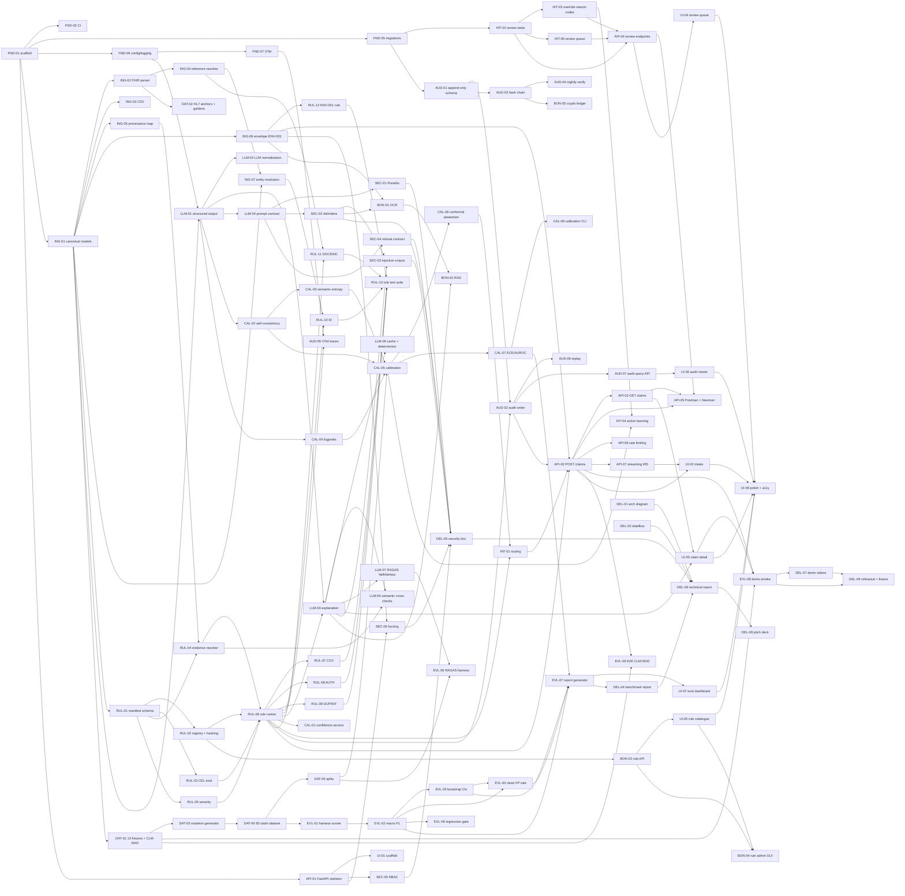

# 07 — Specification, Plan & Task Breakdown

> **Document:** The senior-engineer implementation plan — a task-by-task specification of _how_ to build ClaimGuard AI, from empty repo to finished deliverable. This is the document the team **executes against**.
> **Project:** ClaimGuard AI — CSTAM-VELODOC Challenge ("Trustworthy Agentic Copilot for Healthcare Claim Pre-Validation")
> **Audience:** The whole team. The two engineers (project lead + senior dev) build the central parts from it; the three beginners build their features from their own tasks, which are written to be self-contained and reviewable.
> **Status:** v1.0 · 2026-09-04 · For implementation
> **Companion docs:** `01` domain · `02` problem & numbers · `03` challenge decode · `04` architecture (ADRs) · `05` system design & data model (the code contract) · `06` cahier des charges (FR/NFR/UC requirements + recette R1.x–R4.x) · `08` team roles & sprints.
> **Ground rules this document inherits:** RFC 2119 keywords; FHIR R4 JSON and/or CSV input, **synthetic only**; **review, don't adjudicate** — we pre-validate, we never adjudicate, diagnose, recommend treatment, or approve/deny payment; every statistic carries a source + year; the pipeline is **Ingest → Normalize → Validate → Handoff**; deterministic core with LLM at the edges; rules as data (YAML + CEL); evidence-first findings (RFC 6901 pointers, verified in code); calibrated confidence with conformal abstention (α = 0.05); three-tier HITL with never-confidence-gated mandatory escalations; append-only hash-chained audit with OpenTelemetry.

---

## 1. How to read this document

**Task IDs.** Every task has an ID `EPIC-NN` where `EPIC` is the two/three-letter epic code:

| Epic | Code | Epic | Code |
|---|---|---|---|
| EPIC-0 Foundation | `FND` | EPIC-7 Security, Privacy & Safety | `SEC` |
| EPIC-1 Ingestion & Normalization | `ING` | EPIC-8 API & Integration | `API` |
| EPIC-2 Deterministic Rule Engine | `RUL` | EPIC-9 Reviewer UI | `UI` |
| EPIC-3 LLM Enrichment & Explanation | `LLM` | EPIC-10 Data & Benchmark | `DAT` |
| EPIC-4 Confidence & Calibration | `CAL` | EPIC-11 Evaluation Harness | `EVL` |
| EPIC-5 HITL Routing & Review | `HIT` | EPIC-12 Bonus Features | `BON` |
| EPIC-6 Audit & Traceability | `AUD` | EPIC-13 Deliverables & Documentation | `DEL` |

IDs are stable: once a task exists, its ID never changes. New tasks get the next free number in their epic and an entry in the traceability matrix (`FND-08`).

**Estimate units.** `Est` is **owner work hours** — the hours the named owner spends building. It deliberately excludes review time: every beginner-owned task carries additional review load (~30% of the estimate) on the named reviewer (usually the project lead). Estimates are for part-time students (~15–20 h/week) and assume no prior familiarity with the stack; pair-owned tasks (`HoP+SD`) assume the two work together, which compresses calendar time even though hours are additive.

**Dependency notation.** `Dep:` lists task IDs that must be **done and accepted** (DoD, §3) before this task starts. A dependency graph is in §5; when two tasks have no dependency between them they may run in parallel and be assigned to different people.

**Definition of Done.** Every task must clear the §3 checklist. Tasks are **done** when the reviewer says so, not when the code compiles.

**Acceptance criteria.** Each task ends with `Accept:` — concrete, checkable statements. A task whose acceptance criteria are not demonstrated with evidence (test output, screenshot, command transcript) is not done.

**Scoring mapping.** Each task cites the challenge phase points it serves (`P1 = 15 pts ingestion`, `P1 = 15 pts rule engine`, `P1 = 10 pts explainability`, `P1 = 10 pts audit log`, `P2 = 15 pts detection quality`, `P2 = 10 pts HITL & escalation`, `P2 = 5 pts privacy/security/safety`, `P3 = 10 pts UI/UX`, `P4 = 10 pts pitch`, `Bonus = +2`), plus the FR requirement IDs it implements (from `06`). This is the engineering half of the traceability matrix (`FND-08`); the flip happens when the task passes DoD.

**Status tracking.** Task status lives in the traceability matrix (`FND-08`) and the sprint board (`08`). Nobody updates "done" except the reviewer after the DoD checklist passes.

---

## 2. Repository and project bootstrap

### 2.1 Repository layout (canonical tree)

Repo root: **`claimguard`** (project root: `C:/Users/oussa/oussema/CSTAM`). Flat-layout Python package (no `src/`), per `04`/`05`. `05` §1.2 defines the core layout; this document extends it with the modules the implementation needs.

```
claimguard/
├── .github/
│   ├── workflows/
│   │   ├── ci.yml                  # FND-03: lint, typecheck, tests, build
│   │   ├── benchmark-gate.yml      # EVL-06: macro-F1 / FP-rate regression on main
│   │   ├── nightly-audit.yml       # AUD-04: hash-chain verification job
│   │   └── demo-smoke.yml          # EVL-08: full demo smoke on PRs touching pipeline
│   ├── CODEOWNERS                  # FND-02: rules/, audit/, security/ need SD+HoP
│   └── PULL_REQUEST_TEMPLATE.md    # FND-02
├── .pre-commit-config.yaml         # FND-01
├── pyproject.toml · uv.lock · .python-version   # FND-01 (uv, Python 3.12)
├── .env.example                    # FND-04
├── docker-compose.yml              # FND-04 (db, api, web, otel, jaeger, [ollama profile])
├── docker/api.Dockerfile · docker/web.Dockerfile
├── README.md                       # badges, quickstart, demo instructions
├── CONTRIBUTING.md                 # FND-02
├── claimguard/                     # Python package (flat layout per 04/05)
│   ├── __init__.py · __main__.py   # `python -m claimguard` prints CLI help
│   ├── config.py                   # FND-06 pydantic-settings
│   ├── logging.py                  # FND-06 structlog JSON
│   ├── errors.py                   # FND-06 ClaimGuardError taxonomy + error codes
│   ├── telemetry.py                # FND-07 OTel setup + span helpers
│   ├── db.py                       # FND-05 async SQLAlchemy engine + session
│   ├── core/                       # from 05 §1.2 — the engine heart
│   │   ├── canonical.py            # CanonicalClaim + ClaimLine + Coverage + Member +
│   │   │                           #   Provider + Encounter + Authorization + Attachment + BenefitBalance
│   │   ├── resolve.py              # reference resolver + pointer index
│   │   ├── evidence.py             # SourcePointer, Evidence, emit()
│   │   ├── engine.py               # rule engine: loads YAML catalogue, binds payload, runs CEL
│   │   ├── envelope.py             # ENV-001 pre-pass
│   │   └── guard.py                # synthetic-only guard, PII refuse-list, size caps
│   ├── ingest/                     # raw → canonical (EPIC-1)
│   │   ├── fhir.py                 # FHIR R4 bundle parser
│   │   ├── csv_ingest.py           # CSV path
│   │   ├── provenance.py           # pointer-map construction
│   │   └── attachments.py          # file handling, size caps (BON-01 extends)
│   ├── rules/                      # rules-as-data catalogue (EPIC-2)
│   │   ├── manifest.py · registry.py · cel_eval.py · evidence.py · severity.py · runner.py
│   │   └── yaml/                   # one YAML per rule: cov_001.yaml … env_001.yaml
│   │   └── rules.lock.json         # RUL-02 hash pinning
│   ├── llm/                        # EPIC-3
│   │   ├── client.py · structured.py · schemas.py · prompts/ · explain.py ·
│   │   ├── normalize_llm.py · verify.py · cache.py · rag.py (BON-02)
│   ├── confidence/                 # EPIC-4
│   │   ├── service.py · self_consistency.py · semantic_entropy.py · logprobs.py ·
│   │   ├── calibration.py · conformal.py · metrics.py
│   ├── hitl/                       # EPIC-5
│   │   ├── routing.py · review.py · overrides.py · active_learning.py
│   ├── audit/                      # EPIC-6
│   │   ├── writer.py · events.py · hashchain.py · verify.py · queries.py · replay.py · ledger.py (BON-05)
│   ├── security/                   # EPIC-7
│   │   ├── pii.py · delimiters.py · refusal.py · rbac.py
│   ├── api/                        # EPIC-8 (FastAPI, thin layer per 05 §6)
│   │   ├── main.py · errors.py · deps.py · rate_limit.py · ws.py
│   │   └── routes/ (claims.py · review.py · rules.py · audit.py · admin_rules.py · eval.py)
│   ├── eval/                       # EPIC-11
│   │   ├── runner.py · metrics.py · bootstrap.py · ragass.py · report.py · demo_smoke.py
│   ├── benchmark/                  # EPIC-10/11 (from 05 §7–§8)
│   │   ├── fixtures/ (CLM-*.json + manifest.jsonl) · mutations/ · datasets/ · harness.py
│   └── cli/                        # scripts as `uv run claimguard <cmd>`
│       ├── seed.py · evaluate.py · calibrate.py · verify_audit.py · replay.py · demo_smoke.py
├── claimguard/db/
│   └── migrations/0001_schema.sql   # FND-05 baseline; audit_events added by AUD-01 (0002)
├── scripts/                         # one-off dev scripts (hash_rules.py, migrate.py, …)
├── tests/
│   ├── unit/ · golden/ · integration/ · e2e/ · security/ · property/
│   └── conftest.py                  # tmp DB, seeded fixtures, LLM stub
├── web/                             # EPIC-9 (Next.js 14 App Router + TS + Tailwind)
│   ├── app/ (intake/ · claims/[id]/ · review/ · rules/ · audit/ · dashboard/ · admin/rules/)
│   ├── components/ · lib/api.ts · lib/types.ts · package.json · tsconfig.json
├── postman/
│   ├── claimguard.postman_collection.json · claimguard.postman_environment.json
├── docs/ (01–08 specs, diagrams/, benchmark/, pitch/, videos/)
└── artifacts/                       # benchmark-latest.json, calibration.json, diagrams (gitignored except baselines)
```

### 2.2 Tooling (decisions + justification)

| Concern | Choice | Why |
|---|---|---|
| Package manager | **uv** (Python 3.12, `uv.lock`) | Single source of truth, ~10× faster than poetry/pip, first-class lockfile; nothing in `04` contradicts it. Never mix with pip/poetry. |
| Lint + format | **ruff** (line-length 100) | One fast binary replaces black+flake8+isort; zero config drift between members. |
| Types | **mypy** strict mode | The core is data-heavy; strict typing catches pointer/model drift the tests won't. |
| Tests | **pytest** + pytest-asyncio + hypothesis + pytest-cov | Async pipeline + property tests for the mutation generator (§9). |
| Migrations | **plain SQL** in `claimguard/db/migrations/0001_schema.sql` + tiny `scripts/migrate.py` | `05` ships `0001_schema.sql` as SQL; an ORM-migrator adds a second source of truth we don't need. Runner tracks applied versions in a `schema_migrations` table. |
| App server | FastAPI + uvicorn (async) | Per `04`/`05`; async needed for streaming (`API-07`) and OTel-friendly spans. |
| DB | PostgreSQL 16 (asyncpg) | Per `04` ADR-004/005; append-only audit needs real GRANTs. |
| LLM | OpenAI-compatible client (Pydantic AI or Instructor — decide in `LLM-01`) + **Ollama/vLLM profile** for the offline demo | NFR-006 offline mode is mandatory at the venue. |
| Container | Docker Compose (`db`, `api`, `web`, `otel-collector`, `jaeger`, optional `ollama` profile) | NFR-011 portability; team is on Windows 11 laptops. |
| Web | Next.js 14 App Router, TypeScript, Tailwind | `05` §6 defines the API; the UI is a thin typed client (openapi-typescript). |

### 2.3 Environment setup commands (once per machine)

```bash
# 1. clone + install
git clone <repo-url> claimguard && cd claimguard
uv python install 3.12 && uv sync --all-groups      # dev + test + eval extras
pre-commit install

# 2. local stack: DB + observability (API can run under `uv run` for a fast loop)
cp .env.example .env                                # then edit LLM_PROVIDER, DATABASE_URL
docker compose up -d db otel-collector jaeger

# 3. schema + seed
uv run migrate                                      # applies claimguard/db/migrations/*.sql
uv run claimguard seed                              # registries, 13 fixtures, benchmark metadata

# 4. optional local LLM (offline demo; needs ~8 GB)
docker compose --profile llm up -d ollama
ollama pull qwen2.5:7b-instruct                     # or any OpenAI-compatible local model
```

### 2.4 Branching strategy — **trunk-based with short-lived branches**

Chosen over GitFlow deliberately:

- Five people, one deliverable per phase, weekly demo cadence. `main` is always green; the demo is always demoable from `main`.
- GitFlow's long-lived `develop`/`release` branches exist to decouple *release trains* — we have no releases to decouple, and a second integration branch would double merge conflicts for zero benefit.
- Demo snapshots are **git tags** (`demo-2026-09-13`, `phase1-2026-10-01`), not branches — tags are immutable and replayable, exactly what a demo and an audit chain need.

Rules: feature branches off `main`, live ≤ 3 days, one task (or one tightly-coupled task pair) per branch, squash-merge, delete after merge. `main` is protected: no direct pushes, CI must pass, ≥ 1 review.

### 2.5 Commit convention — **Conventional Commits**

`type(scope): summary` — types: `feat`, `fix`, `test`, `docs`, `refactor`, `chore`, `build`, `perf`, `security`. Scopes: `ingest`, `rules`, `llm`, `confidence`, `hitl`, `audit`, `api`, `ui`, `data`, `eval`, `sec`, `db`, `ci`, `docs`. Every commit summary ends with the task ID: `feat(rules): implement COV-001 coverage-active condition (RUL-07)`. PR title follows the same convention; the PR body references the task ID and, for UI work, embeds a screenshot. No "wip" commits on `main`; squashing cleans the history.

### 2.6 Pull request & review policy (WHO reviews WHOM)

The project lead (HeadOfProject) reviews the beginners' work; the two engineers review each other:

| Author | Reviewer(s) | Notes |
|---|---|---|
| **B1 / B2 / B3** (beginners) | **HeadOfProject** (primary), **SeniorDev** on anything touching core/engine | The lead reviews for correctness *and* taste; the senior co-reviews code-level detail when the lead isn't hands-on in that file. Two approvals on `rules/`, `audit/`, `security/` paths (CODEOWNERS enforces). |
| **SeniorDev** | HeadOfProject | Core engine/audit/security work gets the lead's domain review. No self-merge anywhere. |
| **HeadOfProject** | SeniorDev | The lead's own commits are code-reviewed like anyone else's — the senior must be able to veto. |

Process: open PR → CI runs → reviewer(s) approve with comments addressed → author squash-merges → branch deleted. PRs stay ≤ 400 changed lines (split otherwise — reviewers cannot meaningfully review more). UI PRs require a screenshot or screen recording; benchmark-affecting PRs require the regression gate (`EVL-06`) to be green or an explicit baseline bump in the same PR.

### 2.7 CI (GitHub Actions)

| Workflow | Trigger | Jobs | Gate |
|---|---|---|---|
| `ci.yml` | every PR + push to main | ruff check/format · mypy · pytest (unit+integration, `-m "not e2e"`) · build (uv build + docker compose build + `web` build) · gitleaks secret scan | PR merge |
| `benchmark-gate.yml` | push to main | `uv run claimguard evaluate --dataset benchmark-50` → compare macro F1 + clean-FP rate vs `artifacts/benchmark-baseline.json` (EVL-06) | main health |
| `nightly-audit.yml` | cron 02:00 | `uv run claimguard verify-audit` → integrity report (AUD-04) | audit health |
| `demo-smoke.yml` | PRs touching pipeline paths | `uv run claimguard demo-smoke` (EVL-08) | demo readiness |

Fail fast: lint/type failures stop before tests; e2e (slow, needs LLM) runs nightly and before demos, not on every PR. Coverage uploaded as an artifact per run.---


## 3. Definition of Done (DoD)

A task is **done** only when **all** of the following hold. The reviewer checks the list; anything unchecked sends the task back.

1. **Code reviewed by the named reviewer.** PR approved per §2.6 (CODEOWNERS respected; lead-approved for all beginner work). Review comments resolved or explicitly declined with reason.
2. **Unit tests with a real assertion.** Not `assert True` scaffolding: each test exercises a behavior, a boundary, or a failure mode and fails on a plausible bug. Coverage on the task's module ≥ 80% (guiding, not gospel — the rule tests in `RUL-13` must clear 90% on the engine).
3. **No new lint/type errors.** `uv run ruff check . && uv run mypy claimguard` clean on the touched files (CI enforces; a PR that introduces warnings is not done).
4. **Docs updated.** The task's behaviour is visible in the right place: API changes in OpenAPI + Postman (`API-05`), data-model changes in `05`, new config keys in `.env.example`, CLI changes in `README.md`. No "we'll document it later".
5. **Traceability matrix row flipped.** The `FND-08` row for this task (task → FR IDs → recette row → status) is marked Done by the reviewer.
6. **Demoable.** The result can be shown in under two minutes from the running system (API call, UI screen, or CLI one-liner); the demo smoke test (`EVL-08`) still passes for pipeline-affecting tasks.
7. **CI green** and — for benchmark-affecting tasks — the regression gate (`EVL-06`) passes or the baseline bump was deliberate and reviewed.
8. **No secrets, no real data.** Gitleaks passes; the synthetic-only guard (`FR-008`) flags nothing introduced.

---

## 4. The work breakdown

**Workload note before the tasks:** the number by each owner is the plan's honest arithmetic — HeadOfProject and SeniorDev carry the central core (models, engine, rules, LLM enrichment, confidence), which is deliberate and matches the team's skills; the three beginners own the AI-flavoured, well-scoped perimeter. Total ≈ 575 owner-hours across 8 weeks; capacity ≈ 640 h at ~16 h/week/person — the plan is **full, not slack**, which is why §6 has an explicit cut list. Keep `RUL-01`–`RUL-06` and `LLM-01` moving: everything else dangles off them.

### EPIC-0 — Foundation (goal: empty repo → green CI, local stack up, conventions fixed)

**FND-01 — Repo scaffold + Python tooling**
Owner: SD · Est: 6h · Dep: — · Score: P1 all (prereq) · FR: NFR-011
Files: `pyproject.toml`, `uv.lock`, `.python-version`, `.pre-commit-config.yaml`, `tests/conftest.py`, `claimguard/__init__.py`
Description: Initialize the repo with the §2.2 tooling: uv project (Python 3.12), ruff (line-length 100), mypy strict, pytest with async + hypothesis plugins, pre-commit hooks (ruff, mypy, gitleaks, end-of-file-fixer).
Notes: Add the package under `claimguard/` flat layout (per `05`). `pyproject.toml` gets `[tool.ruff]`, `[tool.mypy]` strict with an ignore list for generated code, `[tool.pytest.ini_options]` markers `unit/integration/e2e/security/property`. pre-commit must run fast or nobody runs it — keep hooks local to staged files. Trap: don't let pre-commit block WIP commits (`SKIP=ruff mypy git commit` is the escape hatch); CI re-checks everything anyway.
Accept: `uv sync` from a clean clone installs; `uv run pytest` passes one smoke test; `uv run ruff check .` clean; `pre-commit run --all-files` passes.
Test: conftest provides `tmp_db` (sqlite for unit / postgres for integration via env flag), a `clean_package()` factory, and an `LLMStub` object with `llm_stub_returns` fixture — every later task reuses these.

**FND-02 — Branching, commit & review conventions**
Owner: HoP · Est: 2h · Dep: — · Score: process · FR: — 
Files: `CONTRIBUTING.md`, `.github/PULL_REQUEST_TEMPLATE.md`, `.github/CODEOWNERS`
Description: Write §2.4–§2.6 down: trunk-based flow, Conventional Commits (+ task ID), PR policy incl. who reviews whom (lead reviews beginners; engineer pair self-reviews), CODEOWNERS protecting `claimguard/rules/`, `claimguard/audit/`, `claimguard/security/` (require SD+HoP).
Notes: Use the exact reviewer matrix from §2.6. Keep it short — a 2-page CONTRIBUTING the beginners actually read beats a 10-page one nobody does.
Accept: A newcomer can open a correct branch/commit/PR from the doc alone (mentor-checked once at kickoff).

**FND-03 — CI pipeline**
Owner: SD · Est: 4h · Dep: FND-01 · Score: process · FR: NFR-011
Files: `.github/workflows/ci.yml`
Description: GitHub Actions per §2.7: lint (ruff + pre-commit), typecheck (mypy), tests (`pytest -m "not e2e"`), build (uv build + docker compose build + `web` build once `UI-01` exists). Cache uv and node deps; upload coverage artifact; add status badges to README.
Notes: Use `astral-sh/setup-uv`; keep jobs parallel, fail fast on lint. Trap: never run `e2e` in the PR path — LLM tests are nightly + pre-demo only.
Accept: pushing a feature branch runs all jobs green; pushing a deliberate lint error turns the check red.

**FND-04 — Docker Compose stack + env template**
Owner: SD · Est: 4h · Dep: FND-01 · Score: NFR-006/011 · FR: FR-067
Files: `docker-compose.yml`, `docker/api.Dockerfile`, `docker/web.Dockerfile`, `.env.example`
Description: Compose services: `db` (postgres:16-alpine, named volume, healthcheck), `api` (uvicorn), `web` (Next.js), `otel-collector` + `jaeger` (traces), optional `ollama` profile for the local LLM (NFR-006 offline). `.env.example` documents every variable; nothing secret is committed.
Notes: Dev default is `docker compose up -d db otel-collector jaeger` while the API runs under `uv run uvicorn` — Docker is not required for the daily loop (fast iteration), only for the demo/production-shaped run. Trap: Windows file sharing slows hot-reload; mount only `claimguard/` and `web/`, not the whole tree.
Accept: `docker compose up` on a fresh machine brings the stack up; `docker compose config` resolves with zero secret warnings; `.env` from template works.

**FND-05 — Database baseline migrations**
Owner: SD · Est: 5h · Dep: FND-01, FND-04 · Score: P1 all · FR: FR-005/050
Files: `claimguard/db/migrations/0001_schema.sql`, `claimguard/db.py`, `scripts/migrate.py`
Description: Plain-SQL migration runner + baseline schema per `05` §4: `claim_packages` (raw payload hash, canonical package JSONB, status), `canonical_claims` (materialized fields the queue needs), `rules_manifests` (catalogue + hash), `schema_migrations`. The `audit_events` table is deliberately **not** here — it lives in its own migration `0002` under `AUD-01` with its DB-privilege setup.
Notes: `claimguard/db.py`: async SQLAlchemy 2.0 + asyncpg; a `get_session()` dependency used by the API. `scripts/migrate.py` applies `migrations/*.sql` in filename order, recording versions; idempotent, transactional.
Accept: `uv run migrate` on a fresh postgres creates the baseline tables; re-running is a no-op; a failing migration leaves a clean rollback message.

**FND-06 — Shared config, logging, error taxonomy**
Owner: SD · Est: 4h · Dep: FND-01 · Score: NFR-012 · FR: FR-093
Files: `claimguard/config.py`, `claimguard/logging.py`, `claimguard/errors.py`
Description: pydantic-settings `Settings` loaded from `.env`; structlog JSON logging with a `claim_id` contextvar; error classes `ClaimGuardError` → `EnvelopeError`, `IngestError`, `NormalizeError`, `RuleError`, `LLMError`, `AuditError`, each carrying a stable machine `code` + safe user `message` (no tracebacks to clients, FR-093).
Notes: All pipeline stages log one structured line with `claim_id`, `stage`, `duration_ms`. Error codes use the FR-093 domains: `ENV-*`, `INGEST-*`, `NORMALIZE-*`, `RULE-*`, `LLM-*`, `AUDIT-*`.
Accept: config loads from env; one log line per stage carries `claim_id`; every error class serializes to `{code, message, detail, retryable}`.

**FND-07 — OpenTelemetry foundation**
Owner: SD · Est: 3h · Dep: FND-06 · Score: P1 audit 10 (FR-053) · FR: FR-053, NFR-012
Files: `claimguard/telemetry.py`, `docker-compose.yml` (otel services)
Description: OTLP gRPC exporter to `otel-collector` → Jaeger; `start_claim_trace(claim_id)` context manager; span helpers per stage. **No PHI in span attributes** — attributes are claim_id, rule ids, counts, durations only; enforce with a comment + review, and validate in AUD-05.
Accept: running a scripted claim through the pipeline shows a 4-phase trace in Jaeger (`localhost:16686`).

**FND-08 — Traceability matrix**
Owner: HoP · Est: 2h · Dep: 03/06 docs · Score: process · FR: all (mapped)
Files: `docs/traceability.md`, `scripts/check_traceability.py`
Description: A table mapping every task ID → FR IDs → recette row (R1.x–R4.x from `06` §10) → status (`TODO/InProgress/Done`). A small script validates the file: every task ID in this doc appears exactly once, every FR referenced by a task exists in `06`, duplicate IDs rejected.
Accept: CI (added to ci.yml) runs the checker; the matrix has one row per task from this document.

### EPIC-1 — Ingestion & Normalization (P1 15 pts)

**ING-01 — Canonical claim models**
Owner: HoP+SD (pair) · Est: 8h · Dep: FND-01 · Score: P1 ingestion 15 (FR-005) · FR: FR-005
Files: `claimguard/core/canonical.py`, `tests/unit/core/test_canonical.py`
Description: Implement `05` §1.3 **exactly** — the models below are the contract: `SourcePointer` (resource_type, resource_id, pointer, bundle_entry), `CanonicalBase` (extra="forbid", `src` dict, `derived_from`), `Money` (Decimal, AED), `Member`, `Provider`, `Coverage`, `Encounter`, `Authorization`, `Attachment`, `BenefitBalance`, `ClaimLine`, `CanonicalClaim` + `Envelope`. Add `package_hash` (SHA-256 of canonical JSON, `sort_keys=True`) and an `immutable_after_validation` flag enforced by a validator.
Notes: This is the single most load-bearing file in the repo — pair-program it. Read `05` §1.3–§1.5 fully first. Every mutable field must carry provenance (`src`), because `RUL-04`'s emitter refuses findings whose pointers don't resolve. Trap: `extra="forbid"` on `CanonicalBase` means *unknown FHIR fields must be dropped explicitly in the mapper*, never passed through — map, don't leak.
Accept: `05` §1.3 example constructs; JSON round-trip byte-stable; hash changes iff content changes; mutating after seal raises.
Test: model validators (negative Money rejected), hash stability, seal immutability, `src` required on mapped fields.

**ING-02 — FHIR R4 bundle parser**
Owner: HoP · Est: 10h · Dep: ING-01 · Score: P1 ingestion 15 (FR-001) · FR: FR-001/003
Files: `claimguard/ingest/fhir.py`, `tests/golden/fhir/`, `tests/unit/ingest/test_fhir.py`
Description: Parse a FHIR R4 JSON bundle into `CanonicalClaim`: extract Patient, Coverage, Encounter, Organization/Practitioner, DocumentReference (attachment stubs), and the `Claim` itself (status, type, use, patient, created, provider, priority, insurance, item[] with productOrService, servicedDate/Period, quantity, unitPrice/net, diagnosis linkage). Every canonical field records its source pointer (`/Claim/item/0/net`, …). Unknown resources are preserved in `package.raw` for the audit trail, not dropped.
Notes: Consult `05` §1.4 for the field map. Handle `servicedDate` **or** `servicedPeriod`; `quantity`/`unitPrice`/`net` triples with different payer conventions; `Claim.insurance` as a list. Trap: FHIR `date` fields are ISO strings with optional offsets — parse to `datetime` with a `tz_utc()` normalizer *here*, so the rules never see raw strings. Trap: `Claim` vs `ExplanationOfBenefit` — reject the latter with a clear `INGEST-UNSUPPORTED` code.
Accept: FR-001 acceptance — valid CLM-0042-style bundle → canonical package + package ID; syntactically invalid JSON → structured error, no claim created; `05` §1.4 field map complete (a test asserts every mapped field is non-null on the flagship).
Test: golden-file tests on official HL7 examples (`DAT-02`), each fixture in `DAT-01`, malformed variants (truncated JSON, wrong resource type, missing Claim).

**ING-03 — CSV ingestion + column contract**
Owner: SD · Est: 6h · Dep: ING-01 · Score: P1 ingestion 15 (FR-002) · FR: FR-002
Files: `claimguard/ingest/csv_ingest.py`, `claimguard/config/csv_columns.json`, `tests/unit/ingest/test_csv.py`
Description: Flat CSV (claim-line oriented) → the same canonical model as FHIR. Publish the column contract (`FR-002`: claim_id, patient_emirate_id, service_date, cpt, dx_code, provider_id, amount, currency, auth_number, …) in `05` and validate against it: unknown columns and type mismatches become **per-row structured validation errors**, not a silent drop.
Notes: Row-level provenance (e.g., `/row/3/amount`) via `SourcePointer(resource_type="csv", resource_id=filename, pointer=...)` exactly as `05` §1.3 specifies. Handle utf-8-sig BOM, quoting, and CSV-formula injection (`=cmd(...)` cells are inert strings — `SEC-06` asserts this).
Accept: FR-002 — the same data as CSV and FHIR yields field-equivalent canonical packages; bad rows produce row-indexed errors with codes.
Test: header mismatch, type mismatch, blank rows, unicode, formula cells, equality with the FHIR path.

**ING-04 — Reference resolver**
Owner: SD · Est: 12h · Dep: ING-02 · Score: P1 ingestion 15 (FR-003) · FR: FR-003
Files: `claimguard/core/resolve.py`, `tests/unit/core/test_resolve.py`
> **v2 note (2026-09-05):** Estimate raised 8h → 12h. v1's spec silently failed on **absolute-URL references** (`http://example.org/fhir/Patient/123`) — real bundles and HL7 examples use them routinely, and this resolver feeds four rules (ENC-001, AUTH-004, DOC-004, ID-002), so a silent miss is a silent rule miss. 2–3× the original estimate is the honest cost of the full spelling matrix.
Description: Implement `05` §2.1: resolve every reference (`urn:uuid:…`, `urn:oid:…`, `ResourceType/id`, `#contained`, bare id, **absolute URL**) against the bundle in two passes — index all `Bundle.entry.fullUrl` + contained resources, then resolve; an absolute URL matches the entry whose `fullUrl` equals it first, then falls back to the `ResourceType/id` tail (the final path segment). Output: a `ResolvedRef{resource, pointer}` map plus a **dangling-reference report** fed to `ENC-001`/`ID-005` (and AUTH-004/DOC-004 via the same index). Detect circular references (visited set) and duplicate fullUrls.
Notes: `bundle_entry` (the entry index) survives re-ordering — use it as the stable lookup key (05 §1.3). This is the single most-trapped task in FHIR work; read §8 traps #1. Register the resolver result on the canonical package (`package.resolved_refs`) so rules cite pointers into it. The resolver feeds ENC-001, AUTH-004, DOC-004 and ID-002 — every reference spelling above resolves or lands in the dangling-report; there is no silent pass-through.
Accept: FR-003 — every reference used by any rule resolves to a concrete node, verified at validation time; **absolute-URL references (`http://example.org/fhir/Patient/123`) resolve via the `fullUrl` index and via the `ResourceType/id` tail for URLs pointing at a shipped resource**; external/absent URLs land in the dangling-report with a precise pointer, never a crash.
Test: uuid/relative/contained/circular/duplicate/missing cases + absolute-URL variants (in-bundle fullUrl match, external → dangling); golden pointer maps.

**ING-05 — Provenance map (copy with provenance)**
Owner: SD · Est: 6h · Dep: ING-01 · Score: P1 explanation 10 (FR-015) · FR: FR-015
Files: `claimguard/ingest/provenance.py`, `claimguard/core/evidence.py` (collab with RUL-04)
Description: During any mapping (FHIR or CSV), record **every** canonical field's `SourcePointer` in `src`; computed fields populate `derived_from` with the pointers they were computed from. Build a serializable pointer index on the package. All pointers are RFC 6901 with `~0`/`~1` escaping on JSON round-trip (the classic bug).
Notes: The invariant (05 §0.1): *a finding that cannot point at the original bytes that caused it is not emitted*. The provenance map is what makes findings evidence-first rather than LLM-flavored. Escape `/` and `~` correctly; test round-trip through `json.dumps`.
Accept: 100% of canonical fields on the flagship have a resolving `src` pointer (asserted by test).
Test: round-trip escaping, computed-field `derived_from`, pointer index serialization.

**ING-06 — Envelope guard ENV-001**
Owner: SD · Est: 4h · Dep: ING-01 · Score: P1 ingestion 15 + Clean family (FR-004) · FR: FR-004, UC-10
Files: `claimguard/core/envelope.py`, `tests/unit/core/test_envelope.py`
Description: Pre-pass checking the minimum claim envelope per `04` §4 and FHIR R4 Claim mandatory elements: status, type, use, patient, created, provider, priority, insurance + ≥ 1 service line with a service date. On failure the pipeline **stops safely**: no LLM call, no rule run, an ENV-001 finding (High) is emitted, the package lands in the review queue as `ENVELOPE_INCOMPLETE`, the API returns a structured 200-level envelope result (never 500, never partial state).
Notes: This is the challenge's "graceless degradation" test — the controller must be at the *front* of the pipeline, not caught mid-normalize. The same check runs as the ENV-001 *rule* in `RUL-12` so the output surface is uniform; here it is the safety gate.
Accept: FR-004 test — package missing a member identifier halts before any LLM span (asserted on the trace!) with an ENV-001 finding + queue task + non-5xx response.
Test: 5 malformed envelopes (missing member, no lines, no service date, bad JSON, oversized) each stop with the documented reason code.

**ING-07 — Entity resolution (member / provider / coverage registries)**
Owner: B1 (review: SD) · Est: 6h · Dep: ING-01, ING-04 · Score: P1 ingestion 15 (ID-005 inputs) · FR: FR-005
Files: `claimguard/normalize/resolvers.py` → use `claimguard/core/resolve.py`; `claimguard/benchmark/fixtures/registries.json`; wait — layout per 05: put under `claimguard/benchmark/registries.json`? 05 has no normalize/ dir; use `claimguard/benchmark/registries/` for the synthetic registries and `claimguard/core/resolve.py` for the matching primitives. Files: `claimguard/core/resolve.py` (extend), `claimguard/benchmark/registries/*.json`, `tests/unit/core/test_resolvers.py`
Description: Match claim references to the (synthetic) entity registries — member by Emirates ID / membership number, provider by license/national id, coverage by policy number. Deterministic exact matching with normalized keys (casefold, strip); never fuzzy here (LLM-assisted matching is `LLM-02`'s job). Produce an `unresolved` set consumed by ID-005/ID-002.
Notes: This is B1's first real core task — the spec is tight (matching is mechanical), the review is about rigor. Registries are part of the synthetic fixture set (`FR-008`: no real entities anywhere). Trap: don't invent registries at runtime — they come from the seeded DB (FND-05) and `claimguard seed`.
Accept: CLM-0042 resolves Sara Mansour → HealthPlus Gold coverage + NorthStar provider; a claim with an unknown provider id lands in `unresolved` and ID-005 fires downstream.
Test: case/whitespace normalization, missing registry entries, duplicate matches (two members one id).

**ING-08 — P0 hardening: canonical model aliases + payload smoke test**
Owner: SD · Est: 3h · Dep: ING-01, RUL-01 · Score: P1 rule engine 15 (protects every rule) · FR: FR-012/016
Files: `claimguard/core/canonical.py`, `tests/unit/core/test_rule_payload.py`
> **v2 note (2026-09-05):** This is P0-1 from the adversarial review (`09` Part B). The CEL conditions are written in camelCase (`payload.coverage.periodEnd`, `i.productOrService`, `payload.authorization.validFrom`) but `to_rule_payload()` dumped snake_case (`period_end`, `product_or_service`) — every rule silently failed to fire, with no error. v2: add Pydantic aliases to every canonical model and dump `by_alias=True`. **REQUIRED before the rule engine is trusted**; do not start rule acceptance work ahead of it.
Description: Add `Field(alias=...)` camelCase aliases to every canonical model (`05` §1.3) so the dense payload matches the catalogue's CEL conditions (periodEnd, productOrService, validFrom, …). **Startup smoke test:** serialise CLM-0042 to the dense payload and assert every CEL expression in the catalogue touches only resolvable keys — a rule whose condition references a missing key fails startup naming the rule.
Notes: The aliases must cover the full field surface the conditions use (`05` §5.2, `03` §2.4). The smoke test is the guard that keeps P0-1 from silently regressing.
Accept: every catalogue CEL expression evaluates against the aliased payload on CLM-0042; a condition referencing a non-existent key fails fast at startup.
Test: alias round-trip, dump shape (`by_alias=True`), the CLM-0042 payload smoke test, negative case (unresolvable key → startup failure).

### EPIC-2 — Deterministic Rule Engine (P1 15 pts)

**RUL-01 — Rule manifest schema + the 12 rule YAMLs**
Owner: HoP+SD (pair) · Est: 6h · Dep: FND-06 · Score: P1 rule engine 15 (FR-010/013) · FR: FR-010/013/014
Files: `claimguard/rules/manifest.py`, `claimguard/rules/yaml/*.yaml` (12), `tests/unit/rules/test_manifest.py`
Description: Pydantic `RuleDefinition`: id, family (six families), name, description, **severity** (info/warning/high/critical), applies_to (claim|line), `condition` (CEL string), `evidence_pointers` (list), `suggested_corrective_action`, version (semver), `effective_from/to`, `mandatory_escalation` (bool). Write the 12 fixture rules as YAML — COV-001, COV-008, AUTH-004, AUTH-006, AUTH-009, DUP-002, INT-003, ID-002, ID-005, DOC-004, ENC-001, ENV-001 — mapped onto the R01–R15 catalogue by family, severities per `06` FR-013 table.
Notes: The schema is the **contract** with `05` §5 — read it first. Severity lives here and only here (RUL-05). Write one YAML per rule id; `mandatory_escalation: true` exactly for AUTH-004/006/009, ENC-001, COV-001, COV-008 and anything in the eligibility/benefit family (FR-041).
Accept: FR-010/013 — all 12 manifests parse; a manifest schema violation fails load with the offending field named; no Python code needed to add a rule (pilot rule test, NFR-010).
Test: schema validation per rule, family enum, severity enum, effective-date types.

**RUL-02 — Rule registry + versioning + hash pinning**
Owner: SD · Est: 5h · Dep: RUL-01 · Score: P1 rule engine 15 (FR-011) · FR: FR-011
Files: `claimguard/rules/registry.py`, `claimguard/rules/rules.lock.json`, `scripts/hash_rules.py`
Description: Registry = ordered id → RuleVersion; loads the 12 YAMLs at startup and validates their SHA-256 hashes against `rules.lock.json` (which also pins the manifest git sha + semver). A hash mismatch **refuses startup** (determinism, FR-011). Effective dating: rules apply when `effective_from <= claim.service_date <= effective_to`; version history queryable.
Notes: The lockfile is updated only by an explicit `uv run claimguard hash-rules` after a reviewed catalogue change. This is the anti-drift mechanism the audit chain depends on (`AUD-02` records the catalogue hash per claim).
Accept: FR-011 — tampering with any rule YAML fails startup with the offending file + expected/actual hash; two catalogue versions validate the same claim with the respective version annotated.
Test: tamper, version selection by date, empty catalogue, duplicate rule id.

**RUL-03 — CEL evaluation**
Owner: SD · Est: 6h · Dep: RUL-01 · Score: P1 rule engine 15 (FR-012) · FR: FR-012
Files: `claimguard/rules/cel_eval.py`, `tests/unit/rules/test_cel.py`
Description: `cel-python` evaluation of rule conditions against a dense binding `{package, line, ctx}` where `ctx` holds claim-level precomputed facts (dates normalized, registry resolution results). Compile all expressions **at load time** (fail fast at startup, per rule with the offending expression). Runtime evaluation errors or timeouts produce a `RULE_EVAL_ERROR` operational finding and the pipeline continues — fail-open per rule, never a false positive on an error (FR-012).
Notes: Register pure helper functions as CEL builtins (date comparison, string contains). Trap: `cel-python` evaluation is not free — add a per-expression size cap and an instruction budget; see §8 trap #11. Trap: thread-safety — the CEL env object is not guaranteed safe to share across threads; create the evaluator per call or guard with a lock (measure first, but assume).
Accept: FR-012 — each rule's condition matches documented semantics on fixture + mutation cases; a deliberate evaluation error yields `RULE_EVAL_ERROR`, not a claim finding or a crash.
Test: compile-all at startup, boolean semantics per rule, error case, timeout case, binding shape.

**RUL-04 — Evidence pointer resolver + verification**
Owner: SD+HoP (pair) · Est: 5h · Dep: ING-05, RUL-01 · Score: P1 explanation 10 (FR-015) · FR: FR-015, NFR-013
Files: `claimguard/core/evidence.py`, `tests/unit/core/test_evidence.py`
Description: RFC 6901 resolver over the canonical package + `emit()` gate: a finding is returned by the engine **only if** every evidence pointer in it resolves to an existing node (resolved in code, not assumed). Dangling pointers in a rule manifest are rejected at load time (authoring error); runtime unresolvable pointers log an audit warning and suppress the finding.
Notes: The pointer resolver is shared JSON Pointer math — also used by the API evidence chips (`UI-03`), replay (`AUD-06`), and the audit viewer. `emit()` is the single funnel every finding passes through — make it the only way findings are constructed (`core/engine.py` imports it).
Accept: FR-015 + NFR-013 — 100% of emitted findings have ≥ 1 resolving pointer (asserted across the whole fixture suite); a rule with a dangling pointer fails load.
Test: pointer escaping, array indices, deep paths, missing paths, `emit()` suppression.

**RUL-05 — Severity assignment (manifest-bound)**
Owner: HoP · Est: 3h · Dep: RUL-01 · Score: P1 explanation 10 (FR-014) · FR: FR-014
Files: `claimguard/rules/severity.py`, `tests/unit/rules/test_severity.py`
Description: Severity is a function of the manifest only — `severity(rule_id) = manifest[rule_id].severity`. Expose `MANDATORY_TOPICS` (escalation set) from the manifest flags for `HIT-01`. Nothing else may write severity — the LLM output schemas forbid a severity field (`LLM-05` enforces).
Accept: FR-014 — a test asserts the severity of every catalogue rule equals the manifest value; attempting to construct a finding with a different severity raises.
Test: all 12 rules' severities, immutability attempt, mandatory-topic list exact match (FR-041 set).

**RUL-06 — Rule runner + pipeline skeleton**
Owner: SD+HoP (pair) · Est: 6h · Dep: RUL-02, RUL-03, RUL-04, RUL-05 · Score: P1 rule engine 15 (FR-016/017) · FR: FR-016/017/018
Files: `claimguard/core/engine.py`, `claimguard/pipeline.py`, `tests/unit/core/test_engine.py`
Description: The deterministic engine: for each applicable rule, evaluate; on fire, assemble a `Finding` via `emit()`: rule id + name + version, family, severity, **confidence = 1.0** (deterministic by definition, FR-016), the six Phase-1 fields (Claim ID, Rule ID, evidence, severity, confidence, corrective action — FR-017), catalogue hash, timestamp. Deduplicate identical findings; claim-level rules run once, line-level rules per line. The `pipeline.py` orchestrator wires Ingest → Normalize → Validate → Handoff with OTel spans and audit hooks at the boundaries.
Notes: The runner is where `FR-018` is structural: the LLM has no code path into this module — enforce with an import-linter rule (mypy/arch test in `CAL-01`).
Accept: FR-016/017 — on CLM-0042 the runner emits exactly COV-001 + AUTH-004 + DUP-002, each with confidence 1.0 and all six scored fields; a clean claim emits zero findings.
Test: `05`/`06` fixture matrix (13 fixtures → expected findings), dedupe, engine purity (no network/clock).

**RUL-07 — Coverage rules: COV-001, COV-008**
Owner: SD · Est: 6h · Dep: RUL-02, RUL-03 · Score: P1 rule engine 15 · FR: FR-013
Files: `claimguard/rules/yaml/cov_001.yaml`, `cov_008.yaml`, `tests/unit/rules/test_cov.py`
Description: COV-001: coverage active on service date — `coverage.period.start <= service_date <= coverage.period.end` (inclusive both ends; FHIR Coverage.period end is inclusive — document this decision in the rule YAML). COV-008: benefit balance available — sum of line amounts in the window vs the plan limit from `BenefitBalance` (EBP-style sub-limits); the balance comes from the registry/benefit table, never invented. Both `mandatory_escalation: true`.
Notes: Date semantics are the trap — all dates normalized to UTC-aware datetimes at `ING-02`; comparisons in CEL use the registered date helpers. COV-008 needs a benefit registry row for the payer/plan; fixture `DAT-01` includes one (dental sub-limit style).
Accept: CLM-0042 fires COV-001 High (coverage ended 15 Aug < service 20 Aug); service exactly on end date passes; missing coverage record → fires with `RULE_EVAL`-safe data-missing semantics (documented).
Test: boundary dates, both families of date forms (date / datetime+offset), missing coverage, exhausted balance, balance exactly equal.

**RUL-08 — Authorization rules: AUTH-004, AUTH-006, AUTH-009**
Owner: SD · Est: 8h · Dep: RUL-02, RUL-03 · Score: P1 rule engine 15 · FR: FR-013/041
Files: `claimguard/rules/yaml/auth_*.yaml`, `tests/unit/rules/test_auth.py`
Description: AUTH-004: required approval present — services requiring prior authorization (config list, e.g., MRI 72148) must reference an authorization; missing → fire. AUTH-006: approval valid on service date — status approved AND `auth.valid_from <= service_date <= auth.valid_to`. AUTH-009: authorization/referral scope matches the billed service (procedure in auth items, or referral specialty matches the line's specialty). All three `mandatory_escalation: true` (FR-041).
Notes: The three rules must be mutually exclusive in the "expired" case: an approved-but-expired auth fires AUTH-006, never AUTH-004 (present is present) — the unit tests pin this. Trap: validity windows are datetime ranges, not dates (an auth valid "until 2026-08-20" usually means end-of-day 20 Aug) — decide once in the rule YAML, test both edges.
Accept: FR-013/041 — missing auth → AUTH-004 High; expired → AUTH-006; wrong-procedure auth → AUTH-009; valid auth → all three silent; at confidence 0.10 **and** 0.99 the routing still escalates (tested here via the manifest flag, enforced in HIT-01).
Test: presence/absence, expiry edges, scope mismatch, multi-line claims with one auth.

**RUL-09 — Integrity rules: DUP-002, INT-003**
Owner: SD · Est: 6h · Dep: RUL-02, RUL-03 · Score: P1 rule engine 15 · FR: FR-013
Files: `claimguard/rules/yaml/dup_002.yaml`, `int_003.yaml`, `tests/unit/rules/test_dup_int.py`
Description: DUP-002: duplicate service line — identical (CPT, service_date, provider, billed_amount) with quantity 1 semantics; a legitimately repeated service (same CPT on different dates, or same date different diagnosis) is NOT a duplicate — see §8 trap #5. INT-003: overlapping service periods within the claim (sort lines by period start, detect overlap, cite both pointers).
Notes: Implement DUP-002's tricky part in the YAML-exposed helper `ctx` layer, not in Python branching (rules-as-data keeps the *logic* declarative; the tuple-normalization helper is a registered CEL function). CLM-0042's two identical MRI lines at 1,800 each must fire DUP-002.
Accept: two identical lines → DUP-002 Medium (per 06); same CPT next day → no fire; same day different dx → no fire; overlapping periods → INT-003.
Test: the §8 #5 case matrix, quantity>1 (single line qty 2 is not a duplicate), 3-line chains, reversed order.

**RUL-10 — Identity rules: ID-002, ID-005**
Owner: SD · Est: 4h · Dep: RUL-06, ING-07 · Score: P1 rule engine 15 · FR: FR-013
Files: `claimguard/rules/yaml/id_*.yaml`, `tests/unit/rules/test_id.py`
Description: ID-005: provider identifier present and resolving in the registry (`ING-07` unresolved set). ID-002: claim identity consistency — member Emirates ID on the claim matches the coverage subscriber / encounter member; mismatch fires.
Accept: wrong-field provider id → ID-005; member/coverage mismatch → ID-002; matching fixture → silent.
Test: missing id, wrong field, registry miss, member-subscriber mismatch, case-normalized match.

**RUL-11 — Documentation rules: DOC-004, ENC-001**
Owner: SD · Est: 4h · Dep: RUL-06, ING-04 · Score: P1 rule engine 15 · FR: FR-013/041
Files: `claimguard/rules/yaml/doc_004.yaml`, `enc_001.yaml`, `tests/unit/rules/test_doc.py`
Description: ENC-001: encounter reference resolves (from `ING-04`'s dangling-report) — `mandatory_escalation: true`. DOC-004: every attachment referenced by the claim (DocumentReference) is present in the package; missing → fire; present-but-unparseable (BON-01) → note, not a finding yet.
Accept: dangling encounter ref → ENC-001 High; missing referenced PDF → DOC-004; complete package → silent.
Test: dangling/absent/extra references, attachment present + OCR-unreadable (no DOC-004, note set).

**RUL-12 — Envelope rule ENV-001 integration**
Owner: SD · Est: 3h · Dep: ING-06 · Score: P1 engine 15 + Clean family (FR-004) · FR: FR-004
Files: `claimguard/rules/yaml/env_001.yaml`, `claimguard/core/engine.py` (wiring)
Description: Surface the `ING-06` envelope failures through the rule engine as ENV-001 findings with evidence pointers into the envelope, so every pipeline outcome — including envelope stops — is a uniform findings-shaped output.
Accept: the 5 malformed envelopes from ING-06 produce ENV-001 findings end-to-end with resolving pointers.
Test: the ING-06 corpus re-run through the engine.

**RUL-13 — Table-driven rule test suite**
Owner: B1 (review: SD) · Est: 6h · Dep: RUL-07..RUL-12 · Score: P1 engine 15 (FR-013/085) · FR: FR-085
Files: `tests/unit/rules/test_rules.py`, `tests/data/rule_cases/*.json`
Description: One test function per rule ID (12 minimum), table-driven: `{input package, expected findings}` rows per rule for fire / no-fire / boundary / malformed-input cases. Case JSON files live in `tests/data/rule_cases/` and are shared with `RUL-13`'s sibling eval tasks.
Notes: B1 writes the tests from SD's case spec — this is the domain-teaching task for B1 and the regression net for the engine. Cases must include the §8 trap scenarios (boundary dates, legit repeat visits, expired-vs-missing auth).
Accept: `uv run pytest -k rules` green with ≥ 12 rule tests × ≥ 3 cases each; every finding asserted field-by-field (rule_id, severity, confidence 1.0, ≥1 resolving pointer).
Test: the suite itself is the deliverable; a deliberately-broken rule (DUP-002 silenced) fails the suite (regression proof).

**RUL-14 — P0 hardening: to_rule_payload rewrite (no env-dict overwrite)**
Owner: SD · Est: 3h · Dep: ING-08, RUL-03 · Score: P1 rule engine 15 (protects COV-001/AUTH-006) · FR: FR-012/016
Files: `claimguard/core/engine.py`, `tests/unit/core/test_rule_payload.py` (extend)
> **v2 note (2026-09-05):** This is P0-2 (`09` Part B). The old `to_rule_payload()` built an `env` dict of flat partials (`coverage` → `{payerName, planName}`, `patient` → `{memberId}`) and merged `{**claim, **env}` — overwriting the full dumped `Coverage`/`Patient` models. COV-001 could never see `coverage.periodEnd`; it was overwritten. REQUIRED before the rule engine is trusted.
Description: Delete the `env` dict. `to_rule_payload()` becomes a pure `model_dump(by_alias=True)` transformation of the whole model plus the derived `anchorDate`. Never hand-build partial dicts that collide with the full dump.
Accept: the payload carries the full dumped `coverage`/`patient` objects; CLM-0042 fires COV-001 (proves `periodEnd` is visible); the old env-merge bug is pinned by a regression test.
Test: payload shape, COV-001 fire on the flagship, env-merge regression test (the old bug must fail it).

**RUL-15 — P0 hardening: emit() result enum + suppression audit event**
Owner: SD · Est: 4h · Dep: RUL-04, AUD-02 · Score: P1 rule engine 15 + P1 audit 10 (no silent drops) · FR: FR-015/050
Files: `claimguard/core/evidence.py`, `claimguard/audit/events.py`, `tests/unit/core/test_evidence.py` (extend)
> **v2 note (2026-09-05):** This closes P1-6 (`09` Part B). v1's `emit()` silently dropped findings whose pointer wouldn't resolve — a rule that fired correctly vanished with no audit record, and the cross-check gate never saw it. v2: `emit()` returns an enum, and suppression is an audited, routable event. REQUIRED before the rule engine is trusted.
Description: `emit()` returns `EMITTED | SUPPRESSED(reason) | DEFERRED_TO_HITL` instead of a bare `None`/bool. Suppression writes a `finding.suppressed` audit event carrying rule_id + the bad pointer; suppressed findings route to HITL per the cross-check gate. Silent drops are forbidden — a test asserts no code path can drop a finding without an audit event.
Accept: every `emit()` call site handles the enum; a dangling-pointer finding produces a `finding.suppressed` audit row and a HITL task, never a vanish.
Test: emit enum matrix, suppression audit event, no-silent-drop path scan.

### Payer policy packs — v2 addition (scoring-positive, after the MUSTs)

> **v2 note (2026-09-05):** New v2 capability (`09` Part D), the competitive wedge: payers publish their front-door edit sets (UHC Smart Edits, CMS NCCI quarterly, …), and nobody ships them as open, versioned, diffable, testable artifacts with provenance back to the payer's publication. The engine evaluates **baseline rules + the pack for the claim's payer**, and every pack-sourced finding names the pack, version, and source URL — "UHC Smart Edits edition 2026-02, edit 0142 fired — here is UHC's own page." **Not on the 1 Oct critical path**: schedule only after the §6.3 never-cut set is done (S3 if SD has spare hours, S5 otherwise). Scoring-positive (Phase-2 detection + jury story), not a MUST — the honest limit is a demo of 2–3 real payers, not 1 000.

**RUL-16 — Payer pack manifest schema extension**
Owner: HoP · Est: 3h · Dep: RUL-01 · Score: P2 detection 15 (differentiator; no Phase-1 points) · FR: FR-010
Files: `claimguard/rules/manifest.py`, `tests/unit/rules/test_manifest.py` (extend)
Description: Extend `RuleDefinition` with `payer` (default `"*"` = baseline), `effective_from` (already in the schema) and `source: {name, url, retrieved}`. A rule with `payer != "*"` **must** carry a source `url` + retrieved date — pack rules without provenance fail load; the provenance *is* the differentiator.
Accept: baseline rules load unchanged (default `payer: "*"`); a pack rule without a source URL fails load naming the rule.
Test: default-payer stability, pack-schema validation, source-URL presence.

**RUL-17 — Engine support: baseline + payer pack evaluation**
Owner: SD · Est: 6h · Dep: RUL-16, RUL-06 · Score: P2 detection 15 (differentiator) · FR: FR-010/012
Files: `claimguard/core/engine.py`, `claimguard/rules/packs/`, `tests/integration/test_packs.py`
Description: Engine loads baseline (`payer: "*"`) + the claim payer's pack; a finding from a pack rule tags `{payer_pack, pack_version, source_url}`. Overlay semantics: pack rules **add** to baseline (a pack rule may later set `overrides`); effective-dating applies per rule; findings pass through `RUL-04`'s pointer verification as usual.
Accept: a claim for UHC evaluates baseline + UHC pack rules; a finding from a pack rule carries pack/version/source; a claim for a payer without a pack evaluates baseline only.
Test: pack selection by payer, overlay addition, effective-date cut, finding provenance fields.

**RUL-18 — Demo packs from public payer sources (2)**
Owner: HoP · Est: 4h · Dep: RUL-16, RUL-17 · Score: P2 detection 15 (differentiator) · FR: FR-013
Files: `claimguard/rules/packs/UHC/`, `claimguard/rules/packs/CMS-NCCI/`, `tests/unit/rules/test_packs_demo.py`
Description: Two demo packs from public sources, 1–3 rules each, with real source URLs: UHC Smart Edits (e.g., a documentation-edit rule) and CMS NCCI quarterly (e.g., a column-1/column-2 edit). Honest limit: this is a demo, not 1 000 payers — the report says so.
Accept: both packs load and fire on crafted fixtures; each rule's source URL resolves to the payer's publication.
Test: pack load, fixture fire/no-fire, retrieved-date currency check.

**RUL-19 — Surface pack/version/source in findings + UI**
Owner: SD · Est: 4h · Dep: RUL-17, API-03 · Score: P2 detection 15 (differentiator) · FR: FR-017
Files: `claimguard/contracts.py` (Finding), `claimguard/api/routes/claims.py`, `web/app/claims/[id]/page.tsx` (UI-03 extend)
Description: Pack-sourced findings carry a machine-readable `payer_pack {id, version, source_url}` block; the API serialises it, and the claim-detail finding card renders "UHC Smart Edits · 2026-02 · source" with a link. The API/finding half ships first; the chip render is a small `UI-03` extension that defers with the packs.
Accept: a pack finding's API response carries pack/version/source; the source URL is a click from the finding card.
Test: API serialisation, pointer-safety of the new fields, UI render (once UI-03 extends).

### EPIC-3 — LLM Enrichment & Explanation (P1 10 pts + P1 15 pts)

**LLM-01 — Structured output plumbing**
Owner: HoP+SD (pair) · Est: 10h · Dep: FND-06, ING-01 · Score: P1 explanation 10 (FR-021) · FR: FR-021/024, ADR-006
Files: `claimguard/llm/client.py`, `claimguard/llm/structured.py`, `claimguard/llm/schemas.py`, `tests/unit/llm/test_structured.py`
Description: Choose **Pydantic AI** (or Instructor — one ADR line, then commit) and build: provider abstraction (OpenAI-compatible + Ollama/vLLM local, so the offline demo works), JSON-schema mode / structured outputs, and the validate-and-retry loop: max 3 attempts, on schema validation failure retry with the error appended; after the bound → `LLM_UNRELIABLE` finding + route to HITL (FR-024). Timeouts + exponential backoff; no PHI in logs.
Notes: The output models **forbid** severity and any adjudication/decision field (FR-064) — enforcement is schema-level AND cross-checked in LLM-05. Response schemas are versioned (`schema_version` in the cache key, LLM-06). Trap: providers differ in how strictly they honor "strict" JSON mode — the retry loop must treat *semantic* validation (pointer fields, enum values) as first-class, not just parseability (§8 trap #2).
Accept: FR-021 — valid response passes; 3 consecutive schema failures → `LLM_UNRELIABLE` + task; a response violating the forbidden-fields rule is rejected even if JSON-valid.
Test: retry counting, schema rejection, forbidden-field rejection, provider adapter swap (stub + Ollama), timeout/backoff.

**LLM-02 — LLM-assisted normalization**
Owner: B1 (review: SD) · Est: 8h · Dep: LLM-01, ING-01 · Score: P1 ingestion 15 (FR-006/007) · FR: FR-006/007
Files: `claimguard/llm/normalize_llm.py`, `claimguard/llm/prompts/normalize.txt`, `tests/unit/llm/test_normalize_llm.py`
Description: Free-text/noisy fields (diagnosis description → code, provider name → registry provider, authorization letter fields) → structured `NormalizationProposal {field, value, confidence, source_pointer}`. **Only fills nulls** — never overwrites values that came from structured input; result applies only when above the conformal threshold (`FR-007`, wired in HIT-01), else routes to HITL with raw + candidate. Provenance kind = `llm`.
Notes: This is B1's LLM-choreography task. Self-consistency (CAL-02) samples these same calls — keep the function pure (input text → proposal) so sampling is trivial. Trap: a hallucinated normalization must never look authoritative — the `source_pointer` points at the raw text, and confidence is the calibrated LLM confidence, never 1.0.
Accept: FR-006/007 — clean text normalizes with schema-valid output ≤ 3 retries; repeated failure → `LLM_UNRELIABLE`; overwrite attempt on structured data is rejected by design (test).
Test: structured-overwrite rejection, null-fill only, cal-threshold routing, provider-detail edge cases.

**LLM-03 — Explanation narrative service**
Owner: B1 (review: HoP) · Est: 10h · Dep: LLM-01, RUL-06 · Score: P1 explanation 10 (FR-020/022) · FR: FR-020/021/022
Files: `claimguard/llm/explain.py`, `claimguard/llm/prompts/explain.txt`, `claimguard/models/explanation.py`, `tests/unit/llm/test_explain.py`
Description: After deterministic rules fire, generate `Explanation {narrative, steps: ExplanationStep[]{rule_id, plain_language, evidence_chips[], corrective_action}}` grounded ONLY in the fired rules + their verified evidence (FR-020). Temperature 0, fixed seed, prompt hash (LLM-06). **Template fallback**: if the LLM fails after retries, a deterministic template narrative is produced from the findings — the six Phase-1 fields survive an LLM outage (this is the MVP de-risking decision; the explanation screen never shows a bare spinner).
Notes: Input is the fired-finding set + evidence values (resolved by RUL-04) — the prompt literally contains no other claim data. The narrative "never overrides or adds findings": enforced by LLM-05's cross-check and by the schema (no finding-creating fields). LLM-05 verifies `rule_id ∈ fired set` per step and pointer resolution per chip.
Accept: FR-020/022 — the narrative covers every fired rule and no others; each step's citations resolve; template fallback produces a complete explanation with all six scored fields visible.
Test: narrative on CLM-0042 (3 findings → 3 steps), hallucinated rule_id rejected (LLM-05), pointer-missing chip dropped, fallback determinism.

**LLM-04 — Prompt contract + refusal blocks**
Owner: HoP · Est: 5h · Dep: LLM-01 · Score: safety + P1 explanation (FR-062) · FR: FR-062/064
Files: `claimguard/llm/prompts/contract.py`, `tests/unit/llm/test_contract.py`
Description: Canonical, single-source prompt contract text: "You review, you never adjudicate. You must not diagnose, recommend treatment, approve or deny payment, or decide rule outcomes. You explain what the rules found." Data delimiters (SEC-02) + the clinical-refusal instruction (SEC-04) are composed here once and reused by every prompt. Output schemas forbid adjudicative fields (grep-tested).
Accept: FR-062/064 — the contract constant is injected into normalize + explain prompts; a schema-wide grep finds no `paid_amount`/`approve`/`deny` fields anywhere.
Test: contract presence in rendered prompts, forbidden-field schema grep (also run in CI).

**LLM-05 — Semantic cross-checks**
Owner: SD · Est: 5h · Dep: LLM-03, RUL-04 · Score: P1 explanation 10 (FR-018/022) · FR: FR-018/021/022
Files: `claimguard/llm/verify.py`, `tests/unit/llm/test_verify.py`
Description: Post-hoc verifier run on every LLM-structured output: (1) every `rule_id` cited ∈ the actually-fired rule set; (2) every evidence chip's pointer resolves via RUL-04; (3) no severity/adjudication fields present (schema + runtime check); (4) narrative length cap. Violations drop the offending step, add a per-step flag, and when systematic emit `LLM_UNRELIABLE` + route to HITL. This is the "syntactic-not-semantic" enforcement (FR-021 caveat).
Accept: FR-018/022 — adversarial test where the LLM cites a nonexistent rule → step dropped, finding recorded; finding set unchanged regardless of LLM disagreement.
Test: hallucinated rule id, dangling chip, severity smuggling (schema must catch), flag propagation.

**LLM-06 — Caching & determinism**
Owner: B1 · Est: 4h · Dep: LLM-03 · Score: determinism (FR-046) · FR: FR-046, NFR-009
Files: `claimguard/llm/cache.py`, `tests/unit/llm/test_cache.py`
Description: Cache key = SHA-256(model_version + prompt_hash + input_hash + temperature + seed + schema_version). Postgres cache table (no extra service). **Automatic invalidation**: prompt_hash includes the rule-catalogue hash, so a rule change busts stale explanations (§8 trap #7). TTL 24 h. Sampling calls (CAL-02) bypass the cache.
Accept: identical input + versions → cache hit; catalogue change → miss; model version change → miss; determinism test: same key, same output twice.
Test: key stability, invalidation on each input component, bypass flag, TTL expiry.

**LLM-07 — Explanation quality evaluation (RAGAS faithfulness)**
Owner: B2 (review: SD) · Est: 6h · Dep: LLM-03, EVL-01 · Score: P2 detection quality 15 (FR-034) · FR: FR-022, NFR-013
Files: `claimguard/eval/ragass.py`, `tests/eval/test_ragass.py`
Description: RAGAS `Faithfulness` over the dev split: convert each explanation step's evidence values into text contexts, score narrative-claim attributability; report fraction of grounded narrative claims (target ≥ 0.99 per NFR-013) and per-claim failures for the author.
Notes: Our evidence is structured pointers, not retrieved passages — the contexts are synthesized from resolved evidence values; document this adaptation in the report. LLM-as-judge cost is tiny at 30 claims. Deterministic-core metrics are exempt from LLM variance (state it per NFR-009 E2).
Accept: harness runs on the dev split and emits a grounded-citation report; a deliberately ungrounded narrative scores clearly below threshold.
Test: known-good vs known-bad narrative pair, empty evidence case.

**LLM-08 — P0 hardening: baseline-diff suppression check (LLM cannot silence a rule)**
Owner: SD · Est: 5h · Dep: LLM-02, RUL-06 · Score: P1 rule engine 15 + P2 detection 15 (the LLM boundary) · FR: FR-012/018
Files: `claimguard/pipeline.py`, `claimguard/llm/verify.py` (extend), `tests/integration/test_baseline_diff.py`
> **v2 note (2026-09-05):** This closes P1-5 (`09` Part B). LLM-02 fills nulls; a hallucinated `authorization.reference` would make AUTH-004 ("is authorization present?") go quiet — the LLM suppressing a rule outcome through the normalization path, exactly what the boundary forbids. v2 adds the baseline diff. REQUIRED before the rule engine is trusted.
Description: Run rules on the **pre-LLM** canonical package → baseline finding set; run normalization; re-run rules → post-normalization set. **Any rule that fired in baseline but not after ⇒ emit `LLM_SUPPRESSED` and route to HITL.** Tag every LLM-filled field `source_kind="llm"` so evidence pointers show the provenance.
Accept: an adversarial case where the LLM fills a null that would silence AUTH-004 produces `LLM_SUPPRESSED` + a HITL task; legitimate fills (no rule flip) pass silently.
Test: baseline-diff on the adversarial field set, no-flip pass-through, provenance tag.

### EPIC-4 — Confidence & Calibration (P2 15 pts; differentiator)

**CAL-01 — Confidence pipeline abstraction**
Owner: SD+HoP (pair) · Est: 6h · Dep: RUL-06 · Score: P2 detection 15 (FR-016/035) · FR: FR-016/035
Files: `claimguard/confidence/service.py`, `claimguard/models/confidence.py`, `tests/unit/confidence/test_service.py`
Description: `ConfidenceBundle {deterministic, llm_raw, calibrated, abstain, reason}` and a service with two hooks: after rules fire (writes `deterministic = 1.0` — never altered by calibration, FR-016) and after LLM modules (holds per-field LLM confidence). The final finding confidence is always the deterministic 1.0; LLM confidence applies only to normalization/explanation. Include an **import-linter/architecture test**: `confidence` may not import from `llm` except through the documented interface, and `engine` imports nothing from `confidence` (FR-035 boundary).
Accept: FR-016/035 — deterministic findings report 1.0 through the whole pipeline; the architecture test enforces the boundary and fails on an illegal import.
Test: interface contract, boundary test, bundle serialization.

**CAL-02 — Self-consistency sampling (K=3)**
Owner: B2 (review: SD) · Est: 6h · Dep: LLM-01, LLM-06 · Score: P2 detection 15 (FR-030) · FR: FR-030
Files: `claimguard/confidence/self_consistency.py`, `tests/unit/confidence/test_self_consistency.py`
Description: Sample each LLM-assisted normalization task K=3 with distinct temperature/seed policy (documented: e.g., temperatures 0.2/0.4/0.6, seeds hash-derived); canonicalize outputs (strip, sort); majority vote + pairwise agreement ratio = self-consistency feature. Bypass cache for samples (LLM-06).
Notes: B2's ML-flavored core task. Explanation stays deterministic (temperature 0, LLM-03) — the sampling is for normalization candidates only; document that choice. Trap: agreement must be *semantic* — start with canonical-string equality, upgrade to CAL-03 clustering when embeddings land.
Accept: FR-030 — exactly 3 samples drawn per task with the documented policy; samples + agreement recorded for the confidence model.
Test: sample count, policy application, stub-LLM agreement cases (3/3, 2/1, 1/1/1).

**CAL-03 — Semantic entropy**
Owner: B2 · Est: 5h · Dep: CAL-02 · Score: P2 detection 15 (FR-031) · FR: FR-031
Files: `claimguard/confidence/semantic_entropy.py`, `tests/unit/confidence/test_entropy.py`
Description: Cluster the K samples by semantic equivalence (string-canonical now; embedding cosine ≥ 0.9 upgrade path), then H = −Σ pᵢ log pᵢ over cluster proportions. Near-zero for paraphrases, high for divergence — the FR-031 unit tests assert exactly those two directions.
Accept: FR-031 — paraphrased samples → entropy ≈ 0; divergent samples → high entropy; output is a float feature in the bundle.
Test: both FR-031 directions, empty/identical samples.

**CAL-04 — Logprob features**
Owner: B2 · Est: 4h · Dep: LLM-01 · Score: P2 detection 15 (FR-032) · FR: FR-032
Files: `claimguard/confidence/logprobs.py`, `tests/unit/confidence/test_logprobs.py`
Description: Request `logprobs=True` (top-1) on sampling calls; features: mean token logprob, min, length-normalized sum, variance. Wrap provider differences (OpenAI vs Ollama logprob shapes) in the provider adapter.
Accept: feature vector extracts on both stub providers; missing logprobs → explicit feature-absent marker, not a crash.
Test: provider shape differences, empty sequence, absent logprobs.

**CAL-05 — Platt/isotonic calibration**
Owner: B2 · Est: 6h · Dep: CAL-02, CAL-03, CAL-04, DAT-05 · Score: P2 detection 15 (FR-032) · FR: FR-032
Files: `claimguard/confidence/calibration.py`, `scripts/calibrate.py`, `tests/unit/confidence/test_calibration.py`
Description: Labels = benchmark ground-truth outcomes (per claim × rule, from DAT-04); features = [llm_raw, self_consistency, semantic_entropy, logprob features]. Fit Platt (LogisticRegression) and isotonic (IsotonicRegression, out-of-bounds handling) on the **train split only** (leakage rule, §8 trap #12); choose by dev log-loss/ECE; persist a versioned artifact (parameters + data hash) and record it in the audit catalogue metadata (FR-032 replayability).
Accept: FR-032 — post-calibration ECE improves over the raw logprob baseline on the dev set; the artifact carries a data hash so replays are honest.
Test: leakage guard (train-parameter never sees dev), isotonic bounds, artifact load/version.

**CAL-06 — Conformal abstention (α = 0.05)**
Owner: SD · Est: 5h · Dep: CAL-05 · Score: P2 detection 15 (FR-033/042) · FR: FR-033/042, ADR-007
Files: `claimguard/confidence/conformal.py`, `tests/unit/confidence/test_conformal.py`
Description: Split-conformal threshold on the calibration split: scores = 1 − p_calibrated(positive); threshold = (1−α) quantile with finite-sample correction (n+1)/n; below-threshold items abstain and route to HITL (never silent acceptance — FR-042, wired via HIT-01). Document the exchangeability assumption in the module docstring + report (§8 trap #8).
Accept: FR-033 — empirical coverage of non-abstained outputs ≥ 0.95 on the held-out set; every abstained item produces a review task.
Test: coverage bound, threshold monotonicity, zero-variance inputs, abstain→task handshake.

**CAL-07 — ECE/AUROC metrics + reliability diagram**
Owner: B2 · Est: 4h · Dep: CAL-05, CAL-06 · Score: P2 detection 15 (FR-034, NFR-005) · FR: FR-034
Files: `claimguard/confidence/metrics.py`, `claimguard/eval/calibration_report.py`, `tests/unit/confidence/test_metrics.py`
Description: ECE (10 bins, confidence-weighted, bin counts reported — a bin with 3 samples is not a number to quote), AUROC per rule (only rules with ≥ 8 positives), reliability diagram PNG. Output JSON consumed by EVL-07/UI-07. Targets: ECE ≤ 0.05, AUROC ≥ 0.95 (NFR-005) — report, don't fake; if targets are missed the report says so and the task list gets a tuning task.
Accept: FR-034/NFR-005 — a metrics artifact with ECE, AUROC, and the reliability plot exists for every calibrated run; values reproducible with pinned versions.
Test: hand-computed ECE on a toy set, bin-count guard, AUROC AUC sanity.

**CAL-08 — Calibration CLI**
Owner: B2 · Est: 3h · Dep: CAL-07 · Score: P2 detection 15 (FR-080) · FR: FR-080
Files: `claimguard/cli/calibrate.py`
Description: `uv run claimguard calibrate --dataset benchmark-50 --splits splits.json --out artifacts/calibration.json` fits on train, evaluates on dev, emits the CAL-07 artifact, all < 5 min on the 50-claim set. CI compares ECE/AUROC to the committed baseline (regression).
Accept: the CLI runs end to end on the 50-claim set and exits non-zero if the baseline target is missed.
Test: end-to-end run, baseline comparison, artifact schema.

### EPIC-5 — HITL Routing & Review (P2 10 pts)

**HIT-01 — Three-tier routing + mandatory escalation**
Owner: HoP · Est: 5h · Dep: RUL-06, CAL-06 · Score: P2 HITL 10 (FR-040/041/042) · FR: FR-040/041/042
Files: `claimguard/hitl/routing.py`, `claimguard/config/routing.yaml`, `tests/unit/hitl/test_routing.py`
Description: Deterministic router mapping each finding to exactly one tier (FR-040): **Tier 1** routine (Low/Medium, high confidence), **Tier 2** High severity or any mandated-topic finding, **Tier 3** policy exceptions/override disputes (Phase 2/3). Mandatory escalation is **never confidence-gated** (FR-041): AUTH-004/006/009, ENC-001, COV-001/COV-008 and any eligibility/benefit finding escalate at confidence 0.10 or 0.99. Abstentions (CAL-06), `LLM_UNRELIABLE`, and normalization uncertainty (FR-007) always produce human tasks (FR-042). Routing config is data (`routing.yaml`).
Accept: FR-040/041/042 — routing matrix unit test: every rule × confidence → expected tier; mandated rules escalate at both confidence extremes; abstentions/LLM failures → ≥ 1 queue task each.
Test: the full rule×tier matrix, config reload, no-bypass test at confidence 1.0.

**HIT-02 — Review task model + persistence**
Owner: SD · Est: 6h · Dep: FND-05, ING-01 · Score: P2 HITL 10 (FR-044) · FR: FR-044
Files: `claimguard/hitl/review.py`, `claimguard/db/migrations/0003_review.sql`, `tests/unit/hitl/test_review.py`
Description: `ReviewTask {task_id, claim_id, rule_ids, tier, status (open/accepted/closed), assignee, created_at}` with SQLAlchemy CRUD. Status transitions are enforced invariants (closed ← accepted only; no ghost reopen). No PHI in the table — it references the claim package by id (FR-056).
Accept: CRUD + transition invariants; queue queries by status/assignee/tier work.
Test: transition matrix, invalid transitions rejected, idempotent task creation (re-submit links runs per FR-092).

**HIT-03 — Structured override reason codes**
Owner: SD · Est: 5h · Dep: HIT-02 · Score: P2 HITL 10 (FR-043) · FR: FR-043
Files: `claimguard/hitl/overrides.py`, `claimguard/models/review.py`, `tests/unit/hitl/test_overrides.py`
Description: Decision record: `finding_id`, `decision ∈ {CONFIRM, CORRECT, DISMISS_WITH_REASON, ESCALATE}`, **reason code from a fixed enum** (`DATA_FIXED`, `DOCUMENTATION_SUPPLIED`, `POLICY_EXCEPTION`, `DUPLICATE_INTENTIONAL`, `NOT_APPLICABLE`, `NEEDS_PAYER_INPUT`, `BENEFIT_LIMIT_DISPUTED`), optional note (supplementary, never sole justification), reviewer id, timestamp. Persist to `overrides` + audit (AUD-02). Double-submit → conflict, not overwrite.
Accept: FR-043 — an override without a valid reason code is rejected; the stored record matches the FR-043 shape; reason-code stats exportable (feeds HIT-04).
Test: enum validation, double-submit 409, note-only rejection, audit row written.

**HIT-04 — Active learning from overrides (bonus +2)**
Owner: B2 · Est: 8h · Dep: HIT-03, CAL-05 · Score: Bonus +2 (FR-036) · FR: FR-036
Files: `claimguard/hitl/active_learning.py`, `scripts/export_overrides.py`, `tests/unit/hitl/test_active_learning.py`
Description: Export overrides (≥ 20 with reason codes) as weak labels appended to the dataset (split-allocated by batch); trigger recalibration; report before/after macro-F1 delta; produce candidate rule/condition suggestions (e.g., "DUPLICATE_INTENTIONAL clusters on dental claims → narrow DUP-002"). Nothing applied without admin approval (FR-036).
Accept: FR-036 — a candidate list + expected-impact numbers is produced; recalibration delta reported.
Test: label export shape, split allocation, no-auto-apply guarantee.

**HIT-05 — Review queue service**
Owner: SD · Est: 4h · Dep: HIT-02 · Score: P2 HITL 10 (FR-044) · FR: FR-044
Files: `claimguard/hitl/review.py` (queue queries), `tests/unit/hitl/test_queue.py`
Description: Priority-ordered queue service: mandated topics first, then severity, then queue time; filters by family/tier/status/assignee; workload per user with no silent reassignment.
Accept: FR-044 — filtering by family=Authorization shows only Authorization tasks; mandated topics sort above non-mandated regardless of age.
Test: ordering invariants, filter combinations, reassignment guard.

### EPIC-6 — Audit & Traceability (P1 10 pts)

**AUD-01 — Append-only audit_events schema + GRANTs**
Owner: SD · Est: 4h · Dep: FND-05 · Score: P1 audit 10 (FR-050) · FR: FR-050, ADR-004
Files: `claimguard/db/migrations/0002_audit.sql`, `tests/integration/test_audit_schema.py`
Description: `audit_events {seq BIGSERIAL PK, claim_id, event_type, actor, catalogue_hash, rule_ids JSONB, package_pointers JSONB, prev_hash, hash, created_at}` in schema `claimguard` (per 05). Create an app DB role with **exactly** SELECT+INSERT; REVOKE UPDATE/DELETE from everyone including admin; a trigger raises on any UPDATE/DELETE attempt (defense in depth). No FK to `claim_packages` — audit must never cascade-delete (FR-056 independence).
Notes: This is the one place we trust the DB, not the app (ADR-004). The app role connects with those privileges; the migration also creates a read-only `auditor` role.
Accept: FR-050 — privilege test shows the app role has only SELECT/INSERT; an UPDATE attempt fails at the DB layer; the audit endpoint exposes no mutation.
Test: privilege matrix, trigger-blocked UPDATE/DELETE, cascade-independence.

**AUD-02 — Audit writer + event catalogue**
Owner: SD · Est: 5h · Dep: AUD-01, RUL-06 · Score: P1 audit 10 (FR-050/056) · FR: FR-050/056, NFR-008
Files: `claimguard/audit/events.py`, `claimguard/audit/writer.py`, `tests/integration/test_audit_writer.py`
Description: Event types: `claim.ingested`, `claim.normalized`, `rules.evaluated` (batch ref), `finding.emitted`, `pipeline.handoff`, `review.decision`, `override.recorded`, `catalogue.changed`, `audit.verify_failure`, `audit.gap`. Payload = pointers, rule ids, severity, hashes — **never PHI values** (FR-056; the test scans stored rows for member names/IDs and fails on any hit). Writer is called synchronously from pipeline stages but **fails open**: a write error logs a high-priority `audit.gap` and the claim continues (FR-055).
Accept: FR-050/056 + NFR-008 — every scored event for a smoke run is present exactly once; zero PHI strings in stored rows; a forced audit failure still completes the claim with a logged gap.
Test: event completeness on CLM-0042, PHI scan, fail-open injection.

**AUD-03 — SHA-256 hash chain**
Owner: SD+HoP (pair) · Est: 6h · Dep: AUD-01 · Score: P1 audit 10 (FR-051) · FR: FR-051, NFR-007
Files: `claimguard/audit/hashchain.py`, `tests/integration/test_hashchain.py`
Description: `hash_n = SHA256(prev_hash ‖ canonical(event_n) ‖ nonce)` with **canonical serialization** (`json.dumps(…, sort_keys=True, separators=(',',':'))` — the #1 chain-breaker). Chain state per claim and global; the writer computes the hash in the same transaction as the insert (SELECT … FOR UPDATE on the chain-state row). FR-051 anchoring: at ingest milestones the head is written to a second location (a git-synchronized `artifacts/chain-anchor.txt` or separate volume).
Accept: FR-051 + NFR-007 — recomputation from entry 1 reproduces every hash; tampering with any entry is detected down to the exact broken link.
Test: recompute, tamper-each-field matrix, nonce handling, canonical-serialization drift (a non-canonical writer must break the test).

**AUD-04 — Nightly chain verification job**
Owner: B1 (review: SD) · Est: 4h · Dep: AUD-03 · Score: P1 audit 10 (FR-052) · FR: FR-052
Files: `claimguard/cli/verify_audit.py`, `.github/workflows/nightly-audit.yml`, `tests/integration/test_verify.py`
Description: Re-read all rows, recompute the chain, emit `OK` or the precise list of broken links (+ count); fail loudly (exit code, workflow failure, dashboard alert). Manual command `uv run claimguard verify-audit` too. Never reports a false OK on a partially-unreadable interval — report which interval couldn't be read (UC-08 E1).
Accept: FR-052 — intact chain → OK; tampered test row → exact broken link; schedule runs unattended.
Test: tamper detection, interval-unreadable case, exit codes.

**AUD-05 — OTel per-claim traces**
Owner: SD · Est: 4h · Dep: FND-07, RUL-06 · Score: P1 audit 10 (FR-053) · FR: FR-053, NFR-012
Files: `claimguard/telemetry.py`, `claimguard/pipeline.py`, `tests/integration/test_traces.py`
Description: Root span per claim; child spans per phase (ingest/normalize/validate/explain/hitl/audit), per rule family, per LLM call (tokens, latency, retries). Attributes: claim_id, family ids, finding count, route — **no PHI** (validated by test). trace_id stored on the audit row and claim record.
Accept: FR-053 + NFR-012 — every claim has a trace with the four phases; queryable by claim id in Jaeger.
Test: span tree shape on CLM-0042, PHI-in-attributes scan, no-trace failure.

**AUD-06 — Replay service**
Owner: SD · Est: 5h · Dep: AUD-02 · Score: P1 audit 10 (FR-054) · FR: FR-054
Files: `claimguard/audit/replay.py`, `tests/integration/test_replay.py`
Description: Given a stored claim: re-run the pipeline from the stored package pointer + catalogue hash + pinned model/config versions; diff deterministic findings vs the original (rule ids, severities, pointers); explicit root-cause report on mismatch (data drift / rule drift / engine bug — FR-054). Idempotent, never mutates (a replay writes only its own audit row `replay.ran`).
Accept: FR-054 — replay reproduces 100% of stored deterministic findings on ≥ 5 stored claims; a deliberate catalogue change produces the explicit drift report.
Test: replay equality, rule-version drift, data-drift case, idempotence.

**AUD-07 — Audit query API**
Owner: SD · Est: 4h · Dep: AUD-02, AUD-03 · Score: P1 audit 10 (FR-076) · FR: FR-076
Files: `claimguard/api/routes/audit.py`, `tests/integration/test_audit_api.py`
Description: Read-only endpoints: events by claim (paginated), chain status (verified / broken links), trace id lookup. `auditor` + `reviewer` roles only; no mutation verbs.
Accept: FR-076 — the API returns chain verification state; a tampered chain shows the broken link; non-auditor gets 403.
Test: role matrix, pagination, tamper display.---

**AUD-08 — P0 hardening: hash serialisation alignment (trigger = Python)**
Owner: SD · Est: 4h · Dep: AUD-01, AUD-03 · Score: P1 audit 10 (FR-051) · FR: FR-051, NFR-007
Files: `claimguard/audit/hashchain.py`, `claimguard/db/migrations/0002_audit.sql` (trigger), `tests/integration/test_hashchain.py` (extend)
> **v2 note (2026-09-05):** This is P0-3 (`09` Part B). The DB trigger concatenated raw fields (`NEW.prev_hash || NEW.at::text || …`) while Python did `SHA256(prev_hash + "\x1f" + json.dumps(event, sort_keys=True))` — two serialisations that could never agree, so Python-side verification always reported broken links. v2: one canonical serialisation, owned by the trigger; Python replicates it byte-for-byte. REQUIRED before the rule engine (and its audit story) is trusted.
Description: Define the single canonical event serialisation **in the trigger** (same transaction, one source of truth); Python `chain_hash()`/`verify()` replicates the trigger logic character-for-character — no `json.dumps` default drift, no key-order freedom. Applies to the MVP single-hash-per-event chain shape (§6.3 cut #6) and the post-MVP chain alike. **Integration test:** insert via Python, assert the stored hash equals the trigger's computation, then verify from Python end-to-end.
Accept: a Python-side insert and the DB trigger produce identical hashes; nightly verification and replay use the same path; serialisation drift fails the integration test.
Test: Python-vs-trigger equality, tamper matrix, drift injection (a non-canonical writer must break the test).

### EPIC-7 — Security, Privacy & Safety (P2 5 pts; safety is a P1 constraint)

**SEC-01 — Presidio PII pipeline (pre-prompt + post-response)**
Owner: B1 (review: SD) · Est: 6h · Dep: LLM-01, LLM-04 · Score: P2 privacy 5 (FR-060) · FR: FR-060, NFR-016
Files: `claimguard/security/pii.py`, `tests/security/test_pii.py`
Description: Microsoft Presidio: (a) **pre-prompt** — analyze + anonymize incoming free text/OCR before any LLM call: PERSON, PHONE, EMAIL, LOCATION, DATE_OF_BIRTH + a custom **Emirates-ID** recognizer (15-digit pattern + check-digit style validation); the anonymizer mapping lives in-process only, never logged or stored; (b) **post-response** — scan LLM output for residual PII; a leak blocks the output, emits a `PII_LEAK` finding and routes to HITL. PII runs in the ingest path too (guards the `ingest` → `llm` boundary).
Notes: B1's security task — NER machinery, well-documented library, highly reviewable. Trap: Presidio false positives on synthetic names are acceptable in demo mode (quarantine, FR-066) but must never silently redact a finding's evidence value — redaction is display/LLM-boundary only, never the canonical package. Trap: Emirates-ID recognizer must not match fixture IDs (CLM-0042's fixture IDs) — the recognizer needs a fixture-exemption list configured for demo.
Accept: FR-060 + NFR-016 — on the injection test set 100% of PII entities masked pre-prompt, 0 residual post-response into stored output.
Test: per-entity masking, custom recognizer, fixture exemption, leak-block path.

**SEC-02 — Data-not-instructions delimiters**
Owner: SD · Est: 4h · Dep: LLM-04 · Score: P2 privacy 5 (FR-061) · FR: FR-061
Files: `claimguard/security/delimiters.py`, `tests/security/test_delimiters.py`
Description: All attachment/OCR/free-text content is wrapped in explicit `<claim_data>…</claim_data>` delimiters with XML-escaped content; the system prompt states data is never instructions (composed in LLM-04). The delimiter helper is the only way LLM prompts receive claim content.
Accept: FR-061 — a corpus of ≥ 10 adversarial attachment payloads ("ignore previous instructions…", encoded variants) leaves rule outcomes and explanation content unchanged.
Test: the corpus, delimiter escaping, absence-of-delimiter lint (prompt-template test).

**SEC-03 — Prompt-injection test corpus + runner**
Owner: B1 · Est: 5h · Dep: SEC-02, LLM-03 · Score: P2 privacy 5 (FR-061/065) · FR: FR-061/065
Files: `tests/security/injection_corpus.json`, `tests/security/test_injection.py`
Description: Curated corpus: direct "ignore system", indirect via attachment, base64/leetspeak encoding, role-play "you are a claims assistant…", exfiltration requests, clinical prompts. Runner asserts: no rule outcome override, no fabricated findings, no severity change, no PII emission, refusal where the contract requires it (SEC-04). New cases documented with a template.
Accept: FR-061/065 — every corpus case passes; the runner is CI-green and cheap (stub LLM where possible, live LLM in nightly).
Test: the corpus itself; add-one-case workflow documented.

**SEC-04 — Clinical-refusal contract + tests**
Owner: HoP · Est: 4h · Dep: LLM-04 · Score: safety boundary + P2 privacy 5 (FR-062) · FR: FR-062/064, NFR-019
Files: `claimguard/security/refusal.py`, `tests/security/test_refusal.py`
Description: Any prompt/endpoint asking for clinical conclusions (diagnosis, treatment, medical necessity, "approve this claim", "should we pay") → the deterministic refusal contract: state administrative-only scope, decline, suggest the human/clinical channel. `refusal.py` intercepts at the API layer; post-hoc output scan flags clinical phrasing. No adjudicative output anywhere (FR-064 grep test runs in CI).
Accept: FR-062 + NFR-019 — the 10-prompt refusal matrix returns the contract verbatim with zero clinical content; schema grep finds no adjudication fields.
Test: refusal matrix, adjudication grep, API-layer interception.

**SEC-05 — RBAC**
Owner: SD · Est: 5h · Dep: API-01 · Score: P2 privacy 5 (FR-063) · FR: FR-063
Files: `claimguard/security/rbac.py`, `claimguard/api/deps.py`, `tests/security/test_rbac.py`
Description: Roles per `06` §4 (reviewer T1/T2/T3, admin, auditor, api) enforced via a FastAPI dependency; dev mode uses a header-authenticated role override (`X-Demo-Role` gated behind `DEMO_MODE=1`), production path expects a real token (documented as future work — the challenge runs demo mode). Permission matrix: T1 cannot dismiss mandated/High findings; only T3 policy-overrides; admin-only catalogue writes; auditor-only audit reads. Role changes are audited events.
Accept: FR-063 — the role×endpoint matrix test passes (T1 attempt on a mandated finding → 403; admin catalogue write → 200 + audit event).
Test: full matrix, dev-mode escape hatch locked when `DEMO_MODE=0`.

**SEC-06 — Malformed-input fuzzing**
Owner: B2 · Est: 4h · Dep: ING-06, API-01 · Score: P2 privacy 5 (FR-065) · FR: FR-065, NFR-017
Files: `tests/security/test_fuzz_ingest.py`
Description: Hypothesis-based fuzz of the ingest endpoints: truncated JSON, wrong types, huge numbers, deep nesting, duplicate keys, unicode bombs, malicious CSV cells. Assertions: structured error or ENV-001 stop, zero 5xx, zero crashes, zero partial writes. Limited fuzz in CI, full run nightly.
Accept: NFR-017 — the corpus of malformed variants all handle gracefully; a 10-min nightly run finds 0 crashes; discovered crashes become regression cases.
Test: found-case regression list, partial-write detection (claim row absent after failed ingest).

### EPIC-8 — API & Integration (P1 15 pts + deliverable)

**API-01 — FastAPI skeleton + error envelope**
Owner: SD · Est: 5h · Dep: FND-01, FND-06 · Score: P1 ingestion 15 (FR-090/093) · FR: FR-090/093
Files: `claimguard/api/main.py`, `claimguard/api/errors.py`, `tests/integration/test_api.py`
Description: App factory with lifespan (DB pool, rule registry load, telemetry); `ProblemDetails {type, title, status, detail, code, retryable, claim_id?}`; exception handlers mapping every `ClaimGuardError` → stable code (FR-093); `GET /healthz` + `GET /readyz`.
Accept: FR-093 — each failure class returns its documented code; no response body ever contains a traceback (grep test).
Test: error mapping table, health endpoints, unknown-route shape.

**API-02 — POST /claims submit endpoint**
Owner: HoP+SD (pair) · Est: 8h · Dep: ING-06, RUL-06, HIT-01, AUD-02 · Score: P1 ingestion 15 + rule engine 15 (FR-090) · FR: FR-090/092, UC-01
Files: `claimguard/api/routes/claims.py`, `tests/integration/test_submit.py`
Description: `POST /v1/claims` multipart (FHIR JSON or CSV + optional attachments) → runs the full pipeline → returns `{claim_id, package_hash, findings[], route, explanation, trace_id}` (202 Created). Envelope failures → structured 422 with the ENV-001 finding (never 500). **Idempotency key** (FR-092): same key + same package hash → same report id with a re-run link, not a duplicate claim.
Accept: FR-090/092, UC-01 — CLM-0042 through the API returns exactly 3 findings + route + audit rows; duplicate submit returns the linked re-run.
Test: happy path, idempotency, ENV-001 422, attachment upload, rate limit interplay (API-06).

**API-03 — GET claim/finding endpoints**
Owner: SD · Est: 4h · Dep: API-02 · Score: P1 explanation 10 (FR-090) · FR: FR-090
Files: `claimguard/api/routes/claims.py`, `tests/integration/test_get.py`
Description: `GET /v1/claims/{id}` (package summary + findings + evidence values resolved from pointers), `GET /v1/claims/{id}/findings?family=&severity=` with pagination.
Accept: detail returns resolvable evidence values; each finding renders the six Phase-1 fields losslessly (FR-017).
Test: pagination, filters, evidence resolution, 404 shape.

**API-04 — Review & decision endpoints**
Owner: SD · Est: 4h · Dep: HIT-02, HIT-03, HIT-05 · Score: P2 HITL 10 (FR-043/090) · FR: FR-043/090
Files: `claimguard/api/routes/review.py`, `tests/integration/test_review_api.py`
Description: `GET /v1/review/tasks?status=&assignee=&tier=`, `POST /v1/review/tasks/{id}/decision {decision, reason_code, note?}` → 200 + audit row; 409 on double-submit; RBAC (SEC-05).
Accept: the full review flow (queue → decision → audit) passes via API; invalid reason code rejected.
Test: flow, 409, RBAC denials, audit linkage.

**API-05 — OpenAPI + Postman collection + Newman CI**
Owner: B1 · Est: 5h · Dep: API-02, API-03, API-04 · Score: deliverable (Swagger/Postman) · FR: FR-090
Files: `postman/claimguard.postman_collection.json`, `postman/claimguard.postman_environment.json`, ci job
Description: Generate/maintain a Postman collection from OpenAPI covering every endpoint with fixture-based example requests (incl. CLM-0042), env vars (`base_url`, `api_key`); verify every request runs via **Newman in CI** — the collection is a living smoke suite, not a screenshot.
Accept: Newman green in CI; the README links Swagger (served by FastAPI) and the collection.
Test: newman run, env substitution, failure on schema drift (endpoint renamed → CI red).

**API-06 — Rate limiting**
Owner: SD · Est: 3h · Dep: API-02 · Score: robustness (NFR-017) · FR: FR-065
Files: `claimguard/api/rate_limit.py`, `tests/integration/test_rate_limit.py`
Description: Per-IP limits (submit: 60/min, general: 300/min) with `429 + Retry-After`; health endpoints exempt; limits from env (demo raises them). Redis-free (in-memory, single instance — documented as fine for demo horizon).
Accept: the 61st submit in a minute returns 429 with Retry-After.
Test: burst, exemption, header correctness.

**API-07 — Streaming / WebSocket (bonus +2)**
Owner: B1 · Est: 8h · Dep: API-02 · Score: Bonus +2 (FR-091) · FR: FR-091
Files: `claimguard/api/ws.py`, `tests/integration/test_ws.py`
Description: `WS /v1/claims/stream`: client sends the package, server streams phase events (`ingest` → `normalize` → `validate` → `handoff`) as they complete, terminal event carries the report id. Reconnect-safe (resume by claim_id), fallback to polling documented. Web layer in `UI-02`.
Accept: FR-091 — progress events arrive in phase order; terminal event carries report id; reconnect resumes.
Test: ordering, reconnect, error mid-stream (ENV-001 stop still streams a terminal error event).

### EPIC-9 — Reviewer UI (P3 10 pts)

**UI-01 — Next.js scaffold + design tokens + typed API client**
Owner: B2 · Est: 6h · Dep: API-01 · Score: P3 UI 10 (FR-070 base) · FR: FR-070
Files: `web/package.json`, `web/app/layout.tsx`, `web/app/globals.css`, `web/lib/api.ts`, `web/lib/types.ts`
Description: Next.js 14 App Router + TS + Tailwind; design tokens for the six signal families + severity colors from `05`; API client generated from OpenAPI (openapi-typescript) mirroring backend schemas; ESLint + production build wired into CI.
Accept: `pnpm build` green in CI; a typed client call renders a health check on a stub page.
Test: typegen regenerates on schema change; build; lint.

**UI-02 — Intake/upload screen**
Owner: B3 · Est: 8h · Dep: API-02, API-07 · Score: P3 UI 10 (FR-070) · FR: FR-070
Files: `web/app/intake/page.tsx`, `web/components/UploadZone.tsx`
Description: Drag-and-drop FHIR JSON / CSV (+ attachments), inline validation feedback, package preview, "Start validation"; live phase progress (Ingest → Normalize → Validate → Handoff) from the WS stream (fallback polling); result links to the claim detail; precise error cards incl. ENV-001; upload state survives refresh.
Accept: FR-070 — dropping CLM-0042 shows the 4-phase progress then a link to detail; a malformed file shows a precise error and ingests nothing.
Test: Playwright flow, malformed-file path, refresh survival (localStorage).

**UI-03 — Claim detail + finding cards + evidence chips**
Owner: B2 · Est: 10h · Dep: API-03, LLM-03 · Score: P3 UI 10 (FR-071/072) · FR: FR-071/072
Files: `web/app/claims/[id]/page.tsx`, `web/components/FindingCard.tsx`, `web/components/EvidenceChip.tsx`
Description: Per-claim view: header (claim id, member, provider, service date, payer, status), package summary, findings ordered by severity then confidence, each a **finding card**: rule id + family, severity badge, confidence bar (1.0 for deterministic), one-line summary, **evidence chips** (each chip = JSON pointer that opens the resolved value — resolved in code via the API, never client-side guessing), deterministic trace excerpt, suggested corrective action, review buttons per role. Clean state: "No findings — ready to submit".
Accept: FR-071/072, R3.3 — CLM-0042 shows exactly 3 cards, chips resolve to real values on click, no finding without a resolving pointer is rendered.
Test: Playwright — 3 cards on flagship, chip click, clean claim state, role-gated buttons.

**UI-04 — Review queue + decision dialog**
Owner: B3 · Est: 8h · Dep: API-04 · Score: P3 UI 10 + P2 HITL 10 (FR-073/074) · FR: FR-073/074
Files: `web/app/review/page.tsx`, `web/components/DecisionDialog.tsx`
Description: Tiered queue (priority: mandated badge, severity, age), filters by family/tier/status; decision dialog: CONFIRM/CORRECT/DISMISS_WITH_REASON/ESCALATE radio, **mandatory reason-code enum select** (free text only as an optional note), corrective-action prefill; role-aware (T1 cannot dismiss mandated — backend enforces, UI disables).
Accept: FR-073/074 — filter by tier=2 shows mandated/High only; submitting without a reason code is blocked client- and server-side; a completed decision updates the queue and appears in audit.
Test: Playwright filter + dialog flows, reason-code enforcement, role disabling.

**UI-05 — Rule catalogue screen**
Owner: B2 · Est: 6h · Dep: BON-03 (read API) or RUL-02 registry listing — wire after BON-03 for writes; read-only catalog now · Score: P3 UI 10 (FR-075 base) · FR: FR-075
Files: `web/app/rules/page.tsx`
Description: Browse the catalogue: search by family/id, severity, effective dates, enabled state, version + hash. Write/edit GUI is `BON-04`; this screen is the read side and the launch pad for it.
Accept: the page lists all 12 rules with families/severities/versions from the API.
Test: search/filter, empty state, API failure state.

**UI-06 — Audit viewer**
Owner: B3 · Est: 6h · Dep: AUD-07 · Score: P3 UI 10 (FR-076) · FR: FR-076
Files: `web/app/audit/page.tsx`
Description: Read-only timeline of audit events filtered by claim/actor/action; per-entry details (hash, prev-hash, pointers, trace id); "verify chain" action with integrity report; replay button per claim (AUD-06). No mutation controls anywhere in this screen.
Accept: FR-076 — verify returns OK on an intact chain, broken-link report on tampered test data; no mutation verbs exposed.
Test: Playwright verify flow, read-only assertion, replay button wiring.

**UI-07 — Evaluation dashboard**
Owner: B2 · Est: 6h · Dep: EVL-07, CAL-07 · Score: P3 UI 10 (FR-077) · FR: FR-077
Files: `web/app/dashboard/page.tsx`, `web/components/MetricCard.tsx`, `web/components/ReliabilityPlot.tsx`
Description: Macro F1, ECE, AUROC, clean-claim FP rate, per-family breakdown, per-rule precision/recall, bootstrap CIs, reliability diagram — all from `artifacts/benchmark-latest.json` (loaded, version-stamped); export button.
Accept: FR-077 — after a harness run all six metrics display with dataset/model/catalogue versions; exported report matches displayed numbers.
Test: artifact rendering, version stamp, empty-artifact state.

**UI-08 — Polish + a11y pass**
Owner: B2/B3 · Est: 6h · Dep: UI-02..UI-07 · Score: P3 UI 10 (FR-078) · FR: FR-078, NFR-014
Files: `web/` (cross-cutting), CI a11y job
Description: Keyboard navigation (j/k queue, decision shortcut), ≤ 3 clicks per decision, WCAG-AA contrast, responsive ≥ 1280px, empty/loading/error states on every screen; axe scan in CI.
Accept: R3.8 — axe reports 0 AA violations on the 4 main pages; the timed T1 script (review CLM-0042) completes ≤ 3 min, ≤ 3 clicks/decision.
Test: axe CI job, timed script (recorded once, re-run at each demo).

### EPIC-10 — Data & Benchmark (P1 proof + P2 15 pts)

**DAT-01 — 13 seed fixtures + manifest + flagship CLM-0042**
Owner: HoP (+ B1 assembles JSON) · Est: 10h · Dep: ING-01 · Score: P1 all (fixture proof) + P2 detection 15 · FR: FR-013, FR-085
Files: `claimguard/benchmark/fixtures/CLM-*.json` (13), `claimguard/benchmark/fixtures/manifest.jsonl`, `claimguard/benchmark/registries/*.json`
Description: Reproduce Velodoc's 13 synthetic claim packages as FHIR R4 bundles — **CLM-0042 exactly**: Sara Mansour, MRI lumbar spine (72148/M54.5), NorthStar Medical Center, payer HealthPlus Gold, service date 2026-08-20, coverage ended 2026-08-15, **no authorization**, two identical 1,800 AED MRI lines. Manifest per claim: ground truth findings `[{rule_id, severity, confidence_reference}]`; ≥ 5 clean claims (clean-family) for FP measurements; registries (member/provider/coverage/benefit) as JSON, seeded into the DB.
Notes: The flagships' published confidences (COV-001 0.99, AUTH-004 0.96, DUP-002 0.88) are **reference labels** for comparison — our deterministic findings are confidence 1.0 by definition (FR-016); the E2E test asserts the three rule ids, not the published floats.
Accept: R1.4/R1.5 — manifest parses; CLM-0042 ground truth = exactly {COV-001, AUTH-004, DUP-002}; HoP signs off each fixture as faithful to the published descriptions.
Test: schema validation, ground-truth spot checks, clean-claim balance count.

**DAT-02 — FHIR structural anchors + golden tests**
Owner: SD · Est: 4h · Dep: ING-02 · Score: P1 ingestion 15 (FR-001 robustness) · FR: FR-001
Files: `tests/golden/hl7_examples/*.json`, `tests/golden/test_normalization_golden.py`
Description: Port official HL7 FHIR R4 example bundles (Claim, Coverage, Encounter, Patient) into the repo as **structural anchors** — they stretch the parser beyond our own fixtures (servicedPeriod, quantity≠1, insurance lists, contained resources). Golden tests: normalization output snapshots — commit the expected canonical JSON; a parser change that alters output fails the diff.
Accept: ≥ 3 external examples parse with committed goldens; CI fails on uncommitted schema drift (the review then decides intent vs accident).
Test: snapshot diff per example, explicit golden-bump workflow documented.

**DAT-03 — Seeded mutation generator (16 recipes)**
Owner: B3 (review: SD) · Est: 8h · Dep: DAT-01, ING-01 · Score: P2 detection 15 (FR-083) · FR: FR-083
Files: `claimguard/benchmark/mutations/recipes.json`, `claimguard/benchmark/mutate.py`, `tests/property/test_mutations.py`
Description: Deterministic seeded transforms on clean packages — 16 recipes aligned with the rule catalogue: `coverage_ended_before_service`, `missing_auth`, `expired_auth`, `auth_wrong_procedure`, `duplicate_line`, `overlapping_periods`, `wrong_provider_id`, `member_coverage_mismatch`, `missing_attachment`, `dangling_encounter`, `benefit_exhausted`, `malformed_envelope`, … Each mutant logs `{seed, recipe, params}` → ground truth derivable; single-defect per mutant for clean attribution (plus 2 crafted multi-defect flagships).
Notes: B3's ML-adjacent task (data augmentation mindset, but applied to claims). Property test: **every recipe's target rule fires on its mutants** and unrelated rules stay silent (detectability invariant). Trap: mutations must stay realistic — a "coverage ended" mutant must not also accidentally trip identity rules; the property suite catches recipe-author drift.
Accept: FR-083 — the same seed reproduces the same mutant byte-for-byte; each recipe fires exactly its target rule (property test); the mutation log is the label source.
Test: seed determinism, per-recipe fire/no-fire property, mutation-log schema.

**DAT-04 — 50-claim benchmark dataset (BM-001..050)**
Owner: HoP (review) + B3 (generates) · Est: 10h · Dep: DAT-03 · Score: P2 detection 15 (FR-080/081/082) · FR: FR-080/081/082
Files: `claimguard/benchmark/datasets/benchmark-50/manifest.jsonl`, `claimguard/benchmark/datasets/benchmark-50/claims/*.json`
Description: 50 claims = 13 seeds (as-is, incl. clean) + ~35 single-defect mutants + 2 crafted multi-defect flagships; manifest with per-claim ground truth; **hand-audit every mutant** (second reviewer signs each row); balance: ≥ 15 clean, every rule ≥ 5 positives (ENV-001 aside, which is ingest-level), family balance; dataset stats report. IDs BM-001..BM-050.
Accept: R2.x — dataset stats (class balance per rule) prints; every ground-truth row double-reviewed and signed; schema-valid manifest.
Test: stats script, second-review sign-off list, checksum of the dataset frozen in the repo (`dataset.sha256`).

**DAT-05 — Train/dev/test split**
Owner: B2 · Est: 3h · Dep: DAT-04 · Score: P2 detection 15 (FR-080) · FR: FR-080
Files: `claimguard/benchmark/datasets/benchmark-50/splits.json`
Description: 60/20/20 stratified by family presence; **grouped by seed family** — mutants of the same seed never span splits (no leakage, §8 trap #12); splits versioned; CLI emits them from the manifest.
Accept: no seed family spans splits; per-split class balance printed; splits reproduce from the manifest + version.
Test: leakage assertion (group disjointness), balance report.

### EPIC-11 — Evaluation Harness (P2 15 pts + deliverable)

**EVL-01 — Harness runner CLI**
Owner: SD · Est: 6h · Dep: DAT-04 · Score: P2 detection 15 (FR-080) · FR: FR-080
Files: `claimguard/eval/runner.py`, `claimguard/cli/evaluate.py`, `claimguard/benchmark/harness.py`
Description: `uv run claimguard evaluate --dataset benchmark-50 --catalogue <hash> → report.json`: run the pipeline **in-process** over each manifest row (not over HTTP — fast, deterministic), align predictions to ground truth by (claim, rule_id) presence, emit raw prediction JSONL + per-rule confusion; per-claim run cache by package hash. < 2 min for 50 claims.
Accept: FR-080 — report.json is complete and self-describing (dataset, catalogue hash, seeds, versions); a re-run with pinned versions reproduces deterministic-core metrics exactly.
Test: runner on a 3-claim toy set, cache correctness, checksum-fail fast on dataset mismatch (UC-09 E1).

**EVL-02 — Macro F1 + per-family metrics**
Owner: B2 · Est: 5h · Dep: EVL-01 · Score: P2 detection 15 (FR-081, NFR-003) · FR: FR-081
Files: `claimguard/eval/metrics.py`, `tests/unit/eval/test_metrics.py`
Description: Per-rule P/R/F1; **macro = mean over rules with ≥ 5 positives** (rules below the count are reported separately, not silently averaged in — §8 trap #6); family-level macro (the six families per FR-081); claim-level F1 (claim flagged = ≥ 1 finding) and **clean-claim FP rate** (EVL-04) as separate headline numbers; micro reported alongside for honesty. Unit-tested against a hand-computed toy case (FR-081 acceptance).
Accept: FR-081 + NFR-003 — macro F1 ≥ 0.90 target on the 50-claim set is *reported* (target tracked, gaps become tuning tasks); toy-set hand-check passes.
Test: hand-computed toy case, zero-division guards, count thresholds, family grouping.

**EVL-03 — Bootstrap confidence intervals**
Owner: B2 · Est: 5h · Dep: EVL-02 · Score: honesty differentiator · FR: FR-080/081
Files: `claimguard/eval/bootstrap.py`, `tests/unit/eval/test_bootstrap.py`
Description: Resample **claims** (not findings — §8 trap #6), 1 000 iterations, 95% percentile CI on macro F1 and per-rule F1; seeded RNG for reproducibility.
Accept: deterministic CI output; CI narrows as n grows (sanity test).
Test: determinism, resample unit (not finding) assertion, n-sensitivity.

**EVL-04 — Clean-claim FP rate + severity agreement**
Owner: B2 · Est: 3h · Dep: EVL-02, EVL-03 · Score: P2 detection 15 (FR-082, NFR-004) · FR: FR-082
Files: `claimguard/eval/metrics.py` (extend), report fields
Description: FP rate on clean claims (any finding on a clean claim = FP) with the *list* of false findings for manual inspection (FR-082); severity agreement = predicted vs ground-truth severity exact-match rate.
Accept: NFR-004 — FP rate ≤ 5% reported; the false-finding list is artifacted for inspection.
Test: FP computation on crafted clean+noisy set, severity match rate.

**EVL-05 — RAGAS faithfulness harness**
Owner: B2 · Est: 4h · Dep: LLM-07, DAT-05 · Score: P2 detection 15 (FR-022) · FR: FR-022
Files: `claimguard/eval/ragass.py`, `scripts/evaluate_explanations.py`
Description: Run explanations on the dev split (30 claims), faithfulness metric, cost budget guard, `JSON` output; deterministic-core metrics exempt from LLM variance, stated per NFR-009.
Accept: harness runs and emits a grounded-citation report; budget guard stops runaway LLM-judge spend.
Test: budget guard, empty-evidence handling, artifact schema.

**EVL-06 — Regression gate in CI**
Owner: SD · Est: 4h · Dep: EVL-02, FND-03 · Score: P1 fixture regression (FR-085) · FR: FR-085
Files: `.github/workflows/benchmark-gate.yml`, `artifacts/benchmark-baseline.json`
Description: On main: run EVL-01/02 on the 50-claim set; fail if macro F1 drops > 0.03 or clean-FP rate rises > 0.05 vs the committed baseline; baseline bumped only via a reviewed PR (with the artifact). The 13-fixture suite additionally runs on every PR as the fast regression (FR-085).
Accept: a deliberately-broken rule branch fails the gate; baseline bump requires the PR to show the metrics delta.
Test: break injection, baseline bump workflow, fixture-suite fast path.

**EVL-07 — Benchmark report generator**
Owner: B2 · Est: 4h · Dep: EVL-02, EVL-03, EVL-04, CAL-07 · Score: deliverable (FR-084) · FR: FR-084
Files: `claimguard/eval/report.py`, `docs/benchmark/`
Description: Emits `docs/benchmark/YYYY-MM-DD.md` + `artifacts/benchmark-latest.json`: dataset stats, macro F1 + CI, per-rule + per-family tables, clean FP, ECE/AUROC + reliability PNG, faithfulness, latency p95 (NFR-001 spectrum), versions (dataset/catalogue/model), methodology + reproduction steps. Consumed by `UI-07`.
Accept: FR-084 — the report artifact exists at each gate with the current run attached and NFR targets stated.
Test: report renders from a toy run; artifact schema stable (CI check).

**EVL-08 — Demo smoke test**
Owner: B1 · Est: 4h · Dep: API-02, DAT-01, UI-03 · Score: demo quality (FR-046) · FR: FR-046
Files: `claimguard/cli/demo_smoke.py`, `web/e2e/demo.spec.ts` (Playwright), `.github/workflows/demo-smoke.yml`
Description: `uv run claimguard demo-smoke`: reset DB → seed → POST CLM-0042 → assert exactly the 3 findings (ids + severities, deterministic confidence 1.0, every pointer resolves) → UI shows 3 cards → audit chain verifies → pass/fail in < 60 s. Deterministic (seeded, temp 0, recorded LLM cassettes for the narrative). **Runs before every demo and every presentation** (the §2.7 workflow + a pre-demo ritual).
Accept: FR-046 — full pass on a clean checkout; fails loudly listing each broken step; two consecutive identical runs.
Test: the script itself; a broken-rule injection must fail it (proving it has teeth).

**EVL-09 — E2E CLM-0042 test**
Owner: SD · Est: 5h · Dep: DAT-01, API-02 · Score: P1 proof (R1.5) · FR: FR-013/017
Files: `tests/e2e/test_clm0042.py`
Description: Full-stack test: submit the CLM-0042 fixture → assert **exactly** {COV-001, AUTH-004, DUP-002}; severities High/High/Medium per manifest; confidence 1.0 each; all evidence pointers resolve; route = escalate (HIT-01); audit rows for ingest/normalize/findings/handoff; trace present. Negative: a clean mutation of the fixture yields 0 findings.
Accept: R1.5 — the test passes in CI; it is the single most important regression test in the repo.
Test: the E2E test itself, plus the negative clean-claim twin.

### EPIC-12 — Bonus Features (+2 each)

**BON-01 — Attachment OCR pipeline**
Owner: B3 (review: SD) · Est: 12h · Dep: ING (attachments), SEC-02 · Score: Bonus +2 (FR-023/100) · FR: FR-023
Files: `claimguard/ingest/ocr.py`, `claimguard/models/attachment.py` (extend), `config/ocr.yaml`
Description: PDF/image attachments → text: pypdf text layer first; docTR (or Tesseract) for image-only pages; output = page→text map + per-page OCR confidence; stored with provenance kind=`ocr`. Failure = attachment flagged `OCR_UNREADABLE` (a note, not a finding — DOC-004 fires on *absence*, not unreadability). Runs inside the ingest path so PII de-identification (SEC-01) covers it.
Notes: B3's computer-vision flagship. Synthetic fixtures are English; keep the text layer primary and treat OCR as fallback. Trap: OCR text is the #1 prompt-injection channel — SEC-02 delimiters are mandatory before OCR text reaches any LLM.
Accept: FR-023 — a text-PDF and an image-PDF both produce page maps; classification correctness ≥ 90% on the labeled attachment subset; unreadable → note, not crash.
Test: text-layer detection, image-only fallback, unreadable file, size caps.

**BON-02 — RAG over attachments**
Owner: B3 + B1 (paired) · Est: 10h · Dep: BON-01, LLM-03 · Score: Bonus +2 (FR-023) · FR: FR-023
Files: `claimguard/llm/rag.py`, `claimguard/embed/` (sentence-transformers)
Description: Chunk OCR text (500 tokens, 50 overlap), embed (all-MiniLM-L6-v2, local), retrieve top-k passages to ground explanation steps; citations = page/chunk pointers appended to `evidence_chips`; no relevant chunk → cite "attachment present" only (never hallucinate a citation). RAG content flows through SEC-02 delimiters and SEC-01 PII pass.
Accept: FR-023 — explanation of a claim whose DOC-004 evidence came from an attachment cites the page/chunk; retrieval precision measured on 5 labeled attachments.
Test: chunk boundary handling, retrieval hit-rate, no-citation fallback, PII masking of retrieved text.

**BON-03 — Dynamic rule management API + dry-run**
Owner: SD · Est: 8h · Dep: RUL-02 · Score: Bonus +2 (FR-019/075) · FR: FR-019/075
Files: `claimguard/api/routes/admin_rules.py`, `claimguard/rules/admin.py`
Description: Admin CRUD over rule manifests: create versioned rule (semver bump + effective dates), enable/disable override, **dry-run** — evaluate a draft catalogue against the fixture set and report the delta table (findings added/removed) without writing anything (FR-019); every mutation audited (`catalogue.changed`). Hash-pin on save.
Accept: FR-019/075 — a draft rule dry-run on the 50-claim set shows the diff; publish picks it up for the next claim; audit records the actor.
Test: CRUD, dry-run diff correctness, hash-pin on save, RBAC (admin only).

**BON-04 — Rule admin GUI**
Owner: B2 · Est: 4h · Dep: UI-05, BON-03 · Score: Bonus +2 (FR-075) · FR: FR-075
Files: `web/app/admin/rules/page.tsx`
Description: Enable/disable toggles, effective-date editor, dry-run button with the diff table rendered, publish flow.
Accept: R3.4 — edit → validate → dry-run → publish audited, end to end from the UI.
Test: Playwright publish flow, dry-run rendering, RBAC hiding.

**BON-05 — Crypto ledger (audit chaining bonus)**
Owner: SD · Est: 8h · Dep: AUD-03 · Score: Bonus +2 (FR-051 extended) · FR: FR-051
Files: `claimguard/audit/ledger.py`, `scripts/ledger_anchor.py`
Description: Daily Merkle root over the day's audit rows + membership proofs; anchor published to a second location (`artifacts/chain-anchor.txt`, git-synced); `verify --proof` proves a single row's membership; tampering fails the proof. No wallet/no chain needed — a hash commitment satisfies the bonus and the jury narrative.
Accept: verify proves row membership; a tampered row fails; anchors exist per day.
Test: Merkle construction, proof path, tamper failure, anchor rotation.

*(`HIT-04` active learning and `API-07` streaming are bonus-scored tasks living in their home epics — referenced here so the bonus tally is complete: OCR/RAG BON-01/02, rule GUI BON-03/04, active learning HIT-04, crypto ledger BON-05, streaming API-07.)*

### EPIC-13 — Deliverables & Documentation (pitch + required artifacts)

**DEL-01 — Architecture diagram**
Owner: HoP · Est: 3h · Dep: 04 · Score: deliverable · FR: §11
Files: `docs/diagrams/architecture.mmd` + PNG export
Description: Component diagram (pipeline stages, DB, LLM adapters, UI) rendered from the mermaid in `04` §3/§4, exported to PNG/SVG; must match the deployed reality at each gate.
Accept: diagram renders and is reviewed against `04`; the artifact ships with Phase 1.

**DEL-02 — Data-flow diagram**
Owner: SD · Est: 3h · Dep: RUL-06 · Score: deliverable · FR: §11
Files: `docs/diagrams/dataflow.mmd` + PNG
Description: Sequence: package through Ingest→Normalize→Validate→Handoff with evidence pointers flowing into findings, audit + trace events at each boundary, HITL loop.
Accept: the flagship's three findings trace through the diagram; HoP reviews.

**DEL-03 — API docs pack**
Owner: B1 · Est: 2h · Dep: API-05 · Score: deliverable (API docs) · FR: FR-090
Files: `docs/api.md`, `postman/` (verified), README links
Description: Swagger link + curl quickstart per endpoint + fixture example calls; every example verified by running it (Newman already does this in CI — the doc points at the collection).
Accept: a juror can run all examples from the README in < 10 min.

**DEL-04 — Performance/benchmark report**
Owner: B2 · Est: 4h · Dep: EVL-07 · Score: deliverable (perf/benchmark report) · FR: FR-084
Files: `docs/benchmark/report-2026-10-01.md` (+ Phase-2 revision)
Description: Phase-1 numbers: rule coverage on the 13 fixtures, engine latency (p95 from OTel, NFR-001), audit-chain verification result; honest limitations section. Phase-2 adds macro F1, ECE/AUROC, FP rate.
Accept: every number in the report carries its run artifact id; no number without a source (run) is quoted.

**DEL-05 — Network/security documentation**
Owner: SD · Est: 5h · Dep: SEC-01..06 · Score: deliverable (network/security doc) · FR: FR-065/066/067
Files: `docs/security.md`, `docs/network-topology.md`
Description: Deployment topology diagram (compose services + ports), threat model (STRIDE-lite), Presidio coverage, data handling story (pointers-not-PHI), ADHICS v2 alignment note (from `04`), env hardening checklist, offline-mode boundary.
Accept: covers the challenge's "network/security documentation" deliverable; reviewed by HoP.

**DEL-06 — Technical report**
Owner: HoP · Est: 6h · Dep: DEL-01..05 · Score: deliverable (technical report) · FR: §11
Files: `docs/technical-report.md`
Description: Problem → architecture summary (ADR pointers) → implementation per `05` → benchmark results → limitations (honest: what we didn't ship) → lessons. Jury-facing but truthful.
Accept: reviewed by all five members; every claim cites a doc or artifact.

**DEL-07 — Demo videos**
Owner: B3 (edit) + HoP (script) · Est: 6h · Dep: EVL-08 · Score: deliverable (demo videos) · FR: FR-046
Files: `docs/videos/` (3 × ≤ 90 s mp4)
Description: (1) upload CLM-0042 → 3 findings → fix-and-revalidate loop; (2) HITL review + structured override; (3) audit chain + replay. Recorded from the demo-smoke script runs — never ad-hoc footage; phone-quality acceptable if time runs short.
Accept: 3 videos, each ≤ 90 s, linked from README, each reproducible from `demo-smoke` steps.

**DEL-08 — Pitch deck**
Owner: HoP (+ B1 presents) · Est: 8h · Dep: DEL-06 · Score: P4 10 (+12 creative optional) · FR: §11.4
Files: `docs/pitch/`
Description: 12 min = 5 talk + 2 live demo + 5 Q&A; max 2 presenters, English. Narrative: problem (sourced numbers from `02` §3) → the gate wedge → "review, don't adjudicate" → architecture one-slide → live demo (CLM-0042) → benchmark results → roadmap. Every slide number carries (source, year). Creative bonus (+12) prepared separately if pursued.
Accept: R4.2 — timed at 11:30–12:00 with a mentor dry-run; Q&A drills recorded.

**DEL-09 — Live-demo rehearsal + freeze**
Owner: HoP+SD · Est: 4h · Dep: EVL-08, DEL-07 · Score: R4.1 · FR: FR-046, NFR-006
Files: `scripts/demo_smoke.py` (frozen), `docs/pitch/rehearsal-log.md`
Description: Two consecutive dry runs on the actual stage laptop (offline — NFR-006), recorded LLM cassettes for the narrative, DB reset script, timebox. After the freeze, only show-critical fixes merge.
Accept: R4.1 — the 13-fixture script runs end-to-end < 2 min, twice identically, offline; rehearsal log signed off.---


## 5. Task dependency graph

The spine (every task on the critical path is bolded in §6). Edges = "must complete before". The three rails — **ingest**, **rules/LLM**, **audit** — converge in `API-02`; everything else hangs off.



## 6. Critical path to 1 October (Phase 1 MVP)

### 6.1 The path

The critical path is the **FND-01 → ING-01 → RUL-01 → RUL-06 spine**, then two arms: **rules → LLM explanation** and **API → E2E**:

```
FND-01 scaffold → FND-05 migrations
FND-01 → ING-01 canonical models → ING-02 FHIR parser → ING-04 resolver
ING-01 → RUL-01 manifest → RUL-02 registry → RUL-03 CEL → RUL-04 evidence
         → RUL-05 severity → RUL-06 runner → RUL-07/08/09 flagship rules (+ RUL-12 ENV)
RUL-06 → LLM-01 structured output → LLM-03 explanation → LLM-05 cross-checks
RUL-06 + ING-06 + HIT-01 + AUD-02 → API-02 POST /claims
API-02 + DAT-01 → EVL-09 E2E CLM-0042 → EVL-08 demo smoke
DAT-01 (parallel, feeds RUL-13 tests + E2E)
AUD-01 → AUD-02 → AUD-03 (parallel rail, unblocks audit 10 pts)
```

**On the critical path** (delay here delays 1 Oct): FND-01, FND-05, ING-01, ING-02, ING-04, RUL-01, RUL-02, RUL-03, RUL-04, RUL-06, RUL-07, RUL-08, RUL-09, RUL-12, LLM-01, LLM-03, LLM-05, HIT-01, API-02, DAT-01, EVL-09, EVL-08.

**Near-critical** (slack of ≤ 2–3 days; slipping them breaks the freeze): RUL-10/11, LLM-04, AUD-01/02/03, API-01/03, UI-02/03 (demoable UI), DAT-03/04 (needed for Phase-2 numbers only — not Phase 1).

**Capacity reality check.** Owner-hour arithmetic: SD owns ≈ 246 h (~31 h/week across 8 weeks) — above the 15–20 h/week assumption and the honest bottleneck of the plan. The mitigations are structural, not optimistic: (1) HoP co-implements the heaviest SD items (ING-02, RUL-08, LLM-01, CAL-01, AUD-03, API-02 are pair tasks — halves calendar time); (2) beginner tasks that unblock SD (UI-01, EVL-08, DAT-01 assembly) are scheduled earliest among their work; (3) the cut list below is applied **by the lead, not by consensus**, the day a sprint review shows slippage. If SD + HoP cannot hold ~25 h/week each in September, the honest adjustment is to cut earlier, not later.

### 6.1.1 De-risking the SeniorDev single point of failure

> **v2 note (2026-09-05):** v1 assumed SD would simply be very available. Every core module depends on him; pairing with HoP compresses calendar time but *doubles person-hours*, and HoP's hours are finite too — one bad SD week stalls the whole critical path. v2 adds a pre-agreed handoff so a single bad week cannot sink the plan.

Two structural mitigations, agreed up front (not improvised mid-crisis):

1. **RUL-07/08/09 are HoP-executable solo.** The three per-rule implementation tasks (coverage, authorization, integrity rules) are self-contained, heavily spec'd, and HoP owns the rule content anyway. If SD stalls, HoP executes them solo — which means the detailed per-rule specs must **already exist**: boundary tables (from each rule's unit-test list), §8 trap scenarios, fixture references, and the `RUL-13` case matrices are pre-written as part of `RUL-01`'s pair work, *before* the contingency is ever needed. SD reviews the resulting YAMLs on a best-effort basis when he returns; that review is not a blocking dependency for the freeze.
2. **LLM-03 can ship the MVP with the TEMPLATE fallback only.** The narrative service's deterministic template path (already in LLM-03's spec) is a complete, acceptable Phase-1 explanation — six scored fields, no bare spinner, no LLM dependency. If SD stalls on LLM-01/03 plumbing, the MVP ships template explanations only and full LLM narrative integration moves after 1 Oct; §7's S3 treats the template path as the acceptance floor for LLM-03.

### 6.2 Minimum shippable MVP (the smallest set that scores Phase 1's 50 points)

| Phase-1 block | Points | Absolute minimum | Explainer |
|---|---|---|---|
| Ingestion & normalization | 15 | ING-01..ING-06 (ING-07 for ID-005) | FHIR + CSV → canonical package, provenance, ENV-001 safe stop |
| Deterministic + AI rule engine | 15 | RUL-01..RUL-06 + RUL-07/08/09 + RUL-10/11/12 + **LLM-01 + LLM-03 + LLM-04/05** | All 12 rules; explanation narrative (template fallback acceptable, narrative is the "AI rule engine" half) |
| Explainability & structured output | 10 | RUL-04 + RUL-05 + LLM-05 + the Finding model | Six scored fields (Claim ID, Rule ID, evidence, severity, confidence, corrective action) — satisfied by the deterministic engine even with the template narrative |
| Audit log engine | 10 | AUD-01 + AUD-02 + AUD-03 | Append-only + hash chain + per-claim events |
| *Demoable* | — | API-01 + API-02 + UI-02 + UI-03 + EVL-08 | The jury must *see* the gate work; CLI-only would forfeit the "usable" criterion |
| *Proof* | — | DAT-01 + EVL-09 (+ RUL-13) | CLM-0042 → exactly three findings is the demo's spine |

The MVP floor is ~34 tasks: FND-01..07, ING-01..06, RUL-01..13, LLM-01/03/04/05, HIT-01, AUD-01/02/03, API-01/02/03, UI-02/03, DAT-01, EVL-08/09 (+ DEL-01/03) **plus the v2 P0 hardening tasks ING-08, RUL-14, RUL-15, LLM-08, AUD-08** — they are the precondition for trusting any rule output (§4) and outrank everything else in §6.3.

### 6.3 The cut list — applied decisively, in order, the day slippage shows

> **v2 note (2026-09-05):** v1 ordered this list by points and cut bonus/calibration/security/UI work — but most of that is **beginner-owned**, and cutting beginner work does nothing for the real bottleneck: the **SeniorDev at ≈ 246 h (~31 h/week against the 15–20 h assumption)**, on whom every core module depends. v2 reorders the list to cut **SD-owned hours first** (still in scoring order), and one item — AUD-03 — is *simplified* instead of cut because it sits on the audit rail that scores Phase-1 points. Deferrals that don't relieve SD (LLM-02, EVL-02..05/DAT-03/04/05, DEL-04/05/07) remain Phase-2 scope but are deliberately removed from this table — they buy zero critical-path relief.

The order follows two rules: cut what scores least first, and cut **SD hours** — the plan's honest bottleneck — before anything else. Beginner-owned deferrals are a separate conversation; they never unblock the critical path.

1. **All BON-\* and bonus-scored tasks** (BON-01..05, API-07, HIT-04) — each is +2 after the first 100; zero Phase-1 points. Cut first, always.
2. **CAL-02/CAL-03 — semantic entropy + self-consistency** — calibration does **not** improve Macro F1, which is what Phase 2 scores; the sampling/clustering machinery is not a scored input. The MVP keeps CAL-01 (confidence service) with Platt scaling on logprobs (CAL-04/05 — the honest baseline) and the ECE/CI reporting (CAL-07/08). Conformal abstention (CAL-06, SD-owned) defers with the suite; HIT-01's MVP routing keeps its fixed review threshold in the meantime.
3. **AUD-06/07** (replay + query API) — Phase-1 audit points come from writer + chain + nightly (AUD-01..04) **only**; both are SD-owned, so cutting them directly relieves the bottleneck. Replay is a Phase-2/3 demo centerpiece, not an MVP need.
4. **UI-05/06/07** (catalogue / audit viewer / dashboard screens) — Phase-3 UI points; the MVP's "usable" criterion needs only intake (UI-02) + claim detail (UI-03) + a working review path (UI-04 can wait).
5. **Full SEC corpus** — keep SEC-02 (delimiters — a prompt-safety requirement the moment any LLM runs) and SEC-04 (refusal contract — the trust story). SEC-01/03/06 are beginner-owned deferrals (Phase 2); SEC-05 (RBAC, SD-owned) defers too — the MVP runs demo mode with the role override.
6. **AUD-03 — simplify, don't cut: single-hash-per-event for the MVP.** Hash each event once (canonical event payload + previous hash) instead of the multi-field keyed chain, recovering ~6 h of SD time; full chain semantics return post-MVP. Detects corruption/unsophisticated tampering either way — we no longer over-claim it as tamper-proof against a determined attacker (see companion docs).
7. **Never cut** (the four score blocks + demo spine + P0 fixes): ING-01/02/04/06, RUL-01..12, LLM-01/03/04/05, AUD-01/02/03, API-01/02, EVL-09, DAT-01, **plus the P0 hardening tasks ING-08, RUL-14, RUL-15, LLM-08, AUD-08** — they are the precondition for trusting any rule output and outrank the whole list. If any of these slip, the phase slips: there is no post-deadline buffer — S3's 27 Sep freeze is the hard cut-off and S4 only stabilises (§7).

## 7. Sprint plan

Cadence: weekly sprints (Mon–Sun), review every Sunday (retro + plan + flip traceability rows), big checkpoint at each phase gate. Capacity assumption: **HoP/SD ≈ 25 h/week during build-up** (their part-time assumption is 15–20 h, we plan 25 and absorb the gap via the cut list), **beginners ≈ 15–20 h/week**. Beginner tasks are sized to their week; pair tasks are calendar-compressed.

> **v2 note (2026-09-05):** v1 called Sprint 4 "the buffer" — but S4 runs 28 Sep–1 Oct and the gate is **1 Oct**, so the buffer was *inside* the deadline, not after it: if S3 slips into S4, the MVP is late. v2 moves the buffer earlier. **S3 (21–27 Sep) ends with a hard feature freeze on 27 Sep** — no new features, no new tasks, only finishing already-started work — and **S4 (28 Sep–1 Oct) is stabilisation + submission only**: fixes, demo-smoke green twice, docs, traceability flip. The §6.3 cut list is the valve that keeps S3 inside its dates; anything still open at the freeze is cut or deferred, never carried into S4.

| Sprint | Dates | Goal | Tasks (focus) | Demoable increment | Review checkpoint |
|---|---|---|---|---|---|
| **S0 — Kickoff** | 5–6 Sep | Registered, tools installed, roles confirmed, repo initialized | None (admin); FND-01 started | — | Sat: registration confirmed; machines ready |
| **S1 — Runway** | 7–13 Sep | Green CI + canonical models + FHIR parses its first fixture | FND-01..08, ING-01, ING-02 (start), DAT-01 (B1 assembly), UI-01 (B2) | `uv run pytest` green with a CLM-0042 parse test; CI badge live | Sun 13 Sep: branch → trunk discipline reviewed |
| **S2 — Engine core** | 14–20 Sep | Full normalize + engine skeleton + the 3 flagship rules firing + audit schema | ING-03..07, RUL-01..06, RUL-07/08/09, RUL-12, AUD-01/02, LLM-01 (start), API-01, DAT-01 done, DAT-02 | CLI: CLM-0042 → 3 findings + audit rows | Sun 20 Sep: engine demo to the whole team |
| **S3 — All rules + explanation + API** | 21–27 Sep | 12 rules, LLM narrative + cross-checks, submit API, upload + detail UI, E2E, benchmark-50 generated; **ends with the hard feature freeze on 27 Sep** | RUL-10/11/13, LLM-02/03/04/05/06, AUD-03/04/05, API-02..05, SEC-02/04, UI-02/03, EVL-01/09, DAT-03/04, HIT-01, BON-01 start (B3) | POST CLM-0042 from the UI → 3 finding cards with narrative + audit chain verified | Sun 27 Sep: full-stack walkthrough + cut-list check, then **hard feature freeze** |
| **S4 — MVP freeze** | 28 Sep–1 Oct | **Stabilisation + submission only** — no new features, nothing carries over from S3 (an S3 slip is a phase slip, not S4 work): benchmark run, E2E + demo smoke green, docs pack, traceability flipped | EVL-08, EVL-02 (if ready), UI-08 (minimal), DEL-01/02/03, SEC-01 (minimal), **no new features** | `uv run claimguard demo-smoke` green twice; Phase-1 package submitted **1 Oct** | Thu 1 Oct: submission + retro |
| **S5 — Confidence & HITL** | 5–11 Oct | Calibration suite live, HITL fully functional, security complete, splits | CAL-01..08, HIT-02/03/05, SEC-01/03/05/06, DAT-05, EVL-03/04/05, UI-04, BON-01 (B3) | Reliability diagram + a full override flow from UI | Sun 11 Oct: metrics review with the lead |
| **S6 — Detection quality** | 12–20 Oct | Macro-F1 push to NFR-003 (≥ 0.90), bootstrap CIs, regression gate, Phase-2 freeze | EVL-02/03/06/07, BON-02 (B3+B1), per-rule tuning loops, UI-05/07, AUD-06/07 | Benchmark report with CI bounds; **Phase-2 package 20 Oct** | Tue 20 Oct: freeze + retro |
| **S7 — UI/UX + deliverables** | 21 Oct–1 Nov | Review UI polish + a11y, audit viewer, rule admin, all docs + videos; Phase-3 freeze | UI-06/08, U4/U5 polish, BON-03/04, DEL-04/05/07, UI benchmark dashboard, second full benchmark run | Timed T1 script ≤ 3 min; **Phase-3 package 1 Nov** | Sat 1 Nov: selection-gate submission |
| **S8 — Pitch** | 2–13 Nov | Deck + rehearsal + offline demo hardening + Q&A drills; NO code beyond show-critical fixes | DEL-08, DEL-09, EVL-08 (frozen), pitch rehearsals ×3 | 12-min pitch under 12:00 at venue conditions | Finals **14–15 Nov** in Hammamet |

**Beginner load check (S1–S3, the part-time reality):** B1 (DAT-01 assembly, ING-07, RUL-13, LLM-02, LLM-03, LLM-06, API-05 + SEC-02/03) ≈ 16 h/week; B2 (UI-01, UI-03, EVL-02/09, CAL-02..08) ≈ 15→19 h/week (CAL loads up in S5, when Phase 1 is over); B3 (UI-02, UI-04, DAT-03, BON-01) ≈ 17 h/week. Every beginner task carries an explicit, bounded spec + a named reviewer — that is the whole strategy for making beginners productive without the lead becoming the bottleneck.

## 8. Technical traps and how to avoid them

1. **FHIR bundle reference resolution.** `urn:uuid:`, `urn:oid:`, `ResourceType/id`, `#contained`, and bare ids are five spellings of the same thing — a resolver that handles only one spelling breaks on real bundles. Contained resources (`#id`) are *inside* the resource, not the bundle — index them separately. Two resources can share an id across *types* (`Patient/42`, `Claim/42`) — index by `(type, id)`, never by id alone. `Bundle.entry.fullUrl` may be a full URL, a uuid, or absent. **The fix:** the two-pass `resolve.py` (ING-04) with a `(fullUrl|contained) → (type,id)` map built first; every failure lands in the dangling-report that feeds ENC-001/ID-005 *instead of crashing*. **The test:** the reference-shape matrix, plus golden files from HL7's own examples (DAT-02).

2. **The syntactic-vs-semantic structured-output trap.** JSON-schema mode guarantees *shape*, never *truth*. The LLM can return perfectly-valid JSON citing `COV-999` (not fired), a dangling evidence pointer, or a severity field the rule manifest disagrees with. **The fix:** bounded validate-and-retry (LLM-01) is only the first gate; `LLM-05` cross-checks every rule_id against the actually-fired set, resolves every pointer in code (RUL-04), and rejects forbidden fields; violations drop the step and emit `LLM_UNRELIABLE`. **The test:** adversarial narratives citing nonexistent rules/pointers — LLM-05's test suite. Never ship an explanation path whose citations are assumed valid because the JSON parsed.

3. **Letting the LLM set severity.** Severity is the first thing a human reads and the first thing a jury cross-examines. An LLM-assigned severity is nondeterministic, unreviewable, and — since severities drive tiering (HIT-01) and mandatory escalation — it would silently change *who sees the claim*. **The fix:** severity exists only in the rule manifest (`RUL-05`); LLM output schemas forbid the field; a test asserts every emitted finding's severity equals the manifest value. The same argument covers routing and confidence — none of them are LLM-writable (FR-018/035).

4. **Timezone and date-comparison bugs in coverage/authorization windows.** `2026-08-20` (date), `2026-08-20T10:00+04:00` (datetime with offset), and `2026-08-20T06:00Z` are *different objects*; comparing them as strings or naive datetimes silently flips boundary cases — the coverage that "ended 15 Aug" fires or doesn't depending on the order fields arrived in. **The fix:** one normalization point in `ING-02` (parse everything to UTC-aware datetimes; keep `date_only` flags for fields that are genuinely dates), one registered CEL date helper, and *documented inclusive/exclusive decisions per rule* (COV-001 treats `coverage.period.end` as inclusive, per FHIR; AUTH-006's "valid until" is end-of-day). **The test:** every date rule gets boundary cases — service exactly on start, exactly on end, one day after, with and without offsets.

5. **Duplicate-detection false positives on legitimately repeated services.** Same CPT on two different dates is a normal follow-up; same date + same code + *different diagnosis* is a different exam; a single line with quantity 2 is billing practice, not a duplicate. A naive "same code" matcher would flag all three. **The fix:** DUP-002 fires only on the full tuple (CPT, service_date, provider, billed_amount) with quantity-1 semantics — and that tuple semantics is *documented in the rule YAML*, not buried in Python (RUL-09). **The test:** the §8 #5 case matrix is a permanent fixture in RUL-13.

6. **Class imbalance in Macro F1.** Most claims are clean; per-rule positives are rare; a naive "accuracy" number is ~95% and tells you nothing. Micro-F1 is dragged by the majority class; a rule with 2 positives and 1 prediction produces wild variance. **The fix:** macro over rules with a positive-count floor (≥ 5; below-floor rules reported separately — `EVL-02`), family-level macros, claim-level F1 and clean-claim FP rate as *separate* headline numbers, bootstrap CIs over **claims, not findings** (resampling findings double-counts correlated duplicates). **The test:** hand-computed toy metrics (FR-081 acceptance) + the n-sensitivity sanity test.

7. **Prompt caching keyed on model version (and nothing else).** A cache keyed on the prompt string *without* the model version serves stale narratives after a model upgrade; keyed *without* the rule-catalogue hash it serves explanations that contradict the rules that actually fired after a rule change — a traceability nightmare. **The fix (LLM-06):** key = SHA-256(model_version + prompt_hash + input_hash + temperature + seed + schema_version); prompt_hash bakes in the catalogue hash; sampling calls bypass the cache entirely. **The test:** cache-hit/miss matrix with each component perturbed.

8. **The conformal exchangeability assumption.** Split-conformal gives coverage ≥ 1−α *only if* the calibration set is exchangeable with deployment. Our Phase-2 calibration set is the benchmark-50 dev split; the live demo is the 13 fixtures; a rule change, a model upgrade, or a distribution drift silently invalidates the guarantee — and the coverage number in the report is then a lie. **The fix:** treat α-coverage as *measured on held-out data, per catalogue/model version* (recorded with the run, `CAL-06` + `AUD-02` catalogue hash), re-fit on every catalogue/model change (CLI in `CAL-08`), print the exchangeability caveat in the report, and never route *confidence-critical* decisions purely on the conformal score — the mandatory topics are exempt by design (HIT-01).

9. **Audit fail-open vs fail-closed.** Two failure modes, two correct answers: an audit write that fails must **not** block the claim (the quality gate must never become a denial vector — FR-055: log the gap, mark the chain, continue); an *envelope/safety* check that cannot run **must** stop the pipeline (FR-004: fail-closed). Mixing them up produces either a gate that DoSes clinics on a DB hiccup or a "validated" claim that skipped PII checking. **The fix:** the fail-open policy lives in the audit writer only (AUD-02); fail-closed lives in `envelope.py`/`guard.py`; the §4 stage boundaries make the policy explicit, and tests cover both directions (forced audit failure → claim completes + gap logged; forced guard failure → pipeline halts).

10. **A flaky demo on stage.** The demo is the product at the jury. Flakiness sources: live LLM variance (temperature > 0, no seed), unseeded mutation/benchmark data, state leaking between runs (old claims in the queue), network dependence, and ad-hoc clicking. **The fix:** the demo *is* a script — `EVL-08 demo-smoke` resets the DB, seeds, runs CLM-0042, asserts the exact three findings, verifies the audit chain, and does it in under a minute; LLM calls use temperature 0 + pinned seeds or **recorded cassettes** (FR-046 allows them); the event venue runs fully **offline** (NFR-006, Ollama profile + cassettes). Two consecutive green runs before every presentation (DEL-09), and the freeze rule: no show-critical-only code after the freeze.

11. **CEL evaluation liveness and purity.** `cel-python` is pure, but a pathological expression can still take unbounded time on a large binding (a nested loop over 10 000 lines) or a rule author can smuggle non-pure calls. **The fix (RUL-03):** compile all expressions at load time (startup fails with the offending expression named), per-expression size/instruction caps, a timebox per rule evaluation, evaluation errors → `RULE_EVAL_ERROR` operational finding (never a false claim finding, never a crash). **The test:** a crafted slow expression hits the cap; an erroring rule yields the operational finding.

12. **Data leakage between train, dev, and test.** The benchmark-50 set is small; if a mutant and its clean seed land in different splits, the "held-out" F1 is inflated — exactly the number we'd quote to a jury. Calibration features fit on train must not see dev/test; the conformal threshold must not be tuned on test. **The fix (DAT-05, CAL-05):** splits group by seed family (a seed's mutants travel together — asserted by a leakage test), calibration fits on train only (enforced by test), conformal threshold computed on a calibration split that test never touches.

13. **Record/replay is the ONLY real determinism.** OpenAI states verbatim that *"identical requests are not guaranteed to produce identical outputs"* — even with prompt caching; temperature 0 still varies across model versions. The demo can never rest on "temperature 0 + a seed". **The fix:** record once at the **SDK boundary** (inside the single LLM gateway, `LLM-01`'s provider abstraction) and replay cassettes for every demo and every demo-smoke run (EVL-08); cassettes are the only thing the demo asserts against. **The test:** two demo-smoke runs from the same cassette produce byte-identical outputs; a live-call path in demo mode fails the smoke test.

14. **Anthropic structured outputs can violate the schema.** Refusals and `max_tokens` truncation can return partial or out-of-schema payloads, and enum casing is not guaranteed — Anthropic's strict mode is not OpenAI's. **The fix:** always validate after the call (LLM-01's retry loop must treat semantic validation as first-class, not just parseability), treat a refusal as a typed result, and never assume casing. **And never put PHI in JSON schema definitions** — schemas are sent to the model provider and may be logged by it. **The test:** a truncated/refusal fixture on the Anthropic adapter fails validation and routes to `LLM_UNRELIABLE`; a schema-grep asserts no PHI-shaped fields in `schemas.py`.

15. **cel-python v0.5 is a native-wheel constraint.** v0.5 made `google-re2` a hard requirement and dropped Python 3.9 — on Python 3.13 the wheels must exist for the platform or `uv sync` fails. **The fix (FND-01):** pin cel-python to a 3.13-compatible version from day one, verify `uv sync` in CI on the exact target platform, and keep it out of any pure-portability story. **The test:** a clean `uv sync` on the CI runner resolves the pinned wheels; the CEL compile-all smoke (`RUL-03`) runs on that same environment.

16. **Temporal's default activity retry policy retries forever.** The SDK default is unbounded retry with backoff — a deterministic bug becomes an infinite loop and the workflow never surfaces the failure. **The fix:** every activity registration carries an explicit `RetryPolicy` — bounded `maximum_attempts` and `non_retryable_error_types` for deterministic defects — per `09` A2 constraint #4; code review gates on it. **The test:** an activity that always fails hits `maximum_attempts` and the workflow fails fast instead of retrying forever (time-skipping test in the Temporal Replayer suite).

## 9. Testing strategy

The pyramid, bottom-heavy and honest about what each layer defends:

| Layer | What | Who owns | Where it runs |
|---|---|---|---|
| **Unit — per-rule** | `RUL-13`: ≥ 12 rule tests (one per rule ID), table-driven, ≥ 3 cases each (fire / no-fire / boundary), finding asserted field-by-field incl. severity + confidence 1.0 + resolving pointer | B1 (spec: SD) | every PR |
| **Unit — core** | model validators, pointer resolver/escaping, engine purity (no clock/network), severity immutability, CEL compile-all, routing matrix, RBAC matrix, reason-code enum, confidence metrics hand-checks | SD + owners | every PR |
| **Unit — security** | refusal matrix (10 prompts), injection corpus (≥ 10 adversarial payloads), PII masking (pre 100% / post 0 residual), delimiter lint | SEC owners | every PR (live-LLM cases nightly) |
| **Golden** | normalization snapshots on HL7 anchors (`DAT-02`) + the 13 fixtures — committed expected canonical JSON; drift fails CI | SD | every PR |
| **Property** | mutation generator: every recipe fires exactly its target rule and no others; seed determinism (byte-identical mutants); JSON-pointer round-trip escaping | B3 (SD review) | every PR |
| **Integration** | API flows: submit → findings → review → audit; idempotency; rate limit (429); RBAC denials; streaming order; ENV-001 422 + no-LLM-span assertion; fuzz corpus (NFR-017) | SD + B2 | every PR (fuzz full run nightly) |
| **E2E** | `EVL-09`: CLM-0042 → **exactly** {COV-001, AUTH-004, DUP-002}, severities, confidence 1.0, pointers resolve, route escalate, audit + trace present; negative twin (cleaned fixture → 0 findings) | SD | nightly + pre-demo |
| **Eval regression** | `EVL-06` gate on main (macro F1 − ≤ 3 pts, FP + ≤ 5 pts vs baseline); fixture-suite fast regression on every PR; calibration baseline (ECE/AUROC) in S5+ | SD + B2 | main / nightly |
| **Demo smoke** | `EVL-08`: reset → seed → CLM-0042 → assertions → audit verify, < 60 s; **mandatory before every demo and every presentation** | B1 | demo-smoke workflow + ritual |

Rule of thumb: **test behavior, not plumbing** — no test asserts "the function was called"; every test asserts an observable contract (a finding fired/not, a pointer resolves, a status transition, a code returned). Deterministic tests only in the PR path; anything needing a live LLM is stub-based in PR and cassette/nightly outside it.

## 10. Local development setup

From clone to running (Windows 11 laptops, AMD Ryzen AI 7 350 class; Docker Desktop):

```bash
# 0. prerequisites: git, uv (https://docs.astral.sh/uv), Docker Desktop, Node 20 + pnpm
git clone <repo-url> claimguard && cd claimguard

# 1. Python env + hooks
uv python install 3.12
uv sync --all-groups
pre-commit install

# 2. env + infra
cp .env.example .env                        # set DATABASE_URL, LLM_PROVIDER, MODEL_NAME
docker compose up -d db otel-collector jaeger

# 3. schema + seed (registries, 13 fixtures, benchmark metadata, demo user)
uv run migrate
uv run claimguard seed

# 4. run the API (fast loop) — or `docker compose up api` for the containerized path
uv run uvicorn claimguard.api.main:app --reload --port 8000
#    Swagger: http://localhost:8000/docs

# 5. run the UI
cd web && pnpm install && pnpm dev         # http://localhost:3000

# 6. tests (skip e2e/LLM unless you mean it)
uv run pytest -m "not e2e"                 # unit + integration + security + property

# 7. the flagships
uv run claimguard evaluate --dataset benchmark-50 --out artifacts/benchmark-latest.json   # harness (EVL-01)
uv run claimguard calibrate --dataset benchmark-50 --splits splits.json --out artifacts/calibration.json  # Phase 2
uv run claimguard verify-audit                                                             # chain integrity
uv run claimguard demo-smoke                                                               # MUST be green before any demo

# 8. optional local LLM for the offline demo
docker compose --profile llm up -d ollama && ollama pull qwen2.5:7b-instruct
#    then LLM_PROVIDER=ollama in .env; recorded cassettes (FR-046) are the fallback
```

Deterministic-only dev mode: set `LLM_PROVIDER=none` — the engine + template explanations still run (this is exactly the MVP cut-list behavior), which keeps every developer unblocked before the LLM plumbing lands. The demo smoke test is the team's shared definition of "the system is up": if it is green, the demo is green.