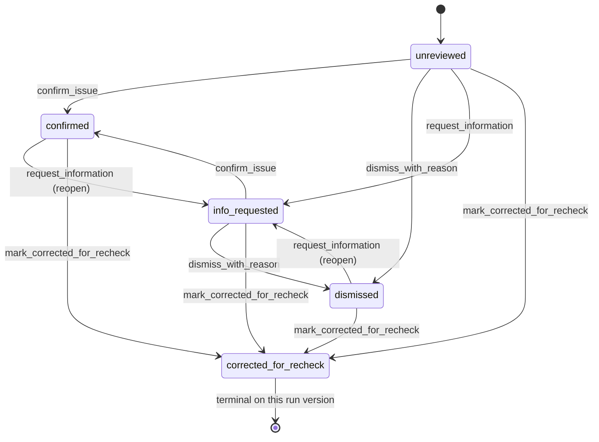
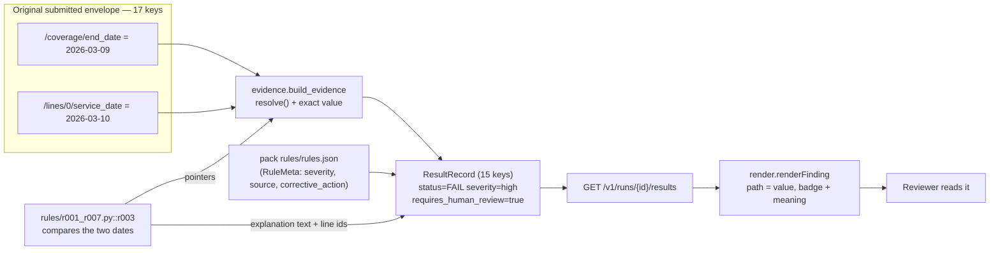

# 16 — User flow and explainability

> **Status:** Phase-1 submission document · written 2026-09-23 · every mechanism claim below names
> the file and symbol that implements it, and §7 pastes the commands that verified the ones that
> can be verified cheaply.
> **Read with:** `docs/11-Architecture-and-Dataflow.md` (the pipeline and trust boundaries),
> `docs/15-Demo-Script.md` (the same flow performed live),
> `docs/12-Privacy-and-Security-Note.md` (§4–§5: what the ledger does *not* protect).
> **Scope:** synthetic educational data only. The system reports deterministic check results and
> records reviewer notes about them. It never approves, denies, prices, pays or submits a claim, and
> no endpoint, button or database column in this repository expresses such a decision.
>
> **2026-09-25 product update:** the primary interface is now the evidence-first Next.js cockpit in
> `frontend/`, served by Compose on `http://localhost:3001`. It keeps queue, deterministic findings,
> explanation provenance and audit context visible together, requires a reviewer note before a
> decision, and edits a detached copy of the stored synthetic claim before creating a recheck
> version. The detailed `/review` walkthrough below remains accurate for the legacy operational
> fallback; it is no longer the primary presentation surface.

---

## 1. The people and what they need

Four jobs use this product. They are **jobs, not roles**: the code has one interface and one
free-text actor field, and it does not know who is typing. §1.5 states that plainly.

### 1.1 The billing officer — catch problems before submission

The pack's mission statement is written for this person: *"Build a usable copilot for a claims
officer who checks a claim before submission. The officer needs to see what is wrong, which evidence
supports the finding, what to review or correct, and which questions remain unresolved"*
(pack `docs/01_Challenge_Brief.md`).

| | |
|---|---|
| **Needs to see** | Which of the 15 checks objected, the severity, the exact field and value that proves it (`path = value`, read from the claim they submitted), the corrective action, and which checks could not be decided. |
| **May do** | Submit an envelope for checking (`POST /v1/claims`); read the queue and a claim's 15 records; correct the source claim and ask for a recheck (`POST /v1/claims/{claim_id}/recheck`). |
| **Must never be able to do** | Read a check result as payer approval. There is no approve, deny, pay, price or submit-to-payer operation in the API (`claimguard/review/app.py`, the eight documented operations) and no such field in the result contract (`RESULT_KEYS`, `claimguard/edu/envelope.py`). The page says so on itself, quoting the pack: *"A PASS is not payer approval."* |

### 1.2 The first-line reviewer — work a queue

| | |
|---|---|
| **Needs to see** | A filtered queue that defaults to the checks that need attention, per-claim rollups, and an explicit count of what is still owed. |
| **May do** | Record one of the pack's four actions against a finding, with a self-declared actor and a reason: `confirm_issue`, `dismiss_with_reason`, `request_information`, `mark_corrected_for_recheck` (`ReviewAction`, `claimguard/review/models.py`). |
| **Must never be able to do** | Change a check's status, severity, evidence or review flag. `ResultRecord` refuses a `method` other than `deterministic` and a `review_status` other than `unreviewed`, and the store never writes to `rule_results` after the run commits — migration `0002` refuses `UPDATE` on that table (§7.4 shows the refusal). Also: decide on a version that has been superseded (409, `RunSupersededError`). |

### 1.3 The senior reviewer — handle escalations

| | |
|---|---|
| **Needs to see** | Everything the first-line reviewer sees, plus the full decision history of a run — what was recorded, by whom, why, and against which original status. |
| **May do** | Reopen a decided finding with `request_information` (the state machine allows it from `confirmed` and `dismissed`) and then confirm or dismiss again. That is how a decision is revised: a new appended event, never an edit. |
| **Must never be able to do** | Silently reverse a decision. `review_decisions` is append-only (migration `0002`: `UPDATE` **and** `DELETE` refused), and the API exposes no operation that edits or deletes a decision. There is also no escalation *routing*: no assignment, no priority queue, no notification — see §6. |

### 1.4 The auditor — reconstruct what happened

| | |
|---|---|
| **Needs to see** | For each run: `input_hash` (SHA-256 of the canonical envelope), `rule_version`, `model_version`, `prompt_version`, `initiated_by`, `created_at`, `supersedes_run_id`, and the run's audit stamp (`event_id`, `at`, `kind`, `chain_hash`). For each decision: the 7-key pack event (`claim_id, rule_id, action, actor, reason, created_at, original_status`). Plus the ability to verify the hash chain. |
| **May do** | Read all of it: `GET /v1/runs/{run_id}`, `GET /v1/runs/{run_id}/results`, `GET /v1/runs/{run_id}/decisions`, and `SELECT claimguard.verify_audit_chain()`. |
| **Must never be able to do** | Alter the record. The `0001` trigger refuses `UPDATE`/`DELETE` on `audit_events`; `0002` refuses them on `review_decisions` and refuses `UPDATE` on `rule_runs`/`rule_results` — for the table owner too (measured in §7.4). **Honest limit:** this is tamper-*evident*, not tamper-*proof*; a superuser can disable a trigger or drop the table, and the application connects as a superuser here (`docs/12-Privacy-and-Security-Note.md` §4, measured: `current_user = claimguard`, `rolsuper = True`). |

### 1.5 There are no roles, and the document says so

The page has **no authentication and no permission model**. The pack's own teaching page states its
position — *"Reviewer identity is self-declared"* (`<pack>/examples/review_demo.html`) and *"The
supplied static interface uses self-declared reviewer names and does not authenticate users"*
(`<pack>/START_HERE.html`) — and this page carries the same sentence in its own honesty notice and
above the actor field. Whoever types a name into the reviewer field is recorded as the decision's
actor (`claimguard/review/ui/static/index.html`, `#detail-actor`, `#recheck-actor`). The four
personas above are therefore **distinguished by what they do, not by what the system allows them to
do**. The only identity control in the code is that the actor must be non-blank
(`ReviewDecisionEvent._text_is_present`).

---

## 2. The user journey, step by step

### 2.1 The journey as a sequence

```mermaid
sequenceDiagram
    autonumber
    actor BO as Billing officer
    participant API as review.app — FastAPI
    participant EN as edu.engine + rules/emit
    participant ST as review.store
    participant DB as PostgreSQL
    actor RV as Reviewer
    participant PG as review.ui page — GET /review

    BO->>API: POST /v1/claims  (submit_claim)
    API->>API: _migrated_store -> ensure_schema (503 if unmigrated)
    API->>API: _evaluate -> validate_transport (422 on defect)
    API->>EN: evaluate_claim(envelope, rules.context())
    EN-->>API: 15 records R001..R015
    API->>API: validate_record(record, envelope) x15
    API->>ST: record_run(envelope, records, versions, actor="api-submit")
    ST->>DB: INSERT rule_runs + 15 rule_results + 1 audit event (one transaction)
    API-->>BO: 201 run + results=15 + needs_attention + by_status + duplicate + audit

    RV->>PG: open /review
    PG->>API: GET /v1/queue with the filter query parameters
    API-->>PG: filters, counts, claims, items
    RV->>PG: click "Open claim"
    PG->>API: GET /v1/runs/{run_id}/results
    PG->>API: GET /v1/runs/{run_id}/decisions
    API-->>PG: run identity + 15 records, and the decision history
    RV->>PG: pick an action, type actor and reason
    PG->>API: POST /v1/runs/{run_id}/decisions (rule_id, action, actor, reason)
    API->>ST: record_decision (404 / 409 / 422 as applicable)
    ST->>DB: INSERT review_decisions + 1 audit event (trigger chains the hash)
    API-->>PG: 201 decision + review state + audit stamp
    PG->>API: GET /v1/queue (refresh) + GET results (re-render)
    RV->>PG: paste corrected envelope JSON, click recheck
    PG->>API: POST /v1/claims/{claim_id}/recheck (claim, actor)
    API->>ST: record_recheck -> version+1, supersedes_run_id set
    ST->>DB: INSERT rule_runs + 15 rule_results + 1 audit event
    API-->>PG: 201 new run at version 2
    Note over RV,DB: the original run, its 15 records and its decisions stay readable;<br/>a decision on the superseded run is 409.
```

### 2.2 What the person sees, what the system does, and which call does it

| # | The person | What they see | What the system does | Call / store operation |
|---|---|---|---|---|
| 0 | The clinic finishes a claim | Nothing on this page | The envelope enters either as batch input to the engine CLI, or as one API request. **The page has no "submit a claim" control** — §6 | `python -m claimguard.edu.run --claims <jsonl> --rules-dir <dir> --output <out.jsonl>` (`claimguard/edu/run.py`), or `POST /v1/claims` (`submit_claim`) |
| 1 | — | — | Schema readiness is checked once per process; a missing migration is a 503 naming the command | `_migrated_store` → `ReviewStore.ensure_schema` → `SchemaNotMigratedError` (`claimguard/review/app.py`, `claimguard/review/store.py`) |
| 2 | — | — | The 17-key envelope is validated as a *transport* contract; a defect is a 422 carrying the engine's own words, never a repair | `_evaluate` → `validate_transport` (`claimguard/edu/envelope.py`) |
| 3 | — | — | All 15 rules run over the **original** parsed object, in R001..R015 order; each record is then re-validated against that same object (evidence re-resolves, line ids exist, key set is exact) and coverage must be exactly 15 | `_evaluate` → `evaluate_claim` (`claimguard/edu/engine.py`) → `validate_record` (`claimguard/edu/emit.py`) |
| 4 | The submitter gets a 201 | `run` (id, version, input hash, rule/model/prompt versions, who initiated it, when, what it supersedes), `results: 15`, `needs_attention`, `by_status`, `duplicate`, and an `audit` stamp | One transaction writes the run row, its 15 result rows and its audit event; a resubmission whose canonical bytes equal the current version writes **nothing** and returns `duplicate: true` | `store.record_run` → `envelope_digest` → `_persist_run` → `audit_events.append` |
| 5 | The reviewer opens `/review` | A static honesty notice, a status legend, then "1. Review queue" with four filters (rule status, severity, rule, *include checks that do not need attention*) | The queue is read with the filters, listing each claim's **latest** version, with counts that describe the returned set | page `refreshQueue()` → `GET /v1/queue` → `get_queue` → `store.queue` → `_queue_statement` |
| 6 | The reviewer reads the counts | *"N unresolved check(s) still need a decision, of M finding(s) shown"*, then "R resolved", a per-status table, and a per-claim table (claim, version, findings, unresolved, latest decision) | Counts and rollups are computed from the returned items only | `render.renderCounts`, `render.renderClaims`; `store._queue_counts`, `store._claim_summaries` |
| 7 | The reviewer clicks **Open this claim** / **Open claim** | The run header (`run`, input hash, rule version, model version, prompt version, initiated by, created, supersedes), a notice that the reviewer field is self-declared, the versions open in this page, then **all 15 findings**, then the decision history | Two reads: the 15 records and the decision history; the reviewer's current state per finding is derived from the latest decision | page `openClaim()` → `GET /v1/runs/{run_id}/results` (`get_results`) + `GET /v1/runs/{run_id}/decisions` (`list_decisions`); `store._reviews_for` |
| 8 | The reviewer types their name into the reviewer field and a reason into a finding's box, then clicks one of **Confirm issue / Dismiss with reason / Request information / Mark corrected for recheck** | Either a green notice — *"Recorded \<action\> for \<rule\> on \<run\> (HTTP 201); the finding's review state is now \<state\> (still unresolved); Audit chain hash: …"* — or the API's own refusal, printed unedited | Four ordered checks: run exists (404), finding exists (404), the run is still the claim's current version (409), the state machine allows the action (409); then the 7-key event is built from the stored finding and the DB clock and validated, and one decision row plus one audit event are written in one transaction | page `decide()` → `POST /v1/runs/{run_id}/decisions` → `record_decision` → `store.record_decision` → `models.next_status` |
| 9 | The reviewer pastes the corrected envelope as JSON and clicks **Submit corrected claim for recheck** | *"The recheck produced version N as RUN-… (HTTP 201), superseding RUN-…. Version M (RUN-…) is unchanged and still viewable — nothing in this page replaced it."* The new version is added to the page's version list and each is viewable | The corrected envelope is re-validated and re-evaluated, then persisted as a **new version** (`version + 1`, `supersedes_run_id` set). An envelope whose canonical bytes are unchanged is refused | page `recheck()` → `POST /v1/claims/{claim_id}/recheck` → `recheck` → `store.record_recheck` |
| 10 | The reviewer looks at the queue again | The corrected claim has left the default listing (its only objection is gone); with *include checks that do not need attention* ticked, all 15 checks appear at version 2 | Default listing = `requires_human_review` or `NOT_IMPLEMENTED`; `include_all` drops that filter | `store._queue_statement`, `models.requires_attention` |
| 11 | The auditor reads a run | The run's identity and its `audit` stamp; the decision history with actor, reason and original status per event | The ledger holds one event per run and one per decision — never one per finding; the chain hash is computed by the database trigger | `GET /v1/runs/{run_id}` → `get_run` → `store.run_audit_stamp`; `audit_events.events_for_ref` |
| 12 | The auditor verifies the chain | The verification result | Every event's stored `chain_hash` is recomputed from its own fields and compared | `SELECT claimguard.verify_audit_chain()`; or `audit_events.unlinked_refs` for a slice |

### 2.3 What a reviewer may do to a finding, and nothing else



This is `ALLOWED_TRANSITIONS` in `claimguard/review/models.py` drawn literally: any action from
`unreviewed`/`info_requested`; only reopening or `mark_corrected_for_recheck` from
`confirmed`/`dismissed`; nothing at all from `corrected_for_recheck`. Repeating the same terminal
action is refused (409) because it would append a row without changing the reviewer's answer — the
reviewer who wants to say *"still confirmed, new information arrived"* has `request_information`.
`unreviewed` and `info_requested` are the two statuses that still owe work
(`UNRESOLVED_STATUSES`), which is exactly what the queue's unresolved count measures.

---

## 3. Explainability: what a finding actually shows

### 3.1 The anatomy of one result record

The record is the pack's frozen 15-key contract (`RESULT_KEYS` in `claimguard/edu/envelope.py`,
enforced by `ResultRecord` with `extra="forbid"` and a per-record validator; assembled by
`claimguard/edu/emit.py::make_result`). Here is every key, who produces it, and what the page does
with it:

| Key | Produced by | What the page shows |
|---|---|---|
| `claim_id` | `make_result` from the envelope | The queue row and the run header |
| `rule_id` | `RuleMeta.rule_id` (the rule manifest, never invented) | The finding's heading |
| `rule_version` | `RuleMeta.version` | The run header ("rule version") |
| `status` | the rule function's own decision | The status badge **plus the meaning of that status** (§3.3) |
| `severity` | `RuleMeta.severity` (manifest) | `severity: high\|medium\|low` on the finding |
| `affected_line_ids` | the rule, using the stable `line_id` values (never array offsets) | `affected lines: L1, …` or `none` |
| `evidence` | `build_evidence(claim, pointers)` — resolved against the **original** envelope | The evidence block, `path = value` (§3.2) |
| `rule_source` | `RuleMeta.source`, i.e. `fictional-rulebook/<RID>@1.0.0` | `source: …` |
| `explanation` | the rule function's own sentence (see §3.4) | The finding's first paragraph, verbatim |
| `corrective_action` | `RuleMeta.corrective_action`, non-empty only for `FAIL`/`UNABLE_TO_ASSESS` | `Corrective action: …` or `none supplied` |
| `confidence` | always `null` | `confidence: null` |
| `confidence_kind` | always `not_probabilistic` | `(not_probabilistic)` — a deterministic rule is not a probability |
| `requires_human_review` | `True` exactly for `FAIL`/`UNABLE_TO_ASSESS` | `human review required: yes\|no` |
| `method` | always `deterministic` | `method: deterministic` |
| `review_status` | always `unreviewed` (the *engine's* field; the reviewer's own state lives beside it) | `result review_status: unreviewed` |

The reviewer's state is deliberately **not** one of the 15 keys. It is `ReviewState` inside
`FindingView` (`claimguard/review/models.py`), derived on read from the append-only decision history,
so the engine's record stays exactly what the mentor's scorer reads.



### 3.2 How evidence is presented — and why it is trustworthy

Every evidence entry is `{"path": <RFC 6901 pointer>, "value": <the exact value found there>}`
(`EVIDENCE_KEYS`). It is built by *resolving* the pointer against the original envelope and storing
the object found — the observed value is never re-typed, re-rounded or re-serialised
(`claimguard/edu/evidence.py::resolve`, `build_evidence`). The mentor's scorer re-resolves every
pointer against the original claim and demands equality; our conformance harness does the same
independently, with stricter type equality (`values_match`: `1` is not `1.0`, `True` is not `1`).

The page renders it as literally `path = value`, with the caption *"Evidence (original values from
the submitted claim)"* (`render.mjs::renderEvidence`). Measured on a real submitted claim (§7.2,
step 4), the R003 finding carried:

```text
/coverage/status     = "active"      resolved in the original envelope: "active"      equal
/coverage/start_date = "2026-01-01"  resolved in the original envelope: "2026-01-01"  equal
/coverage/end_date   = "2026-03-09"  resolved in the original envelope: "2026-03-09"  equal
/lines/0/service_date= "2026-03-10"  resolved in the original envelope: "2026-03-10"  equal
```

So the sentence a reviewer reads is checkable by the reviewer: the claim they submitted contains
those four values, and two of them disagree. **Honest limit:** resolution and equality prove the
cited field *exists* and holds what we say it holds. They do not prove the field is *relevant* to the
conclusion — the mentor states this caveat (`docs/07_Evaluation_and_Acceptance.md`: "Evidence-value
checks do not prove that the chosen field is relevant to a conclusion"), and it is repeated in
`docs/verification/EDU-PACK-CONFORMANCE.md`.

### 3.3 The five statuses are not interchangeable

Five values, from `Status` in `claimguard/edu/envelope.py`. The page's wording is the single source
`STATUS_MEANINGS` in `render.mjs`, used both by the legend and by every badge, so a status can never
be displayed without its meaning next to it:

| Status | What it means for the person reading it | In the default queue? |
|---|---|---|
| `PASS` | *"This specific check passed on the supplied data. It is not payer approval."* | No — unless the reviewer ticks *include checks that do not need attention* |
| `FAIL` | *"The check found an issue. A human decides what happens next."* | Yes |
| `UNABLE_TO_ASSESS` | *"The check could not decide from the supplied data. A human must assess it."* | Yes |
| `NOT_APPLICABLE` | *"The rule does not apply to this claim. It is not a pass."* | No |
| `NOT_IMPLEMENTED` | *"This check has not run. The claim cannot be considered fully checked."* | **Yes, always** |

The last row is the load-bearing one: `requires_attention` (`claimguard/review/models.py`) returns
true for a record that asks for human review **or** whose status is `NOT_IMPLEMENTED`, so an
unimplemented check can never be filtered away as if it were clean. The stylesheet gives the five
statuses five distinct treatments and styles `NOT_IMPLEMENTED` as a warning with a dotted underline,
never as a pass (`styles.css`, `.status-NOT_IMPLEMENTED`). The page also states, statically:
*"No claim is submitted to a payer from this page, and NOT_IMPLEMENTED is never shown as a pass."*

### 3.4 The explanation text: where it comes from today

Two different things are called "the explanation", and they must not be conflated.

**(a) What the page shows today.** The `explanation` field of the 15-key record, written by the rule
function that decided the status, through `emit.make_result(..., explanation, ...)`. It is short,
deterministic and status-specific, and `corrective_action` beside it comes from the rule manifest.
Measured (§7.3):

```text
R003  FAIL             explanation: service outside coverage period
                       corrective_action: Verify coverage applicable on the service date with the source records.
R001  PASS             explanation: Required information is present.
R008  NOT_APPLICABLE   explanation: Rule does not apply to the supplied claim.
```

This text is always available because it is produced by the same deterministic code path as the
status, before any model could be involved: nothing optional sits between the rule and the record.

**(b) The bounded AI layer that exists beside it.** `claimguard/edu/explain/` implements the pack's
behaviour 6. It is a *language* layer and nothing else:

* `fallback.py::build_text` composes a full explanation from the validated finding only (status,
  severity, the rule's own sentence, corrective action, the cited evidence, the human-review flag)
  and prefixes it with `[deterministic] `. It never quotes `notes` or attachment `text`: those are
  claim data, and an explanation that echoed them would be indistinguishable from one that followed
  them.
* `provider.py::explain_finding` asks an `ExplanationProvider` for a draft, verifies it, and on any
  fault — missing configuration, exception, timeout, malformed payload, rejected output — returns
  the deterministic safe twin with reasons recorded (`rejection_reasons`) and
  `fallback_used=True`. The model path prefixes accepted explanation and recommendation with
  `[model]`; fallback content is marked `[deterministic]`. Only reviewer-facing language can differ:
  status, severity, evidence and the review flag are carried through unchanged.
* `MODEL_ELIGIBLE_STATUSES = {"FAIL", "UNABLE_TO_ASSESS", "NOT_IMPLEMENTED"}`: a `PASS` is never
  sent to a model. Every state that needs administrator attention receives contextual help when the
  SLM is configured, while non-attention results stay deterministic.
* `verifier.py::validate_explanation` enforces the secured five-key contract
  (`explanation, correction_recommendation, cited_evidence_paths, cited_rule_ids,
  needs_human_review`), requires every citation to be supplied by the finding and preserve the
  stored review flag, and rejects empty text, adjudication/clinical claims, automatic actions and
  direct or Base64-transformed instruction language. The mentor prompt is preserved as
  `SYSTEM_PROMPT`; the coherent deployed extension is `SECURE_ASSISTANCE_PROMPT`, version `2.0.0`.

**Why the deterministic text is always available even when a model writes the prose.** The
dependency points one way: the record exists *before* the explanation layer is consulted, and the
layer's only write is one string. There is no code path in which a model answer is required for a
status, a severity, an evidence entry or a routing flag to exist, because those are computed in
`engine.evaluate_claim` and then copied (`claimguard/edu/explain/__init__.py`, module docstring:
*"a model failure cannot remove a deterministic finding"*). Measured (§7.3): with no provider
configured, the outcome is `source=deterministic, fallback_used=True`, the text is marked
`[deterministic] `, and `status` is still `FAIL`; a draft citing `/lines/0/nonexistent_field` is
rejected with `citation '/lines/0/nonexistent_field' was not supplied with the finding`; a draft
saying *"The claim is denied"* is rejected as `adjudication_outcome`.

**Where this layer is wired — stated plainly.** Every API submission and recheck now passes the
engine's 15 records through `claimguard.review.explanations.explain_run`. The intended product
profile is model-first through the environment. An endpoint and checkpoint must still be explicitly
configured; incomplete configuration becomes a visible fallback rather than silent deterministic
success. The page receives explanation, correction recommendation and immutable sidecar provenance,
including security decision and receipt, while the API re-validates that the frozen decision fields
did not move. This is a product feature now, not only a tested library. No live-model quality number
is claimed: secured-contract v2 must be rerun first.

---

## 4. The mechanisms, in plain language

### 4.1 How a claim gets in

Two doors, one engine. The **batch** door is the frozen CLI
`python -m claimguard.edu.run --claims <jsonl> --rules-dir <dir> --output <out.jsonl>`
(`claimguard/edu/run.py`), with CSV and FHIR intake in `claimguard/edu/intake/`. A defective line is
quarantined as a structured `ingestion_error`, written to stderr and to a sidecar file, excluded from
evaluation, and the process exits 2 — never repaired, never silently dropped, never emitted as a
pass. The **interactive** door is `POST /v1/claims`. The CLI is the scorer's entry point; the API is
the reviewer's, and both call `claimguard.edu.engine.evaluate_claim` — the same code path, without
the file round-trip (`claimguard/review/app.py`, module docstring).

### 4.2 How the catalogue is resolved

`resolve_rules_dir()` (`claimguard/review/app.py`) looks, in order, at `CLAIMGUARD_RULES_DIR`, then
`CLAIMGUARD_PACK_ROOT` (the convention `scripts/edu_conformance.py` already uses), then searches up
the tree for the vendored pack directory. It requires a `rules.json` and raises `RuleDirError`
otherwise. The catalogue is then loaded **lazily, once, under a lock** (`_RulesLoader.context`), so a
misconfigured deployment fails on the first claim rather than at import time and `GET /v1/health` can
still say why: with a bad directory, health answers `200 {"status": "degraded", ..., "rules_ready":
false}` (measured, §7.6). `RuleContext.from_rules_dir` (`claimguard/edu/policy.py`) supplies each
rule's severity, version, source and corrective action, so those are copied from the manifest and
never invented by a rule function.

### 4.3 How a result is produced

One pure function per rule, in a fixed order (`RULE_FUNCTIONS` / `ALL_RULES` in
`claimguard/edu/rules/__init__.py`), driven by `evaluate_claim`. Each returns one record built by
`make_result`, which resolves its evidence pointers against the original envelope, takes severity,
source and corrective action from the manifest, and sets `confidence: null`,
`confidence_kind: not_probabilistic`, `method: deterministic`, `review_status: unreviewed`. The
engine is the only place that fixes coverage: 15 records, R001..R015, for every claim. The API then
re-validates each record against the envelope it came from (`validate_record`) and refuses to proceed
unless exactly 15 came back.

### 4.4 How a decision is stored

`store.record_decision` runs four ordered checks so the reviewer gets the most useful reason first —
run exists (404), finding exists (404), the run is still the claim's current version (409), the state
machine allows the action (409) — then inserts one `review_decisions` row and appends one audit
event, **in one transaction**. The pack's 7-key event is built from the *stored* finding and the
*database* clock, never from client input: `claim_id`, `original_status` and `created_at` cannot be
supplied by the caller (`DecisionRequest` carries only `rule_id`, `action`, `actor`, `reason`). A
model violation rolls back the decision row and its audit event together. The reviewer's current
state is not stored anywhere — it is derived on read from the decision history
(`_reviews_for`), which is why a rewritten history is not merely forbidden but unusable.

### 4.5 How the audit chain is written and verified

One event per engine run and one per human decision — never one per finding. Both are appended by
`claimguard/review/audit_events.py::append` into `claimguard.audit_events`, the append-only table
created by migration `0001`, whose trigger `claimguard.audit_chain_insert()` is the **single
canonical owner** of the hash serialisation (`claimguard/audit/chain.py` is its
character-for-character Python replica, guarded by a parity test). Three details make the chain
survive concurrency: `at` is inserted as `clock_timestamp()` (not `now()`, which is the transaction
start), the append takes a transaction-scoped advisory lock, and every connection is pinned to
`TimeZone=UTC` — because the trigger hashes `at::text`, which renders in the *session* time zone.
Run events carry the claim version and who asked for the run inside the hashed `reason_code`:
`input_sha256=<64 hex> prompt_version=<version> actor=<who>` (`format_provenance`, read back by
`provenance_of`), because migration `0001` has no column for either and is frozen. Verification is
`SELECT claimguard.verify_audit_chain()`, or `audit_events.unlinked_refs` to recompute a slice's
hashes. Measured on a real run: the event's provenance parsed back correctly and `unlinked_refs`
returned `{}` (§7.4).

### 4.6 How a correction produces a new version instead of overwriting anything

`store.record_recheck` refuses when the claim was never submitted (404) and refuses an envelope whose
canonical bytes equal the current version's (`NoCorrectionError`, 409) — *"a correction that changes
nothing would create a version that differs from its predecessor only in a timestamp, which is
exactly the kind of unverifiable claim this workflow exists to prevent"*. Otherwise it writes
`version = latest + 1` with `supersedes_run_id` set to the previous run. Nothing is updated: the old
run row, its 15 records and its decisions stay exactly as they were, and the database refuses to
change them anyway (`trg_rule_runs_no_update`, `trg_rule_results_no_update`,
`trg_review_decisions_no_modify`). The API also refuses a decision on a superseded run (409), so open
questions live on the live version only. Measured end to end in §7.2, steps 14–19.

---

## 5. An honest assessment of the interface as it stands

### 5.1 What it is

One self-contained HTML page and three asset files, served by the same FastAPI application as the
API: `GET /review` and `GET /review/static/{asset}` (`claimguard/review/ui/__init__.py`, `ASSETS`,
`PAGE_PATH`, `_asset`). There is no build step, no bundler, no CDN, no second server and no
framework: `index.html` links `styles.css`, `app.js` and `render.mjs` and nothing else. The four
known assets are served from an explicit map — *"the explicit map IS the traversal defence: a request
either names a key here or it is a 404, so no path arithmetic is ever performed on caller input"* —
and the page is reached at `http://127.0.0.1:8000/review` from `uv run claimguard serve`, which prints
that URL (`claimguard/cli/serve.py`).

### 5.2 What that buys

* **Zero-dependency demo.** Nothing to install, nothing to compile, no network: open the URL and the
  page works offline (the page loads only same-origin assets — verified in §7.1).
* **One deployable service.** The interface and the API are the same process and the same port, so
  they cannot drift: a test asserts the page and `/v1/health` are answered by one app
  (`tests/review_ui/test_ui_flow.py::test_the_page_is_served_by_the_same_app_that_answers_the_api`).
* **Reviewable by reading.** The rendering is pure functions of `(document-like, data)`
  (`render.mjs`, with the DOM injected rather than reached for), so it runs under Node with a DOM
  shim (`tests/review_ui/dom_shim.mjs`, `render_harness.mjs`) — the page's rendering is tested
  without a browser, including the case where attachment text is a `<script>` payload.
* **Injection-resistant by construction.** Every untrusted value — claim `notes`, attachment `text`,
  rule text, evidence values, reviewer input, API error bodies — is written with
  `document.createTextNode`; the module contains no `innerHTML`, `outerHTML`, `insertAdjacentHTML` or
  `document.write`, and the shim raises if one is used (`render.mjs`, untrusted-data policy).
* **Refusals are shown, not smoothed.** A 422 or a 409 is rendered as the HTTP status plus the API's
  own body, unedited (`renderApiError`): the reviewer sees the real contract, including the blank
  actor/reason refusal.

### 5.3 What it costs

| Cost | Reality in the code |
|---|---|
| **No login, no permission model** | The reviewer name is a text field; whoever types it is the actor. Stated on the page and in `claimguard/review/ui/__init__.py`. Same position as the pack's own page, and this page persists to the ledger where the pack's page lost its decisions when the tab closed. |
| **No saved views** | No `localStorage`, `sessionStorage` or cookie use anywhere in the UI, and no `pushState`/`replaceState`/`location` write either (checked: §7.5). The filters are sent as query parameters to `/v1/queue` for one request and are not written into the address bar, so a filter selection cannot be bookmarked or shared. |
| **No keyboard workflow** | The only listeners in the whole page are a form `submit` and `click` handlers on buttons. There is no `keydown`/`keypress` handler, no shortcut, no focus management beyond the browser default. A reviewer works this queue with a mouse. |
| **No pagination, no virtualisation** | `_queue_statement` has no `LIMIT`, and `renderQueueItems` loops over every returned finding. The page renders the whole filtered listing into the DOM in one pass. Measured: with `include_all=true` over the two claims in the local database the queue returned **30 findings in one response** (§7.5). **Note on the brief:** this document's brief mentioned a "100-card render cap"; I searched the UI, the store and the tests and found no cap, so none is claimed here. |
| **Cannot pre-fill the correction form** | No endpoint returns the submitted envelope (`RuleRun` carries the input *hash*, not the input), so the recheck panel takes the corrected envelope as pasted JSON and says so on the page. |
| **No submit control** | The page cannot submit a claim: `POST /v1/claims` is driven by the API's own callers (the demo uses `scripts/sample_run.py`, which drives the same app in-process). A claim appears in the queue because something else submitted it. |
| **No responsive/print/mobile work** | `styles.css` is a single stylesheet with no `@media` rule, and `main` is one centred column capped at 1180px (§7.5). It is a desktop review screen, and there is no print stylesheet. |

### 5.4 Is a framework SPA needed for the Phase-3 interface score?

The pack's stated criterion is functional, not architectural: *"Human review and usability — 15 —
Reviewer can trace, dismiss with reason, request info and trigger recheck"*
(pack `docs/07_Evaluation_and_Acceptance.md`). **On that criterion a framework SPA is not needed.**
All four are present and measurable today: tracing (the run header plus `path = value` evidence read
from the original claim), dismiss-with-reason, request-information, and recheck-as-new-version — and
each is exercised through the real routes by `tests/review_ui/test_ui_flow.py` and reproduced
end-to-end in §7.2. The pack also warns that *"Visual polish alone is insufficient."*

What a framework SPA **would** add, if the interface were to be pushed further: routing with
bookmarkable per-claim views, optimistic UI with a real client-side cache, virtualised long queues,
keyboard-first triage, component-level state for multi-claim comparison, and a place to hang an
authentication/session layer. Those are real gains, but they are new capability, not gaps in the four
required behaviours — and today's page already does what the required behaviours describe.

---

## 6. What is not built

Stated plainly, so nothing here is read as a promise:

1. **No authentication, no sessions, no per-user authorisation, no roles.** One self-declared actor
   string. Nothing in this repository should be exposed to an untrusted network as it stands.
2. **No adjudication of any kind.** No approve, deny, price, pay, appeal or submit-to-payer
   operation exists — not in the API, not in the page, not as a column.
3. **No live-model explanation benchmark has been completed.** The bounded layer is wired into the
   reviewer API and page, but its default is deterministic and no configured model has yet earned a
   quality, latency or cost claim.
4. **No explanation-quality number.** The pack's manual 0/1 scorecard over its 25 cases is not
   reproducible by a command and has not been run here.
5. **No live model was measured.** No latency, cost or token figure exists in this repository, and no
   model provider is configured by default.
6. **No queue features beyond filters and counts:** no pagination, no sorting controls, no saved
   views, no bulk actions, no keyboard shortcuts, no assignment/ownership, no escalation routing, no
   notifications, no SLA/priority model, no per-reviewer workload view.
7. **No claim editing UI.** A correction is a pasted JSON envelope, and the page cannot fetch the
   original to pre-fill it.
8. **No claim submission UI.** Claims arrive through the API or the batch CLI.
9. **No client-side validation beyond JSON parsing** of the pasted envelope; every real rule of the
   contract is enforced server-side and the refusal is shown as it arrived.
10. **No tamper-*proof* logging.** The chain is tamper-evident; a superuser can disable the trigger or
    drop the table, there is no external anchor and no trusted timestamp
    (`docs/12-Privacy-and-Security-Note.md` §4).
11. **No per-finding audit event and no model-call event.** One event per run and one per decision,
    deliberately (`claimguard/review/audit_events.py` docstring).
12. **No notification, email, export, PDF, print stylesheet, i18n or RTL support.**
13. **No accessibility audit.** The page uses semantic elements, labels and `aria-label`s on the
    reason boxes and the recheck textarea, but no screen-reader or contrast audit has been run.
14. **A misconfigured rule catalogue blocks submissions.** Health remains readable with
    `rules_ready: false`; a valid submission receives a structured 503 naming the missing setting.

---

## 7. Verification performed for this document

Three throwaway probes under `C:/tmp/ui_probe/` (not committed; they import the repository's own test
helpers `tests.edu.base_claim` and `tests.review.conftest.purge_claims` and delete every row they
create), plus two inline probes in §7.6. Interpreter: `uv run python` on the project venv, 2026-09-23.

### 7.1 The page, its assets and the routes

```bash
uv run python C:/tmp/ui_probe/probe.py
```

Output below is condensed where the probe prints one line per check (page-content checks and the
contract constants); no value is altered.
```text
=== routes (path, methods, name) ===
GET,HEAD   /openapi.json                            openapi
GET,HEAD   /docs                                    swagger_ui_html
GET,HEAD   /docs/oauth2-redirect                    swagger_ui_redirect
GET,HEAD   /redoc                                   redoc_html
GET        /v1/health                               health
POST       /v1/claims                               submit_claim
GET        /v1/runs/{run_id}                        get_run
GET        /v1/runs/{run_id}/results                get_results
POST       /v1/runs/{run_id}/decisions              record_decision
GET        /v1/runs/{run_id}/decisions              list_decisions
GET        /v1/queue                                get_queue
POST       /v1/claims/{claim_id}/recheck            recheck
           _IncludedRouter(original_router=<APIRouter …>)     # the UI router, enumerated below

=== the included UI router's own routes ===
GET        /review                                  reviewer_page
GET        /review/static/{asset}                   reviewer_asset

=== page and assets ===
GET /review                            -> 200 text/html; charset=utf-8
GET /review/static/index.html          -> 200 text/html; charset=utf-8
GET /review/static/app.js              -> 200 text/javascript; charset=utf-8
GET /review/static/render.mjs          -> 200 text/javascript; charset=utf-8
GET /review/static/styles.css          -> 200 text/css; charset=utf-8
GET /review/static/nope.js             -> 404 application/json
GET /review/static/%2e%2e/app.py       -> 404 application/json
GET /review/static/..%2fapp.py         -> 404 application/json

=== page content checks ===
'<title>ClaimGuard AI | Reviewer interface</title>'            present=True
'id="filters"' / 'id="queue-items"' / 'id="detail-findings"'   present=True
'id="decisions"' / 'id="recheck-submit"'                       present=True
'Reviewer identity is self-declared'                           present=True
'/review/static/app.js'                                        present=True

=== contract constants ===
RESULT_KEYS 15 ('claim_id', 'rule_id', 'rule_version', 'status', 'severity',
  'affected_line_ids', 'evidence', 'rule_source', 'explanation', 'corrective_action',
  'confidence', 'confidence_kind', 'requires_human_review', 'method', 'review_status')
Status ['PASS', 'FAIL', 'UNABLE_TO_ASSESS', 'NOT_APPLICABLE', 'NOT_IMPLEMENTED']
Severity ['high', 'medium', 'low']
REVIEW_ACTIONS ('confirm_issue', 'dismiss_with_reason', 'request_information',
  'mark_corrected_for_recheck')
REVIEW_STATUSES ('unreviewed', 'info_requested', 'confirmed', 'dismissed',
  'corrected_for_recheck')

=== health with the configured DSN ===
GET /v1/health -> 200 {"status":"ok","database":"ready","schema_revision":"0002",
  "rules_dir":"…\\ClaimGuardAI_Student_Starter_Pack\\…\\rules","rules_ready":true,
  "engine_rule_version":"1.0.0"}
```

### 7.2 The whole journey against the real API and database

```bash
uv run python C:/tmp/ui_probe/journey.py
```

Trimmed to the load-bearing lines (the numbered steps correspond to the journey steps in §2.2):

```text
=== 1. submit (POST /v1/claims) ===
status: 201
run: {run_id: RUN-50fe7541…, claim_id: CG-DOC16-fc27c93c, version: 1,
      input_hash: 26ec28b6…, trace_id: ada26644…, rule_version: 1.0.0,
      model_version: deterministic-engine/1.0.0, prompt_version: none,
      initiated_by: api-submit, created_at: 2026-09-23T20:45:44.042884Z,
      supersedes_run_id: None}
results: 15   needs_attention: 1
by_status: {PASS: 11, FAIL: 1, UNABLE_TO_ASSESS: 0, NOT_APPLICABLE: 3, NOT_IMPLEMENTED: 0}
duplicate: False
audit: {event_id: 92f1a7f1-…, at: 2026-09-23T20:45:44.117099Z, kind: validated,
        chain_hash: 57542230…}

=== 2. resubmit the identical envelope (duplicate, nothing written) ===
status: 201   duplicate: True   same run id: True

=== 3. the 15 records (GET /v1/runs/{run_id}/results) ===
record count: 15
non-PASS rules: [('R003','FAIL'), ('R008','NOT_APPLICABLE'), ('R009','NOT_APPLICABLE'),
                 ('R010','NOT_APPLICABLE')]
record keys: the 15 keys above
rule_id: R003   status: FAIL   severity: high   affected_line_ids: ['L1']
evidence: [{path: /coverage/status, value: active},
           {path: /coverage/start_date, value: 2026-01-01},
           {path: /coverage/end_date, value: 2026-03-09},
           {path: /lines/0/service_date, value: 2026-03-10}]
rule_source: fictional-rulebook/R003@1.0.0
explanation: service outside coverage period
corrective_action: Verify coverage applicable on the service date with the source records.
confidence / confidence_kind: (None, not_probabilistic)
requires_human_review: True    method / review_status: (deterministic, unreviewed)

=== 4. evidence re-resolves against the ORIGINAL envelope ===
  /coverage/status      stored='active'     resolved='active'     equal=True
  /coverage/start_date  stored='2026-01-01' resolved='2026-01-01' equal=True
  /coverage/end_date    stored='2026-03-09' resolved='2026-03-09' equal=True
  /lines/0/service_date stored='2026-03-10' resolved='2026-03-10' equal=True

=== 5. the queue (GET /v1/queue) ===
filters: {status: None, severity: None, rule_id: None, claim_id: CG-DOC16-…, include_all: False}
counts: {findings: 1, unresolved: 1, resolved: 0,
         by_rule_status: {PASS: 0, FAIL: 1, …}, by_review_status: {unreviewed: 1},
         by_severity: {high: 1}}
claims: [{claim_id: CG-DOC16-…, version: 1, findings: 1, unresolved: 1, latest_decision_at: None}]
items: [('R003', 'FAIL', {status: unreviewed, decision_count: 0, unresolved: True})]

=== 6. a decision with a blank reason is refused (422) ===
status: 422
body: {detail: [{type: value_error, loc: [body, reason], msg: "Value error, must not be blank",
                input: "  "}]}
=== 7. a decision with a blank actor is refused (422) ===   status: 422
=== 8. an unknown run is 404, an unknown rule is 422 ===    unknown run: 404   unknown rule: 422

=== 9. record a decision (POST /v1/runs/{run_id}/decisions) ===
status: 201
decision.event: {claim_id: CG-DOC16-…, rule_id: R003, action: confirm_issue,
                 actor: doc16-reviewer, reason: coverage ended before the service date,
                 created_at: 2026-09-23T20:45:44.195213Z, original_status: FAIL}
review: {status: confirmed, decision_count: 1, unresolved: False}
audit: {event_id: 9ed2027c-…, kind: review_decided, chain_hash: 7addf2a1…}

=== 10. repeating the same terminal action is refused (409) ===
status: 409
body: {detail: "confirm_issue is not allowed from review status 'confirmed'",
       error: IllegalReviewTransitionError}

=== 11. reopening with request_information is allowed (201) ===
review: {status: info_requested, decision_count: 2, unresolved: True}

=== 12. decision history (GET /v1/runs/{run_id}/decisions) ===
entries: [('R003','confirm_issue','FAIL','confirmed'),
          ('R003','request_information','FAIL','info_requested')]

=== 13. the queue's unresolved count moved ===
counts: {findings: 1, unresolved: 1, resolved: 0, by_review_status: {info_requested: 1}}

=== 14. recheck with an IDENTICAL envelope is refused (409) ===
body: {detail: "the submitted envelope is identical to run RUN-50fe7541…; a recheck must carry
                a real correction", error: NoCorrectionError}

=== 15. recheck with a real correction -> version 2 ===
status: 201
run: {run_id: RUN-21944598…, version: 2, input_hash: 21797f00…,
      initiated_by: doc16-reviewer, supersedes_run_id: RUN-50fe7541…}
by_status: {PASS: 12, FAIL: 0, UNABLE_TO_ASSESS: 0, NOT_APPLICABLE: 3, NOT_IMPLEMENTED: 0}

=== 16. a recheck for a different claim id is refused (409) ===   status: 409

=== 17. the superseded version still reads, but refuses a decision (409) ===
GET old run: 200
decision on superseded run: 409
body: {detail: "run RUN-50fe7541… was superseded by a newer version; decide on the current
                version", error: RunSupersededError}

=== 18. the queue now shows version 2 only (default attention filter) ===
claims: []   items: []      # the corrected claim has no check that needs attention

=== 19. all 15 checks listed with include_all ===   findings: 15

=== 20. the run's audit stamp is the ledger anchor ===
audit: {event_id: e19d22bb-…, at: …, kind: validated, chain_hash: 5862553b…}
```

### 7.3 The explanation layer

```bash
uv run python C:/tmp/ui_probe/explain.py
```

```text
=== the engine's own explanation text (what the page shows today) ===
R003 explanation: service outside coverage period
R003 corrective_action: Verify coverage applicable on the service date with the source records.
R001 (PASS) explanation: Required information is present.
R008 (NOT_APPLICABLE) explanation: Rule does not apply to the supplied claim.

=== provenance constants ===
MODEL_ELIGIBLE_STATUSES: ['FAIL', 'UNABLE_TO_ASSESS']
PROMPT_SOURCE: ClaimGuardAI_Student_Starter_Pack/prompts/explain_findings.md
PROMPT_VERSION: 1.0.0
PROMPT_SHA256: 380413e5a5b3a16bbfa36f7623e3cf750cc22999b200e831eff17d61fb7b95c2
SYSTEM_PROMPT first line: # Explanation helper prompt v1.0.0
DEFAULT_TIMEOUT: 20.0
ENV_BASE_URL / ENV_MODEL: ('CLAIMGUARD_EXPLAIN_BASE_URL', 'CLAIMGUARD_EXPLAIN_MODEL')

### Secured SLM correction assistance

For every attention finding, the right-hand panel now keeps the SLM explanation and its contextual
correction recommendation together. The administrator can copy a verified recommendation into the
editable review note, but ClaimGuard never mutates the claim or records a decision automatically.
The same card exposes the envelope decision (`accept`, `fallback`, or `decline`) and the assistance
receipt prefix; rejection reasons remain visible when the deterministic safe twin is shown.

=== no provider configured -> deterministic text, marked, status unchanged ===
source: deterministic   provider: none   fallback_used: True
rejection_reasons: ('no explanation provider is configured',)
status: FAIL
explanation: [deterministic] Rule R003 "Coverage active on service date" reports FAIL (severity
  high) for claim CG-TEST-0001. Detected: service outside coverage period. Evidence (4 pointer(s)
  into the original claim): /coverage/status = "active", /coverage/start_date = "2026-01-01",
  /coverage/end_date = "2026-03-09", /lines/0/service_date = "2026-03-10". Reviewer step: Verify
  coverage applicable on the service date with the source records. Human review is required. The
  rule engine's status is unchanged by this text.
cited_evidence_paths: ('/coverage/status', '/coverage/start_date', '/coverage/end_date',
                       '/lines/0/service_date')

=== a model provider with no endpoint configured degrades ===
provider_name: none   source_kind: deterministic   fallback_used: True

=== a PASS is never sent to a model (scope check) ===
records explained: 15
model-eligible rules in this claim: ['R003']

=== enrich_records changes exactly one field ===
rules whose record changed: every rule, and for each one the ONLY changed key is ['explanation']

=== a fabricated citation is rejected; the deterministic text stands ===
rejection: ExplanationRejectionError
reasons: ("citation '/lines/0/nonexistent_field' was not supplied with the finding",)

=== an adjudicating explanation is rejected ===
rejection: ExplanationRejectionError
reasons: ('explanation asserts an adjudication or clinical conclusion (adjudication_outcome);
          this layer explains, it never decides',)

=== a valid draft is accepted ===
accepted keys: ['cited_evidence_paths', 'cited_rule_ids', 'explanation', 'needs_human_review']
```

### 7.4 The ledger and the immutability guards

```bash
uv run python C:/tmp/ui_probe/audit.py
```

```text
audit stamp: kind='validated' chain_hash='ef12e942…'
SQL claimguard.verify_audit_chain(): ('2026-09-23 19:52:21.223289+00', '2d487d2b-…',
                                      'prev_hash=genesis', '559f3c33…')

=== the ledger row for this run ===
kind: validated   decision: None
reason_code: input_sha256=99ab0994… prompt_version=none actor=doc16-probe
finding_ids: []   rule_version: 1.0.0   model_version: deterministic-engine/1.0.0
prev_hash: 314f3741…   chain_hash: ef12e942…
provenance parsed: {input_sha256: 99ab0994…, prompt_version: none, actor: doc16-probe}

=== recompute the chain hash of this run's events ===   unlinked refs: {}

=== the database refuses to rewrite a run row / a result row ===
UPDATE claimguard.rule_runs SET version = 99 …  -> refused: RaiseException:
  claimguard.rule_runs is immutable here: UPDATE is refused (a correction is a n…
UPDATE claimguard.rule_results SET status = 'PASS' … -> refused: RaiseException:
  claimguard.rule_results is immutable here: UPDATE is refused (a correction is a…
```

### 7.5 What the interface contains, and what it does not

```bash
grep -n "keydown|keypress|addEventListener|localStorage|sessionStorage|Authorization|innerHTML" claimguard/review/ui
grep -n "@media|pushState|replaceState|location\.|history\." claimguard/review/ui/static
grep -n "100|LIMIT|limit|slice|MAX_" claimguard/review
grep -n "enrich_records|explain_records|explain_finding" claimguard; scripts
```

Observed:

```text
- app.js: exactly two listeners — the filter form's `submit` and the recheck button's `click`.
- render.mjs: `click` listeners on the decision buttons and the "open claim" buttons; no keydown,
  no storage, no `innerHTML` (the string appears only in the policy comment forbidding it).
- `@media`, `pushState`, `replaceState` and `location.`: zero matches in the page's assets, so the
  filter form is never written back into the address bar and there is no responsive breakpoint.
- store.py: the only `limit` uses are `.limit(1)` on single-row lookups; `_queue_statement` has no
  LIMIT, so the queue returns every matching finding.
- render.mjs `renderQueueItems`: no slice, no cap — every returned item becomes a node.
- `claimguard/review/app.py` calls the bounded explanation facade for every submission and recheck;
  `claimguard/review/explanations.py` persists one provenance row per rule beside the frozen record.
- Measured queue size: `GET /v1/queue?include_all=true` over the two claims in the local database
  -> counts.findings = 30 in a single response.
```

### 7.6 Health degradation and the 422 / 503 paths

Two inline probes (heredocs), each building the app with `create_app(store=…, rules_dir=…)` and
calling it through `fastapi.testclient.TestClient`:

```bash
uv run python - <<'PY'   # create_app(rules_dir="C:/tmp/ui_probe/not-a-rules-dir"), then GET /v1/health
                         # and POST /v1/claims with a defective envelope
uv run python - <<'PY'   # create_app(rules_dir=<bad>), POST /v1/claims with a VALID envelope
                         # and raise_server_exceptions=False, to read the status instead of the traceback
```

```text
historical probe before migration 0004:
health (bad rules dir): 200 {'status': 'degraded', 'database': 'ready',
  'schema_revision': '0003', 'rules_dir': 'C:\\tmp\\ui_probe\\not-a-rules-dir',
  'rules_ready': False, 'engine_rule_version': '1.0.0'}
submit with a defective envelope: 422
body: {'detail': 'Unexpected or missing envelope keys'}
transport defect: 422 {'detail': 'Unexpected or missing envelope keys'}
valid envelope, no rule catalogue: 503
body: {'detail': 'the rule catalogue is unavailable ...', 'error': 'RuleDirError'}
```

And the role the application connects with, which decides what the grants in migration `0002` are
worth (inline probe over the same DSN):

```text
current_user: claimguard     session_user: claimguard
roles: ['claimguard', 'claimguard_app']
audit_events grants: claimguard {SELECT, INSERT, UPDATE, DELETE, TRUNCATE, REFERENCES, TRIGGER},
                     claimguard_app {SELECT, INSERT}
superuser: True
```

So in this local environment the least-privilege role `claimguard_app` exists but is not the one in
use, and the protection that actually binds is the trigger — which does refuse the write for the
owner (§7.4) but can be disabled by a superuser. That is the same caveat
`docs/12-Privacy-and-Security-Note.md` §4 states.

### 7.7 What this document does **not** verify

* **No browser was opened.** Every UI claim above is from the shipped source (`index.html`,
  `app.js`, `render.mjs`, `styles.css`), from the page as served, or from the API responses the page
  consumes. No screenshot, and no claim about pixels, contrast or screen-reader behaviour.
* **The UI suite was not re-run for this document.** Its coverage is owned by
  `tests/review_ui/` (13 tests: the page and its assets, the four flows the page drives, and the
  rendering of untrusted text; the count is from `docs/11-Architecture-and-Dataflow.md` §9.1(e)).
* **No performance, latency, cost or capacity measurement exists** in this repository, and none is
  claimed here. The "30 findings in one response" figure is a row count, not a timing.
* **No live model was called.** All explanation-layer observations are with the deterministic and
  template providers, plus a provider constructed with no endpoint.
* **The mentor's 200 held-out claims are not reachable** from this repository, so nothing here
  speaks to them.

### 7.8 Numbers in this document

The only measured quantities are: the route list and HTTP statuses in §7.1; the field values,
statuses and counts in §7.2; the explanation-layer outputs in §7.3; the chain values and refusals in
§7.4; the greps and the 30-finding queue response in §7.5; and the health/422/500 statuses in §7.6.
Every rule-accuracy number belongs to `docs/verification/EDU-EVALUATION-REPORT.md` and
`docs/13-Technical-Report.md`, not to this document.
