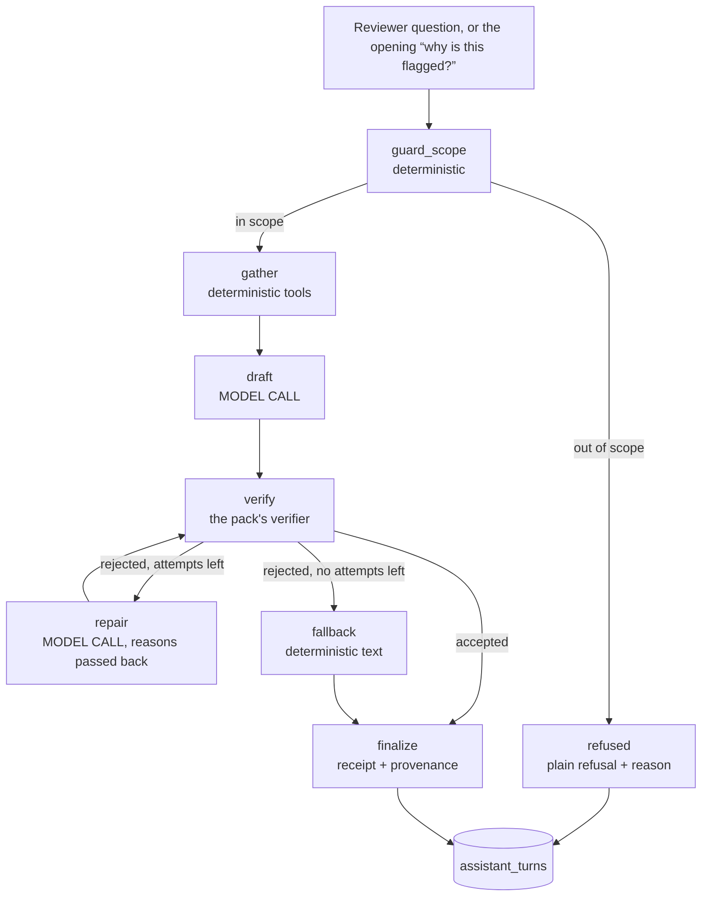
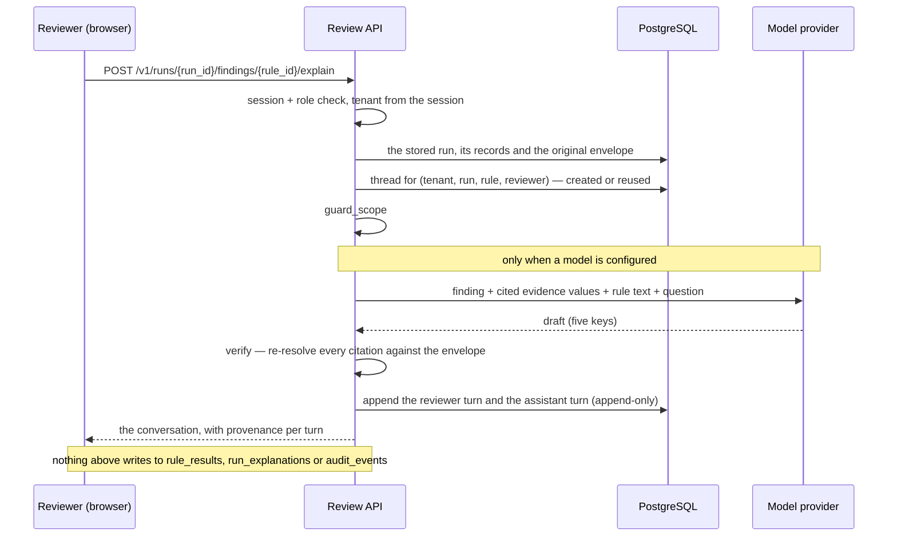

# 22 — The interactive assistant: architecture and data flow

**Status:** implemented 2026-10-01 · **code:** `claimguard/ai/` · **migration:** `0011` ·
**interface:** the finding card in the reviewer workspace

---

## 1. What it is, and what it is not

The deterministic engine answers *what* is wrong with a claim: one of five statuses per rule, with
evidence that points back into the submitted document. It does not answer *why this is a problem* or
*what do I do next*, beyond one fixed sentence per rule.

The assistant answers those, in conversation, beside the finding — and it is built so that the
conversation can never become a decision.

| The assistant **may** | The assistant **must never** |
|---|---|
| Explain a finding's rule, evidence and consequence in more depth than the fixed sentence | Change a status, a severity, an evidence pointer or a routing decision |
| Recommend what a reviewer should check or request from the provider | Approve, deny, price, pay or submit anything |
| Answer follow-up questions about *this* claim and *this* finding | Give clinical advice, a diagnosis, or a coverage determination |
| Refuse, plainly, when a question is outside that ground | Answer from anything except the run's own stored record |

Three structural facts keep that promise rather than trusting the prompt to:

1. **It reads; it does not write.** Every input — the finding, the evidence values, the rule's text —
   comes from the stored run through the same reads the API already serves. Nothing the model
   produces is written into `rule_results`, `run_explanations` or `audit_events`.
2. **Its output is verified, not trusted.** A draft must pass the *same* verifier the graded
   explanation layer uses (`claimguard/edu/explain/verifier.py`), which re-resolves every cited
   pointer against the original claim and rejects adjudication, clinical or injection-shaped text.
3. **It answers in a different table.** The conversation lives in `claimguard.assistant_turns`,
   keyed to the run, append-only. The frozen fifteen-key record is untouched by construction.

## 2. The shape of the answer

An assistant answer carries **the same five keys the pack's explanation contract uses** —
`explanation`, `correction_recommendation`, `cited_evidence_paths`, `cited_rule_ids`,
`needs_human_review`. One reviewer contract serves both surfaces: the text a run carries, and each
turn of the conversation. A reader who has understood one has understood the other, and the
verifier is shared rather than reimplemented.

## 3. The graph

The assistant is a LangGraph state machine, not a free-running agent: the path through it is fixed,
and only two nodes can call a model.

| Node | Model? | What it does |
|---|---|---|
| `guard_scope` | no | Refuses questions asking for a decision, clinical advice, or anything outside this claim. Runs *before* any model is reachable. |
| `gather` | no | The tool belt: the finding, the values its evidence points at, the rule's own text, the relevant policy limits. Read-only, total, no network. |
| `draft` | **yes** | The single drafting call, with a pinned system prompt and the gathered context. |
| `verify` | no | `validate_explanation(...)`: exact key set, every cited path re-resolved against the original claim, citations must belong to this finding, prohibited assertions, injection detection, echo guard. |
| `repair` | **yes** | One bounded re-draft that is *given the rejection reasons*. `MAX_REPAIR_ATTEMPTS = 1`: a model that cannot satisfy the verifier twice will not satisfy it on the fifth, and every extra attempt is another chance to be talked into something the guards exist to prevent. |
| `fallback` | no | The deterministic explanation, served with `verification='fallback'` and the reasons. The reviewer always gets an answer. |
| `finalize` | no | The SHA-256 receipt over the served answer, the latency, the model and prompt versions. |

## 4. Data flow

## 5. Data model

Migration `0011_assistant_threads.sql`, additive.

| Table | Grain | Notes |
|---|---|---|
| `claimguard.assistant_threads` | one conversation per (tenant, run, rule, reviewer) | Unique on that key, so a reviewer's conversation is theirs and never appears in another's; cascades from `rule_runs` |
| `claimguard.assistant_turns` | one turn | `seq` is unique per thread and replayable without trusting `created_at`; `UPDATE` is refused by trigger; `answer` is asserted to be a JSON object; `verification` is one of `accepted`/`repaired`/`fallback`/`refused`; `receipt` is the SHA-256 of the served answer |

A turn records **how** its answer was produced, not just what it said — the same discipline the
graded explanation layer applies in `run_explanations`. "A model wrote this and the verifier
accepted it" and "the deterministic text stood in" are different facts, and a reviewer, an auditor
and a grader all need to tell them apart.

## 6. HTTP surface

All routes require a signed clinic session; the tenant comes from the session, never the body.

| Method | Path | Purpose |
|---|---|---|
| `GET` | `/v1/ai/status` | Whether the assistant can answer, with what, and a truthful one-line detail |
| `POST` | `/v1/runs/{run_id}/findings/{rule_id}/explain` | Open (or reuse) the conversation and answer the first question |
| `POST` | `/v1/threads/{thread_id}/messages` | Ask a follow-up |
| `GET` | `/v1/threads/{thread_id}` | The whole conversation |

A thread that belongs to another reviewer or another tenant is a **404**, not a 403: the route does
not confirm that someone else's conversation exists. Exceeding the thread's turn limit is a 409.

## 7. Privacy and security

| Question | Answer |
|---|---|
| What leaves the machine? | Only when a model is enabled: the finding, **the values of the evidence it cites**, the rule's own text and the reviewer's question. Not the whole envelope, never credentials. With `CLAIMGUARD_AI_MODE=off` (the default) nothing leaves at all. |
| Where does the credential live? | Environment only — `.env`, gitignored, never committed, never logged, never in a prompt. `AssistantSettings.describe()` redacts. |
| What if the model misbehaves? | The verifier refuses the draft, the refusal is recorded with its reasons, and the deterministic explanation is served. The reviewer sees a labelled fallback, not a confident wrong answer. |
| Can the conversation change a claim's outcome? | No. It is a separate, append-only table; the decision path does not read it. |
| Can a reviewer see another reviewer's conversation? | No — the thread key includes the reviewer, and every read is tenant- and owner-scoped. |
| Is the conversation auditable after the fact? | Yes: append-only turns, each with the model version, prompt version, verification outcome, reasons and receipt. |

**The honest limit.** While a cloud model is enabled, the evidence values cited by a finding *do*
leave the machine. That is a deliberate, temporary deployment choice: the product is designed for a
self-hosted or fine-tuned model, and the mode switch is what makes that a configuration change
rather than a rewrite. `CLAIMGUARD_AI_MODE=off` is the default precisely so that a deployment which
has not made that choice does not make it by accident.

## 8. Configuration

| Variable | Values | Default |
|---|---|---|
| `CLAIMGUARD_AI_MODE` | `off` · `groq` · `openai_compatible` | `off` |
| `CLAIMGUARD_AI_MODEL` | any chat model the endpoint serves | none |
| `CLAIMGUARD_AI_BASE_URL` | endpoint root | Groq's, in `groq` mode |
| `CLAIMGUARD_AI_API_KEY` | secret | none |
| `CLAIMGUARD_AI_TIMEOUT` | seconds | 30 |
| `CLAIMGUARD_AI_MAX_TOKENS` | integer | 700 |

The graph, the tools, the verifier and the persistence are identical in every mode. `off` is not a
degraded path: it is the same pipeline with the drafting node replaced by the deterministic
explanation, and every turn says which one produced its answer.

## 9. Why this is agentic, and why it is bounded

The word "agentic" is worth being precise about, because a free-running agent is the wrong shape for
a document that must be explainable to a payer.

The assistant **is** a graph with tools and a decision at every step: it chooses whether a question
is in scope, gathers the evidence it needs from the stored run, drafts, and then acts on the
verifier's verdict — repairing once with the reasons, or falling back. The control flow is explicit,
inspectable and testable, and the model participates in exactly two of its nodes.

It is **not** a loop that lets a model choose its own tools and keep going until it feels finished.
For a pre-submission quality gate the failure mode of that design is a confident, unverifiable
answer, and the whole product exists to make that impossible. Bounded autonomy is the feature: the
agent decides how to explain, never what is true.
