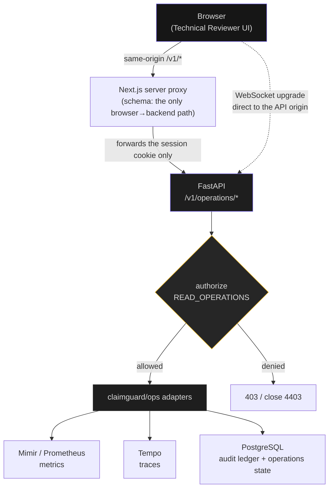
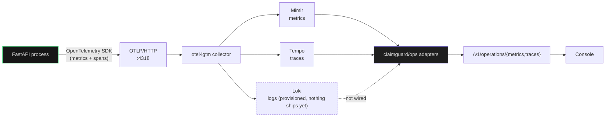
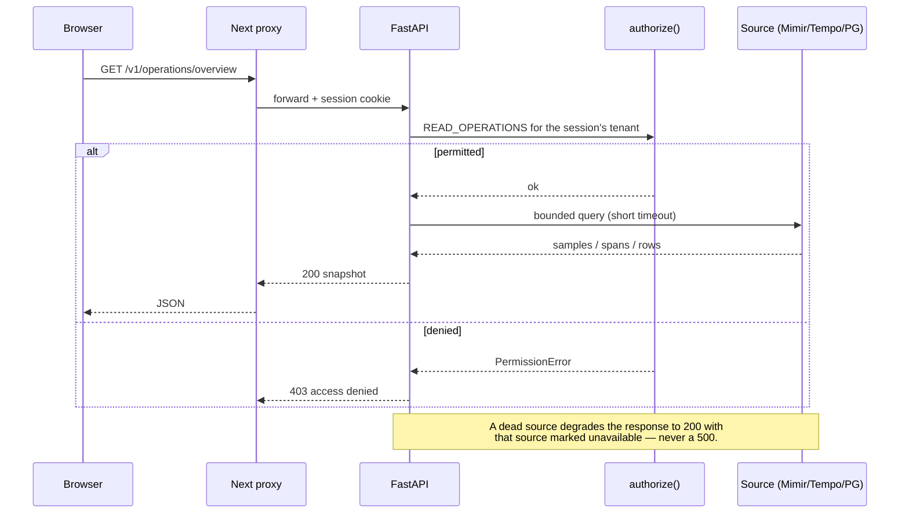
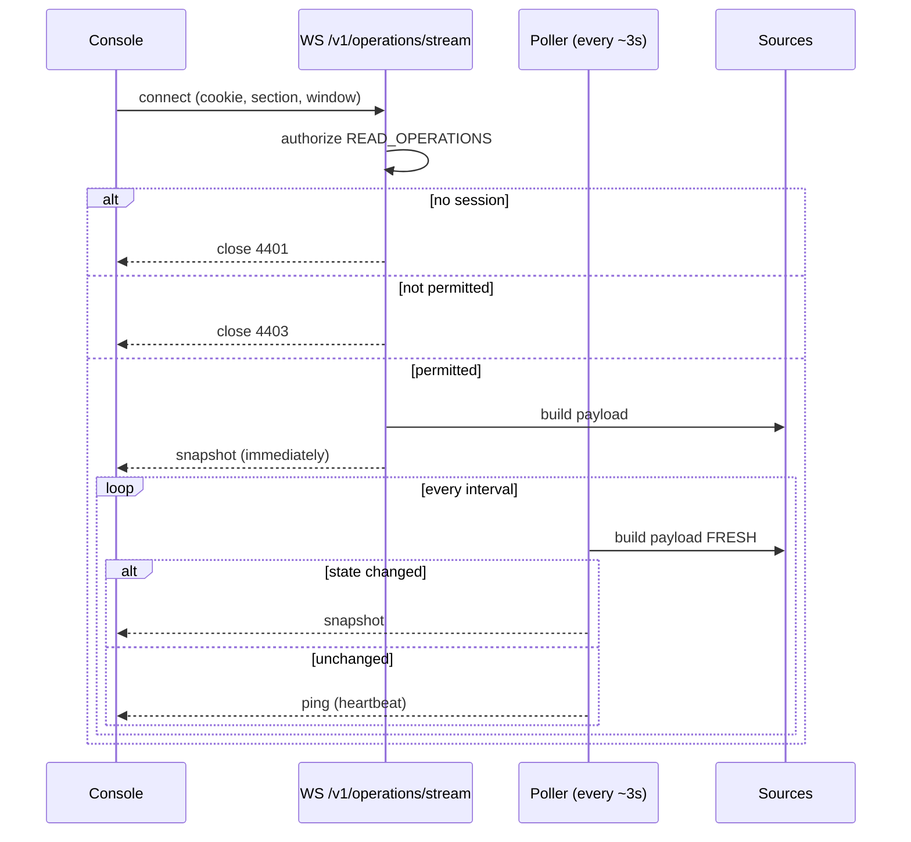
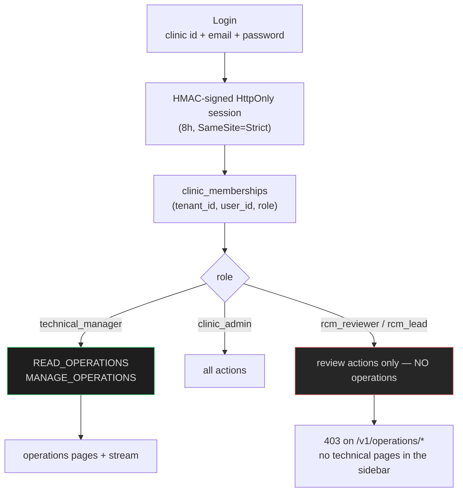
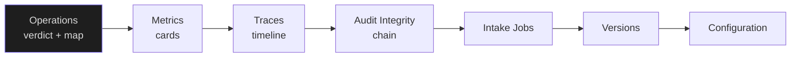

# ClaimGuard — Operations (Stream D) explainer

> **What this is.** A plain-language report of the technical-reviewer observability
> work: what was built, why each piece exists, how the tools connect, what is
> genuinely live, and what is **not** built.
>
> **Status.** Stream D, phases P0–P2 plus real-time. Branch `ops-p2-test`.
> Diagrams use Mermaid and render on GitHub.

---

## 1. The problem this solves

ClaimGuard is a **pre-submission quality gate** for synthetic insurance claims. It
sits between claim authoring and payer submission, finds the administrative
defects a payer would reject on, cites the exact rule and evidence, and routes
uncertain cases to a human.

Two constraints shape everything in this document:

1. **Review, not adjudicate.** The product never approves, denies or advises. So
   the observability surface reports *system* state, never a claim judgement.
2. **The technical reviewer is claim-blind.** They keep the platform running
   without ever seeing claim or patient data — and they must be able to do that
   **without opening Grafana, Prometheus or Tempo**.

The whole design follows from that second constraint: the tools are engines
behind our API, never a screen the reviewer has to learn.

---

## 2. Capability map — what exists today

Seven pages in the technical-manager workspace, all on the dark surface:

| Page | What the reviewer gets | Where the data comes from |
|---|---|---|
| **Operations** | platform verdict, component health, telemetry-source freshness, version markers | `/v1/health` probes + Prometheus/Tempo reachability |
| **Metrics** | HTTP throughput, error mix, latency — expandable cards | Prometheus (Mimir) via the backend |
| **Traces** | recent requests with durations, against a "typical" baseline | Tempo via the backend |
| **Audit Integrity** | hash-chain verification status + event count | PostgreSQL audit ledger |
| **Intake Jobs** | intake job counts by status | PostgreSQL |
| **Versions** | active rule / model / provider versions | PostgreSQL |
| **Configuration** | tenant-scoped intake toggle — audited | PostgreSQL |

---

## 3. Architecture — who talks to whom

The single most important rule: **the browser only ever calls our backend.**



Two deliberate exceptions to "same-origin", both documented:

- The **WebSocket** connects directly to the API origin, because a Next HTTP route
  handler cannot carry a WebSocket *upgrade*. On localhost this is same-site, so
  the `SameSite=Strict` cookie is still sent. A real deployment needs a reverse
  proxy that upgrades.
- **Grafana** is never referenced by the browser at all. It exists as an
  operator-side tool only.

---

## 4. The telemetry pipeline — how data gets in

The console does not manufacture anything. The application emits telemetry, the
collector stores it, and the backend queries it back out.



The application's own HTTP layer is instrumented, so every request the API serves
becomes both a metric counter and a span — which is why the counts you see are
your real traffic.

---

## 5. Request flow — a single REST call



**Fail-open vs fail-closed** is deliberate and consistent:

| Case | Behaviour | Why |
|---|---|---|
| Telemetry source unreachable | `200`, source marked `unavailable` | Observability must never break the product |
| Caller lacks the operations permission | `403`, no data | Authorization must never fail open |
| Audit chain cannot be verified | `intact: false` | A safety check must never claim unverified success |

---

## 6. Real-time flow — how the console updates by itself

The console subscribes once and receives snapshots **only when the data actually
changes**, plus a heartbeat.



Three decisions worth knowing:

- **Fresh build, not the cache.** The stream used to read through the REST cache
  (5 s TTL) while polling every 3 s, which delayed and sometimes masked changes.
  Change detection now always sees current data.
- **Per-build metadata is excluded from the fingerprint.** `checked_at` is stamped
  on every build; including it made every poll look like a change.
- **The first paint does not depend on the socket.** The page paints from one REST
  fetch whose lifetime is independent of the socket, then the socket takes over.
  (A page opened directly on Metrics/Traces/Audit used to stay blank until a manual
  Refresh — see §11.)

---

## 7. The tools, and why each one

| Tool | Role in this system | Why it is used |
|---|---|---|
| **OpenTelemetry SDK** | emits metrics and spans from the app | vendor-neutral instrumentation; no lock-in |
| **OTLP** | the transport for that telemetry | one protocol for metrics, logs and traces |
| **otel-lgtm** | local collector + Grafana/Loki/Mimir/Tempo in one container | a complete dev backend with no infrastructure to build |
| **Mimir / Prometheus** | stores the metrics the console reads | the standard time-series store; queried only by the backend |
| **Tempo** | stores the traces | trace storage that pairs with OTLP |
| **Loki** | provisioned for logs | present, but **nothing ships logs to it yet** |
| **Grafana** | operator-side exploration only | never a reviewer surface |
| **PostgreSQL** | business audit ledger + operations state | the audit chain is the authoritative record |
| **FastAPI** | the one authorized gateway | every telemetry query is authenticated and bounded here |
| **Next.js proxy** | browser → backend, same origin | no telemetry URL or credential ever reaches the browser |

---

## 8. Security and tenancy



- **Tenant comes from the session, never from a query parameter.**
- **The role is resolved server-side on every request**, so revoking a membership
  takes effect immediately.
- **UI visibility is never authorization.** The pages are hidden from a reviewer
  *and* the endpoints refuse them — verified.
- **The role model already existed** in the platform (`Role.TECHNICAL_MANAGER` with
  exactly `READ_OPERATIONS`/`MANAGE_OPERATIONS`); the observability work plugged
  into it rather than inventing a parallel model.

---

## 9. What the reviewer sees (information architecture)



**Reading a trace row.** Traces are the least self-explanatory signal, so the page
does the explaining rather than assuming the reader knows how to read a timeline:

- one muted line states what a row *is*;
- a summary strip gives the request count, the **slowest** duration and the
  **typical (median)** duration, so "slow" has a reference instead of being
  context-free — the median is computed from the returned durations;
- each row carries a plain-language title derived from a **display mapping of a
  known route** (`GET /v1/health` → "Health check", `POST /v1/claims` → "Claim
  submitted"); the **raw route and service are still shown beneath it**, so the
  mapping adds legibility without hiding anything;
- the bar is scaled against the slowest trace in the current view, with a scale
  marker and the slowest row flagged, so bar length is interpretable.

Design principles carried through every page:

- **One page, one question.** Operations = "is it healthy?"; Metrics = "what is the
  load?"; Traces = "what happened and how long did it take?"; Audit = "is the
  record trustworthy?"
- **Explicit states, never silence.** `healthy` / `degraded` / `stale` / `unknown` /
  `unavailable` / `loading` / `empty` / `permission denied`. **`stale` is visually
  distinct from `unavailable`** — a safety property, not styling.
- **No filler text.** Where the API has no detail, the UI renders nothing rather
  than "No detail provided."
- **Motion explains change.** Values count up; bars animate through `transform`;
  entrance animation runs **once per item**, never on every live update.

---

## 10. Honest status — what is real, what is not

**Real (live telemetry from the running system):**
metrics, traces, health, source freshness, audit chain, intake jobs, versions,
configuration — all read from the running stack.

**Synthetic by design:** the *claims themselves*. The challenge forbids real
patient data, so the entities the telemetry describes are synthetic. The
telemetry about them is genuine.

**Not built (deliberately, and not claimed anywhere):**

| Missing | Reason |
|---|---|
| Log viewer | logs are not shipped to Loki yet; a page would be empty |
| Alerts / incidents | phase P3 |
| SLOs, error budgets | need agreed targets first |
| Per-tenant filtering of ops data | waits on the tenant model |
| Autonomous remediation | out of scope by decision |

**Privacy rules enforced by construction:** no PII/PHI in telemetry; an allow-list
of metric labels (`service`, `component`, `route_template`, `method`,
`status_class`, `queue_job_category`, `integration_category`); identifiers
(`claim_id`, `run_id`, `tenant_id`, user ids) are rejected as metric labels;
correlation ids may appear in logs/traces but never as labels.

**One architectural caveat, stated rather than hidden:** the WebSocket connects to
the API origin directly, because a Next HTTP proxy route cannot upgrade. Fine on
localhost (same-site), but a real deployment needs a reverse proxy that upgrades -
or SSE if everything must stay strictly same-origin.

---

## 11. Defects found and fixed (why the visual checks mattered)

Four bugs passed every automated test and were only caught by looking at the
running system:

| Symptom | Root cause | Fix |
|---|---|---|
| Console never went live in a browser | the default WS URL hardcoded `127.0.0.1` while the page is served from `localhost`; browsers do not share cookies between those hosts, so the handshake was unauthenticated (closed 4401) | derive the host from `window.location.hostname` |
| Changes took up to ~8s to appear | the stream fingerprinted **cached** data (5s TTL) while polling every 3s | build each probe fresh |
| A quiet stream still pushed every 3s | `checked_at` is stamped per build, so every payload differed | exclude per-build metadata from the fingerprint |
| Metrics/Traces/Audit showed nothing until **Refresh** | the socket flipping to `live` aborted the in-flight first fetch, and the first snapshot for a non-overview section was discarded | give the first paint a lifetime independent of the socket |

Two more were caught by a class-coverage check the tests could not see:

- **Trace bars rendered uniformly** — the positioned bar had no geometry of its own.
- **Series label chips rendered unstyled** — the JSX named
  `ops-signal-series-label*` while the CSS only defined `ops-metric-series-*`.

**Lesson recorded:** a passing test suite says nothing about whether a page is
readable. The screenshot review caught what 60+ tests could not.

---

## 12. Verification at the time of writing

| Gate | Result |
|---|---|
| Backend suite | **846 passed**, 46 skipped |
| Frontend suite | **62 passed** |
| ruff · ruff format · pyright | clean · clean · 0 errors (1 pre-existing warning) |
| Live WS: unauthenticated | closed **4401** |
| Live WS: reviewer | closed **4403** |
| Live WS: technical manager | immediate snapshot, correct section |
| Live WS: real change | pushed to an **open** socket in **1.8s** |
| Live WS: idle | **no** snapshots while nothing changed |
| Role isolation | reviewer gets **403** on `/v1/operations/*` |

---

## 13. Running it

```bash
# stack
docker compose up -d --build

# gates
uv run pytest -m "not llm and not e2e" -q      # 846 passed
cd frontend && npm run lint && npm run typecheck && npm test

# sign in as the technical manager and open Operations
#   http://localhost:3001  →  technical.local@claimguard.test
```

If the UI ever looks stale, force the browser to reload the bundle first:
**DevTools → Application → Clear site data**, then **Ctrl+Shift+R**. Cached
JavaScript, not the server, was the cause of one confusing report during this work.

---

## 14. What is next

1. **Logs** — ship structured, redacted logs to Loki, then add the log viewer.
2. **Alerts and incidents** — thresholds measured from a real baseline, an in-app
   inbox, and acknowledge/assign/comment/resolve recorded in the audit chain.
3. **Per-tenant operations** — once the tenant model lands, the same endpoints
   become tenant-filtered without a contract change.
4. **Reverse proxy** for the WebSocket upgrade in a real deployment.
5. **Visual regression** — Playwright is not installed, so the visual check is
   still human-driven; adding it would make these four bug classes catchable
   automatically.
