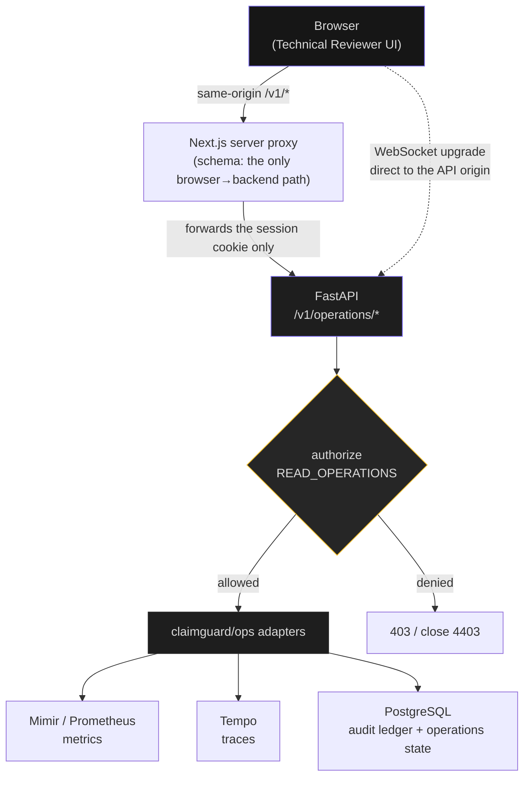
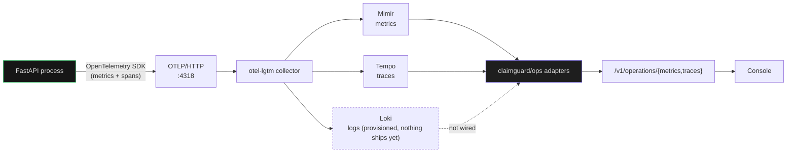
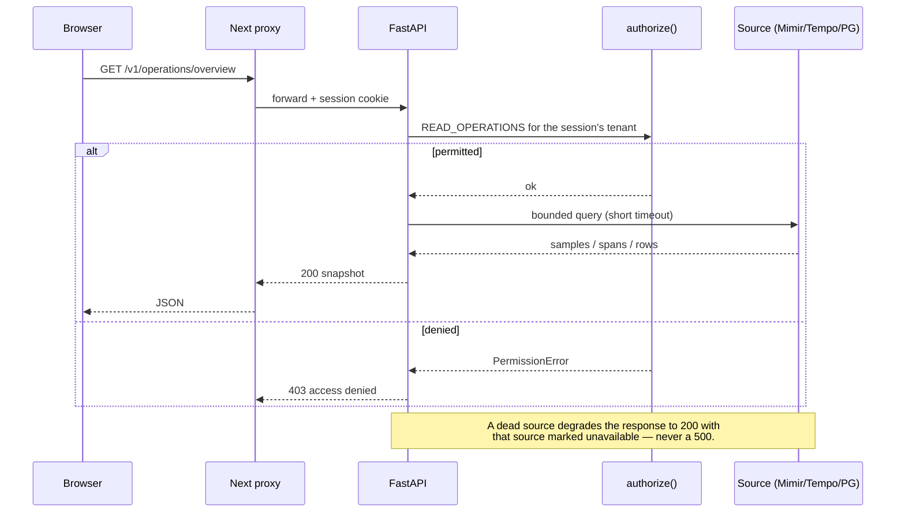
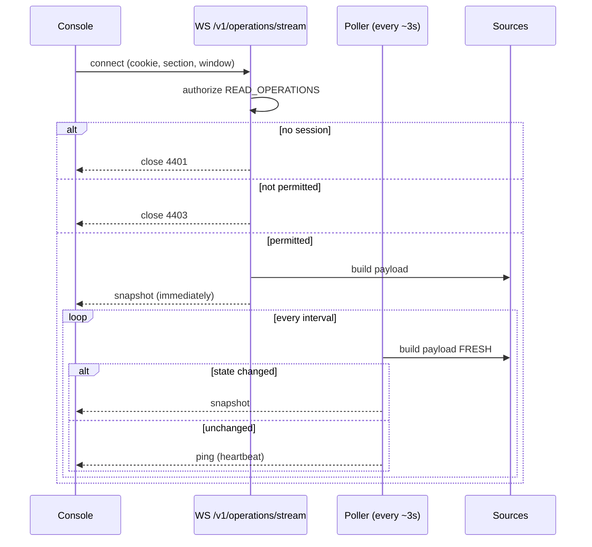
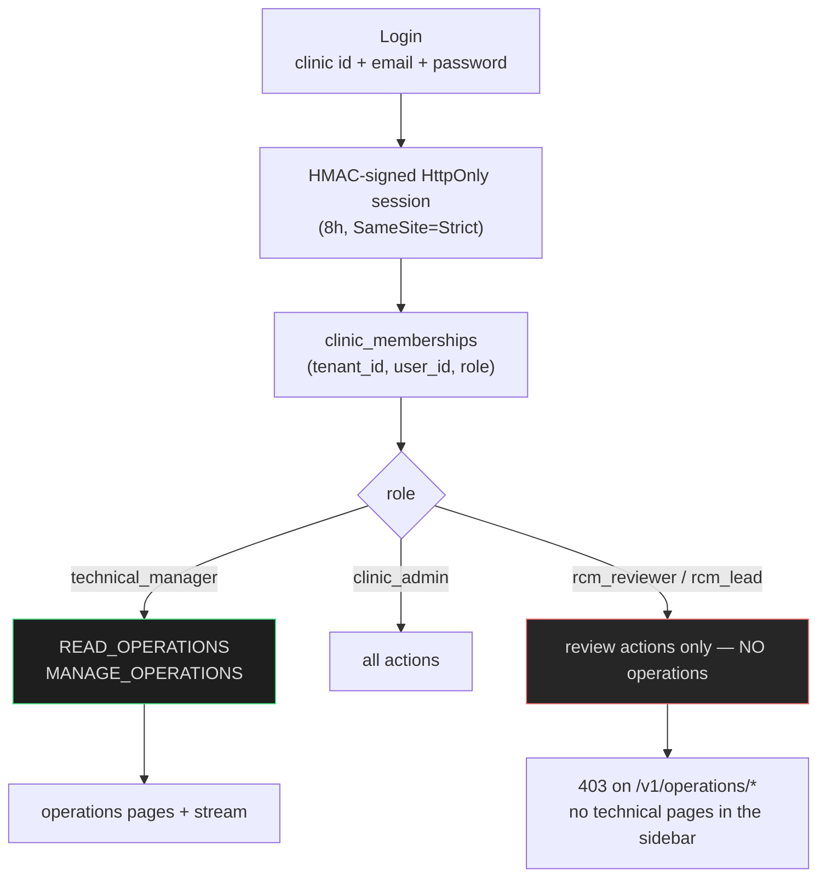
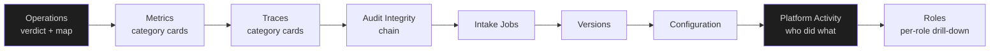
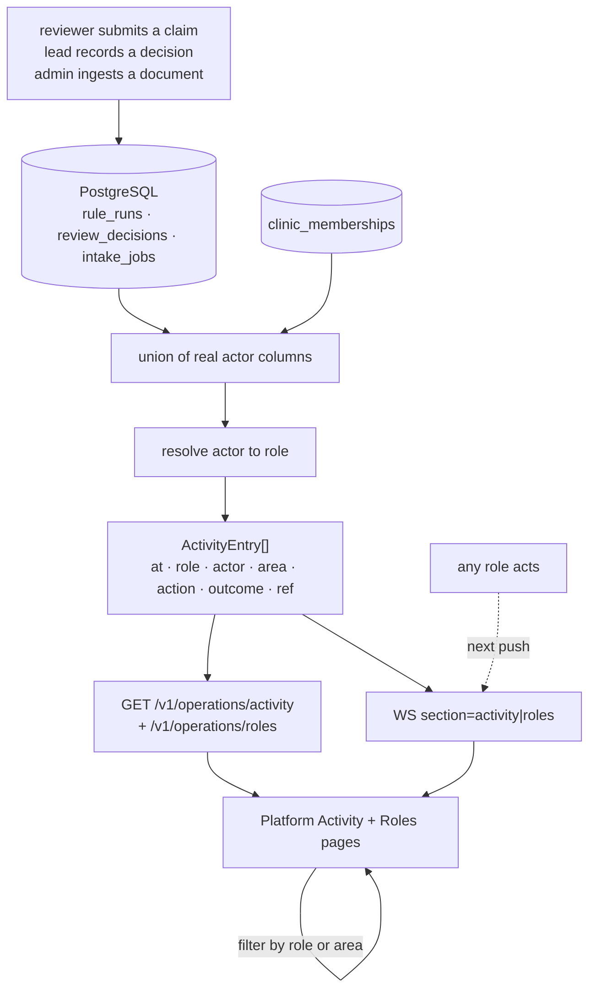

# ClaimGuard — Operations (Stream D) explainer

> **What this is.** A plain-language report of the technical-reviewer observability
> work: what was built, why each piece exists, how the tools connect, what is
> genuinely live, and what is **not** built.
>
> **Status.** Stream D, phases P0–P2 plus real-time. Branch `ops-p2-test`.
> Diagrams use Mermaid and render on GitHub.

---

## 1. The problem this solves

ClaimGuard is a **pre-submission quality gate** for synthetic insurance claims. It
sits between claim authoring and payer submission, finds the administrative
defects a payer would reject on, cites the exact rule and evidence, and routes
uncertain cases to a human.

Two constraints shape everything in this document:

1. **Review, not adjudicate.** The product never approves, denies or advises. So
   the observability surface reports *system* state, never a claim judgement.
2. **The technical reviewer is claim-blind.** They keep the platform running
   without ever seeing claim or patient data — and they must be able to do that
   **without opening Grafana, Prometheus or Tempo**.

The whole design follows from that second constraint: the tools are engines
behind our API, never a screen the reviewer has to learn.

---

## 2. Capability map — what exists today

Nine pages in the technical-manager workspace, all on the dark surface:

| Page | What the reviewer gets | Where the data comes from |
|---|---|---|
| **Operations** | platform verdict, component health, telemetry-source freshness, version markers | `/v1/health` probes + Prometheus/Tempo reachability |
| **Metrics** | metrics grouped into categories, each explained in words before its values | Prometheus (Mimir) via the backend |
| **Traces** | requests grouped into categories, each explained, then drilled into | Tempo via the backend |
| **Audit Integrity** | hash-chain verification status + event count | PostgreSQL audit ledger |
| **Intake Jobs** | intake job counts by status | PostgreSQL |
| **Versions** | active rule / model / provider versions | PostgreSQL |
| **Configuration** | tenant-scoped intake toggle — audited | PostgreSQL |
| **Platform Activity** | who did what, in which area, with what outcome — filterable, live | PostgreSQL (real actor columns) |
| **Roles** | every role, its members, its recent activity, its areas — drillable | PostgreSQL (memberships + activity) |

---

## 3. Architecture — who talks to whom

The single most important rule: **the browser only ever calls our backend.**



Two deliberate exceptions to "same-origin", both documented:

- The **WebSocket** connects directly to the API origin, because a Next HTTP route
  handler cannot carry a WebSocket *upgrade*. On localhost this is same-site, so
  the `SameSite=Strict` cookie is still sent. A real deployment needs a reverse
  proxy that upgrades.
- **Grafana** is never referenced by the browser at all. It exists as an
  operator-side tool only.

---

## 4. The telemetry pipeline — how data gets in

The console does not manufacture anything. The application emits telemetry, the
collector stores it, and the backend queries it back out.



The application's own HTTP layer is instrumented, so every request the API serves
becomes both a metric counter and a span — which is why the counts you see are
your real traffic.

---

## 5. Request flow — a single REST call



**Fail-open vs fail-closed** is deliberate and consistent:

| Case | Behaviour | Why |
|---|---|---|
| Telemetry source unreachable | `200`, source marked `unavailable` | Observability must never break the product |
| Caller lacks the operations permission | `403`, no data | Authorization must never fail open |
| Audit chain cannot be verified | `intact: false` | A safety check must never claim unverified success |

---

## 6. Real-time flow — how the console updates by itself

The console subscribes once and receives snapshots **only when the data actually
changes**, plus a heartbeat.



Three decisions worth knowing:

- **Fresh build, not the cache.** The stream used to read through the REST cache
  (5 s TTL) while polling every 3 s, which delayed and sometimes masked changes.
  Change detection now always sees current data.
- **Per-build metadata is excluded from the fingerprint.** `checked_at` is stamped
  on every build; including it made every poll look like a change.
- **The first paint does not depend on the socket.** The page paints from one REST
  fetch whose lifetime is independent of the socket, then the socket takes over.
  (A page opened directly on Metrics/Traces/Audit used to stay blank until a manual
  Refresh — see §11.)

---

## 7. The tools, and why each one

| Tool | Role in this system | Why it is used |
|---|---|---|
| **OpenTelemetry SDK** | emits metrics and spans from the app | vendor-neutral instrumentation; no lock-in |
| **OTLP** | the transport for that telemetry | one protocol for metrics, logs and traces |
| **otel-lgtm** | local collector + Grafana/Loki/Mimir/Tempo in one container | a complete dev backend with no infrastructure to build |
| **Mimir / Prometheus** | stores the metrics the console reads | the standard time-series store; queried only by the backend |
| **Tempo** | stores the traces | trace storage that pairs with OTLP |
| **Loki** | provisioned for logs | present, but **nothing ships logs to it yet** |
| **Grafana** | operator-side exploration only | never a reviewer surface |
| **PostgreSQL** | business audit ledger + operations state | the audit chain is the authoritative record |
| **FastAPI** | the one authorized gateway | every telemetry query is authenticated and bounded here |
| **Next.js proxy** | browser → backend, same origin | no telemetry URL or credential ever reaches the browser |

---

## 8. Security and tenancy



- **Tenant comes from the session, never from a query parameter.**
- **The role is resolved server-side on every request**, so revoking a membership
  takes effect immediately.
- **UI visibility is never authorization.** The pages are hidden from a reviewer
  *and* the endpoints refuse them — verified.
- **The role model already existed** in the platform (`Role.TECHNICAL_MANAGER` with
  exactly `READ_OPERATIONS`/`MANAGE_OPERATIONS`); the observability work plugged
  into it rather than inventing a parallel model.

---

## 9. What the reviewer sees (information architecture)



**The first seven pages answer "is the platform healthy?" The last two answer "what
have people done in it?"** Health is necessary but not sufficient: a reviewer who can
see green components and still cannot tell whether the lead reviewed anything, or
whether intake is being used at all, is flying on instruments alone. Activity and
Roles close that gap — see §15.

**Why Activity is a page and not a chart.** The question "what happened?" is answered
by a list of attributable acts, not an aggregate: an aggregate would say *twelve
claims were submitted* and hide *by whom, in what order, with what outcome*. So the
feed keeps the act as the unit of display, with the actor, role, area, outcome and
time all visible — and it is filterable **by role and by area**, so the same feed
answers both "what did the lead do?" and "what happened to intake?".

**Reading a trace — by category, not by row.** Traces are the least self-explanatory
signal, and an undifferentiated list of them makes it worse: too many rows, and nothing
saying what a request *was*. So the page now **groups before it lists**:

- the default view is **one card per category** — claim submission, claim queries,
  review decisions, intake, authentication, operations & health, and an explicit
  "other". Categories are derived from the **real route paths**, never invented; a
  request that fits nowhere lands in "other" rather than being forced into a bin;
- every card states **what that category is** in plain language, and carries the big
  picture: volume, **typical (median)** duration and slowest duration, so "slow" has a
  reference instead of being context-free — the median is computed from the returned
  durations;
- opening a category shows only its traces, each carrying a plain-language title
  derived from a **display mapping of a known route** (`GET /v1/health` → "Health
  check", `POST /v1/claims` → "Claim submitted"); the **raw route and service are
  still shown beneath it**, so the mapping adds legibility without hiding anything;
- a category with no traffic is shown as **empty rather than hidden** — an absent
  category and a silent category are different facts;
- within a category the bar is scaled against the slowest trace in that view, with a
  scale marker and the slowest row flagged, so bar length stays interpretable.

**Metrics work the same way, for the same reason.** The complaint was numbers without
meaning, so metrics are grouped into categories derived from the **real metric names**
— HTTP behaviour, runtime health, queue and workers, database, other — and each card
says what the category measures and what to take from it *before* showing any value.

Design principles carried through every page:

- **One page, one question.** Operations = "is it healthy?"; Metrics = "what is the
  load?"; Traces = "what happened and how long did it take?"; Audit = "is the
  record trustworthy?"
- **Explicit states, never silence.** `healthy` / `degraded` / `stale` / `unknown` /
  `unavailable` / `loading` / `empty` / `permission denied`. **`stale` is visually
  distinct from `unavailable`** — a safety property, not styling.
- **No filler text.** Where the API has no detail, the UI renders nothing rather
  than "No detail provided."
- **Motion explains change.** Values count up; bars animate through `transform`;
  entrance animation runs **once per item**, never on every live update.

---

## 10. Honest status — what is real, what is not

**Real (live telemetry from the running system):**
metrics, traces, health, source freshness, audit chain, intake jobs, versions,
configuration — all read from the running stack.

**Synthetic by design:** the *claims themselves*. The challenge forbids real
patient data, so the entities the telemetry describes are synthetic. The
telemetry about them is genuine.

**Not built (deliberately, and not claimed anywhere):**

| Missing | Reason |
|---|---|
| Log viewer | logs are not shipped to Loki yet; a page would be empty |
| Alerts / incidents | phase P3 |
| SLOs, error budgets | need agreed targets first |
| Per-tenant filtering of ops data | waits on the tenant model |
| Autonomous remediation | out of scope by decision |

**Privacy rules enforced by construction:** no PII/PHI in telemetry; an allow-list
of metric labels (`service`, `component`, `route_template`, `method`,
`status_class`, `queue_job_category`, `integration_category`); identifiers
(`claim_id`, `run_id`, `tenant_id`, user ids) are rejected as metric labels;
correlation ids may appear in logs/traces but never as labels.

**One architectural caveat, stated rather than hidden:** the WebSocket connects to
the API origin directly, because a Next HTTP proxy route cannot upgrade. Fine on
localhost (same-site), but a real deployment needs a reverse proxy that upgrades -
or SSE if everything must stay strictly same-origin.

**Two gaps in the activity/trace work, also stated rather than hidden:**

1. **The business `trace_id` and the OpenTelemetry trace id are not unified.** A run
   carries its own 32-hex `trace_id` in `rule_runs` (the business correlation id the
   audit ledger is built on), and the OTel spans carry a *different* id minted by the
   SDK. Verified directly: fetching Tempo with the business id returns **0 spans**.
   The run is therefore traceable in the ledger and traceable in Tempo, but the two
   cannot yet be joined by a single id — you cannot click a run and land on its trace.
   This is a real limitation, not a display bug, and it is the top item in §14.
2. **`audit_events` contributes nothing to the activity feed** (see §15, "Why
   `audit_events` is excluded"). The audit ledger is the tamper-evident record; the
   activity feed is the *attributable* record. They are different questions, and only
   the second has an actor column today.

---

## 11. Defects found and fixed (why the visual checks mattered)

Four bugs passed every automated test and were only caught by looking at the
running system:

| Symptom | Root cause | Fix |
|---|---|---|
| Console never went live in a browser | the default WS URL hardcoded `127.0.0.1` while the page is served from `localhost`; browsers do not share cookies between those hosts, so the handshake was unauthenticated (closed 4401) | derive the host from `window.location.hostname` |
| Changes took up to ~8s to appear | the stream fingerprinted **cached** data (5s TTL) while polling every 3s | build each probe fresh |
| A quiet stream still pushed every 3s | `checked_at` is stamped per build, so every payload differed | exclude per-build metadata from the fingerprint |
| Metrics/Traces/Audit showed nothing until **Refresh** | the socket flipping to `live` aborted the in-flight first fetch, and the first snapshot for a non-overview section was discarded | give the first paint a lifetime independent of the socket |

Two more were caught by a class-coverage check the tests could not see:

- **Trace bars rendered uniformly** — the positioned bar had no geometry of its own.
- **Series label chips rendered unstyled** — the JSX named
  `ops-signal-series-label*` while the CSS only defined `ops-metric-series-*`.

**The worst defect was not a visual one — it was a type that lied.** Platform Activity
rendered a blank framework error page ("This page couldn't load") on a white background,
inside a dark console. The chain:

- the activity endpoint returns `source` as an **object** — `{state, last_data_at, detail}`;
- the client declared `OpsActivityResponse.source` as a **`string`** and rendered it
  directly as a React child, so React threw
  `error #31 — objects are not valid as a React child` and the page died behind the
  error boundary;
- the test fixture mocked `source: "operations"` — **agreeing with the wrong type** — so
  every test passed while the page was dead, and `tsc` had nothing to object to.

It was found by capturing the running page's real exception over the browser's debugging
protocol, not by reading the code: reading the code is what missed it the first time. The
fix was to make the type tell the truth (`OpsSourceStatus`), render a `StateBadge` from
`source.state` as the sibling pages already did, and change the fixture to the real wire
shape — because a fixture that encodes the bug is worse than no fixture.

**A second defect sat underneath the first.** The operator page's id collided with the
clinic's own `activity` page, so both components mounted and the clinic page — which this
role is not permitted to read (`403`) — took the page down before the type error could
even be reached. Renaming the operator destination to `platform-activity` fixed that
layer, and the type fix was still required afterwards. Two independent faults, one
symptom: fixing only the first left the page just as dead.

**Lesson recorded:** a passing test suite says nothing about whether a page is readable,
and a **lying type guarantees the tests will agree with the bug**. When a page dies,
capture what the browser actually reports before reading the source — and check whether
there is a second fault behind the first.

---

## 12. Verification at the time of writing

| Gate | Result |
|---|---|
| Backend suite | **875 passed**, 46 skipped |
| Frontend suite | **69 passed** |
| ruff · ruff format · pyright | clean · clean · 0 errors (1 pre-existing warning) |
| Live WS: unauthenticated | closed **4401** |
| Live WS: reviewer | closed **4403** |
| Live WS: technical manager | immediate snapshot, correct section |
| Live WS: real change | pushed to an **open** socket in **1.8s** |
| Live WS: idle | **no** snapshots while nothing changed |
| Role isolation | reviewer gets **403** on `/v1/operations/*` |
| Activity: all three roles | reviewer, lead and admin each acted live; all three appear, attributed `rcm_reviewer` / `rcm_lead` / `clinic_admin` |
| Activity: all three areas | `claim_submission`, `review_decision` and `intake` all represented |
| Activity: confidentiality | no claim content in the payload (asserted) |
| Trace depth | a real submission produced one trace carrying `claim.submit` → `claim.evaluate` → `claim.explain` → `claim.persist` → `claim.audit` plus SQLAlchemy DB spans |
| Trace id unification | **not unified** — business `trace_id` returns 0 spans in Tempo |
| Decision authorisation | a decision with an `actor` that is not the signed-in user id is rejected **403** (correct: the API forbids impersonation) |


---

## 13. Running it

```bash
# stack
docker compose up -d --build

# gates
uv run pytest -m "not llm and not e2e" -q      # 875 passed
cd frontend && npm run lint && npm run typecheck && npm test

# sign in as the technical manager and open Operations
#   http://localhost:3001  →  technical.local@claimguard.test
```

If the UI ever looks stale, force the browser to reload the bundle first:
**DevTools → Application → Clear site data**, then **Ctrl+Shift+R**. Cached
JavaScript, not the server, was the cause of one confusing report during this work.

---

## 14. What is next

1. **Unify the trace ids** — mint the run's business `trace_id` *as* the OpenTelemetry
   trace id, so a run in the audit ledger and a trace in Tempo are the same object.
   This is the one gap that stops the UI from offering "run → its trace".
2. **Logs** — ship structured, redacted logs to Loki, then add the log viewer.
3. **Alerts and incidents** — thresholds measured from a real baseline, an in-app
   inbox, and acknowledge/assign/comment/resolve recorded in the audit chain.
4. **Per-tenant operations** — once the tenant model lands, the same endpoints
   become tenant-filtered without a contract change.
5. **Reverse proxy** for the WebSocket upgrade in a real deployment.
6. **Visual regression** — Playwright is not installed, so the visual check is
   still human-driven; adding it would make these four bug classes catchable
   automatically.

---

## 15. Platform-wide activity and roles (added after the first review)

### 15.1 The gap this closes

The first seven pages answer **"is the platform healthy?"** They can all be green
while nobody can answer **"what has anyone actually done?"** — whether the lead
reviewed the queue, whether intake is used at all, which role is idle. Health
without activity is a dashboard that cannot tell working from unused.

The requirement was explicit: *the technical manager must be able to see what
happened in every role, and fix problems from the UI.* So the work had two halves:
make every role's actions **recorded and attributable**, then make them **visible**.

### 15.2 Where activity comes from, and why

Activity is read from **PostgreSQL, from real actor columns that already exist** —
not derived, not inferred, not synthesised:

| Area | Table | Actor column |
|---|---|---|
| `claim_submission` | `rule_runs` | `initiated_by` |
| `review_decision` | `review_decisions` | `actor` |
| `intake` | `intake_jobs` | `submitted_by` |

Each actor is then resolved to a **role** through `clinic_memberships`, so the feed
can say *"rcm_lead recorded a decision"* rather than showing a bare id.

**Why `audit_events` is excluded** — and this matters for the honesty of the whole
page. The audit ledger is the tamper-evident record of what the *system* did, and it
has **no actor column**. The activity feed is the record of what *people* did. They
answer different questions. Deriving "who" from the audit ledger would mean inventing
an attribution that the ledger does not contain, so the feed simply does not use it.
The audit ledger keeps its own page and its own job.

**Why the tenant comes from the session.** `/v1/operations/activity` takes the tenant
from the authenticated principal, never from a query parameter. A reviewer cannot ask
for another tenant's activity by editing a URL — the same claim-blindness rule that
governs the rest of the operations surface.

**Limits are bounded** at both ends (`limit`, `window_days`), and the query runs with
a statement timeout, so a large tenant cannot turn the feed into a table scan. A
database fault returns an honest `degraded` 200 rather than a 500: the page says it
could not read, instead of pretending there was nothing to read.

### 15.3 How the feed flows



The same payload feeds both the initial fetch and the live socket, so the page does
not have two sources of truth: what you load is what updates.

### 15.4 Trace depth — the other half

Traces existed but were **shallow**: they showed the request and its duration, and
nothing about what happened *inside* the request. A trace that says `POST /v1/claims`
took 400ms does not tell a reviewer whether the time went into the rule engine, the
database, or the explanation step.

The submit and recheck paths now emit named spans for each stage, and SQLAlchemy
instrumentation is applied so database work appears as child spans. A real submission
now produces exactly this, verified live:

```
POST /v1/claims                      <- request root span
├── claim.submit
├── claim.evaluate
├── claim.explain
├── claim.persist
├── claim.audit
└── SQLAlchemy: connect · SELECT claimguard · INSERT claimguard
```

Everything here is **fail-open**: if the tracer cannot start or close a span, the
claim still processes. Observability is never allowed to become a dependency of the
claim flow. Span attributes follow the same policy as metric labels — route template,
method and version only; **never** a claim id, member id or free text.

### 15.5 Verified live, with the exact run

Three different roles each performed one real action against the running stack, then
the technical manager read the feed:

```
reviewer submitted      run=RUN-9430ea0a...   trace=a68cb8164bf1
lead recorded a decision -> 201
admin ingested a document -> 201

19:11:54  clinic_admin  admin.local@...    intake             document_ingested  needs_review
19:11:53  rcm_lead      lead.local@...     review_decision    decision_recorded  confirm_issue
19:11:52  rcm_reviewer  reviewer.local@... claim_submission   claim_submitted    initial

roles:  rcm_reviewer recent=12 · rcm_lead recent=1 · clinic_admin recent=2
```

All three roles appear, attributed to the correct role, across all three areas, with
**no claim content in the payload**.

### 15.6 One thing that looked like a bug and was not

The first attempt at the lead's decision failed with:

```
403  {"detail": "decision actor must match signed-in user"}
```

This is **correct behaviour, working as designed.** A decision's `actor` must be the
signed-in user's id, so that one user cannot record a decision on another's behalf.
The test had been sending the user's *email* instead of their id. The API refused an
impersonation attempt — the security control did its job and the test was wrong.

**Lesson recorded:** when a live check fails, establish first whether the *system* is
wrong or the *check* is wrong. Here the check was, and "fixing" the API to accept it
would have removed an authorisation guarantee.

### 15.7 What the pages do

- **Platform Activity** — a live feed of attributable acts: *who*, in which *area*,
  with what *outcome*, and an opaque *reference*. Filterable by role and by area, so
  it answers both "what did the lead do?" and "what happened to intake?". Rows read as
  sentences; the reference stays monospace and reveals the full id on hover.
- **Roles** — every role with member count, recent action count, the areas it touches
  and when it was last active. Selecting a role drills into its members and its own
  filtered feed. A role with no activity says so rather than showing zeroes as if they
  were data.

