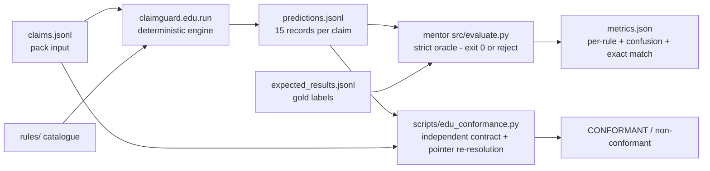

# ClaimGuard AI — engine performance analysis

Report format version **1.0.0** · generated 2026-09-23 · analyst `EnginePerformanceAnalysis` ·
engine revision `bc7d7e69fe524d6bbce864fc32f4264a2fc8e8b7` (clean working tree)

**What this is.** An honest, numbers-backed answer to three questions the team keeps asking:
how well does the engine actually perform on the mentor's data, how would we know if it were
wrong, and what would move the number. Every figure below was produced by a command that is
pasted with it. Nothing is estimated, extrapolated from the synthetic splits, or carried over
from another document except where this document says so and names the source.

**Headline.** 9000 of 9000 public claim-rule labels agree exactly with the mentor's own strict
scorer (`status_accuracy` 1.0000 on development 6000, validation 2250, stress 750), with 0 false
alarms, 0 missed issues, 0 false abstentions, 0 missed abstentions and 0 `NOT_IMPLEMENTED`. On the
same benchmark the pack's own 3-rule reference engine scores issue F1 0.4324 and status accuracy
0.2000. The ceiling is reached on the public data, so **the public data can no longer tell us
whether we are right** — §4 measures exactly where the labels stop discriminating, and §6 says
what the mentor's 200 held-out claims would settle.

---

## 1. What we measured, and how

### 1.1 The grader is the mentor's scorer, not our arithmetic

The number that counts is produced by the mentor pack's own strict scorer,
`<pack>/src/evaluate.py`. It is executed as a subprocess and its exit code is the verdict
(0 = the predictions are admissible). We do not re-implement the metric and call it a result.
Its comparison logic, quoted from the shipped file (`<pack>/src/evaluate.py`, `score()`) — the
statements are unchanged, only reformatted by our formatter so the document passes the same gate as
our code — is:

```python
tp = sum(g[k]["status"] == "FAIL" and p[k]["status"] == "FAIL" for k in keys)
fp = sum(g[k]["status"] != "FAIL" and p[k]["status"] == "FAIL" for k in keys)
fn = sum(g[k]["status"] == "FAIL" and p[k]["status"] != "FAIL" for k in keys)
```

Before scoring anything it also rejects the submission outright unless every result carries the
exact 15 keys, one record per claim-rule pair, a legal status, the frozen rule version/source
literals, non-empty evidence for every status except `NOT_IMPLEMENTED`, a review flag and
corrective action for `FAIL`/`UNABLE_TO_ASSESS`, a non-empty explanation, and — this is the part
that matters for honesty — **every evidence entry must re-resolve by JSON pointer against the
original claim and equal the claimed value exactly**:

```python
if pointer(c, e["path"]) != e["value"]:
    raise ValueError(f"Evidence value mismatch: {key} {e['path']}")
```

Two further opinions are run beside it, and they are deliberately not the same opinion:

* **`scripts/edu_conformance.py`** — an independent re-implementation (standard library only,
  no pack import) that re-checks the admissibility contract and re-resolves every evidence
  pointer itself, and recomputes `count/tp/fp/fn/status_accuracy/not_implemented` from the gold
  and prediction files so a stale metrics file cannot pass. It fails on any disagreement with
  the oracle's JSON.
* **A throwaway edge-availability probe** (§4) — measures which rulebook edges the public
  claims contain at all. It is not committed; it reads the pack read-only and prints counts.



### 1.2 The splits and the counts

All three public splits were run in full. Counts below are the engine's own stderr and the
scorer's `count`.

| Split | Claims | Claim-rule pairs | Role per the pack (`docs/07_Evaluation_and_Acceptance.md`) |
|---|---:|---:|---|
| development | 400 | 6000 | the open development set |
| validation | 150 | 2250 | gap assessment; **once its labels influence development it is development feedback** |
| stress | 50 | 750 | robustness; explicitly *not* a representative prevalence sample |
| **total** | **600** | **9000** | the whole public benchmark |

Inputs are the pack's own files:
`<pack>/data/<split>/{claims.jsonl,expected_results.jsonl}` where
`<pack>` = `ClaimGuardAI_Student_Starter_Pack/ClaimGuardAI_Student_Starter_Pack` (gitignored
reference material). All data is synthetic; the rulebook is fictional.

### 1.3 The exact commands

Interpreter: `uv` resolves to the project virtualenv
`C:\Users\oussa\oussema\CSTAM\.venv\Scripts\python.exe` (the harness prints it; see §1.5).

**Engine**, one invocation per split, `<pack>` abbreviated for readability:

```bash
uv run python -m claimguard.edu.run \
  --claims   ClaimGuardAI_Student_Starter_Pack/ClaimGuardAI_Student_Starter_Pack/data/<split>/claims.jsonl \
  --rules-dir ClaimGuardAI_Student_Starter_Pack/ClaimGuardAI_Student_Starter_Pack/rules \
  --output   C:/tmp/engine-perf/<split>/predictions.jsonl
```

**Mentor's strict scorer**, one invocation per split:

```bash
uv run python ClaimGuardAI_Student_Starter_Pack/ClaimGuardAI_Student_Starter_Pack/src/evaluate.py \
  --gold   ClaimGuardAI_Student_Starter_Pack/ClaimGuardAI_Student_Starter_Pack/data/<split>/expected_results.jsonl \
  --pred   C:/tmp/engine-perf/<split>/predictions.jsonl \
  --claims ClaimGuardAI_Student_Starter_Pack/ClaimGuardAI_Student_Starter_Pack/data/<split>/claims.jsonl \
  --output C:/tmp/engine-perf/<split>/metrics.json
```

**Independent second opinion, all three splits in one pass** (the `{split}` placeholder is the
harness's own convention):

```bash
uv run python scripts/edu_conformance.py --pred 'C:/tmp/engine-perf/{split}/predictions.jsonl' --all
```

**Pack baseline floor** (the mentor's own 3-rule reference engine, for comparison only):

```bash
uv run python ClaimGuardAI_Student_Starter_Pack/ClaimGuardAI_Student_Starter_Pack/src/run_baseline.py \
  --input  ClaimGuardAI_Student_Starter_Pack/ClaimGuardAI_Student_Starter_Pack/data/development/claims.jsonl \
  --output C:/tmp/engine-perf/baseline_dev.jsonl
uv run python ClaimGuardAI_Student_Starter_Pack/ClaimGuardAI_Student_Starter_Pack/src/evaluate.py \
  --gold   ClaimGuardAI_Student_Starter_Pack/ClaimGuardAI_Student_Starter_Pack/data/development/expected_results.jsonl \
  --pred   C:/tmp/engine-perf/baseline_dev.jsonl \
  --claims ClaimGuardAI_Student_Starter_Pack/ClaimGuardAI_Student_Starter_Pack/data/development/claims.jsonl \
  --output C:/tmp/engine-perf/baseline_dev_metrics.json
```

The per-rule tables in §2 are read back out of the scorer's own `by_rule` block — the mentor's
scorer emits them per rule, so no re-implementation of the metrics was needed:

```bash
uv run python -c "
import json
from pathlib import Path
def f(v): return 'null' if v is None else format(v,'.4f')
for s in ('development','validation','stress'):
    m=json.loads(Path(f'C:/tmp/engine-perf/{s}/metrics.json').read_text())
    print('==',s,'== overall count',m['overall']['count'],'claims_all_correct',m['claims_with_all_statuses_correct'])
    for r,v in m['by_rule'].items():
        print(r, v['count'], v['tp']+v['fn'], v['tp'], v['fp'], v['fn'], v['tn'], f(v['issue_precision']),
              f(v['issue_recall']), f(v['issue_f1']), f(v['false_alarm_rate']), f(v['status_accuracy']),
              v['not_implemented'], v['false_abstentions'], v['missed_abstentions'])
"
```

Full raw output of every run is pasted in the appendix.

### 1.4 Engine stderr, verbatim (all three splits)

(The `=== <split> ===` and `exit=<code>` lines were echoed by the shell loop that ran the three
invocations; the `claimguard.edu:` lines are the engine's own stderr.)

```text
=== development ===
claimguard.edu: claims=400 records=6000
claimguard.edu: by_rule=R001=400 R002=400 R003=400 R004=400 R005=400 R006=400 R007=400 R008=400 R009=400 R010=400 R011=400 R012=400 R013=400 R014=400 R015=400
claimguard.edu: by_status=FAIL=319 NOT_APPLICABLE=487 PASS=5014 UNABLE_TO_ASSESS=180
claimguard.edu: output=C:/tmp/engine-perf/development/predictions.jsonl
exit=0
=== validation ===
claimguard.edu: claims=150 records=2250
claimguard.edu: by_rule=R001=150 R002=150 R003=150 R004=150 R005=150 R006=150 R007=150 R008=150 R009=150 R010=150 R011=150 R012=150 R013=150 R014=150 R015=150
claimguard.edu: by_status=FAIL=117 NOT_APPLICABLE=181 PASS=1879 UNABLE_TO_ASSESS=73
claimguard.edu: output=C:/tmp/engine-perf/validation/predictions.jsonl
exit=0
=== stress ===
claimguard.edu: claims=50 records=750
claimguard.edu: by_rule=R001=50 R002=50 R003=50 R004=50 R005=50 R006=50 R007=50 R008=50 R009=50 R010=50 R011=50 R012=50 R013=50 R014=50 R015=50
claimguard.edu: by_status=FAIL=26 NOT_APPLICABLE=63 PASS=599 UNABLE_TO_ASSESS=62
claimguard.edu: output=C:/tmp/engine-perf/stress/predictions.jsonl
exit=0
```

### 1.5 Identity of what was measured

```bash
git rev-parse HEAD            # bc7d7e69fe524d6bbce864fc32f4264a2fc8e8b7   (git status --short: empty)
```

The development predictions are byte-identical to the ones recorded in
`docs/verification/EDU-EVALUATION-REPORT.md` (same content hash, same size), so the two documents
describe the same engine output:

```text
development sha256 025366105049abe7b221082333219a03321ca6dec3c7ecc2bb3da50c3da62350 bytes 4254430 records 6000
```

The three prediction files, their sizes and digests:

| Split | Bytes | SHA-256 |
|---|---:|---|
| development | 4254430 | `025366105049abe7b221082333219a03321ca6dec3c7ecc2bb3da50c3da62350` |
| validation | 1586476 | `3bf705fa44758b6bf3c811bf613377980eb13fcdde9c19ce003832675de385ec` |
| stress | 524252 | `996a43c7b05ebab5e8f9aa1d65e251bf5c944c05b356089fbea75decea387def` |

### 1.6 Data discipline

* **Synthetic only.** The pack manifest declares the dataset synthetic (`synthetic=True`,
  version 1.0.0). The rulebook is fictional (`fictional-rulebook/R0xx@1.0.0`). No real payer
  rule, patient record or adjudication outcome is involved.
* **We have seen all three public splits.** Per the pack's own protocol, the validation labels
  are therefore *development feedback for us* and are treated as such here (this is stated in
  `docs/verification/EDU-EVALUATION-REPORT.md` too). No public split is naive to us any more.
* **The mentor's 200 held-out claims are not in this repository** and were not used. They are the
  only untouched evidence that exists for this project (§6).
* **No tuning on the hidden labels** (`docs/07`): nothing here was fitted to any label set.

---

## 2. Results

### 2.1 Overall, per split

Every value below is a field of the mentor's scorer JSON for that split (pasted verbatim in the
appendix).

| Metric | development | validation | stress | Total |
|---|---:|---:|---:|---:|
| Claim-rule pairs scored | 6000 | 2250 | 750 | **9000** |
| True positives (expected FAIL, predicted FAIL) | 319 | 117 | 26 | **462** |
| False positives (false alarms) | 0 | 0 | 0 | **0** |
| False negatives (missed issues) | 0 | 0 | 0 | **0** |
| True negatives | 5681 | 2133 | 724 | 8538 |
| Issue precision | 1.0000 | 1.0000 | 1.0000 | 1.0000 |
| Issue recall | 1.0000 | 1.0000 | 1.0000 | 1.0000 |
| Issue F1 | 1.0000 | 1.0000 | 1.0000 | 1.0000 |
| False-alarm rate | 0.0000 | 0.0000 | 0.0000 | 0.0000 |
| Status accuracy | 1.0000 | 1.0000 | 1.0000 | 1.0000 |
| `NOT_IMPLEMENTED` predictions | 0 | 0 | 0 | 0 |
| False abstentions | 0 | 0 | 0 | 0 |
| Missed abstentions | 0 | 0 | 0 | 0 |
| Claim exact match (all 15 statuses right) | 400 / 400 | 150 / 150 | 50 / 50 | **600 / 600** |

Two internal consistency checks that cost nothing and are worth stating:

* The scorer's true positives sum to **462**, and an independent count of `FAIL` labels in the
  three gold files also sums to **462** (§2.4). Recall 1.0000 therefore means *every* labelled
  issue is caught, not that the label set is small.
* Every confusion matrix is perfectly diagonal, so there is no error class hiding inside the
  accuracy figure — not a single status of any kind is mispredicted, in either direction.

### 2.2 Per rule — development split (regenerated)

Regenerated in this analysis from the scorer's `by_rule` block, not copied. Columns follow the
scorer: `exp FAIL` is the recall denominator; precision/recall/F1 are issue-level (FAIL vs
not-FAIL); `FA/MA` are false and missed abstentions.

| Rule | n | exp FAIL | tp | fp | fn | tn | Precision | Recall | F1 | False-alarm rate | Status accuracy | FA | MA | `NOT_IMPLEMENTED` |
|---|---:|---:|---:|---:|---:|---:|---:|---:|---:|---:|---:|---:|---:|---:|
| R001 | 400 | 36 | 36 | 0 | 0 | 364 | 1.0000 | 1.0000 | 1.0000 | 0.0000 | 1.0000 | 0 | 0 | 0 |
| R002 | 400 | 11 | 11 | 0 | 0 | 389 | 1.0000 | 1.0000 | 1.0000 | 0.0000 | 1.0000 | 0 | 0 | 0 |
| R003 | 400 | 28 | 28 | 0 | 0 | 372 | 1.0000 | 1.0000 | 1.0000 | 0.0000 | 1.0000 | 0 | 0 | 0 |
| R004 | 400 | 28 | 28 | 0 | 0 | 372 | 1.0000 | 1.0000 | 1.0000 | 0.0000 | 1.0000 | 0 | 0 | 0 |
| R005 | 400 | 26 | 26 | 0 | 0 | 374 | 1.0000 | 1.0000 | 1.0000 | 0.0000 | 1.0000 | 0 | 0 | 0 |
| R006 | 400 | 24 | 24 | 0 | 0 | 376 | 1.0000 | 1.0000 | 1.0000 | 0.0000 | 1.0000 | 0 | 0 | 0 |
| R007 | 400 | 23 | 23 | 0 | 0 | 377 | 1.0000 | 1.0000 | 1.0000 | 0.0000 | 1.0000 | 0 | 0 | 0 |
| R008 | 400 | 11 | 11 | 0 | 0 | 389 | 1.0000 | 1.0000 | 1.0000 | 0.0000 | 1.0000 | 0 | 0 | 0 |
| R009 | 400 | 15 | 15 | 0 | 0 | 385 | 1.0000 | 1.0000 | 1.0000 | 0.0000 | 1.0000 | 0 | 0 | 0 |
| R010 | 400 | 15 | 15 | 0 | 0 | 385 | 1.0000 | 1.0000 | 1.0000 | 0.0000 | 1.0000 | 0 | 0 | 0 |
| R011 | 400 | 10 | 10 | 0 | 0 | 390 | 1.0000 | 1.0000 | 1.0000 | 0.0000 | 1.0000 | 0 | 0 | 0 |
| R012 | 400 | 23 | 23 | 0 | 0 | 377 | 1.0000 | 1.0000 | 1.0000 | 0.0000 | 1.0000 | 0 | 0 | 0 |
| R013 | 400 | 30 | 30 | 0 | 0 | 370 | 1.0000 | 1.0000 | 1.0000 | 0.0000 | 1.0000 | 0 | 0 | 0 |
| R014 | 400 | 20 | 20 | 0 | 0 | 380 | 1.0000 | 1.0000 | 1.0000 | 0.0000 | 1.0000 | 0 | 0 | 0 |
| R015 | 400 | 19 | 19 | 0 | 0 | 381 | 1.0000 | 1.0000 | 1.0000 | 0.0000 | 1.0000 | 0 | 0 | 0 |

**Claim exact match per rule.** Each rule appears exactly once per claim, so "claims where this
rule is exactly right" *is* the rule's status accuracy above; reporting a separate column would
be a fake distinction. The meaningful claim-level figure is the whole-claim one: all 15 statuses
correct for **400 of 400** development claims (and 150/150, 50/50).

**Cross-check against `docs/verification/EDU-EVALUATION-REPORT.md`.** Compared programmatically,
cell by cell, against that document's "Per-rule results" table:

```text
rows parsed from the Per-rule results table: 15
compared 15 rows; mismatches: 0
```

No discrepancy: all 15 rows agree on n, expected FAIL, tp, fp, fn, tn, precision, recall, F1,
false-alarm rate, status accuracy and `NOT_IMPLEMENTED`, and the overall block agrees too
(6000 / 319 / 0 / 0 / 5681, 1.0000, claim exact match 400/400).

### 2.3 Per rule — validation and stress

Status accuracy is 1.0000 for **every** rule on **every** split, and fp/fn/FA/MA are 0 for every
rule on every split. What changes across splits is *support*, and that is where the numbers get
weak. Validation carries a positive (non-zero `exp FAIL`) for all 15 rules; stress does not.

Stress split — note the nine rules whose precision/recall are **`null`, not 1.0000**: with zero
expected `FAIL` pairs the denominators are empty, and the pack's rule "undefined metrics are
null, never 100%" applies. `tp=0, fp=0, fn=0` there means *nothing was asked*, not *everything
was answered*.

| Rule | n | exp FAIL | tp | fp | fn | tn | Precision | Recall | F1 | Status accuracy |
|---|---:|---:|---:|---:|---:|---:|---|---|---|---:|
| R001 | 50 | 8 | 8 | 0 | 0 | 42 | 1.0000 | 1.0000 | 1.0000 | 1.0000 |
| R002 | 50 | 0 | 0 | 0 | 0 | 50 | null | null | null | 1.0000 |
| R003 | 50 | 3 | 3 | 0 | 0 | 47 | 1.0000 | 1.0000 | 1.0000 | 1.0000 |
| R004 | 50 | 0 | 0 | 0 | 0 | 50 | null | null | null | 1.0000 |
| R005 | 50 | 0 | 0 | 0 | 0 | 50 | null | null | null | 1.0000 |
| R006 | 50 | 0 | 0 | 0 | 0 | 50 | null | null | null | 1.0000 |
| R007 | 50 | 0 | 0 | 0 | 0 | 50 | null | null | null | 1.0000 |
| R008 | 50 | 0 | 0 | 0 | 0 | 50 | null | null | null | 1.0000 |
| R009 | 50 | 3 | 3 | 0 | 0 | 47 | 1.0000 | 1.0000 | 1.0000 | 1.0000 |
| R010 | 50 | 3 | 3 | 0 | 0 | 47 | 1.0000 | 1.0000 | 1.0000 | 1.0000 |
| R011 | 50 | 0 | 0 | 0 | 0 | 50 | null | null | null | 1.0000 |
| R012 | 50 | 3 | 3 | 0 | 0 | 47 | 1.0000 | 1.0000 | 1.0000 | 1.0000 |
| R013 | 50 | 6 | 6 | 0 | 0 | 44 | 1.0000 | 1.0000 | 1.0000 | 1.0000 |
| R014 | 50 | 0 | 0 | 0 | 0 | 50 | null | null | null | 1.0000 |
| R015 | 50 | 0 | 0 | 0 | 0 | 50 | null | null | null | 1.0000 |

Validation is the mirror image — every rule has at least one expected `FAIL`, but the counts are
small (R002 4, R008 4, R011 4; nothing above R001's 17). Full validation rows are in the appendix.

### 2.4 Support: which per-rule figures are weak evidence

Expected `FAIL` labels are the recall denominator, so a rule with ten of them rests on ten
observations. Counted directly from the three gold files:

| Rule | dev FAIL | val FAIL | stress FAIL | **total FAIL** | total `UNABLE_TO_ASSESS` | total `NOT_APPLICABLE` |
|---|---:|---:|---:|---:|---:|---:|
| R011 | 10 | 4 | 0 | **14** | 0 | 0 |
| R002 | 11 | 4 | 0 | **15** | 15 | 0 |
| R008 | 11 | 4 | 0 | **15** | 29 | 240 |
| R009 | 15 | 5 | 3 | **23** | 50 | 240 |
| R010 | 15 | 5 | 3 | **23** | 49 | 236 |
| R014 | 20 | 7 | 0 | **27** | 30 | 15 |
| R015 | 19 | 10 | 0 | **29** | 15 | 0 |
| R007 | 23 | 7 | 0 | **30** | 15 | 0 |
| R005 | 26 | 6 | 0 | **32** | 15 | 0 |
| R006 | 24 | 10 | 0 | **34** | 15 | 0 |
| R004 | 28 | 7 | 0 | **35** | 8 | 0 |
| R003 | 28 | 7 | 3 | **38** | 30 | 0 |
| R012 | 23 | 13 | 3 | **39** | 0 | 0 |
| R013 | 30 | 11 | 6 | **47** | 44 | 0 |
| R001 | 36 | 17 | 8 | **61** | 0 | 0 |
| **total** | **319** | **117** | **26** | **462** | 315 | 731 |

Read it this way:

* **Thinnest positive support: R011 (14), R002 (15), R008 (15)** expected `FAIL` labels across
  the entire public benchmark. R011's recall of 1.0000 is ten observations on development and
  four on validation. One missed R011 `FAIL` anywhere would read as a large recall drop.
* **R011, R002, R008, R014, R015 and R007 have no expected `FAIL` at all on stress** — the split
  that is supposed to probe robustness asks nothing of them, which is why nine rules show `null`
  precision/recall there.
* **The `UNABLE_TO_ASSESS` tier is thin everywhere** (315 pairs total, spread over 13 rules):
  abstention behaviour is exercised, but never densely.
* The 462 total reconciles exactly with the scorer's tp (319 + 117 + 26), which is the check
  behind "recall 1.0000".

### 2.5 The reference floor (context, not a performance claim)

The pack ships a 3-rule reference engine (R001, R003, R006). Scored here by the same oracle on
the same development split:

| Metric | Our engine | Pack baseline | Source |
|---|---:|---:|---|
| Claim-rule pairs | 6000 | 6000 | scorer `count` |
| Issue precision | 1.0000 | 1.0000 | scorer |
| Issue recall | 1.0000 | 0.2759 | scorer |
| Issue F1 | 1.0000 | 0.4324 | scorer |
| False-alarm rate | 0.0000 | 0.0000 | scorer |
| Status accuracy | 1.0000 | 0.2000 | scorer |
| `NOT_IMPLEMENTED` | 0 | 4800 | scorer |
| False abstentions | 0 | 0 | scorer |
| Missed abstentions | 0 | 156 | scorer |
| Claim exact match | 400 / 400 | 0 / 400 | scorer |

The baseline is the mentor's own code, not ours. It is the honest floor for the benchmark: a
perfect `precision` with 0.2759 `recall`, because 12 rules are declared `NOT_IMPLEMENTED` and
`NOT_IMPLEMENTED` counts as wrong. Our engine differs from it in the two places a benchmark
actually tests: **coverage** (0 vs 4800 unimplemented) and **abstention discipline**
(0 vs 156 missed abstentions).

### 2.6 Discrepancy found while cross-checking (outside my scope)

The per-rule table matches `EDU-EVALUATION-REPORT.md` exactly. One number elsewhere does not:
`docs/verification/EDU-PACK-CONFORMANCE.md` records "evidence pointers re-resolved" as
**20270 / 1477 / 467** for development / validation / stress, and `EDU-EVALUATION-REPORT.md`
records **20300** for development. My run reproduces:

```text
=== ClaimGuardAI mentor-pack conformance: development ===
  evidence pointers                  20300 re-resolved against the original claims
=== ClaimGuardAI mentor-pack conformance: validation ===
  evidence pointers                  7536 re-resolved against the original claims
=== ClaimGuardAI mentor-pack conformance: stress ===
  evidence pointers                  2410 re-resolved against the original claims
```

The committed snapshot at `artifacts/edu/{development,validation,stress}.jsonl` agrees with my
run exactly (20300 / 7536 / 2410), so the conformance document's column is stale rather than my
run being wrong — that document itself warns its numbers are "snapshots" and must be re-run after
any engine change. The development figure in `EDU-EVALUATION-REPORT.md` is correct. I have not
edited `EDU-PACK-CONFORMANCE.md`; flagging it here is the whole of my involvement.

---

## 3. So did the engine do well?

**Yes — on precisely the thing the mentor's scorer measures, on exactly the data the mentor
ships, and no further.**

### What the numbers do prove

1. **The 15 fictional rules are implemented the way the shipped labels read them.** 9000 of
   9000 statuses agree exactly, with every confusion matrix diagonal. There is no partial credit
   hiding an error class.
2. **The engine is not winning by guessing the majority class.** `precision` and `recall` are
   both 1.0000 with 462 labelled issues found and 0 false alarms — the trivial "always PASS"
   and "always FAIL" strategies both fail hard here, and the pack's own accepted baseline
   demonstrates the first one (accuracy 0.2000).
3. **The engine is not winning by abstaining.** `NOT_IMPLEMENTED` is 0 everywhere; the scorer
   counts it as *incorrect*, so 600/600 whole-claim exact match means it committed to all 15
   rules on all 600 claims and was right every time.
4. **The uncertainty tier is handled, not fudged.** 315 expected `UNABLE_TO_ASSESS` pairs are
   answered `UNABLE_TO_ASSESS` and 0 of the other 8685 pairs are wrongly abstained: false
   abstentions 0, missed abstentions 0.
5. **The citations are real.** 20300 / 7536 / 2410 evidence pointers were independently
   re-resolved against the *original* claim envelopes by a harness that imports no pack code,
   with 0 problems. The values cited exist and are exact.
6. **The result is reproducible today.** Clean tree at `bc7d7e69…`, predictions byte-identical
   to the ones hashed into `EDU-EVALUATION-REPORT.md`.

### What the numbers do not prove

1. **Nothing about real claims.** All 600 claims and all 15 rules are synthetic and fictional.
   This is agreement with an *instructional oracle for a fictional rulebook*
   (`docs/07_Evaluation_and_Acceptance.md`), not clinical or reimbursement ground truth, and not
   a prediction that any payer would pay.
2. **Nothing about real payer policy.** No real insurer, NPHIES requirement, CPT/ICD decision or
   benefit rule is modelled, so no number here transfers to Gulf claims processing.
3. **Nothing about the mentor's held-out 200 claims.** They are not in this repository. Our
   headline is a *public-split* number, and we have seen every public split — validation
   included, which the pack's own protocol says turns it into development feedback. There is no
   naive split left.
4. **Not exactness on the rulebook's intent, only agreement with its labels.** §4 measures six
   edge behaviours that the public labels cannot discriminate at all. A wrong implementation of
   any of them would still score 1.0000 here.
5. **Not explanation quality.** The scorer only requires a non-empty string; the pack scores
   explanations by hand, 0/1 on five criteria over 25 cases (`docs/07`), and that scorecard has
   not been run. No explanation number is claimed here.
6. **Not evidence *relevance*.** Value equality is checked; whether the cited field is the
   reason for the conclusion is not (the pack says so itself, and §5.1 shows how broad our
   citations actually are).
7. **Not production readiness of any kind.** No clinical advice, no adjudication, no payer
   submission path exists — `PASS` means "this check passed on this synthetic data".

**The honest one-sentence answer:** *perfect on a 9000-pair synthetic benchmark built from a
fictional rulebook; the residual risk is no longer accuracy, it is coverage of rule edges the
labels never ask about, and the mentor's held-out set is where that risk becomes measurable.*

---

## 4. Where we are exposed

The public labels cannot discriminate the following rulebook edges. The claim in each row is not
about our engine's behaviour — it is that the **data is silent**, so any implementation of the
edge scores 1.0000. All counts below are from a throwaway probe reading the three splits'
`claims.jsonl` and `expected_results.jsonl` read-only; rule text is quoted from
`<pack>/docs/04_Rulebook.md`, and the corresponding pinned tests live in
`tests/edu_edges/test_rulebook_edges.py` (38 tests, written from the rulebook prose precisely
because the labels cannot arbitrate — several are marked `xfail(strict=False)` with
"rulebook ambiguous; gold cannot arbitrate — flagged for the mentor").

| # | Edge | Rule(s) | What the rulebook says | What the public data actually contains | Why a wrong implementation still scores 1.0000 |
|---|---|---|---|---|---|
| 1 | Cross-line authorization quantity aggregation | R009 | "aggregate quantity across lines sharing that authorization_id <= max_quantity" | Line groups sharing one `authorization_id`: **3 / 4 / 1** (dev/val/stress). Groups where the aggregate exceeds the authorization record's `max_quantity` while each line individually does **not**: **0 / 0 / 0**. Every shared record carries `max_quantity: 10` and the largest aggregate is 2. | With no group where the two readings differ, per-line-only and aggregate quantity checks produce the same status on every public pair. The per-line reading is the "obvious" wrong one and it is invisible. |
| 2 | Cent-level rounding (`ROUND_HALF_UP`, ±0.01 tolerance) | R007 (see note) | "net_amount must equal quantity × unit_price, rounded to 2 decimals using decimal ROUND_HALF_UP. A difference of at most 0.01 SAR passes." | Lines whose exact product needs rounding to 2 dp: **0 / 0 / 0**. Lines landing on the ±0.01 tolerance: **0 / 0 / 0**. `net_amount` values with sub-cent precision: **0 / 0 / 0**. | The rounding step never executes and the tolerance never decides. Truncation, banker's rounding, float arithmetic and half-up all agree on this data. **Positive control:** R012's own ±0.01 tolerance *is* exercised — 4 / 2 / 3 claims differ from the line sum by exactly one cent and are labelled accordingly — so the tolerance mechanism is tested, just never for R007. |
| 3 | Whitespace-only and padded strings | R001, R015 | R001: required strings "must not be empty"; shared conventions: "Do not silently trim or repair source data before checking." | Required string values inspected on every claim (`invoice_number`, `member_id`, `diagnosis_code`, `currency`, per-line `service_date`, `service_code`): **3096 / 1142 / 378** values, of which empty: **0**, whitespace-only: **0**, padded: **0**. | A `strip()`-then-compare implementation and a strict implementation are indistinguishable when no string has leading, trailing or whitespace-only content. The edge tests pin the strict behaviour (`" "` is a known absence under R001; a padded currency is a FAIL under R015) — from the prose, not from a label. |
| 4 | Multi-date reductions | R014 (and R002/R003 "every service_date") | R014: "submission_date minus the **latest** service_date must be <= policy.submission_window_days". R003: "**every** service_date must be within coverage.start_date and coverage.end_date". | Claims with ≥2 distinct non-null service dates: **0 / 0 / 0**. (The apparent "second date" in a naive count — 4 / 2 / 2 claims — is a **null** service_date, not a second date: the null census shows `/lines/*/service_date` null in 8 / 3 / 4 lines.) | With one real date per claim, "latest", "earliest", "first line's date" and "any line" all reduce to the same date. Selecting the earliest, or letting a null short-circuit the comparison, would be undetectable. |
| 5 | Mixed unknown-input and proven-violation precedence | R002, R003, R007, R011, R013 (and R008/R009/R010) | Shared conventions: "a proven violation gives FAIL; otherwise missing necessary evidence gives UNABLE_TO_ASSESS … Preserve uncertainty in the explanation even when a different line proves a failure." | Claims that mix an unknown input with a proven violation **for the same rule**: **0 / 0 / 0**. The unknown side exists (null `invoice_number` 8, `member_id` 4, `diagnosis_code` 8, `/coverage/end_date` 8, `/lines/*/unit_price` 8 on development; unknown service codes 10 / 4 / 0; unknown `policy_id` 8 / 3 / 4 as `EDU-NO-POLICY`, all labelled `UNABLE_TO_ASSESS` on the seven policy-dependent rules) — it simply never coincides with a violation in the same claim. | Ordering two inputs can only be observed when both are present. An engine that returns `UNABLE_TO_ASSESS` whenever *any* line is unknown, ignoring a proven failure elsewhere, scores 1.0000 on all 9000 pairs. Five edge tests (`test_r008/r009/r010/r011/r013_fail_outranks_…`) pin the correct ordering from the prose alone. |
| 6 | Integral-float quantities | R013 | "Every quantity must be a positive integer." The transport contract accepts a JSON number as int **or** float. | Quantities written as a JSON *float*: **4 / 1 / 3**. Of those, floats whose value is mathematically whole (e.g. `2.0`): **0 / 0 / 0** — every float quantity in the corpus is `1.5`. | Fractional rejection *is* discriminated (`1.5` is labelled `FAIL` on development, validation and stress — three splits of coverage). But "a whole `2.0` counts as an integer" is untested: an implementation that rejects every float, or every non-`int` type, scores 1.0000. `test_r013_accepts_a_quantity_written_as_an_integral_float` pins our reading of the contract. |

Two further exposures of the same kind, measured the same way, worth recording even though the
task named six:

* **R009's "complete inventory" clause.** "A referenced ID absent from the supplied complete
  list … fails." The corpus has 0 lines whose `authorization_id` points at an ID missing from the
  claim's `authorizations` array (all references resolve), so an engine that treats "no matching
  record" as unknown rather than failed is untested. Pinned by
  `test_r009_fails_when_a_referenced_id_is_absent_from_a_complete_inventory`.
* **R012's quantisation order** — "round each line, then sum" vs "sum, then round". No public
  split carries a sub-cent `net_amount` (measured: 0 everywhere), so the two orders cannot
  differ on this data. The edge test resolves it from the mentor's own `money()` helper and is
  marked as an `[INFERENCE]` in the test file.

**Say it plainly: the held-out set is the real test.** Every row above is a place where our
1.0000 is unfalsifiable by the data we hold. The edge tests are the only current protection, and
they are written from the rulebook prose — they pin *our reading* of an ambiguous document, which
is exactly the thing the mentor's held-out labels can confirm or refute.

---

## 5. How to improve, ranked

**Framing that governs the ranking.** The graded figure — the mentor's status accuracy — is
already at its maximum on all 9000 public pairs. **No change to rule logic can raise it.** So
the levers split into three kinds, and the ranking respects that:

* **(A) measures the real risk** — the only thing that can still change the headline where it
  matters (the held-out set);
* **(B) moves other rubric lines** — the mentor's 100-point rubric is not only rule correctness
  (`docs/07`: Rule correctness 35, Grounded AI explanations **20**, Human review and usability 15,
  Uncertainty and security 15, Audit and reproducibility 10, Communication 5);
* **(C) improves trustworthiness without moving the graded score at all.**

Effort figures are coarse planning bands marked `[ESTIMATE]`; every other quantity in this
section is measured or quoted.

### 5.1 (A) Calibrate on the held-out set — ask for the 200 claims and labels to be scored

* **Motivation.** §4 shows six measured edges where a wrong engine still scores 1.0000; §2.4 shows
  three rules whose entire public support is 14–15 expected `FAIL`s. The 200 held-out claims are
  the only untouched evidence in existence (`docs/07`: "The mentor should keep the 200 held-out
  inputs and labels private until assessment").
* **The action that costs hours, not weeks:** run the §1.3 commands against the held-out split
  and report the same tables. This is *measurement*, not tuning — `docs/07` forbids tuning on the
  hidden labels, and running the pack's own scorer on them is precisely what the pack provides
  the scorer for.
* **What to look at first when it lands:** whether per-rule recall stays 1.0000 for R011/R002/R008
  (thin support), and whether `false_abstentions`/`missed_abstentions` stay 0.
* **Score effect:** potentially large and *entirely outside our control today* — it is the only
  lever that can move the headline in either direction. Blocker: the labels are not in this
  repository and cannot be synthesised; the claim inputs alone (§6) need no labels at all.
* **Cost:** one scoring run once access exists.

### 5.2 (B) Measure explanation quality — it is 20 of 100 mentor points and we currently have no number

* **Motivation.** The mentor's rubric puts **20 of 100** on "Grounded AI explanations", inspected
  via "25 supplied exercise cases plus fresh variants; no unsupported approvals"
  (`docs/07_Evaluation_and_Acceptance.md`). The pack ships exactly those 25 cases and the 0/1
  scorecard: `exercises/llm_explanation_cases.jsonl` (25 lines),
  `exercises/llm_manual_scorecard.csv` (five 0/1 columns: correct finding, correct evidence,
  correct rule, appropriate action, honest uncertainty, plus an unsupported-fact column).
  Today: *"Explanation quality: **Not scored by any script**"* — no number exists
  (`docs/13-Technical-Report.md`). The engine ships the mechanism (a bounded provider with a
  4-key contract, citation/prohibition/echo guards and a deterministic fallback that can change
  exactly one field) but the scorecard is empty.
* **Action.** Score the 25 cases (125 binary judgments) twice, by two people, and report the
  agreement; record unsupported facts separately as the pack asks. Then repeat on fresh variants
  drawn from the held-out claims.
* **Evidence it is real work, not paperwork:** the citation guard already constrains what a model
  can cite, so the scorecard will mostly test whether the *deterministic* text is useful and
  whether the model adds anything.
* **Score effect:** directly targets 20 of 100 points; **cannot move status accuracy at all** —
  a model failure is structurally unable to change a status.
* **Cost:** 125 judgments per pass, twice; `[ESTIMATE]` days, mostly human.

### 5.3 (C) Raise the evidence *relevance* bar — value equality is checked, relevance is not

* **Motivation (measured).** The scorer checks only that each evidence entry re-resolves to an
  exactly equal value. Our citations are broad rather than minimal:

  ```text
  development FAIL/UNABLE_TO_ASSESS results: 499
  cited evidence entries: 1806 -> null(defect-bearing): 152  non-null: 1654
  ```

  Mean evidence pointers per result, by rule, range from **1.0** (R006 on stress) to **6.6**
  (R013 on development), e.g. R013 6.60, R007 5.66, R003 4.91, R001 3.73. Across the 499
  development `FAIL`/`UNABLE_TO_ASSESS` results, **1654 of 1806 cited values (91.6%) are
  non-null** — i.e. they are context and cross-check values, not the defect itself. That is not
  wrong (a mismatch needs both sides), but it means the citation list is not a *relevance*
  signal, and the grader can neither reward nor punish it.
* **Action.** Per rule, define the minimal decisive citation set (the field(s) whose value
  determined the status, plus the comparison field when the rule is relational), emit those
  first, and mark the rest as context. Then measure the reduction.
* **Score effect:** **does not move status accuracy** and the grader has no relevance metric —
  it is a trustworthiness and human-review lever (rubric line "Human review and usability", 15).
  It is the honest answer to the mentor's own caveat that "evidence-value checks do not prove
  that the chosen field is relevant".
* **Cost:** small, and bounded by the rule catalogue (15 rules); `[ESTIMATE]` a few days,
  including re-reading `tests/edu_edges` so the minimal sets do not contradict a pinned edge.

### 5.4 (C) Abstention quality: keep the 0/0, and make it survive contact with new data

* **Motivation.** False abstentions 0 and missed abstentions 0 on all three splits, against the
  pack baseline's **156 missed abstentions** — this is one of the two dimensions where our engine
  visibly separates from the shipped floor (§2.5). But §2.4 shows only 315 `UNABLE_TO_ASSESS`
  labels in total and §4 row 5 shows the *ordering* between "unknown" and "proven violation" is
  never exercised.
* **Action.** Turn the five precedence edge tests into paired fixtures with expected statuses and
  keep them in the regression set (they already exist — the work is wiring them to an expected
  status rather than asserting current behaviour), and add negative controls that must *not*
  abstain.
* **Score effect:** no change on the public splits (already 0/0); it protects the "Uncertainty and
  security" rubric line (15) and is what would show up as a regression if the held-out set
  exercises the untested ordering.
* **Cost:** low; the fixtures exist.

### 5.5 (C) Per-rule support: stop letting the average hide the thin rules

* **Motivation.** §2.4: R011 rests on 14 expected `FAIL`s total; R002 and R008 on 15 each; six
  rules have **no** expected `FAIL` on stress at all. A single missed R011 `FAIL` moves its
  per-split recall by 10.0 points on development (1 of 10) and 25.0 points on validation (1 of 4).
* **Action.** Keep publishing the support table (§2.4) beside every per-rule metric, and refuse
  to quote a per-rule precision/recall whose denominator is in single digits without the count
  next to it. The engine already has 38 rulebook-derived edge tests; surfacing them as a per-rule
  coverage matrix (rule × edge × pinned/untested) is the honest form of this.
* **Score effect:** none on the metric; it changes what the team is allowed to *claim*, which is
  the point. Feeds the "Rule correctness" line (35) as evidence quality, and the "Communication"
  line (5).
* **Cost:** low (a view over existing data).

### 5.6 (B) Phase-2 detection work — a different benchmark, and a different 15 points

* **Motivation.** The project's own Phase-2 milestone (`docs/03-Challenge-Decode-Requirements.md`)
  scores "Detection quality & benchmark" at **15 points: Macro F1 on the 50-claim validation
  dataset**, with stated targets **Macro F1 ≥ 0.90 and FP ≤ 5%**, measured by a harness over
  per-family F1, clean-claim FP rate and calibration (ECE/AUROC/conformal). That dataset is
  **not** the mentor pack's fictional-rulebook benchmark measured here — same discipline, different
  ground truth, different point pool.
* **Action.** Build the per-family F1 harness and the clean-claim FP measurement first (the two
  things that turn a demo into a number), then the seeded mutation generator
  (`docs/03`: "seeded mutation generator for extra coverage").
* **Score effect:** moves the **Phase-2 15-point line**, not the mentor pack's 100-point rubric
  measured in §2. Do not merge the two numbers in any slide.
* **Cost:** `[ESTIMATE]` weeks; it is the largest item here by a distance.

### 5.7 (A/C) Calibration and confidence — measure it, but do not sell it as accuracy

* **Motivation.** Every status we emit carries `confidence: null` with
  `confidence_kind: not_probabilistic` — correct for a deterministic engine, and enforced by the
  scorer and the harness. Calibration is therefore **not part of the pack's metric set**; it
  appears in the project's own Phase-2 plan (ECE/AUROC/Platt scaling, conformal abstention).
* **Action.** If calibration work is funded, wire it to the Phase-2 line, and keep the pack
  numbers free of any confidence claim. The repo's own v2 note is the right instinct: keep what
  is cheap and honest (Platt + conformal on the model-assisted path), defer self-consistency,
  and never let a probabilistic score replace a deterministic status.
* **Score effect:** **zero** on the mentor's graded score; potential on the Phase-2 line.
* **Cost:** `[ESTIMATE]` weeks, and only meaningful with a calibration set — i.e. only after
  held-out access.

### 5.8 What is deliberately *not* on this list

More rule tuning, more edge tests for edges that are already pinned, and anything aimed at
raising the public-split numbers. The public number is at 1.0000 with 0/0/0/0; further work there
buys nothing measurable and risks overfitting a set we have already seen in full.

---

## 6. What we would do with more data

The mentor's 200 held-out claims are the only untouched evidence. What they would let us measure
that we cannot measure now:

**1. Whether the six §4 edges are exercised at all.** This needs the **inputs only, no labels**.
The §4 probe is a pure function of `claims.jsonl`: it counts whitespace-only/padded strings,
sub-cent amounts and products needing rounding, claims with ≥2 distinct service dates, lines
sharing an authorization, aggregate-vs-cap violations, unknown/missing inputs mixed with proven
violations, and whole-valued JSON floats. Running it on the held-out inputs the same day they
arrive would tell us *before* any scoring whether our unfalsifiable 1.0000 is about to be tested.
This is the highest-value-per-hour action available.

**2. Whether any of those edges is answered the way the mentor intended.** This needs the
**labels**. The edge tests pin our reading of an ambiguous rulebook; the held-out labels are the
only external arbiter that could confirm or refute the reading (e.g. does a whole `2.0` count as
an integer under R013; does R014 reduce over the latest date when another line is in the future).

**3. An accuracy figure on data we did not develop against.** Every public split is known to us,
and the pack's protocol makes validation development feedback the moment we score it. A 200-claim
number would be the first honest estimate of generalisation, and the first opportunity for any
per-rule recall to be anything other than 1.0000.

**4. Real support for the thin rules.** R011, R002 and R008 have 14, 15 and 15 expected `FAIL`s
across the whole public benchmark. I will not guess how many the held-out set adds: prevalence in
an unseen sample is not something this repository can measure, and assuming development's
proportions carry over would be an invention. What is certain is that the held-out set is the
first chance to reduce the single-digit-denominator problem, whatever its composition.

**5. Fresh explanation cases.** `docs/07` asks for the 25 supplied cases **plus fresh variants**.
Held-out claims provide real material for model-assisted explanations, scored with the same
5-criteria scorecard — the difference between "our prompt did not break" and "our explanations
are good" (rubric line: 20 points).

**6. A check on the labels themselves.** Where the rulebook prose is ambiguous and no public gold
can arbitrate (§4), a held-out label that disagrees with our reading is more informative than the
1.0000 it would replace. Treat any such disagreement as a specification conversation with the
mentor, not as a bug to patch silently.

**What more data would *not* fix.** It would still be synthetic data for a fictional rulebook: no
real patient, no real payer policy, no reimbursement ground truth, and no evidence that a `PASS`
means anything about payment. Any claim about real-world performance would remain unsupported no
matter how large the held-out set grows — which is why this system reviews rather than
adjudicates.

---

## Appendix — raw run output

In the blocks below, `=== <split> ===` and `exit=<code>` lines were echoed by the shell loop that
ran the command; they are not part of the program's own output. Everything else is the program's
stdout or stderr, verbatim.

### A.1 Mentor's strict scorer, verbatim stdout (three splits)

```text
=== development ===
{
  "count": 6000,
  "tp": 319,
  "fp": 0,
  "fn": 0,
  "tn": 5681,
  "issue_precision": 1.0,
  "issue_recall": 1.0,
  "issue_f1": 1.0,
  "false_alarm_rate": 0.0,
  "status_accuracy": 1.0,
  "not_implemented": 0,
  "false_abstentions": 0,
  "missed_abstentions": 0
}
Report: C:\tmp\engine-perf\development\metrics.json
exit=0
=== validation ===
{
  "count": 2250,
  "tp": 117,
  "fp": 0,
  "fn": 0,
  "tn": 2133,
  "issue_precision": 1.0,
  "issue_recall": 1.0,
  "issue_f1": 1.0,
  "false_alarm_rate": 0.0,
  "status_accuracy": 1.0,
  "not_implemented": 0,
  "false_abstentions": 0,
  "missed_abstentions": 0
}
Report: C:\tmp\engine-perf\validation\metrics.json
exit=0
=== stress ===
{
  "count": 750,
  "tp": 26,
  "fp": 0,
  "fn": 0,
  "tn": 724,
  "issue_precision": 1.0,
  "issue_recall": 1.0,
  "issue_f1": 1.0,
  "false_alarm_rate": 0.0,
  "status_accuracy": 1.0,
  "not_implemented": 0,
  "false_abstentions": 0,
  "missed_abstentions": 0
}
Report: C:\tmp\engine-perf\stress\metrics.json
exit=0
```

### A.2 Per-rule extraction, verbatim (all three splits)

```text
== development == overall count 6000 claims_all_correct 400 of 400
rule  n expFAIL tp fp fn tn prec rec f1 far acc ni fa ma
R001 400 36 36 0 0 364 1.0000 1.0000 1.0000 0.0000 1.0000 0 0 0
R002 400 11 11 0 0 389 1.0000 1.0000 1.0000 0.0000 1.0000 0 0 0
R003 400 28 28 0 0 372 1.0000 1.0000 1.0000 0.0000 1.0000 0 0 0
R004 400 28 28 0 0 372 1.0000 1.0000 1.0000 0.0000 1.0000 0 0 0
R005 400 26 26 0 0 374 1.0000 1.0000 1.0000 0.0000 1.0000 0 0 0
R006 400 24 24 0 0 376 1.0000 1.0000 1.0000 0.0000 1.0000 0 0 0
R007 400 23 23 0 0 377 1.0000 1.0000 1.0000 0.0000 1.0000 0 0 0
R008 400 11 11 0 0 389 1.0000 1.0000 1.0000 0.0000 1.0000 0 0 0
R009 400 15 15 0 0 385 1.0000 1.0000 1.0000 0.0000 1.0000 0 0 0
R010 400 15 15 0 0 385 1.0000 1.0000 1.0000 0.0000 1.0000 0 0 0
R011 400 10 10 0 0 390 1.0000 1.0000 1.0000 0.0000 1.0000 0 0 0
R012 400 23 23 0 0 377 1.0000 1.0000 1.0000 0.0000 1.0000 0 0 0
R013 400 30 30 0 0 370 1.0000 1.0000 1.0000 0.0000 1.0000 0 0 0
R014 400 20 20 0 0 380 1.0000 1.0000 1.0000 0.0000 1.0000 0 0 0
R015 400 19 19 0 0 381 1.0000 1.0000 1.0000 0.0000 1.0000 0 0 0

== validation == overall count 2250 claims_all_correct 150 of 150
rule  n expFAIL tp fp fn tn prec rec f1 far acc ni fa ma
R001 150 17 17 0 0 133 1.0000 1.0000 1.0000 0.0000 1.0000 0 0 0
R002 150 4 4 0 0 146 1.0000 1.0000 1.0000 0.0000 1.0000 0 0 0
R003 150 7 7 0 0 143 1.0000 1.0000 1.0000 0.0000 1.0000 0 0 0
R004 150 7 7 0 0 143 1.0000 1.0000 1.0000 0.0000 1.0000 0 0 0
R005 150 6 6 0 0 144 1.0000 1.0000 1.0000 0.0000 1.0000 0 0 0
R006 150 10 10 0 0 140 1.0000 1.0000 1.0000 0.0000 1.0000 0 0 0
R007 150 7 7 0 0 143 1.0000 1.0000 1.0000 0.0000 1.0000 0 0 0
R008 150 4 4 0 0 146 1.0000 1.0000 1.0000 0.0000 1.0000 0 0 0
R009 150 5 5 0 0 145 1.0000 1.0000 1.0000 0.0000 1.0000 0 0 0
R010 150 5 5 0 0 145 1.0000 1.0000 1.0000 0.0000 1.0000 0 0 0
R011 150 4 4 0 0 146 1.0000 1.0000 1.0000 0.0000 1.0000 0 0 0
R012 150 13 13 0 0 137 1.0000 1.0000 1.0000 0.0000 1.0000 0 0 0
R013 150 11 11 0 0 139 1.0000 1.0000 1.0000 0.0000 1.0000 0 0 0
R014 150 7 7 0 0 143 1.0000 1.0000 1.0000 0.0000 1.0000 0 0 0
R015 150 10 10 0 0 140 1.0000 1.0000 1.0000 0.0000 1.0000 0 0 0

== stress == overall count 750 claims_all_correct 50 of 50
rule  n expFAIL tp fp fn tn prec rec f1 far acc ni fa ma
R001 50 8 8 0 0 42 1.0000 1.0000 1.0000 0.0000 1.0000 0 0 0
R002 50 0 0 0 0 50 null null null 0.0000 1.0000 0 0 0
R003 50 3 3 0 0 47 1.0000 1.0000 1.0000 0.0000 1.0000 0 0 0
R004 50 0 0 0 0 50 null null null 0.0000 1.0000 0 0 0
R005 50 0 0 0 0 50 null null null 0.0000 1.0000 0 0 0
R006 50 0 0 0 0 50 null null null 0.0000 1.0000 0 0 0
R007 50 0 0 0 0 50 null null null 0.0000 1.0000 0 0 0
R008 50 0 0 0 0 50 null null null 0.0000 1.0000 0 0 0
R009 50 3 3 0 0 47 1.0000 1.0000 1.0000 0.0000 1.0000 0 0 0
R010 50 3 3 0 0 47 1.0000 1.0000 1.0000 0.0000 1.0000 0 0 0
R011 50 0 0 0 0 50 null null null 0.0000 1.0000 0 0 0
R012 50 3 3 0 0 47 1.0000 1.0000 1.0000 0.0000 1.0000 0 0 0
R013 50 6 6 0 0 44 1.0000 1.0000 1.0000 0.0000 1.0000 0 0 0
R014 50 0 0 0 0 50 null null null 0.0000 1.0000 0 0 0
R015 50 0 0 0 0 50 null null null 0.0000 1.0000 0 0 0
```

### A.3 Independent harness, all three splits (`scripts/edu_conformance.py --all`)

```text
=== ClaimGuardAI mentor-pack conformance: development ===
predictions : C:\tmp\engine-perf\development\predictions.jsonl
pack root   : C:\Users\oussa\oussema\CSTAM\ClaimGuardAI_Student_Starter_Pack\ClaimGuardAI_Student_Starter_Pack
oracle      : exit 0 (C:\Users\oussa\oussema\CSTAM\.venv\Scripts\python.exe C:\Users\oussa\oussema\CSTAM\ClaimGuardAI_Student_Starter_Pack\ClaimGuardAI_Student_Starter_Pack\src\evaluate.py --gold C:\Users\oussa\oussema\CSTAM\ClaimGuardAI_Student_Starter_Pack\ClaimGuardAI_Student_Starter_Pack\data\development\expected_results.jsonl --pred C:\tmp\engine-perf\development\predictions.jsonl --claims C:\Users\oussa\oussema\CSTAM\ClaimGuardAI_Student_Starter_Pack\ClaimGuardAI_Student_Starter_Pack\data\development\claims.jsonl --output C:\Users\oussa\AppData\Local\Temp\claimguard-edu-conformance\development\metrics.json)
oracle json : C:\Users\oussa\AppData\Local\Temp\claimguard-edu-conformance\development\metrics.json

metrics from the mentor oracle (claim-rule level)
  claim-rule pairs                  6000
  issue_precision                   1.0000
  issue_recall                      1.0000
  issue_f1                          1.0000
  false_alarm_rate                  0.0000
  status_accuracy                   1.0000
  not_implemented                   0
  false_abstentions                 0
  missed_abstentions                0
  claims_with_all_statuses_correct  400
  tp / fp / fn / tn                 319 / 0 / 0 / 5681

per-rule
      rule        n      tp      fp      fn      tn    prec     rec      f1     far     acc      ni
      R001      400      36       0       0     364  1.0000  1.0000  1.0000  0.0000  1.0000       0
      R002      400      11       0       0     389  1.0000  1.0000  1.0000  0.0000  1.0000       0
      R003      400      28       0       0     372  1.0000  1.0000  1.0000  0.0000  1.0000       0
      R004      400      28       0       0     372  1.0000  1.0000  1.0000  0.0000  1.0000       0
      R005      400      26       0       0     374  1.0000  1.0000  1.0000  0.0000  1.0000       0
      R006      400      24       0       0     376  1.0000  1.0000  1.0000  0.0000  1.0000       0
      R007      400      23       0       0     377  1.0000  1.0000  1.0000  0.0000  1.0000       0
      R008      400      11       0       0     389  1.0000  1.0000  1.0000  0.0000  1.0000       0
      R009      400      15       0       0     385  1.0000  1.0000  1.0000  0.0000  1.0000       0
      R010      400      15       0       0     385  1.0000  1.0000  1.0000  0.0000  1.0000       0
      R011      400      10       0       0     390  1.0000  1.0000  1.0000  0.0000  1.0000       0
      R012      400      23       0       0     377  1.0000  1.0000  1.0000  0.0000  1.0000       0
      R013      400      30       0       0     370  1.0000  1.0000  1.0000  0.0000  1.0000       0
      R014      400      20       0       0     380  1.0000  1.0000  1.0000  0.0000  1.0000       0
      R015      400      19       0       0     381  1.0000  1.0000  1.0000  0.0000  1.0000       0

confusion (expected -> predicted)
              FAIL -> FAIL             319
    NOT_APPLICABLE -> NOT_APPLICABLE   487
              PASS -> PASS             5014
  UNABLE_TO_ASSESS -> UNABLE_TO_ASSESS 180

independent checks (this harness; no pack code imported)
  results                            6000
  claims                             400
  evidence pointers                  20300 re-resolved against the original claims
  status_accuracy (recomputed)       1.0000
  implemented_accuracy               1.0000 over 6000 committed pair(s)
  problems                           0

accuracy gate: scope=implemented min_accuracy=1 accuracy=1.0000 -> PASS

RESULT: CONFORMANT
report: C:\Users\oussa\AppData\Local\Temp\claimguard-edu-conformance\development\conformance.json

=== ClaimGuardAI mentor-pack conformance: validation ===
predictions : C:\tmp\engine-perf\validation\predictions.jsonl
pack root   : C:\Users\oussa\oussema\CSTAM\ClaimGuardAI_Student_Starter_Pack\ClaimGuardAI_Student_Starter_Pack
oracle      : exit 0 (C:\Users\oussa\oussema\CSTAM\.venv\Scripts\python.exe C:\Users\oussa\oussema\CSTAM\ClaimGuardAI_Student_Starter_Pack\ClaimGuardAI_Student_Starter_Pack\src\evaluate.py --gold C:\Users\oussa\oussema\CSTAM\ClaimGuardAI_Student_Starter_Pack\ClaimGuardAI_Student_Starter_Pack\data\validation\expected_results.jsonl --pred C:\tmp\engine-perf\validation\predictions.jsonl --claims C:\Users\oussa\oussema\CSTAM\ClaimGuardAI_Student_Starter_Pack\ClaimGuardAI_Student_Starter_Pack\data\validation\claims.jsonl --output C:\Users\oussa\AppData\Local\Temp\claimguard-edu-conformance\validation\metrics.json)
oracle json : C:\Users\oussa\AppData\Local\Temp\claimguard-edu-conformance\validation\metrics.json

metrics from the mentor oracle (claim-rule level)
  claim-rule pairs                  2250
  issue_precision                   1.0000
  issue_recall                      1.0000
  issue_f1                          1.0000
  false_alarm_rate                  0.0000
  status_accuracy                   1.0000
  not_implemented                   0
  false_abstentions                 0
  missed_abstentions                0
  claims_with_all_statuses_correct  150
  tp / fp / fn / tn                 117 / 0 / 0 / 2133

per-rule
      rule        n      tp      fp      fn      tn    prec     rec      f1     far     acc      ni
      R001      150      17       0       0     133  1.0000  1.0000  1.0000  0.0000  1.0000       0
      R002      150       4       0       0     146  1.0000  1.0000  1.0000  0.0000  1.0000       0
      R003      150       7       0       0     143  1.0000  1.0000  1.0000  0.0000  1.0000       0
      R004      150       7       0       0     143  1.0000  1.0000  1.0000  0.0000  1.0000       0
      R005      150       6       0       0     144  1.0000  1.0000  1.0000  0.0000  1.0000       0
      R006      150      10       0       0     140  1.0000  1.0000  1.0000  0.0000  1.0000       0
      R007      150       7       0       0     143  1.0000  1.0000  1.0000  0.0000  1.0000       0
      R008      150       4       0       0     146  1.0000  1.0000  1.0000  0.0000  1.0000       0
      R009      150       5       0       0     145  1.0000  1.0000  1.0000  0.0000  1.0000       0
      R010      150       5       0       0     145  1.0000  1.0000  1.0000  0.0000  1.0000       0
      R011      150       4       0       0     146  1.0000  1.0000  1.0000  0.0000  1.0000       0
      R012      150      13       0       0     137  1.0000  1.0000  1.0000  0.0000  1.0000       0
      R013      150      11       0       0     139  1.0000  1.0000  1.0000  0.0000  1.0000       0
      R014      150       7       0       0     143  1.0000  1.0000  1.0000  0.0000  1.0000       0
      R015      150      10       0       0     140  1.0000  1.0000  1.0000  0.0000  1.0000       0

confusion (expected -> predicted)
              FAIL -> FAIL             117
    NOT_APPLICABLE -> NOT_APPLICABLE   181
              PASS -> PASS             1879
  UNABLE_TO_ASSESS -> UNABLE_TO_ASSESS 73

independent checks (this harness; no pack code imported)
  results                            2250
  claims                             150
  evidence pointers                  7536 re-resolved against the original claims
  status_accuracy (recomputed)       1.0000
  implemented_accuracy               1.0000 over 2250 committed pair(s)
  problems                           0

accuracy gate: scope=implemented min_accuracy=1 accuracy=1.0000 -> PASS

RESULT: CONFORMANT
report: C:\Users\oussa\AppData\Local\Temp\claimguard-edu-conformance\validation\conformance.json

=== ClaimGuardAI mentor-pack conformance: stress ===
predictions : C:\tmp\engine-perf\stress\predictions.jsonl
pack root   : C:\Users\oussa\oussema\CSTAM\ClaimGuardAI_Student_Starter_Pack\ClaimGuardAI_Student_Starter_Pack
oracle      : exit 0 (C:\Users\oussa\oussema\CSTAM\.venv\Scripts\python.exe C:\Users\oussa\oussema\CSTAM\ClaimGuardAI_Student_Starter_Pack\ClaimGuardAI_Student_Starter_Pack\src\evaluate.py --gold C:\Users\oussa\oussema\CSTAM\ClaimGuardAI_Student_Starter_Pack\ClaimGuardAI_Student_Starter_Pack\data\stress\expected_results.jsonl --pred C:\tmp\engine-perf\stress\predictions.jsonl --claims C:\Users\oussa\oussema\CSTAM\ClaimGuardAI_Student_Starter_Pack\ClaimGuardAI_Student_Starter_Pack\data\stress\claims.jsonl --output C:\Users\oussa\AppData\Local\Temp\claimguard-edu-conformance\stress\metrics.json)
oracle json : C:\Users\oussa\AppData\Local\Temp\claimguard-edu-conformance\stress\metrics.json

metrics from the mentor oracle (claim-rule level)
  claim-rule pairs                  750
  issue_precision                   1.0000
  issue_recall                      1.0000
  issue_f1                          1.0000
  false_alarm_rate                  0.0000
  status_accuracy                   1.0000
  not_implemented                   0
  false_abstentions                 0
  missed_abstentions                0
  claims_with_all_statuses_correct  50
  tp / fp / fn / tn                 26 / 0 / 0 / 724

per-rule
      rule        n      tp      fp      fn      tn    prec     rec      f1     far     acc      ni
      R001       50       8       0       0      42  1.0000  1.0000  1.0000  0.0000  1.0000       0
      R002       50       0       0       0      50    null    null    null  0.0000  1.0000       0
      R003       50       3       0       0      47  1.0000  1.0000  1.0000  0.0000  1.0000       0
      R004       50       0       0       0      50    null    null    null  0.0000  1.0000       0
      R005       50       0       0       0      50    null    null    null  0.0000  1.0000       0
      R006       50       0       0       0      50    null    null    null  0.0000  1.0000       0
      R007       50       0       0       0      50    null    null    null  0.0000  1.0000       0
      R008       50       0       0       0      50    null    null    null  0.0000  1.0000       0
      R009       50       3       0       0      47  1.0000  1.0000  1.0000  0.0000  1.0000       0
      R010       50       3       0       0      47  1.0000  1.0000  1.0000  0.0000  1.0000       0
      R011       50       0       0       0      50    null    null    null  0.0000  1.0000       0
      R012       50       3       0       0      47  1.0000  1.0000  1.0000  0.0000  1.0000       0
      R013       50       6       0       0      44  1.0000  1.0000  1.0000  0.0000  1.0000       0
      R014       50       0       0       0      50    null    null    null  0.0000  1.0000       0
      R015       50       0       0       0      50    null    null    null  0.0000  1.0000       0

confusion (expected -> predicted)
              FAIL -> FAIL             26
    NOT_APPLICABLE -> NOT_APPLICABLE   63
              PASS -> PASS             599
  UNABLE_TO_ASSESS -> UNABLE_TO_ASSESS 62

independent checks (this harness; no pack code imported)
  results                            750
  claims                             50
  evidence pointers                  2410 re-resolved against the original claims
  status_accuracy (recomputed)       1.0000
  implemented_accuracy               1.0000 over 750 committed pair(s)
  problems                           0

accuracy gate: scope=implemented min_accuracy=1 accuracy=1.0000 -> PASS

RESULT: CONFORMANT
report: C:\Users\oussa\AppData\Local\Temp\claimguard-edu-conformance\stress\conformance.json
```

### A.4 Pack baseline floor, verbatim

```text
Processed 400 claims. Implemented: R001, R003, R006. Other rules: NOT_IMPLEMENTED. Output: C:\tmp\engine-perf\baseline_dev.jsonl
exit=0
{
  "count": 6000,
  "tp": 88,
  "fp": 0,
  "fn": 231,
  "tn": 5681,
  "issue_precision": 1.0,
  "issue_recall": 0.27586206896551724,
  "issue_f1": 0.43243243243243246,
  "false_alarm_rate": 0.0,
  "status_accuracy": 0.2,
  "not_implemented": 4800,
  "false_abstentions": 0,
  "missed_abstentions": 156
}
Report: C:\tmp\engine-perf\baseline_dev_metrics.json
exit=0
claims_with_all_statuses_correct 0
per-rule implemented: {'R001': 0, 'R002': 400, 'R003': 0, 'R004': 400, 'R005': 400, 'R006': 0, 'R007': 400, 'R008': 400, 'R009': 400, 'R010': 400, 'R011': 400, 'R012': 400, 'R013': 400, 'R014': 400, 'R015': 400}
confusion [('FAIL', 'FAIL', 88), ('FAIL', 'NOT_IMPLEMENTED', 231), ('NOT_APPLICABLE', 'NOT_IMPLEMENTED', 487), ('PASS', 'NOT_IMPLEMENTED', 3926), ('PASS', 'PASS', 1088), ('UNABLE_TO_ASSESS', 'NOT_IMPLEMENTED', 156), ('UNABLE_TO_ASSESS', 'UNABLE_TO_ASSESS', 24)]
```

### A.5 Edge-availability probe, verbatim — the measurements behind §4

Probe 1 (shape of the corpus; `uv run python C:/tmp/engine-perf/edge_probe.py`), development:

```json
"strings": { "empty": 0, "whitespace_only": 0, "padded": 0, "detail": {} },
"numerics": {
  "quantity_int": 758, "quantity_float": 4, "quantity_float_integral": 0,
  "unit_price_float": 0, "net_amount_float": 4, "total_amount_float": 8,
  "net_amount_sub_cent": 0, "unit_price_sub_cent": 0
},
"cent_arithmetic": {
  "line_product_needs_rounding": 0, "line_net_differs_from_exact_product": 25,
  "line_diff_within_1_cent": 0, "line_diff_exactly_1_cent": 0,
  "claim_total_within_1_cent": 4, "claim_total_differs_exactly_1_cent": 4
},
"dates": {
  "distinct_service_dates_per_claim": { "1": 396, "2": 4 },
  "claims_with_any_future_service_date": 11, "lines_after_submission_date": 11
},
"authorization": {
  "claims_with_shared_authorization_id": 3,
  "groups_where_aggregate_exceeds_cap_but_each_line_does_not": 2
}
```

(The last figure, `2`, is from probe 1, which used `policy.max_quantity_per_line` as a stand-in
cap. Probe 2 corrected the cap to the **authorization record's own `max_quantity`**, which is what
R009 names, and got **0** — §4 row 1 quotes the corrected number. Probe 1 is shown here because it
also supplies the whitespace-only, sub-cent and date counts, which probe 2 reproduces identically.)

Probe 2 (the six edges, `edge_probe2.py`), all three splits:

```json
"integral_float_quantity": { "quantity_json_int": 758, "quantity_json_float": 4, "quantity_float_whose_value_is_whole": 0,
  "float_quantities_that_are_fractional": [ ["CG-DE0F653AF4D4","L1",1.5,"FAIL"], ["CG-8B9EDC5FC572","L1",1.5,"FAIL"],
    ["CG-5FF2ED12EE32","L1",1.5,"FAIL"], ["CG-DDDE3AE544F0","L1",1.5,"FAIL"] ] },
"cent_rounding": { "R007_line_product_needing_rounding_to_2dp": 0, "R007_lines_landing_on_the_1_cent_tolerance": 0,
  "R007_net_amount_with_sub_cent_value": 0, "R012_claims_landing_on_the_1_cent_tolerance": 4 },
"string_shape": { "clean": 3096 },
"multi_date": { "claims_with_2plus_distinct_service_dates": 0, "claims_where_earliest_vs_latest_changes_R014": 0, "examples": [] },
"auth_aggregation": { "line_groups_sharing_one_authorization_id": 3,
  "groups_aggregate_over_cap_while_each_line_is_under_cap": 0, "examples": [] },
"precedence": { "claims_containing_an_unknown_service_code": 10, "claims_containing_a_missing_service_code": 0,
  "claims_with_unknown_service_code_AND_R008_violation": 0, "claims_with_unknown_service_code_AND_R009_violation": 0,
  "claims_with_unknown_service_code_AND_R013_violation": 0, "claims_with_missing_AND_unknown_service_code_same_claim": 0 },
"unknown_policy": { "claims": 8,
  "examples": [ ["CG-128A977172C2","EDU-NO-POLICY", {"R005":"UNABLE_TO_ASSESS","R008":"UNABLE_TO_ASSESS","R009":"UNABLE_TO_ASSESS",
    "R010":"UNABLE_TO_ASSESS","R013":"UNABLE_TO_ASSESS","R014":"UNABLE_TO_ASSESS","R015":"UNABLE_TO_ASSESS"}] ] }
```

```text
validation: cent_rounding R012_claims_landing_on_the_1_cent_tolerance 2
            integral_float_quantity quantity_json_float 1, quantity_float_whose_value_is_whole 0 (all 1.5, labelled FAIL)
            auth_aggregation line_groups_sharing_one_authorization_id 4, aggregate_over_cap_while_each_line_under 0
            precedence claims_containing_an_unknown_service_code 4, all mixed counts 0
            unknown_policy claims 3 (EDU-NO-POLICY, all seven policy-dependent rules labelled UNABLE_TO_ASSESS)
stress:     cent_rounding R012_claims_landing_on_the_1_cent_tolerance 3
            integral_float_quantity quantity_json_float 3, quantity_float_whose_value_is_whole 0 (all 1.5, labelled FAIL)
            auth_aggregation line_groups_sharing_one_authorization_id 1, aggregate_over_cap_while_each_line_under 0
            precedence claims_containing_an_unknown_service_code 0, all mixed counts 0
            unknown_policy claims 4 (EDU-NO-POLICY, all seven policy-dependent rules labelled UNABLE_TO_ASSESS)
```

Probe 3 (null census and the mixed-precedence count, `edge_probe3.py`), all three splits:

```json
development: { "null_field_census": { "/coverage/end_date": 8, "/diagnosis_code": 8, "/invoice_number": 8,
    "/lines/*/service_date": 8, "/lines/*/unit_price": 8, "/member_id": 4 },
  "claims_mixing_unknown_and_proven_violation_for_the_same_rule": {} }
validation:  { "null_field_census": { "/coverage/end_date": 3, "/diagnosis_code": 4, "/invoice_number": 3,
    "/lines/*/service_date": 3, "/lines/*/unit_price": 3, "/member_id": 4 },
  "claims_mixing_unknown_and_proven_violation_for_the_same_rule": {} }
stress:      { "null_field_census": { "/coverage/end_date": 4, "/lines/*/service_date": 4, "/lines/*/unit_price": 4 },
  "claims_mixing_unknown_and_proven_violation_for_the_same_rule": {} }
```

Probe 4 (evidence breadth and decisiveness; extraction command in §5.3):

```text
development sha256 025366105049abe7b221082333219a03321ca6dec3c7ecc2bb3da50c3da62350 bytes 4254430 records 6000
  R001 mean_evidence 3.73 top_paths ['/invoice_number', '/diagnosis_code', '/member_id']
  R002 mean_evidence 2.9  top_paths ['/submission_date', '/lines/0/service_date', '/lines/1/service_date']
  R003 mean_evidence 4.91 top_paths ['/coverage/status', '/coverage/start_date', '/coverage/end_date']
  R004 mean_evidence 4.0  top_paths ['/patient_id', '/coverage/beneficiary_patient_id', '/member_id']
  R005 mean_evidence 2.0  top_paths ['/provider_id', '/policy_id']
  R006 mean_evidence 1.3  top_paths ['/lines', '/lines/0/service_code', '/lines/0/service_date']
  R007 mean_evidence 5.66 top_paths ['/lines/0/quantity', '/lines/0/unit_price', '/lines/0/net_amount']
  R008 mean_evidence 1.75 top_paths ['/policy_id', '/lines/0/service_code', '/lines/0/authorization_id']
  R009 mean_evidence 2.9  top_paths ['/policy_id', '/authorizations/0', '/lines/0/service_code']
  R010 mean_evidence 3.29 top_paths ['/policy_id', '/attachments', '/lines/0/service_code']
  R011 mean_evidence 2.9  top_paths ['/lines', '/lines/0/service_code', '/lines/1/service_code']
  R012 mean_evidence 2.9  top_paths ['/total_amount', '/lines/0/net_amount', '/lines/1/net_amount']
  R013 mean_evidence 6.6  top_paths ['/policy_id', '/lines/0/quantity', '/lines/0/unit_price']
  R014 mean_evidence 3.9  top_paths ['/submission_date', '/policy_id', '/lines/0/service_date']
  R015 mean_evidence 2.0  top_paths ['/currency', '/policy_id']

development FAIL/UNABLE_TO_ASSESS results: 499
cited evidence entries: 1806 -> null(defect-bearing): 152  non-null: 1654
```

---

## Honesty rules and limitations

These are part of this analysis, not a footnote:

* **Synthetic teaching data, fictional rulebook.** Every claim, price, code, network, provider
  and window is invented for this teaching benchmark. No real insurer, NPHIES requirement or
  medical coding standard is modelled.
* **Instructional oracle, not ground truth.** The labels are an instructional oracle. Agreement
  with them is not clinical truth, reimbursement truth or production readiness, and `PASS` is
  never approval and never a prediction that a payer will pay.
* **No split is naive to us.** Development, validation and stress were all scored; per the pack's
  protocol the validation labels are development feedback. Only the mentor's 200 held-out claims
  remain untouched, and they are not in this repository.
* **Perfect agreement on public data is not evidence of correctness.** §4 measures six edges the
  public labels cannot discriminate at all; a wrong implementation of any of them would still
  score 1.0000. The held-out set is the real test.
* **Evidence values do not prove relevance** (the pack's own caveat). Value equality is checked
  and independently re-resolved; whether a cited field is *relevant* is a human judgement, and
  §5.3 shows our citation lists are broad (91.6% of cited values in `FAIL`/abstain results are
  not the defect itself).
* **Explanation quality is not measured here.** The mentor's 20-point explanation line is
  human-scored over 25 cases plus fresh variants; no explanation number appears in this document
  because none has been produced, and inventing one is not an option.
* **Undefined metrics are `null`, never 100%.** Nine rules on the stress split have no expected
  `FAIL` pair; their precision/recall/F1 are reported as `null`.
* **`NOT_IMPLEMENTED` counts as incorrect.** No number here is inflated by abstaining: the engine
  emits none.
* **No extrapolation.** Nothing in this document is an estimate of real-claims accuracy, a
  forecast of the held-out score, or a projection from the public splits. The only figures marked
  `[ESTIMATE]` are planning effort bands in §5, and they are not performance numbers.
* **Review, not adjudication.** This system never approves, denies, prices or pays a claim; it
  produces review findings with evidence for a human reviewer.
* **One known discrepancy, disclosed.** `docs/verification/EDU-PACK-CONFORMANCE.md` records
  evidence-pointer counts that my run does not reproduce and that the committed artifacts
  contradict (§2.6). I did not edit that document.
