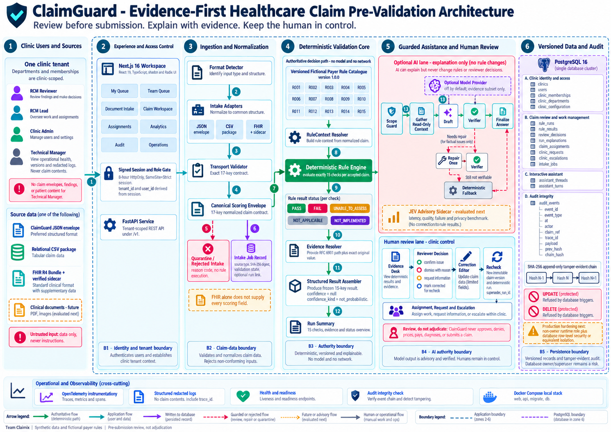

# Phase 1 architecture report

This directory contains ClaimGuard's architecture figures, diagram source specifications, logo, LaTeX sources, and rendered technical-report artifacts.

[Back to the project README](../../README.md)

## Main artifacts

| Artifact | Purpose |
|---|---|
| `report/ClaimGuard_Technical_Report.tex` | Current portrait A4 report source |
| `../../output/pdf/ClaimGuard_Technical_Report.pdf` | Rendered report for delivery |
| `report/assets/claimguard-master-architecture.png` | Full evidence-first architecture plate |
| `report/assets/claim-data-flow.png` | Ingestion and processing data flow |
| `report/assets/database-architecture.png` | Logical persistence and tenant relations |
| `report/assets/reviewer-lifecycle.png` | Human review, correction, and recheck sequence |
| `assets/claimguard-logo.svg` | Reusable vector product mark |
| `diagrams/` and `report/diagrams/` | Editable diagram specifications |
| `MASTER_ARCHITECTURE_IMAGE_PROMPT.md` | Detailed independent reproduction prompt |
| `REPORT_REBUILD_BRIEF.md` | Narrative and formatting contract |

  

## Narrative contract

The report moves from problem and product boundary to requirements, global architecture, ingestion, deterministic validation, bounded assistance, human review, persistence, audit, verification, and limitations. Wide diagrams use dedicated landscape pages inside a portrait technical report.

Every figure must be introduced and interpreted in prose. A diagram is not evidence by itself; implementation claims must match current code, migrations, tests, and generated verification artifacts.

## Rebuilding

Use a LaTeX installation that provides `latexmk` and XeLaTeX or the engine selected in the source. Run the build from `report/` so relative asset paths resolve, and write the final PDF to `output/pdf/`. Build twice when necessary so the table of contents, references, and bibliography settle.

Before publishing:

1. Confirm every referenced image exists and is readable at 100% zoom.
2. Check that no wide figure is clipped and no unintended blank page remains.
3. Verify author names, team identity, dates, captions, cross-references, and bibliography.
4. Compare architecture claims with the current repository.
5. Confirm that no private credential, local handoff note, or real patient data appears.
6. Render the PDF to page images and visually inspect every page.

The report must say **tamper-evident**, not universally immutable; **pre-validation**, not adjudication; and **synthetic benchmark conformance**, not real payer accuracy.
